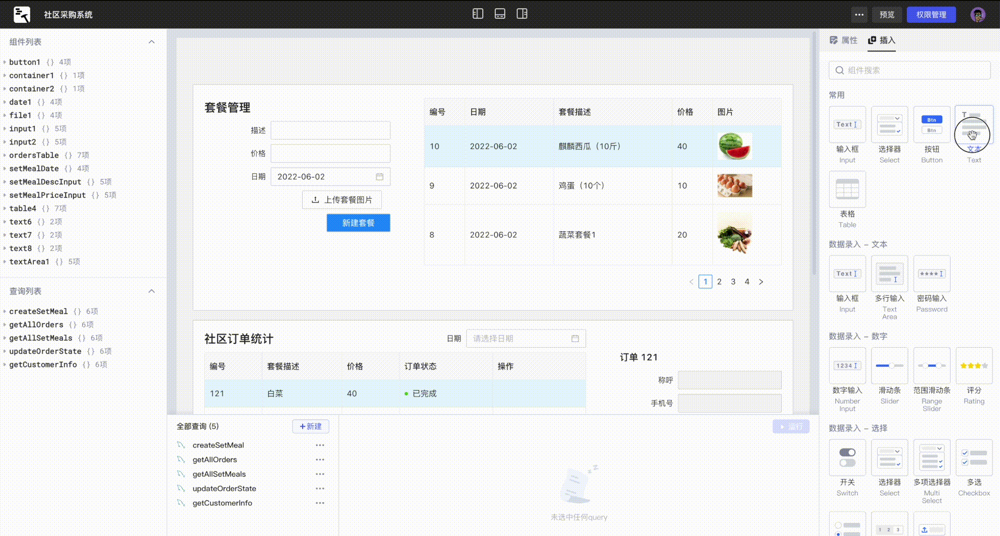

## Lowcoder_cn的前生今世

**lowcoder**继承自废弃的**openblocks**项目，**openblocks** 则是国内低代码平台**码匠**的开源版，后**码匠**项目下马。后来一个国外公司以openblocks为基础，改名为lowcoder。因改为国外团队维护，导致没有了对国内的数据源支持，甚至中文环境一度都无法运行。作为一款国产低代码平台，居然沦落到无法在中文环境运行，实在令人唏嘘。
本人试用过appsmith、retool、tooljet、码匠，很早对码匠就挺有兴趣的，跟他们的销售人员聊的时候问及以后没有开源版来二次开发，但一直跟我说没有开源版。后来选择改造 [tooljet](https://github.com/mousheng/tooljet_cn.git),前段时间无意间发现lowcoder原来就是码匠的开源版，于是开始对其进行改造。

Lowcoder_cn（以下简称lowcoder）是[lowcoder](https://github.com/lowcoder-org/lowcoder.git)的国内分支（因为lowcoder合并代码速度太慢以及有些理念不同，特开此分支），是一款开发者友好的低代码平台。通过开箱即用的组件库、所见即所得 UI 布局以及连接数据库/API，您可以快速开发内部应用，同时无需关注复杂繁琐的前后端交互、应用的安装与部署，让您专注于业务发展。

**维护该项目纯粹出于对低代码平台的兴趣，因此，如果有志同道合的小伙伴，欢迎大家一起交流、讨论、贡献代码,如果你是码匠的前开发人员，更希望你能联系我，因为真的有很多问题需要请教🥺**

​

## 文档

[Document On Github](https://mousheng.github.io/lowcoder_CN) 国内推荐访问 [Document On Gitee](https://moushengkoo.gitee.io/lowcoder_cn)

### 讨论群

### 联系我

## 快速开始

### 在线试用

请访问 https://lowcoder.mousheng.top

> ❗❗请不要将自己的api令牌或者账号密码保存在共享账号中❗❗

> #### 账号密码
> 账户： `test@mousheng.top`
> 
> 密码： `test123456`

### 私有化部署
请参阅 [docker部署](docs/docker.md)

## 搭建应用的步骤？

只需通过几个步骤，便可搭建和使用您的内部应用：

1. 通过 GUI 快速[连接数据源](docs/datasource.md)。
2. 编写少量代码[构建查询](docs/how-to-write-query.md)。
3. 使用开箱即用的组件库轻松[搭建应用界面](docs/drag-and-drop.md)，使用 [JavaScript 表达式](docs/javascript-in-lowcoder/writing-javascript.md)绑定查询数据。
4. 触发查询/控制组件/响应用户行为/...，通过设置[事件触发](docs/event-handler.md)提供响应式 UI 交互。
5. [预览](docs/app-release.md)并将您的应用分享给其他人。

* [教程：如何搭建一个应用？](docs/quick-tutorial.md)

## 💡 为什么选择Lowcoder
创建单个应用程序很麻烦。您必须设计用户界面，用多种语言和框架编写代码，并了解所有这些代码如何协同工作。

低代码/无代码平台虽然可以快速上手，但很快就会变得不可维护且不灵活，产生的问题多于解决的问题。

类似retool的解决方案以其简单性和灵活性而闻名，但与react/vue等框架相比，它们也可能以不同的方式受到限制

## 🪄 特征
- **UI可视化** 内置50+组件.
- **复用模块** 帮助您实现组件和查询的组装与复用.
- **嵌入lowcoder应用程序作为原生react组件** 而不是框架. 
- **查询库** 可重用数据查询.
- **自定义组件** 开发自己的组件并在UI生成器中使用.
- **数据连接** 可连接 PostgreSQL, MongoDB, MySQL, Redis, Elasticsearch, REST API, SMTP, 等.
- **无处不在的JAVA支持** 支持数据转换, 组件控制等等.
- **基于角色的访问控制** 细粒度权限管理.
- **自动保存和可恢复的历史记录** 用于发布和版本控制.
- **应用程序主题和主题编辑器** 与贵公司的品牌指导方针保持一致.

- **自托管** 在公司内部网络中使用lowcoder.

## 🏆 比较
### Lowcoder vs Retool
- Lowcoder是开源的。您无需担心供应商锁定或被过时版本的软件所困扰。
- 在Lowcoder中，开发人员可以创建和使用自己的组件，而不是依赖于官方更新。
- Lowcoder是免费的，你还可以贡献代码！
- EE版本的Lowcoder具有更好的定价模型，因此您没有“每用户成本”。
### Lowcoder vs Appsmith, Tooljet
- Lowcoder比Appsmith和Tooljet拥有更多的组件和更丰富的配置。
- 在Lowcoder中，您可以为组件选择自动高度或固定高度模式，而Appsmith仅支持固定高度模式。
- 在Lowcoder中，您可以在使用模块和查询库功能构建应用程序时重复使用通用结构。
### Lowcoder vs Mendix, Outsystems, Pega
- Lowcoder是现代的。代码库是新鲜的，并使用现代标准。
- 低编码器应用不需要编译和部署。只需发布和使用。
- Lowcoder应用程序可以本机嵌入到网站和应用程序中，甚至可以嵌入到移动应用程序中。
### Lowcoder vs internal Tool platforms
- Lowcoder 完美地支持管理面板等内部工具，但面向客户的应用程序也可以开发和发布。
- Lowcoder UI构建器比Bubble简单易用。
- 应用发布周期和更新几乎每天都可以完成，而不会为客户和用户造成服务停机。

## 🥇 Sponsors
Accelerate the growth of Lowcoder and unleash its potential with your Sponsorship – together, we're shaping the future of Lowcode for everyone!
[Be a Sponsor](https://github.com/sponsors/lowcoder-org)

Like ... @CHSchuepfer & @spacegoats-io. Thank you very much!!