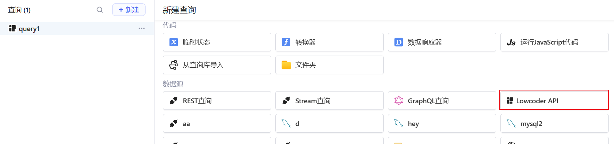
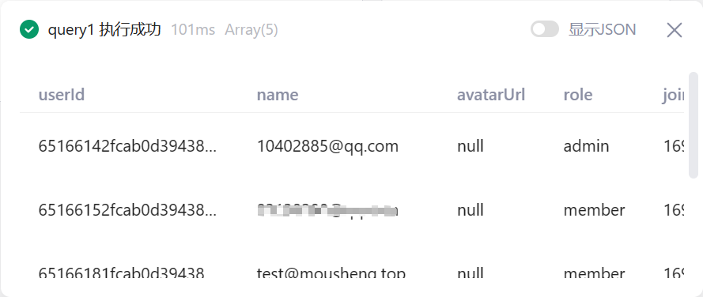
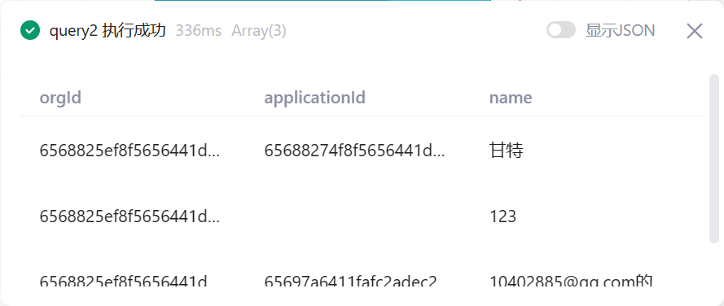

Lowcoder API是lowcoder平台自身提供的API，用于查询平台的一些事务

## 查询工作区用户

查询当前工作区所有的用户信息

## 查询Apps

查询当前用户可访问的Apps信息

查询参数`文件夹`可有以下三种情况：
* 留空： 表示查询该用户所有可访问的Apps
* 文件夹名： 表示查询指定`文件夹名`下，该用户可访问的Apps
* 文件夹ID： 表示查询指定`文件夹ID`下，该用户可访问的Apps

