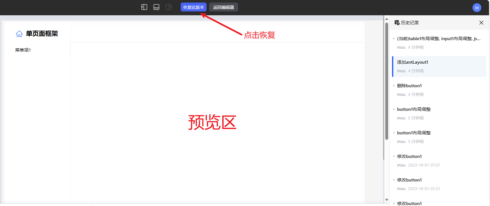
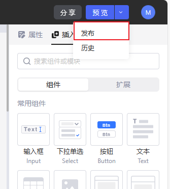
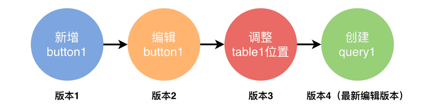
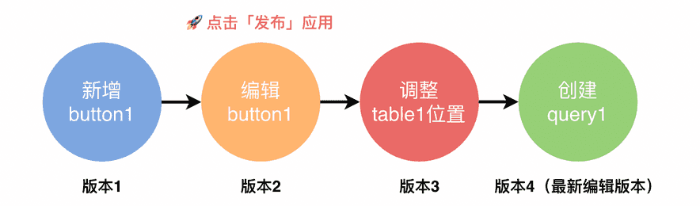
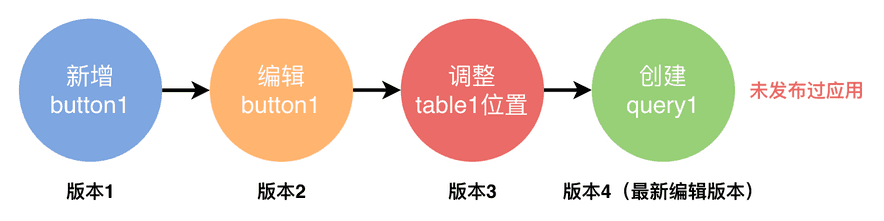

搭建应用时，通过历史记录可以查看应用自创建起的所有编辑历史。

完成对应用的搭建之后，即可对应用进行预览与发布。

应用发布用于控制应用可见版本。默认情况下，终端用户可直接查看应用最新版本；而应用发布功能可以锁定终端用户的可见版本，这样在新功能的开发过程中，不会影响用户的使用版本。

## 编辑模式与终端用户（预览）模式

Lowcoder应用有两种模式：编辑模式和终端用户(预览)模式。

* 在编辑模式下，您可以拖放组件、编写查询等等，您可以将其视为 IDE,创建新应用后自动进入编辑模式。
* 在终端用户模式下，您可以查看和使用应用。用户在他们的浏览器中加载出来的即为该预览内容。

Lowcoder中最常见的工作流程：让开发人员在编辑模式下搭建和编辑应用，然后设置企业中成员的**权限**。
应用编辑模式下点击窗口右上角的预览按钮，您的应用会切换到终端用户模式：

## 历史记录

通过历史记录，可以查看应用自创建起的所有编辑历史。

### 显示历史记录

您可以查看以前的任何版本。单击**预览** **>** **历史记录**。

%20(1).png)

### 恢复历史版本

您可以在右侧选中历史记录中的某一版本，预览区即可预览，然后选择 **恢复到此版本** ，此时应用便恢复到该历史版本：

## 应用发布与版本管理

在应用编辑界面，点击窗口右上角**预览**按钮右侧下拉箭头 ，可看到**发布**按钮。

应用发布功能主要用于控制终端用户的可见版本。每一次编辑界面的操作 —— 如新增组件、修改组件设置、调整组件位置以及创建查询等，都意味着应用的版本迭代，例如：

 

上图中，编辑者进行了一系列操作，相应地，应用版本会不断更新，当前最新版本为版本4。
假设编辑者在编辑 `button1`（即版本2时）之后，选择发布应用：

  

此时，用户点击**查看**应用与**编辑**应用（授予可编辑身份才能对应用进行编辑，可参阅**应用权限**）所请求的版本为：

| **操作**         | **请求应用版本** |
| ------------------------ | ------------------------ |
| 点击**查看**应用 | 版本2                  |
| 点击**编辑**应用 | 版本4                  |

如果从未发布过应用，那么用户点击**查看**与**编辑**请求的都是最新版本：

  

| **操作**         | **请求应用版本** |
| ------------------------ | ------------------------ |
| 点击**查看**应用 | 版本4                  |
| 点击**编辑**应用 | 版本4                  |

> #### 💡 说明
>
> 为什么要控制终端用户查看的版本？假设应用正在开发新功能，开发过程中不希望影响当前用户使用体验，因此可通过发布功能控制用户可见版本，待新功能开发与充分测试后再发布到新版本。