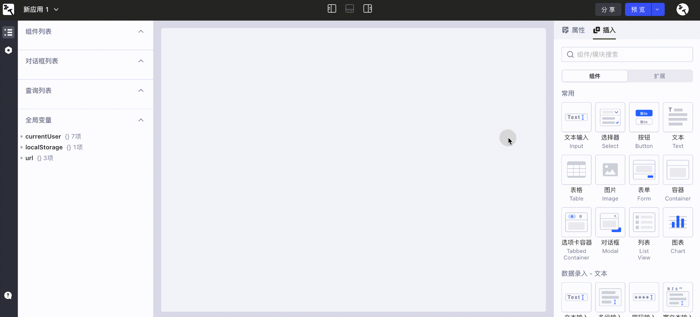

# 应用编辑界面

在Lowcoder中, 您可以通过拖拽组件、连接数据源和创建查询来快速搭建内部应用。开始之前，需要先了解应用编辑界面。如下图，主要包括五个区域：

1. 工具条
2. 画布
3. 数据浏览器
4. 查询编辑器
5. 属性/组件面板

<figure><figcaption></figcaption></figure>

## 工具条

工具条分为顶部工具条和左侧工具条两部分。

<figure><figcaption></figcaption></figure>

顶部工具条中间的三个小按钮用于控制显示或隐藏数据浏览器、查询编辑器和属性/组件面板。此外，顶部工具条还支持：

* 应用重命名
* 导出应用为 JSON 文件
* 预览、发布、分享当前应用
* 浏览应用历史版本

左侧工具条支持：

* 显示或隐藏数据浏览器 **数据浏览器**
* 设置画布尺寸和应用主题、***设置是否显示顶部导航，设置PC端和移动端画布边距***
* 管理 JS 脚本和 CSS 样式
* 获取帮助（提交问题、编辑器教程、快捷键列表等）

## 画布

可视化应用将在画布中搭建，通过拖拽码匠提供的 UI 组件到画布中并进行组合，可搭建能实现您所需功能的应用。

<figure><figcaption></figcaption></figure>

所见即所得的画布可以让您轻松地新增组件和调整 UI 布局，下图是一个网站管理后台的例子。

<figure><figcaption></figcaption></figure>

## 数据浏览器

在数据浏览器面板，您能以树形结构查看**组件**、**查询**和**全局变量**内部的数据。您如果不确定查询或组件实际返回的是什么数据，那么可以在数据浏览器面板展开具体数据：

<figure><figcaption></figcaption></figure>

## 查询编辑器

底部的查询编辑器由两部分组成：左侧为查询列表，右侧为查询设置（带有**常规**、**通知**和**高级**选项卡）。查询是连接您的数据库或者 API 和应用的桥梁。通过创建查询，可以对数据进行创建、读取、更新和删除操作。

<figure><figcaption></figcaption></figure>

## 属性/组件面板

组件和属性窗格位于窗口的右侧。将组件从**插入**选项卡拖动到画布上，然后在**属性**选项卡中编辑组件的属性。

当用光标选中画布中的某一组件时，该面板自动切换为该组件的属性设置面板，在该面板可以对组件的数据、样式等进行调整（如下右图，展示了表格组件的属性面板）。