## 半年修改日志2024.1.3
## 优化
* 键值列表添加批量编辑功能
* 默认打开nginx gzip功能，减少前端加载数据量
* 优化抽屉组件属性逻辑，打开显示蒙层才显示是否点击关闭蒙层关闭按钮
* 优化输入组件标签位于上面时验证提示

## 平台功能更新
* 为非主题内值属性添加默认值
* 后端添加中文错误提示资源文件
* 将chchar作为内置函数
* lowcoder API数据源添加查询Apps的方法
* 根据页面宽度自动切换页面内边距设置
* 允许设置页面图标或自定义logo
* 修改移动聚合页事件到选项列表中
* 移动聚合页添加选择标签改变的事件
* 为页面logo添加是否允许点击属性
* 为聚合页添加顶部菜单是否显示选项
* styleControl允许自定义标题及添加字体大小类型
* 左侧工具栏查询和全局变量添加图标
* 删除所有表单组件的内边距，统一表单组件高度
* 移动端聚合导航页面添加selectedKey属性
* 组件选择添加拼音缩写

## 新组件
* 添加`卡片`组件
* 添加`antLayout`组件
  * 菜单添加项目类型：普通菜单项、标题、分割线
  * 添加logo位置属性选项
  * 添加logo 标题属性
  * 添加图标、隐藏、激活属性
  * 设置菜单默认只打开一个子菜单
  * 添加logo点击、菜单点击事件
  * 图标添加sharp属性
* 添加`Gantt`组件
  * 添加仅排序项目选项
  * 添加currentProjectLastTask属性来指示项目中最后完成的任务
  * 添加currentProjectID属性，用于指向当前选择的项目ID
  * 添加是否允许错误提示的属性
  * 添加列表宽度属性
  * 调整默认列表宽度
  * 设置列表超过宽度自动显示滚动条
  * 任务列表添加标签显示类型
  * 添加项目已完成颜色设置功能
  * 添加项目超期突出显示功能
  * 允许自定义项目、任务、里程碑的颜色
  * 添加调整任务起始的功能
  * 添加显示工具提示和工具提示模板功能
  * 添加行高度和初始时排序选项
  * 添加允许双击时展开或收缩项目
  * 添加showTask方法
  * 列添加排序选项
  * 添加addLink和removeLink方法
  * 添加时间轴刻度模式选项：fit模式、手动模式
  * 修改默认展开所有分支选项时展开或关闭所有分支
  * 添加持续时间单位选项
  * 添加节假日显示，用于显示法定节假日
  * 添加自定义节假日功能
  * 小时视图添加工作时间显示
  * 自定义工作时间功能
  * 自定义休息日、非工作时间的显示颜色
  * 四种连线类型单独设置颜色样式
  * 进度条分段显示颜色，根据进度自动设置进度条颜色
  * 添加导出PNG、PDF、Excel方法
  * 添加双击任务事件
  * 添加是否显示列选项
  * 添加是否允许拖动项目选项
  * 添加自动计算总进度功能
  * 添加展开/收缩所有任务的方法
* 添加`图标`组件
  * 添加激活颜色属性
* 添加`评论`组件
  * 修复无法自动滚动的bug
  * 优化提及内容加载方式
  * 添加clickedItem属性用于暴露点击的对象数据
* 添加`穿梭框`组件
* 添加`高德地图`组件
  * 移动端时缩放按钮显示在右下角
  * 添加是否显示控制按钮
  * 添加缩放按钮的选项
* 添加`头像`组件
  * 使用图标大小属性来精确调整大小
* 添加`颜色选择器`组件
* 添加`悬浮按钮`组件
  * 添加返回顶部事件
  * 添加显示高度属性
  * 添加隐藏属性
  * 添加徽标显示为点的属性
  * 按钮数量为一时渲染为单个按钮
* 添加`级联选择`组件
  * 初始化时同时初始化selectedObject
  * 添加必填选项
  * 精简selectObject对象
  * 添加当前选择元素属性
  * 内边距属性
* 添加`时间线`组件
  * 优化滚动效果
  * 优化标题显示
  * 添加左右偏移显示属性
  * 添加滚动条控制
* 添加`自动完成`组件
  * 添加selectObject属性
* 添加`描述列表`组件
* 添加`提及`组件
* 添加`周、月、季、年`选择器

## 组件功能增强
* 附件组件
  * 添加dataURL属性自动拼接Base64URL
* 列表视图组件
  * 添加底部边框颜色属性
* 走马灯组件
  * 添加渐显属性
* 单选框组件
  * 默认支持首拼搜索
* 选项卡组件
  * 添加隐藏选项标签属性
* 可折叠容器组件
  * 切换按钮添加扩展点击响应选项
* 抽屉组件
  * 添加显示关闭按钮属性
* 二维码组件
  * 修改为antd内置组件
  * 添加二维码状态属性
* 日历组件
  * 调整为本地组件
  * 修复滚动条错位问题
  * id自动生成
  * 删除group属性
  * 事件颜色修改为选择框
  * 添加滚动到此刻功能
* 对话框组件
  * 优化对话框显示
  * 添加内边距属性
  * 添加关闭按钮是否显示开关
  * 添加默认弹出高度属性
* 输入框组件
  * 添加手机号、账号的正则验证
  * 修复password默认正则缺失问题
* 按钮组件
  * 添加禁用属性
* 容器组件
  * 为容器添加内边距属性
  * 添加是否显示滚动条开关

## 修复

* 修复导航组件内边距属性无效的问题
* 修复Gantt组件点击表头添加按钮错误提示
* 修复chart组件
* 修复yarn build失败的bug
* text组件的字体问题
* 修复隐藏组件后显示一条线的bug
* 修复table组件翻译错误
* 取消编辑时antLayout组件内部响应鼠标事件
* 修复antLayout三级以上菜单无法切换页面问题
* 日历组件为本地载入
* 修复redis服务器IP
* 美人鱼组件属性设置页国际化标题
* 添加丢失的i18n中文翻译
* 修改Gantt组件异步载入数据时初始排序出错
* 修复Gantt组件保存参数服务器错误的bug
* 修复Gantt组件显示超期项目时已完成项目无法正确显示的bug
* Gantt组件设置里程碑颜色无效
* 修复gantt组件类型检查key显示错误
* 修复类型检查时提示错误和添加中文汉化提示
* gantt修改连接数据label为连线数据
* 修复初始gantt的持续时间类型错误
* 恢复合并时丢失的文本
* 修复chart组件载入错误
* gantt无法动态载入皮肤，删除皮肤主题功能
* 修复docker镜像后端服务运行失败的bug
* gantt修复初始化日期出现时区偏移
* gantt修复屏幕分辨率较小的情况下时间轴日期显示不全
* gantt组件的时间轴开始比结束日期大时，自动交换日期
* gantt修改进度条分段显示颜色的label
* gantt设置允许拖动进度条后显示自动计算进度选项
* gantt组件国际化和优化示例显示
* 修复gantt的dispatch错误提示
* gantt添加add类型列
* 修复顶部菜单隐藏后依然一闪而过的bug
* 修复组件选中错乱的bug
* 修复组件’查看文档‘链接
* 修复选项卡组件无法自动高度状态无法改变高度
* 修复选项卡组件滚动条抖动的bug
* 修复甘特图崩溃的bug 调整甘特图隐藏列表属性设置栏位置
* 修复聚合页和单页面框架使用添加子菜单项未生产key的bug
* 修复教程中mockAPI失效问题
* 修复主页不显示lowcoder标题的bug
* 修复编辑器教程引导卡死的bug
* 修复英文环境下form的set、clear、reset方法无效的问题
* 修复评论组件标题随滚动条滚动，无法固定的bug 优化界面样式
* 修复悬浮按钮为单个按钮时无法设置主题和外形
* 修复级联菜单在移动端下拉内容太长显示不全的问题
* 修复级联菜单在移动端下拉内容太长显示不全的问题
* antlayout修复拖动菜单导致页面内容丢失问题
* 修复菜单样式 底部根据内容自动隐藏
* 修复最后一项菜单无法删除子菜单的bug
* 添加延迟删除队列，修复调整菜单项时容器内容丢失的bug
* 当前显示容器不为空且不key不为header
* 修复表格列属性弹出框异常退出的bug
* 修复日期、时间、周、季、年选择器初始化时就显示提醒的bug
* 修复地图缩放异常问题
* 修改主页菜单的小房子非激活状态下颜色错误
* 地图组件标记改变时，添加缩放抖动，修复地图标签初始位置错误
* 修复form组件提交后重置无效的bug
* 修复事件编辑框异常关闭的bug
* 修复mongodb连接出错
* 修复时间线设置倒置后显示数据错乱
* 修复时间线设置倒置后显示数据错乱
* 修复输入框自定义验证无法实时验证的问题
* 修复时间轴内容宽度
* 修复时间线组件滚动条控制
* 修复时间线组件子标题解析换行符

## 样式

* 删除Gantt组件任务数据的项目默认颜色属性，调整默认行高
* 删除文本组件padding和margin属性，解决不同字体垂直显示不居中问题
* 汉化创建新程序、应用编辑界面汉化
* 调整图标灰度
* 添加菜单样式
* 添加框架和主容器样式
* 添加antLayout组件主容器样式
* 优化组件边缘，统一输入框高度为32px
* 隐藏画布的横向滚动条
* 缩小滚动条宽度
* 更换头像组件图标，优化显示

## 回滚

* 组件内置方法恢复为SetXX、ClearXX、ResetXX

## 2023年7月19日 `v2.0.1`
* 支持自定义品牌和图标显示
* 布局控制，所有组件添加padding和margin属性（对此更新本人持反对意见，很多组件不需要设置内边距，引入还导致在组件大小不统一，在后续版本已修复）
* 允许设置画布的网格密度
* 添加Lottie动画组件

* 允许设置并发

## 2023年6月21日 `v2.0`
* 项目改名为lowcoder
* 更新大量JS库版本

## 2023年3月23日 `v1.1.8`​

* 新增**日历**组件 📅，支持拖拽、多视图管理日程  
  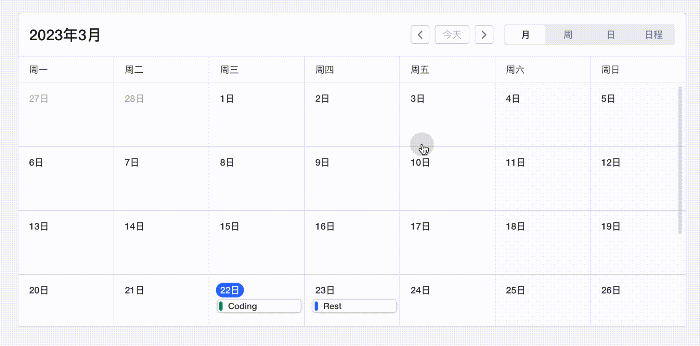​
* 表格组件新特性：

  * 支持**批量调整**列设置：隐藏、可编辑、自动列宽、支持排序、对齐方式  
    ​
  * 新增 `toUpdateRows`​ 字段，方便编写 SQL **批量更新**编辑后的表格行
  * 新增 `selectedIndex`​ 和 `selectedIndexes`​ 字段，暴露当前选中（多）行的下标
  * 新增事件：翻页、刷新
* 优化 JavaScript 第三方库的安装和管理功能  
  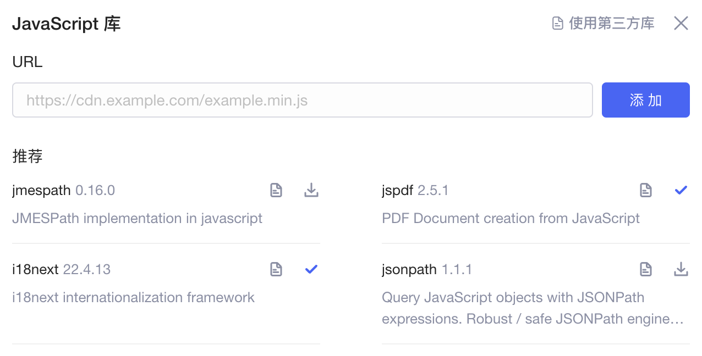​

  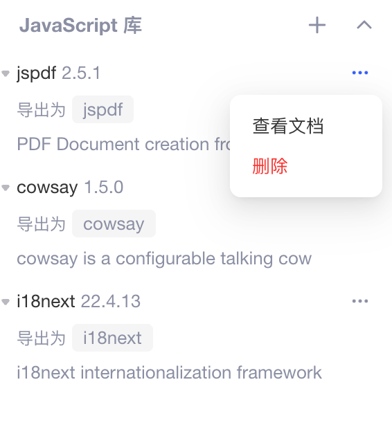​
* 查询编辑器支持**文件夹** 📁 和**搜索** 🔍 功能
* 右侧属性面板支持关键字**搜索** 🔍
* 聚合页新增菜单项动作**打开链接**
* GraphQL 数据源支持转发 Cookies
* LDAP 身份源支持 ldapsearch
* 走马灯 (Carousel) 组件支持配置背景色
* 优化时期范围组件的展示值范围，根据校验规则过滤无关值
* 优化 listView 和 table 中列表逻辑的底层实现
* 优化属性面板展示，切换组件时属性面板各部分维持切换前的展开/收起状态
* 优化应用预览态和发布态显示，去除画布底部多余的空白部分
* 优化表格日期列类型的显示，字段内容不规范时显示为空
* 修复列表 (List View) 中多选 (Checkbox) 组件被错误勾选的问题
* 修复表格排序大小写不敏感的问题
* 修复表格组件中编辑多标签单元格的错误
* 修复表格组件扩展视图中嵌套的表格列不随数据字段变化的问题
* 修复组件标签在顶部模式下展示不全的问题
* 修复文件上传组件调用 clearValue 方法后 parsedValue 不清空的问题
* 修复其他已知问题

## 2023年3月9日 `v1.1.7`​

* 表格组件新特性：

  * 支持将数据中的 `children`​ 数组展示成子表  
    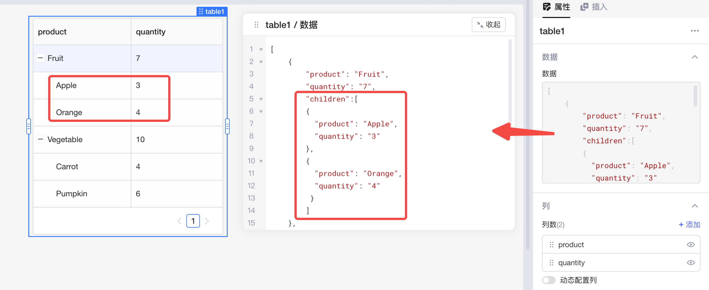​
  * 支持为表格行配置扩展视图  
    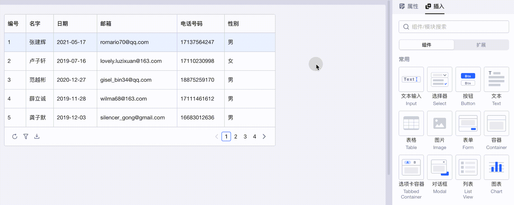​
  * 新增列类型：布尔值 (Boolean)、日期 (Date)、评分(Rating) 和进度条 (Progress)
  * 优化各种列类型的颜色表现，与应用主题一致
  * 优化列宽设置，默认为适应字段长度的固定值
* 列表 (listView) 支持翻页，新增分页设置
* 新增数据库：MariaDB、OceanBase、TiDB、openGauss、达梦、PolarDB、GaussDB、TDengine、SequoiaDB、MogDB 和 StarRocks
* 新增 API：Jira、CircleCI、Hugging Face Inference、Hugging Face Endpoints、GitHub、Notion、Gitlab 和 Shopify
* 新增 JWT (JSON Web Token) 身份认证
* 新增移动端聚合页，支持底部导航菜单；优化移动端日期时间类组件交互
* REST API 数据源支持转发 Cookies
* OpenAI 数据源支持 Chat GPT 接口
* 事件的「控制组件」动作支持选择底层 HTML 元素方法和输入参数，如 `setSelectionRange()`​、`setRangeText()`​、`focus()`​ 和 `seekTo()`​
* 私有化部署支持配置访问限制端口 (disallowed-hosts) 列表
* 连续执行同一查询时，支持在查询的高级面板配置是否「忽略之前未完成的执行结果」
* 优化进度条组件的数值展示
* 优化删除企业的弹窗信息
* 修复分割线组件上下不居中的问题
* 修复查询库中代码提示没有元数据信息的问题
* 修复表单的非必填字段为空时提示校验失败的问题

## 2023年2月24日 `v1.1.6`​

* 新增「数据变化响应器」查询，支持为任何数据的变化添加事件并设置响应动作  
  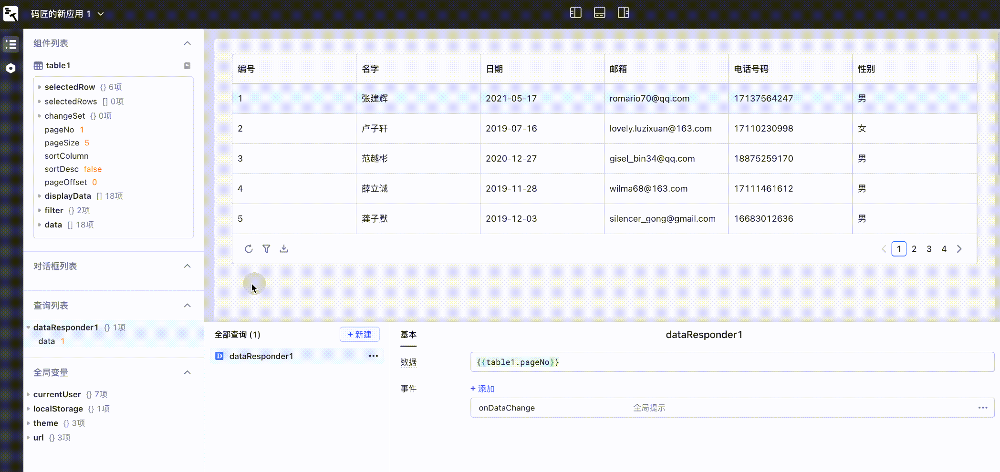​
* 新增全局变量 `theme`​，支持方法 `theme.switchTo()`​，可动态切换应用主题  
  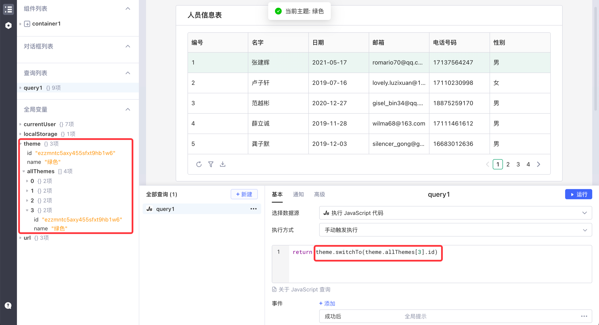​
* 新增签名版 (Signature) 组件  
  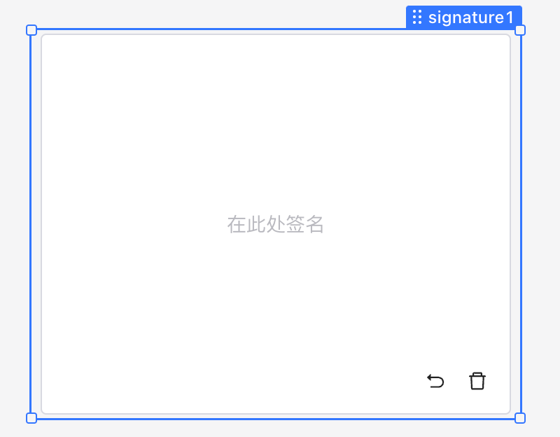​
* 企业设置新增身份源管理，快捷配置不同的登录渠道  
  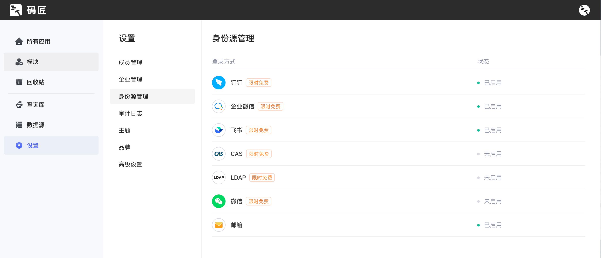​
* 支持从钉钉身份源导入组织架构信息，同步通讯录群组
* 新增以下数据源：

  * CouchDB
  * Athena
  * Lambda
  * WooCommerce
  * OpenAI
* 暴露各组件的底层 HTML 元素方法，如各 UI 组件的 `focus()`​ 和 `blur()`​ 方法；输入类组件的 `select()`​ 和 `setSelectionRange()`​ 方法；视频、音频组件的 `seekTo()`​ 方法等
* 列表 (listView) 支持嵌套使用，可配置子项下标 `i`​ 和子项对象 `currentItem`​ 的命名
* JavaScript 查询和事件动作中支持 `setTimeout`​ 和 `setInterval`​ 方法
* 文本组件支持两端对齐
* 优化代码提示，局部变量排序更靠前
* 修复代码自动补全对含有 `-`​ 符号的属性名失效的问题
* 修复日期范围组件校验出错的问题
* 修复表格组件 `displayData`​ 包含已隐藏字段的问题
* 修复选择类组件在自动模式下，代码提示没有 `item`​ 和 `i`​ 的问题
* 修复页面切换后原应用报错信息的展示问题

## 2023年2月9日 `v1.1.5`​

* 新增 DynamoDB、OpenAPI 和 n8n 数据源​
* 新增宫格 (Grid) 组件，支持多列数据展示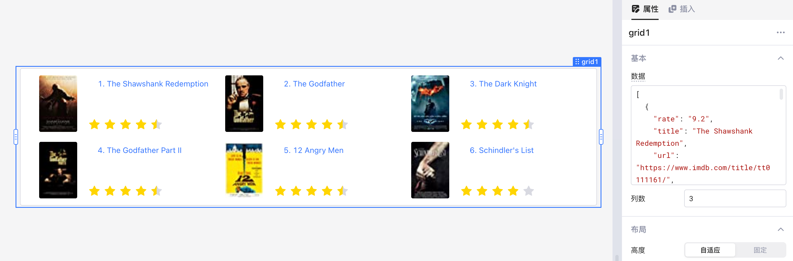​
* 完善列表 (listView) 功能：

  * 支持暴露内部组件数据，例如：`listView.items[0].input1.value`​
  * 除 `i`​ 变量外，局部变量新增 `currentItem`​
  * 取消行数配置，支持自定义 `data`​ 字段
* 优化表格组件：

  * 新增重置选中行方法 `resetSelections`​
  * 「链接」、「多链接」列类型新增禁用属性
  * 编辑「标签」列时支持搜索和新建标签项
  * 支持设置列宽为固定值
  * 提升翻页性能
* Microsoft SQL Server 数据源支持 GUI 模式
* 私有化镜像默认关闭 JS 沙箱
* REST API 查询图标替换为 HTTP 方法标签
* 企业主题设置支持自定义 Echarts 样式
* Lowcoder登录链接支持参数 `loginType`​，可指定登录方式
* 私有化部署的单企业模式下，管理员可重置用户密码
* 首页左侧边栏文件夹支持重命名
* 审计日志支持查询库查询
* 代码字体统一为 Roboto (macOS/Linux/Windows)
* 查询库支持拖动展开查询结果
* 修复输入变化时触发查询的防抖机制问题

## 2023年1月17日 `v1.1.4`​

* 表格组件支持编辑表格列和保存修改​
* 新增 S3 数据源
* REST API 数据源支持自签名证书、优化 URL 验证
* 维格表数据源支持自定义方法
* 组件内搜索功能支持不区分大小写的模糊匹配
* 表单组件新增加载中 `loading`​ 属性
* 数据源权限管理优化：拥有使用权限的成员不能查看数据源的详细信息
* 企业成员管理优化：管理员可以查看成员详情
* 修复 JavaScript 匿名函数代码格式化失败的问题
* 修复音频、视频组件自动播放配置不生效的问题
* 修复扫码组件蒙层配置不生效的问题
* 修复表单校验的正则表达式 (Regex) 及自定义规则的问题
* 修复多行输入组件的输入框不能自动缩放的问题
* 修复表格组件性能问题
* 修复导入查询至查询库后，切换页面导致数据丢失的问题
* 修复按钮事件的节流配置不生效的问题

## 2022年12月30日 `v1.1.3`​

* 新增扫码 (Scanner) 组件，支持扫描二维码和条形码​
* 企业微信数据源支持 JS SDK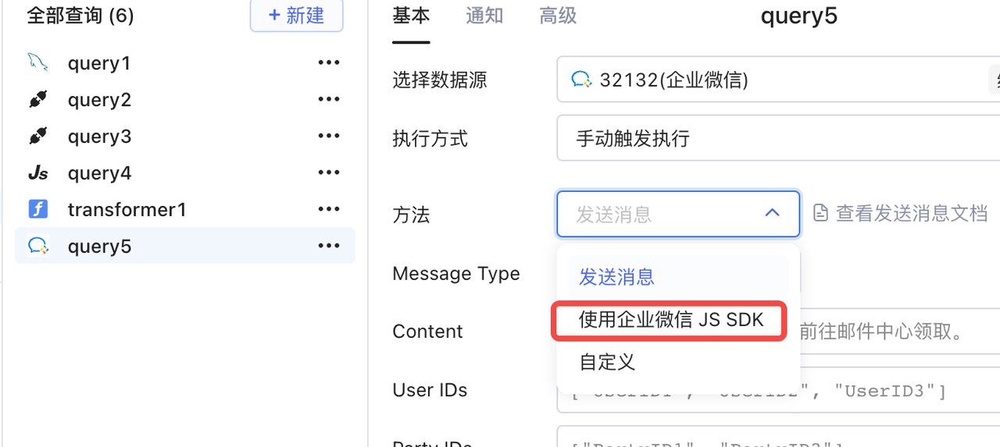​
* 查询库新建查询时支持从文件导入，所有查询支持导出为 JSON
* 查询库中 SQL 查询支持「禁用预编译」（需要先配置数据源「支持切换预编译」）
* 组件的样式属性中颜色输入框支持展开
* 表格组件新增方法 `setPage`​、`setSort`​ 和 `setFilter`​，新增事件 `filterChange`​ 和 `sortChange`​
* 表格组件支持配置工具条位置
* 表格组件支持切换「数据加载时显示加载状态」开关
* 表格组件中「多链接」和「按钮」两种列类型展示优化
* 文本输入、选择器、文件上传、日期和选项卡容器等多个组件支持配置标签文本的前置图标或后置图标
* 选择器组件暴露当前选项索引 `selectedIndex`​ 和 当前选项标签 `selectedLabel`​
* 对话框和抽屉支持配置是否「展示蒙层」
* 表单和容器支持交互禁用 `disabled`​ 属性
* JS 查询执行方式调整为「页面加载时执行」和「手动触发执行」
* JS 查询中运行从查询库导入的其他查询时，支持传递参数
* REST API 支持多种 HAL 等多种 JSON 类型
* REST API 数据源配置支持 Extra body 字段
* 审计日志展示优化
* 私有化部署支持移除企业成员
* 修复维格表数据查询的问题
* 修复容器内图片抖动的问题
* 修复第三方 JS 库执行顺序的问题
* 修复 REST API 解析文件上传参数的问题

## 2022年12月8日 `v1.1.2`​

1. 数据浏览器显示优化：以树形结构展示组件列表，更方便找到对话框 (Modal)、抽屉 (Drawer) 等

​

2. 表格组件支持动态配置列

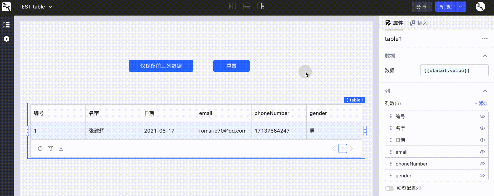​

3. 新增 GraphQL 数据源

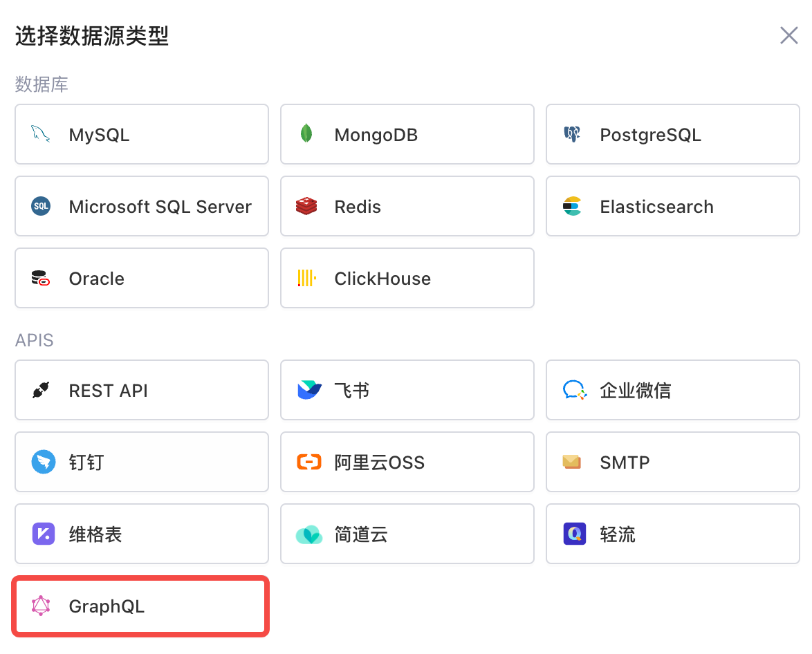​

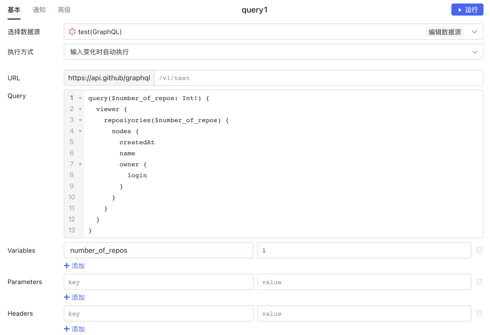​

4. 模块方法支持添加参数

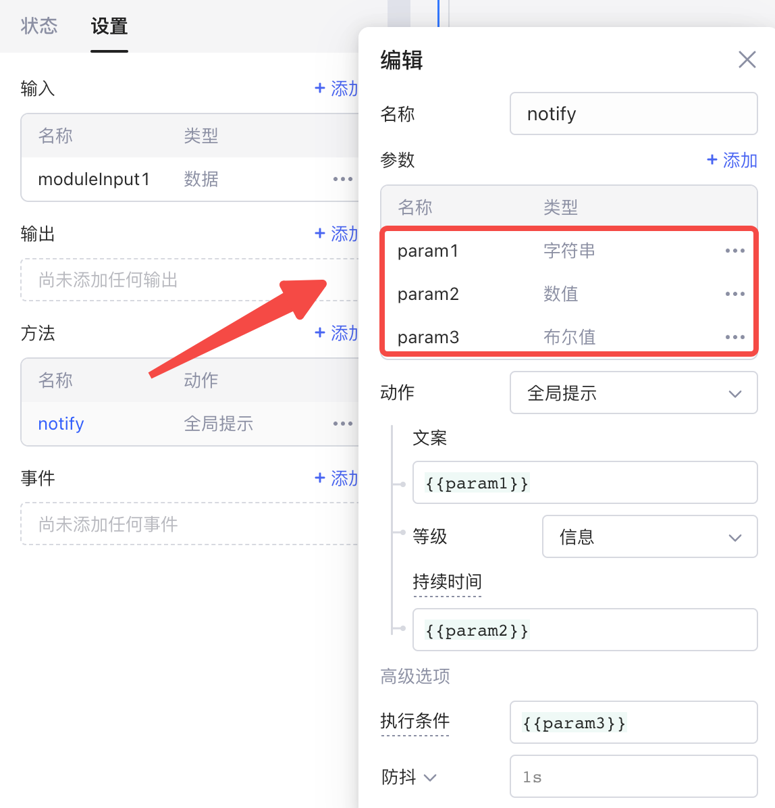​

5. 树形选择组件支持关键字搜索

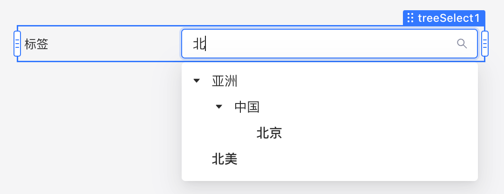​

6. 支持细粒度的数据源权限管理

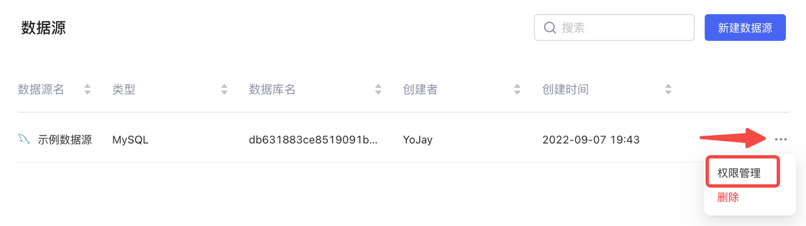​

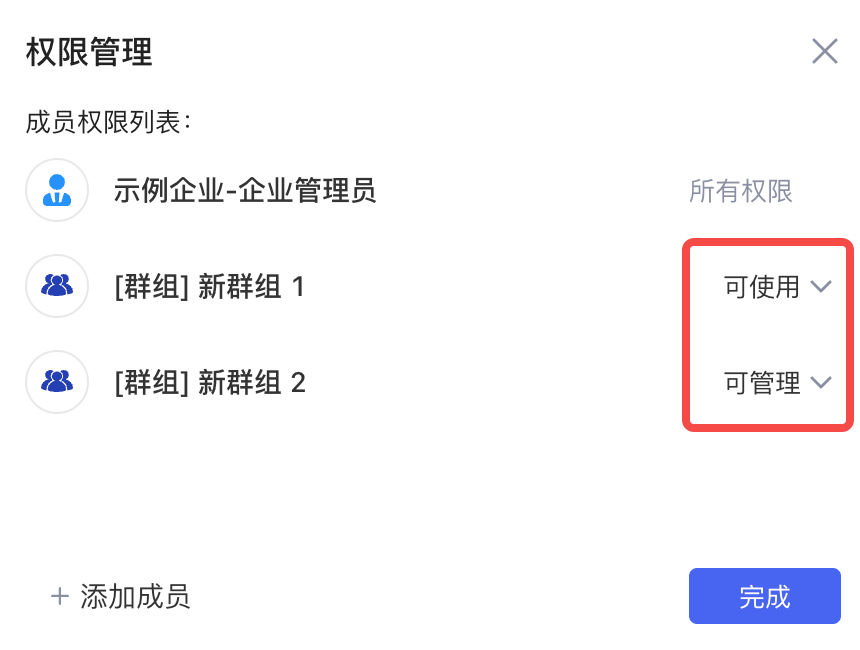​

7. 支持添加 npm 插件包
8. 语法检查增加对 JavaScript 新特性的支持
9. 修复代码编辑器高亮不正确的问题
10. 修复文本组件展示英文长文本时换行错误的问题
11. 修复聚合页中菜单项的标签为空时，无法选中并编辑的问题
12. 修复导航栏组件中子菜单项的隐藏和激活属性失效的问题
13. 修复导入应用后 REST API 数据源出错的问题

## 2022年12月1日 `v1.1.1`​

1. 文件上传组件新增解析 Excel、JSON、CSV 和文本文件功能。

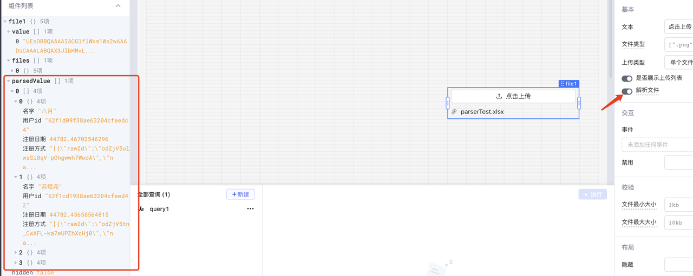​

2. “企业设置”功能挪到用户主页，使用起来更加方便快捷。

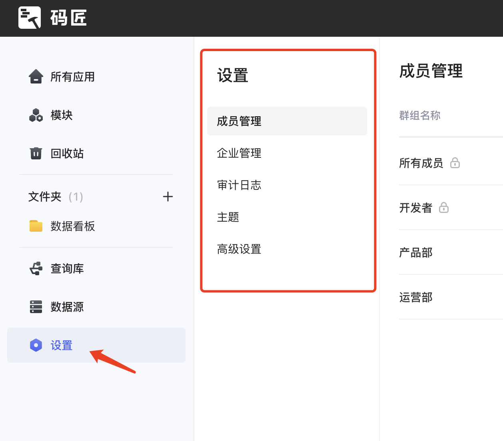​

3. 私有化部署支持配置单企业模式，该模式下仅存在一个企业。

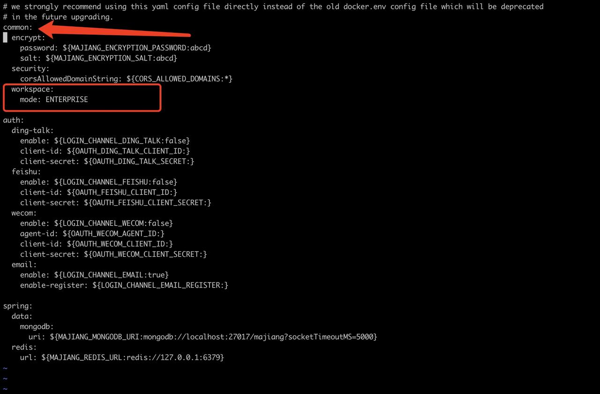​

4. PostgreSQL、Microsoft SQL Server、ClickHouse 等 SQL 数据源支持切换预编译模式。

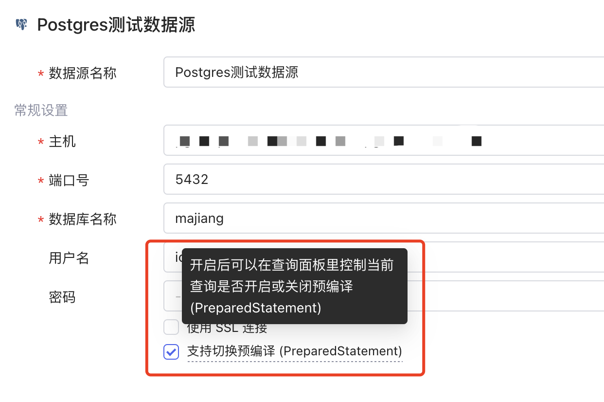​

5. 支持自定义键盘快捷键功能，现在可以通过设置快捷键来触发查询，控制组件以及更多操作！

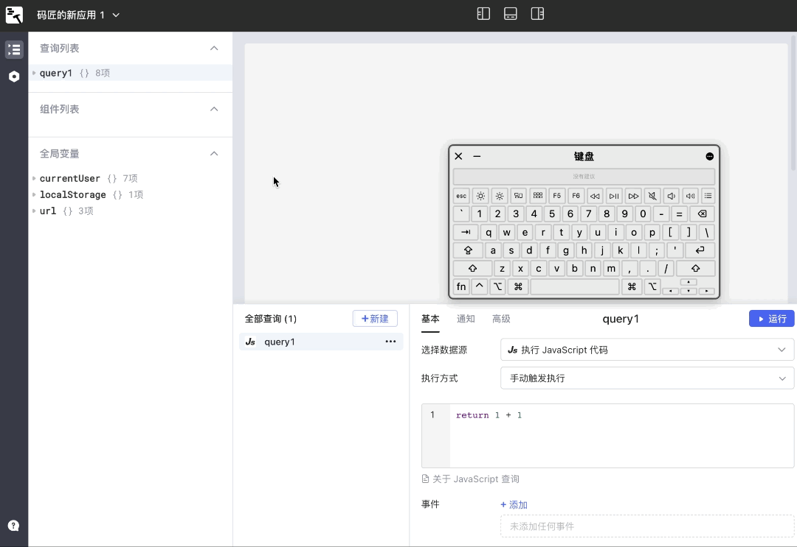​

## 2022年11月18日 `v1.1.0`​

* 编辑页增加左侧工具栏，支持应用内复制、删除应用
* 应用首页适配移动端
* 支持企微内自动登录功能
* 动作选项新增执行运行 Javascript 选项
* 表格支持设置行/单元格颜色
* 图表组件支持设置数据点颜色
* 解决非 sql 类查询不能传参数的问题
* mongo 数据源支持语法补全

## 2022年11月3日 `v1.0.21`​

* 首页新增支持文件夹、增加回收站功能
* 新增走马灯和可折叠容器组件
* 图片组件支持自适应高度，支持点击预览
* 选项卡容器组件的选项增加隐藏属性
* 表格组件暴露行点击与选择改变事件、支持时间列类型
* 对话框类组件支持拖动调整宽度
* 新增简道云数据源

## 2022年10月13日 `v1.0.20`​

* 企业设置支持配置默认主页，非开发者将默认打开该页面
* 新增 JSON 查看和 JSON 编辑组件
* 新增音频、视频组件
* 新增树形展示与树形选择组件
* 新增维格表数据源
* 登陆注册适配移动端
* 图表组件暴露当前选中数据
* 表格组件支持固定列

## 2022年9月27日 `v1.0.19`​

* 新增自定义主题功能
* 新增查询库功能，支持查询的全局复用
* 应用支持公开分享
* 模块支持配置事件与暴露方法
* 新增聚合页类型，支持左侧边栏菜单（入口在企业设置->实验室）
* 组件隐藏时，下方相邻组件自动补位
* 部分组件新增 icon 配置
* 新增二维码组件
* 表格组件支持使用者调整列宽，隐藏列

## 2022年9月8日 `v1.0.18`​

* 支持引入自定义 JavaScript 脚本和 CSS 样式
* 图表组件支持 Y 轴格式化
* 画布视觉优化，对齐辅助点改为辅助网格
* 全局变量增加 localStorage，提供系统 utils 方法
* 优化部分组件对齐困难的问题

## 2022年9月1日 `v1.0.17`​

* 编辑区查询面板支持临时状态和数据转换功能
* 输入类组件增加只读选项
* 首页增加数据源管理功能
* 增加列表组件
* 优化图表组件的默认主题样式
* 组件国际化，根据浏览器语言自动选择中文和英文
* 增加 ClickHouse 数据源

## 2022年8月24日 `v1.0.16`​

* 表格组件增加工具栏，支持下载、筛选、刷新
* 完善 IDE 快捷键，右下角帮助里可打开快捷键面板
* 增加 Oracle 数据源
* 表格等组件增加颜色配置项
* 代码框支持放大和拖拽

## 2022年8月16日 `v1.0.15`​

* 上线模块功能，支持组件与查询的复用
* 增加 SMTP 数据源，支持发邮件
* 组件视觉优化，调整主题色与圆角
* 部分组件优化颜色选择面板
* 查询支持定时执行
* 支持 CAS SSO 登录方式
* 首页应用列表改为按创建时间倒序排列

## 2022年8月8日 `v1.0.14`​

* MySQL 数据源新增 GUI 模式
* 增加应用设置，可以调节画布大小
* 查询增加高级配置项，可以自定义超时时间，写操作支持配置二次确认弹框
* 图表组件支持配置是否显示标签
* 修复 echart json 模式不支持 function 的问题
* 修复 table 组件在数据变化时自动新增列的问题

## 2022年7月29日 `v1.0.13`​

* 新增审计日志查看功能
* 新增开发者群组，普通成员移除新建应用权限
* 输入类组件增加 focus 方法和 submit 事件
* 新增阿里云 OSS 数据源
* 新增 iframe 组件

## 2022年7月21日 `v1.0.12`​

* 增加表单组件，并支持从数据库自动生成表单
* 表格支持 Markdown 列类型
* 修复编辑页选择组件时的卡顿问题
* 组件拖动在容器边缘时支持改变宽度
* 支持禁用 prepared statement

## 2022年7月15日 `v1.0.11`​

* 组件选项里新增组件文档链接
* 新增导航组件
* 新增 MS Sql Server 数据源

## 2022年7月7日 `v1.0.10`​

* 增加**查看历史记录**功能
* 新增 Redis、ElasticSearch 数据源连接
* 新增自定义组件、级联选择器组件
* 容器组件自带 header 和 footer，增加颜色配置
* 图表组件支持 echarts json 配置
* 编辑页新增右下角帮助按钮
* 查询 (Query) 增加**通知**配置项

## 2022年6月24日 `v1.0.9`​

* 新增选项卡容器 (tabbedContainer) 组件
* 新增富文本框、分割线组件
* 新增「执行 JavaScript」的资源类型
* 表格组件改为固定高度模式
* 私有化部署支持钉钉与企业微信登录
* 左侧边栏支持显示属性描述

## 2022年6月10日 `v1.0.8`​

* 支持在新窗口打开代码框
* 左侧边栏 hover 显示组件属性说明
* 新增简易 CRM 模板