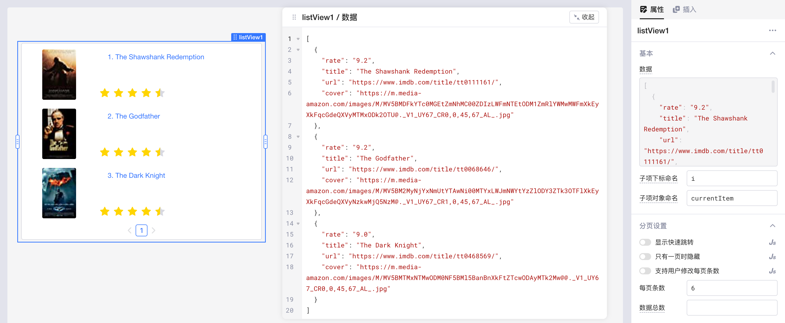
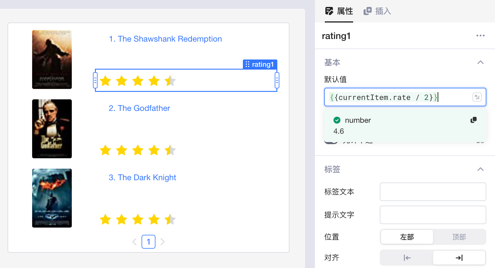
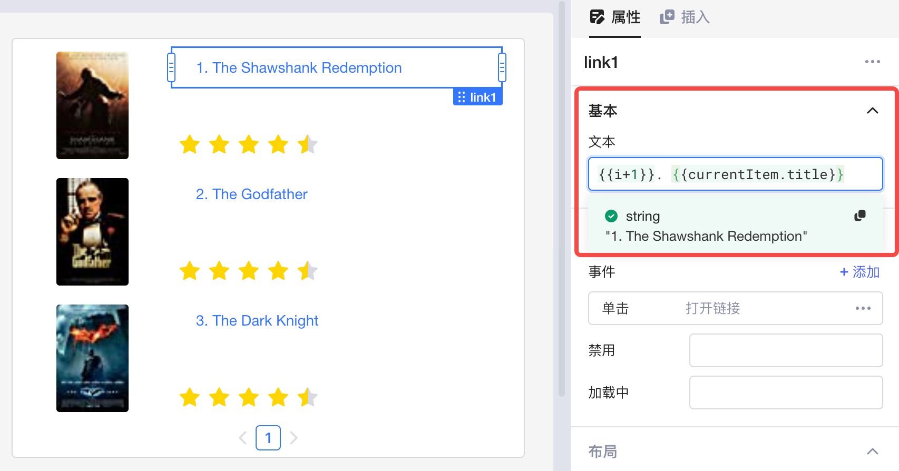
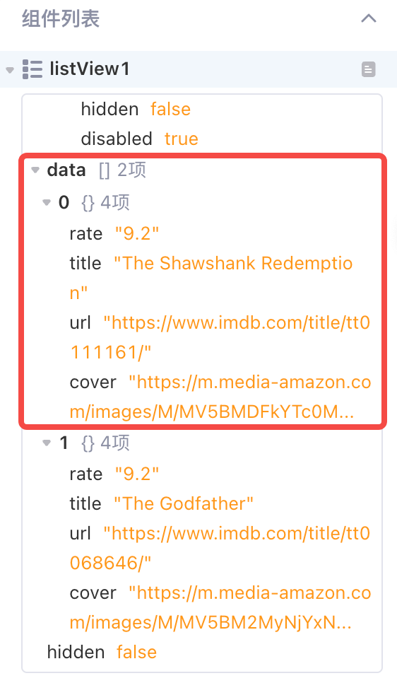
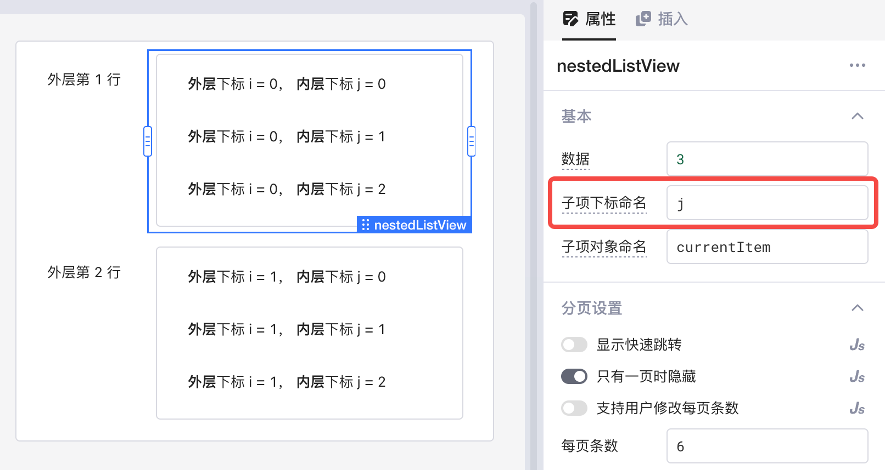
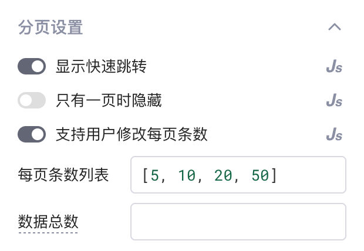
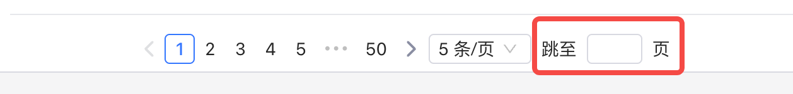

使用 **列表组件 (List View)** ，可以将可迭代的**数组 (Array)** 数据，通过图片、文本、数据输入等组件展示成形式各样的自定义列表行。与表单、对话框和抽屉等类似，列表是容器类组件，可以容纳任意组件和模块，还可以嵌套其他列表。只需要先配置好列表的**数据字段**和用于迭代的**子项变量**的命名，再通过拖拽内部组件设计好**首行**的展示效果，其他行的数据也将相应地自动展示，无需额外操作。


## 快速上手

拖拽一个列表组件到画布上，将自动填充示例数据，此时列表的行数为数组的长度 `3`。列表的每一行都包含了一个图片组件、链接组件和评分组件。其中第一行组件的布局、样式、数据、属性是可以配置的，其他行将根据首行配置相应地自动展示。



点击选中图片组件，可以看到，通过 `{{currentItem.cover}}` 可以获取到当前对象数据的 `cover` 字段。因为列表的数据是一个可迭代的数组，每一行展示的数据就是数组中每一个不同的对象。如果图片地址填写的是静态地址，图片就会重复展示多次。


类似地，评分组件的值是先通过 `{{currentItem.rate}}` 获取到当前对象数据的 `rate` 字段，再通过[使用 JavaScript](../javascript-in-lowcoder/javascript-query.md) 进行基础运算得到。



链接组件的文本则是同时引用了子项下标 `i` 和子项对象的 `title` 字段。两种子项变量均支持自定义命名。



## 数据

列表组件的数据 (data) 字段支持数字 (Number) 和数组 (Array) 两种类型。

* 如果数据计算结果为数字，该字段会被当做列表的 **行数** ，同时输入数据将被当作空数据；
* 如果数据为数组，则列表的行数为数组的长度。数组的每一项对应列表的一行，一般为 JSON 格式的 JavaScript 对象。如下所示，该列表有两行电影相关的数据，其中每一行包含了 `rate`、`title`、`url` 和 `cover` 四个字段的信息。

```json
[
  {
    "rate": "9.2",
    "title": "The Shawshank Redemption",
    "url": "https://www.imdb.com/title/tt0111161/",
    "cover": "https://m.media-amazon.com/images/M/MV5BMDFkYTc0MGEtZmNhMC00ZDIzLWFmNTEtODM1ZmRlYWMwMWFmXkEyXkFqcGdeQXVyMTMxODk2OTU@._V1_UY67_CR0,0,45,67_AL_.jpg"
  },
  {
    "rate": "9.2",
    "title": "The Godfather",
    "url": "https://www.imdb.com/title/tt0068646/",
    "cover": "https://m.media-amazon.com/images/M/MV5BM2MyNjYxNmUtYTAwNi00MTYxLWJmNWYtYzZlODY3ZTk3OTFlXkEyXkFqcGdeQXVyNzkwMjQ5NzM@._V1_UY67_CR1,0,45,67_AL_.jpg"
  }
]
```

输入的列表数据、以及各行所有组件包含的内置属性都可在左侧数据浏览器中查看，如下图所示的 `listView1.data` 和 `listView1.items`。




## 子项变量命名

子项对象本身、子项下标都支持自定义变量名。例如，需要在列表内嵌套另一个列表时，就可以将内层列表的下标命名为 `j`，与外层下标 `i` 进行区分：



### 子项下标

子项下标的变量名默认为 `i`。在**列表内部**直接引用下标 `i`，可以当作数字类型使用；也可用于迭代来自查询的结果，例如 `{{query1.data[i]}}`。

### 子项对象

子项对象的变量名默认为 `currentItem`，用于在**列表内部**获取当前子项对象的数据。

> ### ⚠️ 注意
>
> **禁止在列表内部**的组件引用 `listView.items[i]` 来获取某一行组件的数据，会导致循环依赖错误。
>
> 建议仅在列表外部引用。
>

## 分页设置



### 快速跳转

开启**显示快速跳转**开关，或者值为 `True` 时，用户可以在浏览列表时快速跳转到指定页码，如下图。



### 每页条数

应用开发者可以手动开启**支持用户修改每页条数**开关，或者使用 JavaScript 写 Boolean 值来动态控制：

* 关闭开关时，每页条数为固定值，支持写 JavaScript


* 开启开关时，用户可以从预设的条数列表中任意选择，条数列表同样支持写 JavaScript


### 数据总数

默认值为当前数据条数，可从查询中获取，例如：`{{ query1.data[0].count }}`。