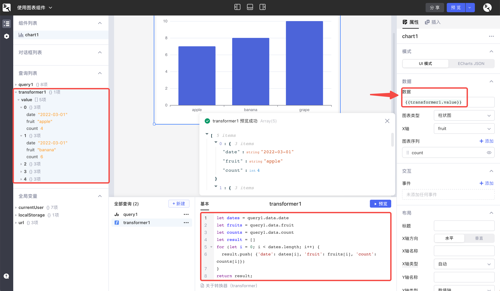
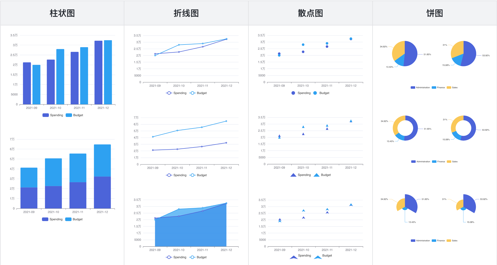
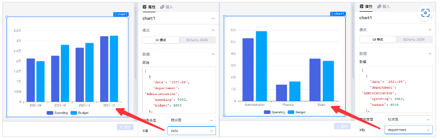
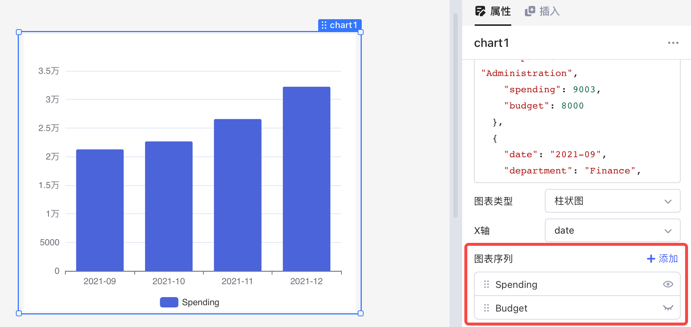
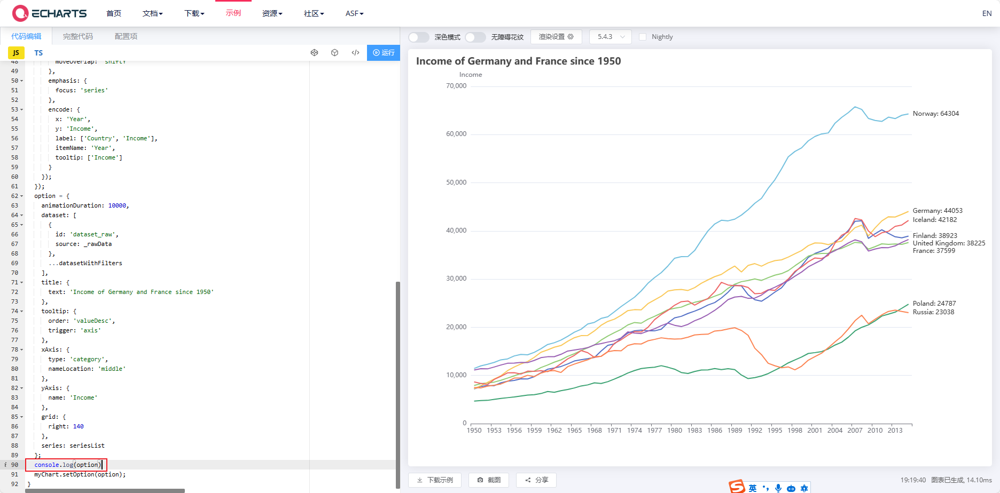
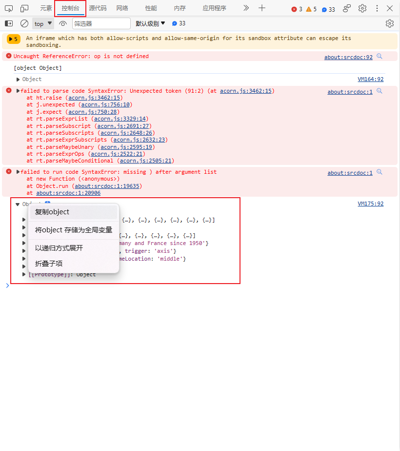
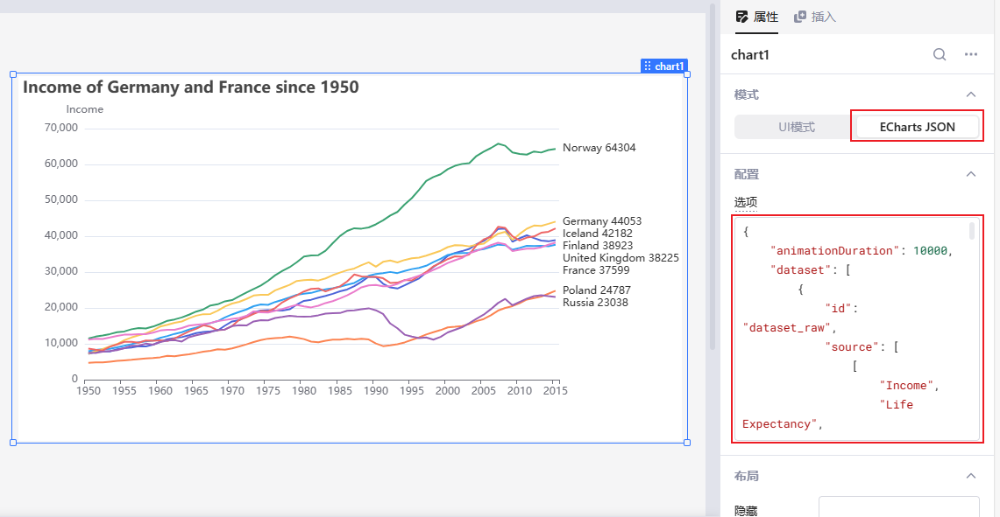

本文档介绍如何使用图表组件可视化展示数据，使数据理解和数据分析更加简单高效。


## UI 模式

### 数据格式

UI 模式下，图表组件支持的**数据**格式与[表格组件](../component-guides/using-table.md)相同，即一个由 JavaScript 对象组成的 **数组** ，其中每一项的不同字段对应不同的表格列。下面的例子包含了 `date`、`fruit` 和 `count` 三列数据。

```json
[
  { "date": "2022-03-01", "fruit": "apple", "count": 4 },
  { "date": "2022-03-01", "fruit": "banana", "count": 6 },
  { "date": "2022-04-01", "fruit": "grape", "count": 10 },
  { "date": "2022-04-01", "fruit": "apple", "count": 3 },
  { "date": "2022-04-01", "fruit": "banana", "count": 2 }
]
```

这里同样支持 [JavaScript 表达式](../javascript-in-lowcoder/javascript-query.md)，您可以在 `{{ }}` 中编写 JS 表达式来引用其他组件或查询的数据，并将不符合要求的数据格式进行转换。

例如，查询 `query1` 当前返回值如下：

```json
{
  "date": [
    "2022-03-01",
    "2022-03-01",
    "2022-04-01",
    "2022-04-01",
    "2022-04-01"
  ],
  "fruit": ["apple", "banana", "grape", "apple", "banana"],
  "count": [4, 6, 10, 3, 2]
}
```

新建一个[转换器](../javascript-in-lowcoder/using-transformer.md) `transformer1`，通过如下 JS 代码对数据格式进行转换：

```javascript
let dates = query1.data.date
let fruits = query1.data.fruit
let counts = query1.data.count
let result = []
for (let i = 0; i < dates.length; i++) {
  result.push( {'date': dates[i], 'fruit': fruits[i], 'count': counts[i]} )
}
return result;
```

然后引用转换器的值 `{{transformer1.value}}`，作为图表组件的数据：



### 图表类型

目前支持的图表类型有四种： **柱状图** 、 **折线图** 、**散点图**和 **饼图** 。可以在右侧属性面板中切换 **图表类型** 、设置**布局**与**样式**等。



### X 轴

图表的 **X 轴**是数据分类的基准，通常选择数据的 **非数值字段** ，如按时间、按部门分类。



### 图表序列

**图表序列**可以理解为图表的 Y 轴，用于展示数据。默认展示数据的所有 **数值字段** ，可以在属性面板中进行修改。



## Echarts JSON

lowcoder还集成了 [Apache ECharts](https://echarts.apache.org/zh/index.html) —— 一个基于 JavaScript 的开源可视化图表库，只需要填写**选项配置**即可使用。目前支持纯 JSON 格式的数据，可参考 [ECharts 选项配置](https://echarts.apache.org/zh/option.html)和 [ECharts 示例](https://echarts.apache.org/examples/zh/index.html)。


### 快速测试是否支持图表类型

[ECharts 示例](https://echarts.apache.org/examples/zh/index.html)中包含了非常多的示例，以下教程将教会你如何快速判断lowcoder是否支持该示例及获取数据结构。

#### 获取数据结构

本次以[动态排序折线图](https://echarts.apache.org/examples/zh/editor.html?c=line-race)为例。


打开示例页面，左侧代码编辑框下拉到 `option` 赋值语句，在下一行输入 `console.log(option)` 来打印 `option`



按F12打开**开发者选项** > **控制台**，找到最后打印的 **Object** 即为刚输出的**option**，点击右键选择**复制object**



#### 设置数据结构

在lowcoder中添加Chart组件，并切换到Echarts JSON模式，将复制的JSON数据粘贴到选项中，即可实时预览。

