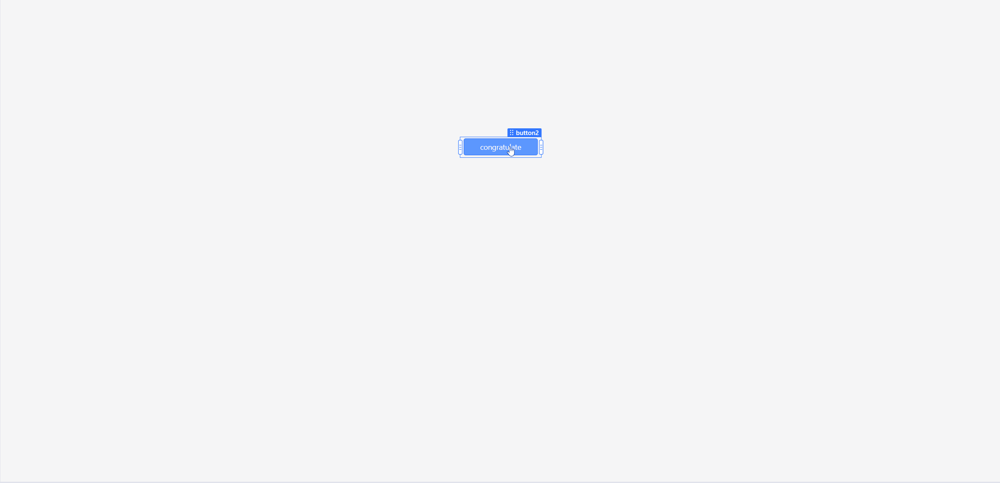
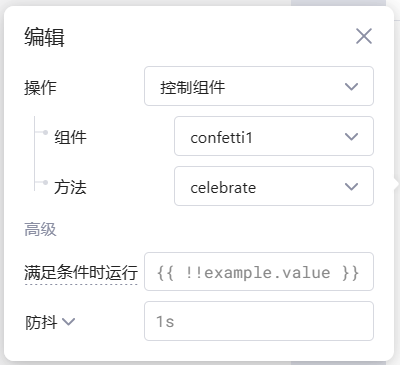

一个创建节日五彩纸屑效果的组件，为您的UI添加一丝庆祝色彩。组件非常简单，可通过JavaScript或者其他组件调用 `celebrate` 方法释放彩带。

## 庆祝

## 爆炸参数

- `angle`: 爆炸的方向，单位为度，默认为90度。
- `spread`: 爆炸的扩散程度，单位为度，默认为45度。
- `startVelocity`: 粒子的初始速度，默认为45。
- `elementCount`: 粒子元素的数量，默认为50。
- `dragFriction`: 速度减小与当前速度成比例的比例，默认为0.1。
- `duration`: 从爆炸到消失的持续时间。 
- `stagger`: 每个碎屑的延迟时间，单位为毫秒，默认为0。
- `width`: 碎屑元素的宽度。
- `height`: 碎屑元素的高度。
- `perspective`: 透视效果的深度.
- `colors`: 一组颜色代码的数组，默认为['#a864fd', '#29cdff', '#78ff44', '#ff718d' '#fdff6a']。

