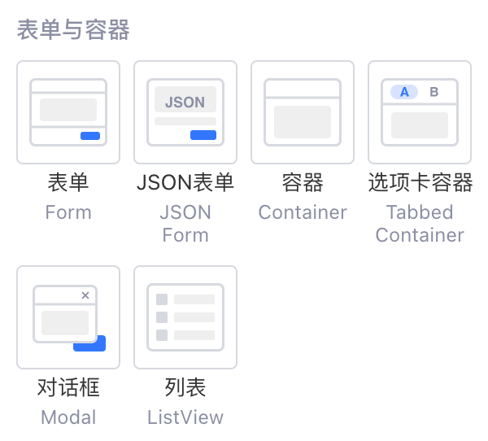
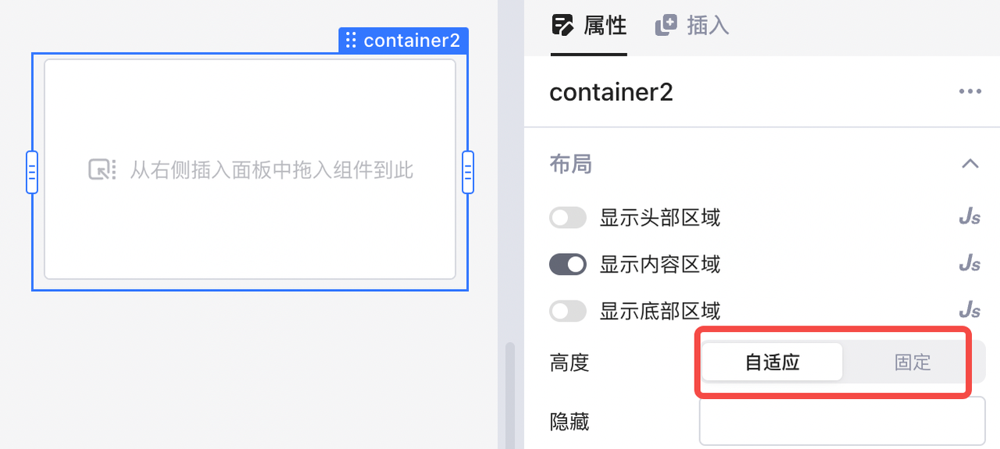
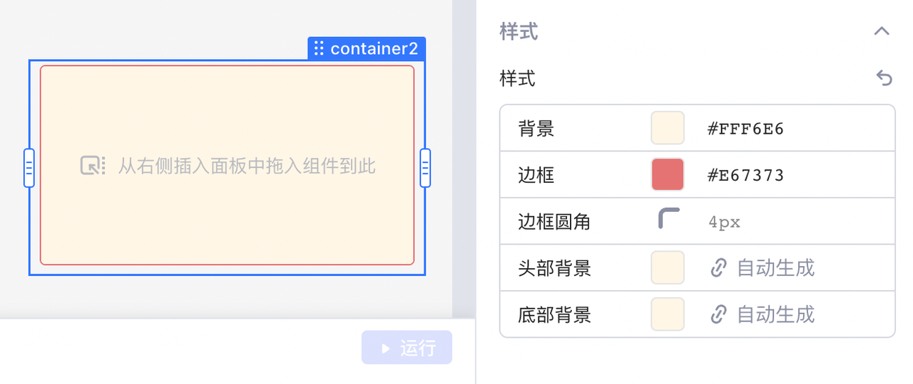
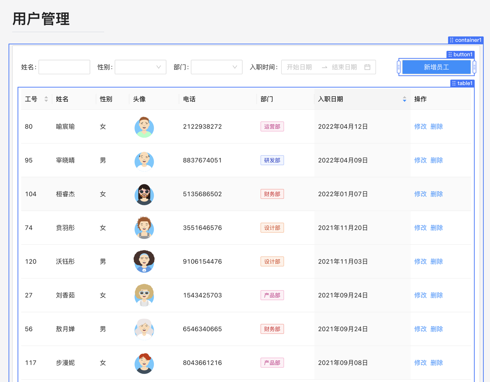
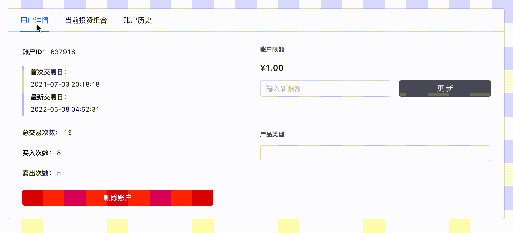
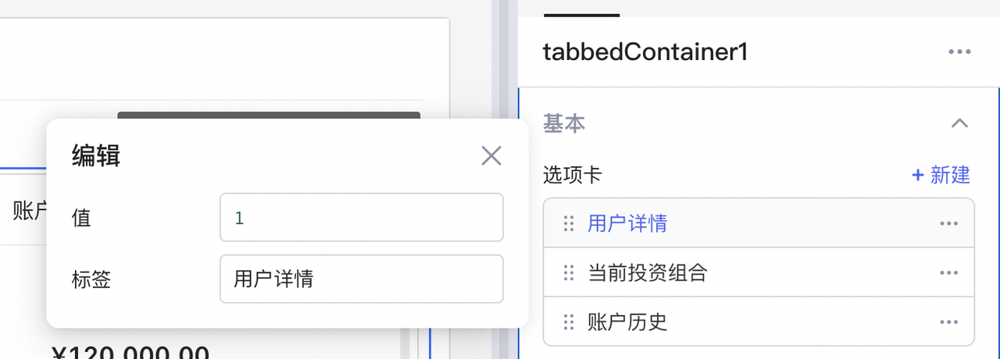

使用容器组件，将相关的多个组件统一收纳在一个容器里，能使应用的 UI 布局更加清晰、美观和模块化，内容更加有条理；用户寻找目标信息也更方便快捷。

​

## 布局

容器组件包含三个部分：

* ​**头部区域**​：默认包含用作标题的 Text 组件。
* ​**内容区域**​：放置组件的主要区域。
* ​**底部区域**​：可以添加脚注和补充内容。

​

## 高度与样式

容器组件的高度可设置为：

* ​**自适应**​：容器的高度会随着嵌入组件的尺寸自动调整。
* ​**固定**​：与自适应相对，手动调整容器尺寸后，容器高度不再变化。若嵌入组件的高度比容器大，容器右侧会出现滚动条，用户可以滚动查看完整的内嵌组件内容。

​

在布局属性的下方，可以设置容器组件的​**样式**​：

​

## 收纳组件

搭建应用时，可以将服务于相同业务流程的表格、输入框、按钮等其他组件嵌入一个容器组件，如下图所示：

​

将多个组件放入容器组件相当于对它们进行了「收纳」，应用的 UI 布局将更加清晰、美观和模块化，整体信息更有条理，用户寻找目标信息也更加方便快捷。如下图，一些组件被放入一个**容器**中进行组合、布局，构成了一个「用户管理」模块。

​

> #### 💡 说明
>
> 容器内也能嵌入容器组件。

## 选项卡容器

相较于普通容器，选项卡容器可通过切换选项卡展示不同内嵌组件内容，如下图所示：

​

### 设置选项卡

选项卡容器的选项卡需要编辑其值和标签，您可以自由新建或者删除​**选项卡**​：

* **标签：**可理解为选项的名字
* **值：**选项被选中后对应的值，值唯一

​

此外，您可在「表单与容器」类别下找到更多的容器类组件并使用，它们也有各自的功能：

* ​**表单**​：表单组件是一系列用于表单提交的输入组件的容器。可参阅[使用表单组件](../component-guides/using-form.md)文档。
* ​**对话框**​：按钮的单击事件触发弹出对话框，可以行使确认信息、填写信息等功能。可参阅[使用对话框](../component-guides/using-modal.md)文档。
* ​**列表**​：列表组件可用于展示自定义的多形式数据行。列表也可以嵌入其他组件。可参阅[使用列表组件 (ListView)](../component-guides/using-listView.md) 文档。