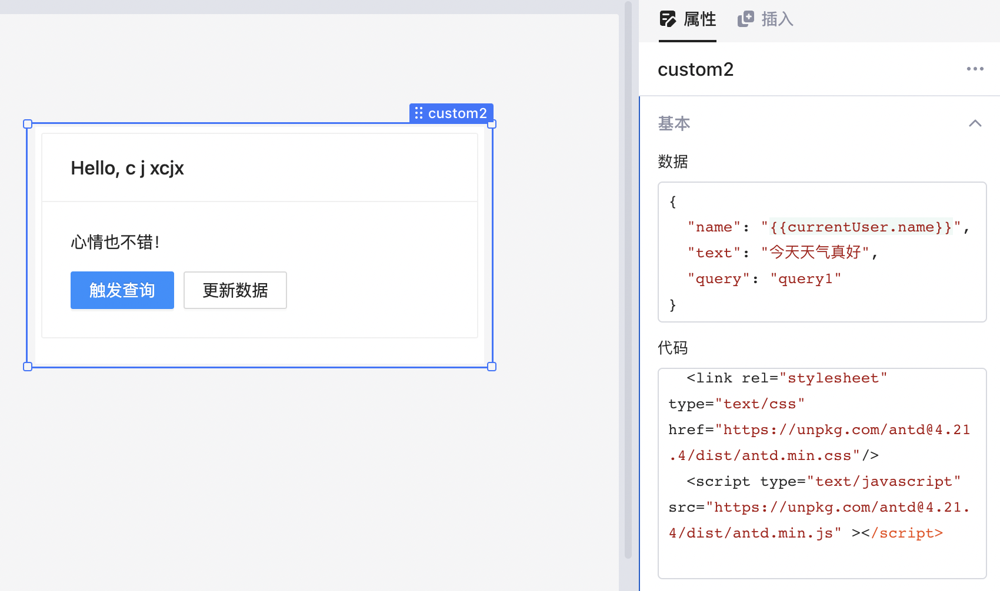
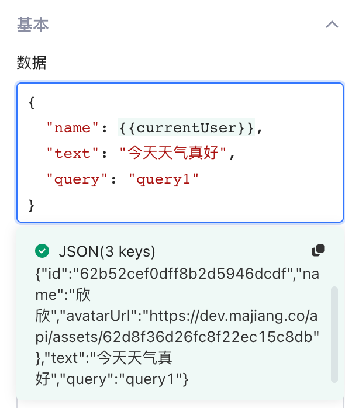
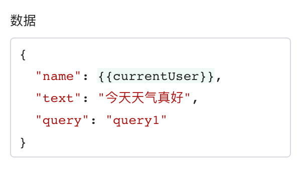
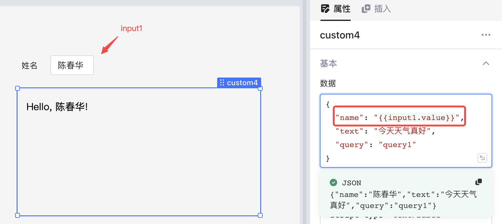
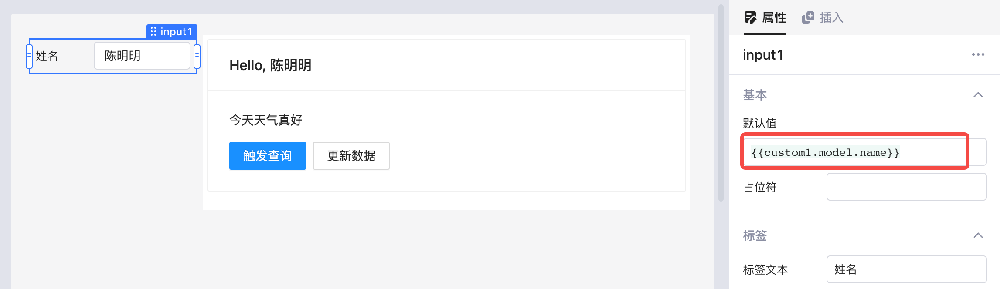
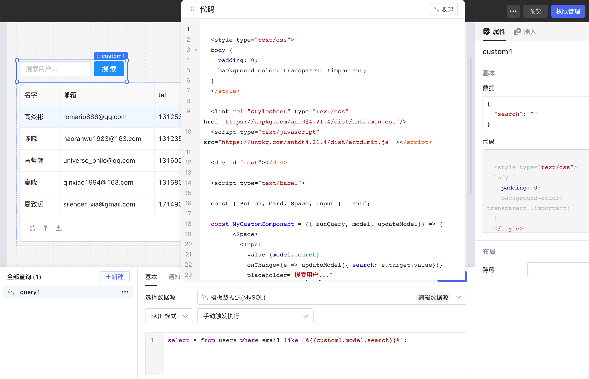

在Lowcoder中，您可以使用React.js库设计自定义组件，以满足构建应用程序时的特定需求。自定义组件可以是静态的，也可以是动态的，但都需要敲代码。

## 前提条件

* 您已经了解Lowcoder搭建应用的基本逻辑。.
* 您对 HTML/CSS/JS 以及 React.js 库较为熟悉。

## 基本了解

拖放一个自定义组件于画布上，Lowcoder已经预填充了示例数据，这些示例代码演示如何在自定义组件中与应用的其他部分交互，您可以基于此进行修改或者将其删除后自己编写代码。

> #### 💡 说明
>
> 点击自定义组件的**边框**选中组件，以显示自定义组件的属性面板（点击组件内部无法选中组件）。



### 数据区域

**数据**区域是自定义组件与外部进行数据交互的接口，通过定义一些键值对来让应用引用自定义组件的内部数据或者从应用传递数据到自定义组件。



### 代码区域

浏览**代码**区域，Lowcoder定义了几个函数或者对象：`runQuery`、`model` 和 `updateModel`。


* `model` 是一个对象，它以键值对的形式定义了应用和自定义组件之间传递的变量数据。**数据区域**中定义的就是 `model`，如下图，可以使用 `model.name`、`model.text` 引用具体值。



* `runQuery` 是一个函数，接受一个字符串类型的参数，该参数是现有查询的名称，如：`runQuery(model.query)`。
* `updateModel`是一个接受单个对象类型参数的函数，传递给 `updateModel` 的参数将与自定义组件的**数据**合并。

```typescript
interface Lowcoder {
    // 订阅数据的变化，当数据变化时回调函数 handler 会被触发
    // 返回值是取消订阅的函数
    subscribe(handler: SubscribeHandler): () => void;
  
    // React HOC组件函数，传入一个 React 组件
    // 返回一个属性包含：runQuery, model, updateModel 的新的组件。
    connect(Component: ComponentType<any>): ComponentType;
  
    // 通过查询的名称执行一个查询
    runQuery(queryName: string): Promise<void>;

    // 更新数据
    updateModel(patch: any): Promise<any>;
}

interface SubscribeHandler {
  (data: IDataPayload): void;
}

interface IDataPayload {
  model: any;
}
```

下面的代码描述了创建一个正常工作的自定义组件所需的最少代码：

```html
<div id="react"></div>
<script type="text/babel">
  const MyCustomComponent = ({ runQuery, model, updateModel }) => (
    <p>Hello, world!</p>
  );
  const ConnectedComponent = Lowcoder.connect(MyCustomComponent);
  ReactDOM.render(<ConnectedComponent />, document.getElementById("react"));
</script>
```

## 数据交互

### 从应用传递数据到自定义组件

**场景** ：希望一个文本输入组件显示一个自定义组件中的某个值。如下图，`custom1.model.name` 可以引用自定义组件的 `name` 值，`input1` 组件的默认值设为`custom1.model.name` 即可显示此值：



代码：

```javascript
<div id="root"></div>
  
<script type="text/babel">
  
  const { Button, Card, Space } = antd;
  
  const MyCustomComponent = ({ runQuery, model, updateModel}) => (
    <Card title={"Hello, " + model.name}>
        <p>{model.text}</p>
        <Space>
          <Button
            type="primary"
            onClick={() => runQuery(model.query)}
         >
            Trigger query
          </Button>
          <Button
            onClick={() => updateModel({ text: "I'm also in a good mood!" })}
          >
          Update data
          </Button>
      </Space>
    </Card>
  );
  
  const ConnectedComponent = Lowcoder.connect(MyCustomComponent);
  
  const root = ReactDOM.createRoot(document.getElementById("root"));
  root.render(<ConnectedComponent />);
  
  </script>
```

### 从自定义组件传递数据到应用

 **场景** ：希望一个文本输入组件显示一个自定义组件中的某个值。如下图，`custom1.model.name` 可以引用自定义组件的 `name` 值，`input1` 组件的默认值设为`custom1.model.name` 即可显示此值：



### 从自定义组件触发查询

 **场景** ：假设您想基于在自定义组件中输入的内容触发一个查询，从而查询 **users 表**中的所有数据。默认情况下，表格会显示查询返回的所有用户。



在自定义组件中我们实现了一个输入框和一个搜索按钮，当在输入框中输入一些文本，然后点击**搜索**按钮后，表格中会只展示用户邮箱匹配输入框内容的用户。


**实现步骤：**

1. 下面展示了上述示例中自定义组件的代码，引入了 Antd 组件库，并使用了其中的 Input 组件，当用户在 Input 组件中输入内容时，会通过 `updateModel` 方法，更新自定义组件的数据。

```html
<style type="text/css">
  body {
    padding: 0;
    background-color: transparent !important;
  }
</style>

<link rel="stylesheet" type="text/css" href="https://unpkg.com/antd@4.21.4/dist/antd.min.css"/>
<script type="text/javascript" src="https://unpkg.com/antd@4.21.4/dist/antd.min.js" ></script>

<div id="root"></div>
<script type="text/babel">

const { Button, Card, Space, Input } = antd;

const MyCustomComponent = ({ runQuery, model, updateModel}) => (
      <Space>
        <Input
          value={model.search}
          onChange={e => updateModel({ search: e.target.value})}
          placeholder="搜索用户..."
        />
        <Button
          type="primary"
          onClick={() => runQuery("query1")}
       >
          搜索
        </Button>
    </Space>
);

const ConnectedComponent = Lowcoder.connect(MyCustomComponent);

const root = ReactDOM.createRoot(document.getElementById("root"));
root.render(<ConnectedComponent />);
</script>
```

2. 同时也使用了 Antd 组件库中的 Button 组件，当用户点击 Button 时，会通过 `runQuery` 方法执行名称为 `query1` 的查询。
3. 创建一个名为 `query1` 的查询，触发方式设置为 “手动触发执行”，编写 SQL 代码，使其访问自定义组件的数据：

```sql
select
  *
from
  users
where
  email like '%{{custom1.model.search}}%';
```