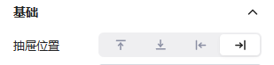
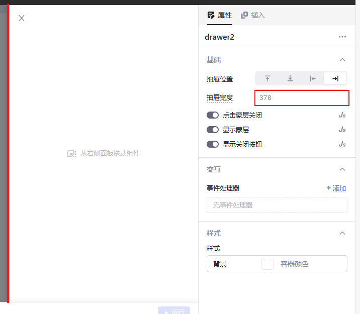
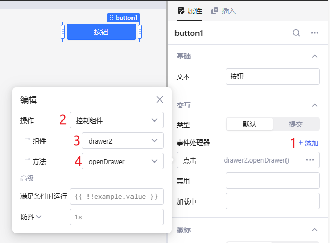

在Lowcoder中，**Drawer**是一个侧边弹出组件，用于显示信息或执行操作，而不会中断主窗口上的工作流程。

## 布局

新插入**抽屉**组件默认会浮动在主窗口的右侧，您可以直接拖动其他组件到**抽屉**上。

当抽屉关闭时，您可以通过单击左侧面板中**对话框**选项卡中的相应标签来重新打开它。

### 抽屉位置

设置**抽屉**弹出的位置，默认为右侧。

### 抽屉宽度

您可以输入数字设置宽度（默认单位px，同时也支持%、rem等CSS常用宽度）也可以按住红线位置直接拖动边框来设置抽屉宽度。

### 显示蒙层

打开 `显示蒙层` 选项后，抽屉组件在打开时，抽屉外将显示一个灰色的遮罩（不管是否打开蒙版，抽屉外的其他组件都将无法操作），同时，可设置点击蒙层是否可以关闭抽屉。

### 显示关闭按钮

是否显示抽屉左上角的关闭按钮，可用于特殊场景下，强制用户完成某些操作后，再[编程关闭抽屉](#编程关闭抽屉)。

## 事件

您可以在应用程序的任何位置引用JS代码中的抽屉的方法，也可以通过**属性***>**交互***>**事件处理器**中的**控制组件**操作它。
以下部分将指导您如何通过单击在线购物应用程序中的按钮打开和关闭抽屉。

### 编程打开抽屉

通常，在应用程序中，您可以通过单击按钮等事件触发打开抽屉。本例中使用按钮组件来触发：

1. 在**事件处理器**中点击 **+添加**。
2. 选择新添加的事件，打开**事件编辑器**的浮动窗口，在操作下拉列表中选择 **控制组件**。
3. 在 **组件** 下拉列表中选择想打开的抽屉组件名。
4. 在 **方法** 下拉列表中选择 `openDrawer`。

    
5. 点击按钮，即可打开抽屉组件.

### 编程关闭抽屉

步骤同上，将 **方法** 下拉列表中的 `openDrawer` 换成 `closeDrawer` 即可。