表单组件是一系列用于表单提交的输入组件的容器，您可以从组件库中选择组件并拖放其中，也可以从数据源快速生成表单。

## 从数据源生成表单

拖放一个表单组件于画布上，单击表单组件的​**从数据源快速生成**​：

​

会弹出表单生成器，**数据源**下拉列表中会展示支持生成表单的数据源（目前支持 MySQL 数据源），**表**下拉列表会列举对应数据源的表。这里以 users 表为例，表单生成器展示了 users 表的**列名、列数据类型**等 schema 信息：

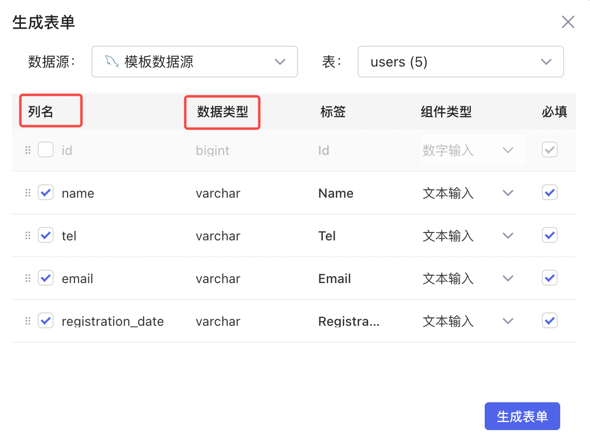​

Lowcoder会基于列数据类型匹配对应的输入组件，例如：一个 int 类型的列会匹配一个**数字输入**组件。users 表中的列都是 varchar 数据类型，所以自动匹配了**文本输入**组件，当然您也可以自行调整输入组件的类型。

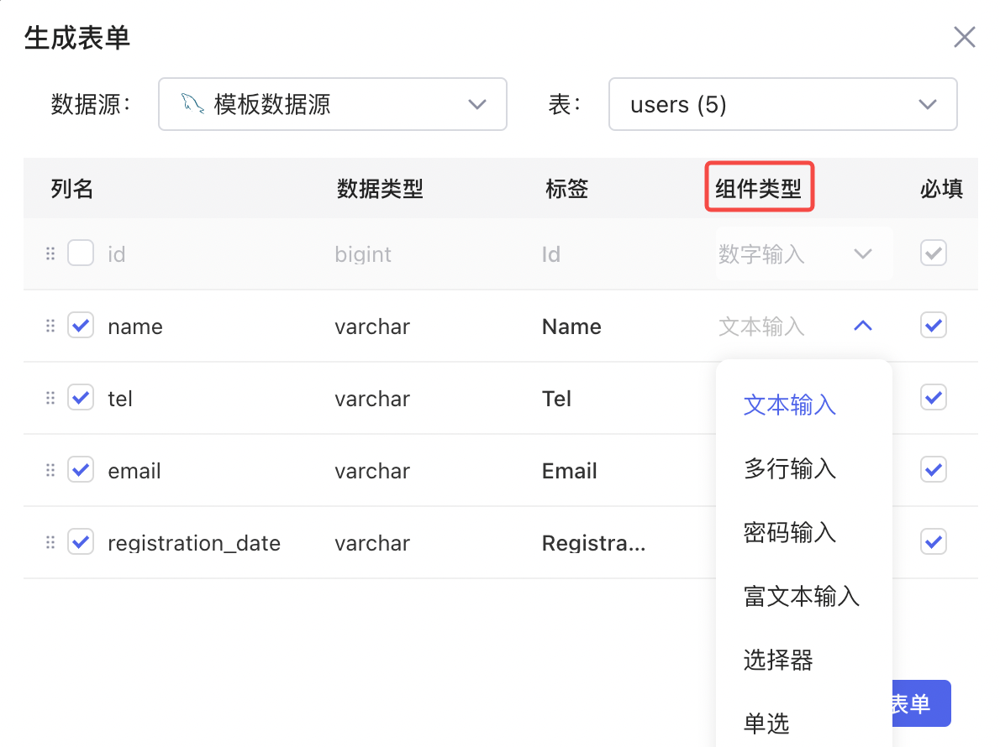​

勾选/不勾选**列名**可以控制用户是否需要填写该字段。例如：id 字段为 auto increment，此时用户无需显式填写 id，不勾选该字段即可；通过勾选/不勾选​**必填**​，可以确定表单中该字段是否必填。

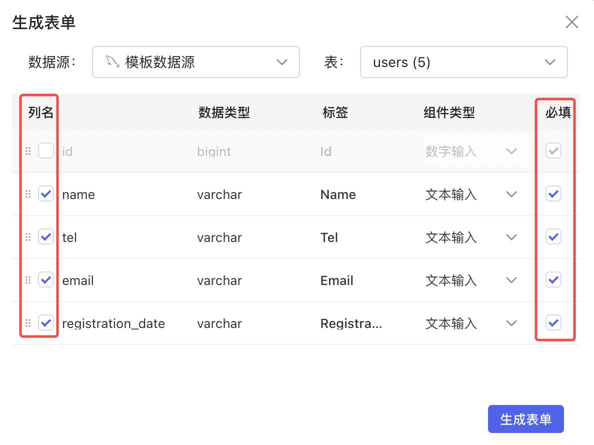​

最后，您还可以调整**标签**字段，提供可读的描述信息。

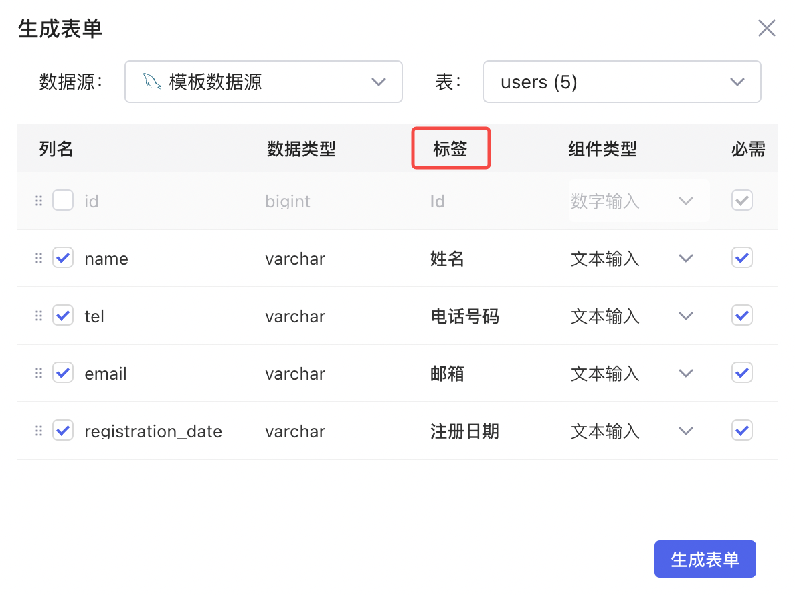​

设置完成后，点击​**生成表单**​：

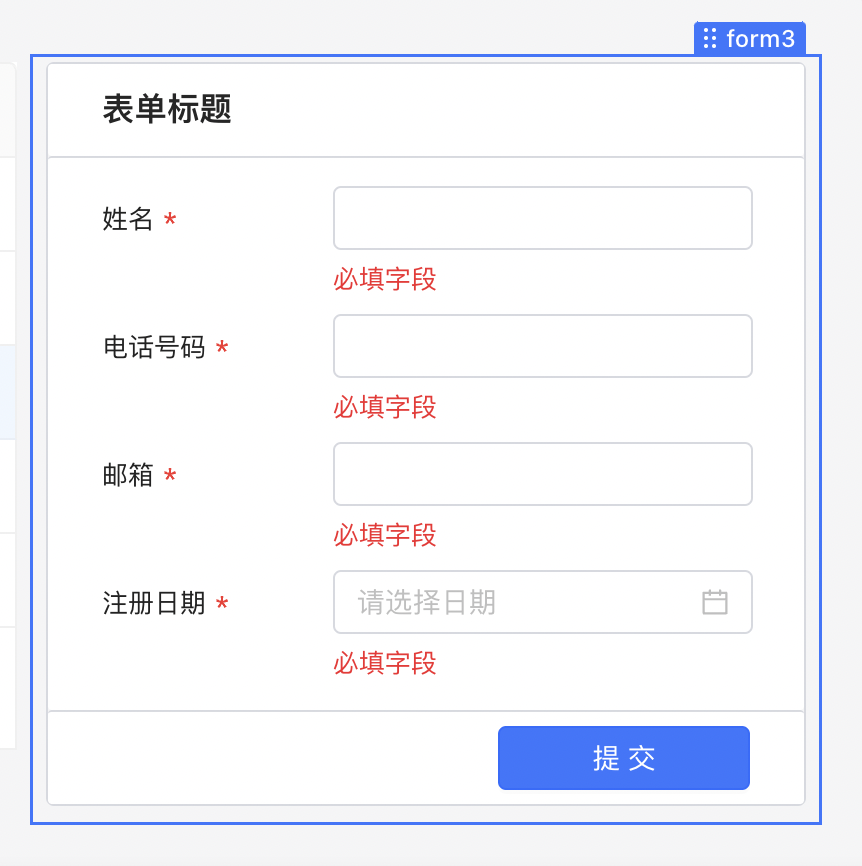​

## 拖放组件到表单

表单中的输入组件将自动暴露在表单的 `data`​ 字段中，字段名默认为对应的输入组件名：

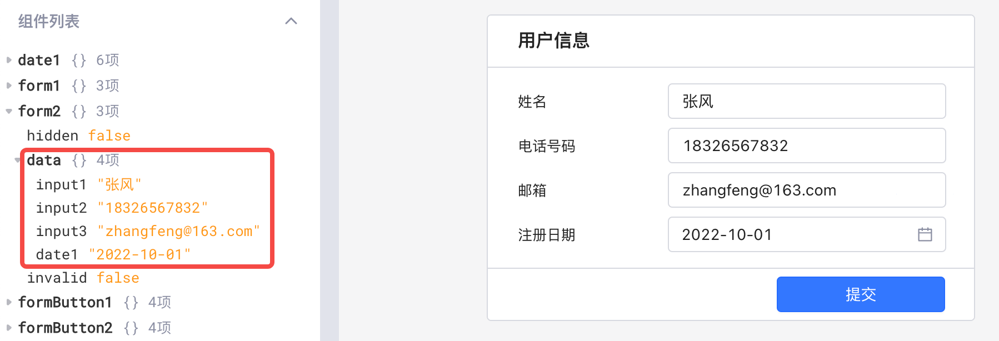​

通过修改组件的​**表单-&gt;属性名**​，可以将其修改为实际业务数据中的字段名，例如：修改上述表格各输入框的**属性名**字段，`data`​ 中将暴露修改后的字段名：

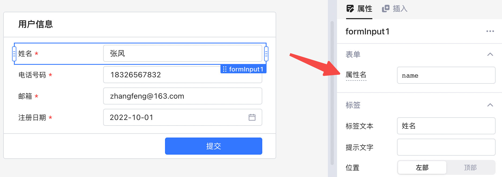​

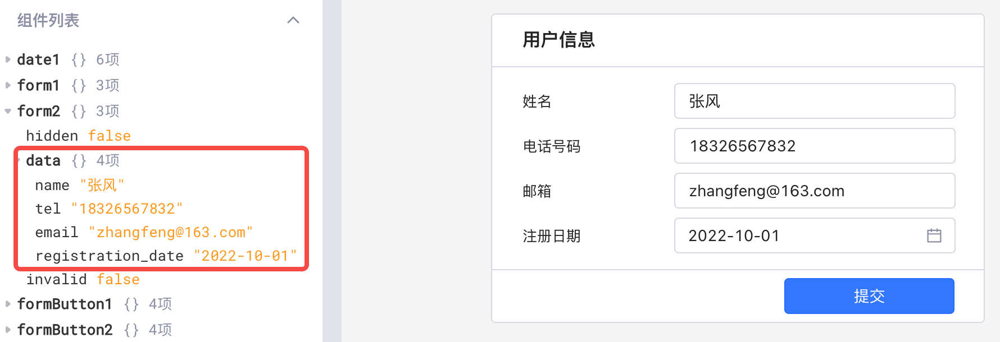​

## 输入校验

除了设置必填之外，您可以通过设置表单的**校验**属性来校验输入是否符合要求，如邮箱格式校验、URL 校验、正则表达式校验等。

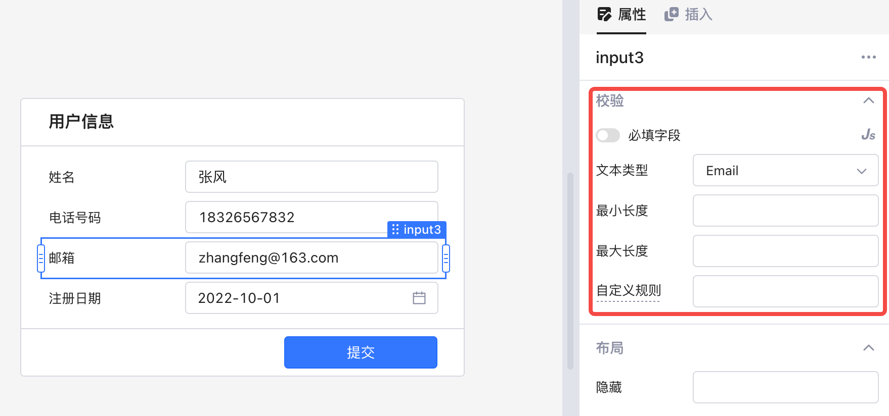​

如果表单内组件输入校验失败，此时表单不能提交：

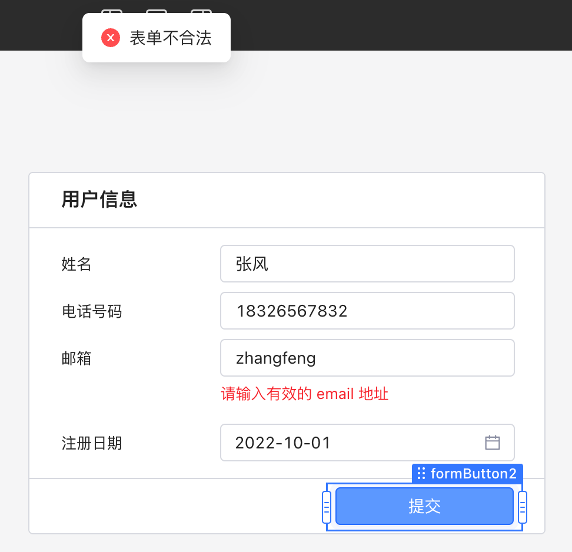​

## 表单提交

在从数据源创建表单后，Lowcoder会同时自动创建一个基于表单的插入查询 ，例如：基于数据源创建表单 `form1`​ 后，会自动创建该表单的插入 (Insert) 查询 `form1SubmitToUsers1`​  ，并绑定到 `form1`​ 的**提交**事件。

​

自动创建的查询是 GUI 模式，插入对象为 `{{form1.data}}`​ 。点击**提交**按钮以后，数据库的 users 表中会提交 `{{form1.data}}`​  新增一条记录。

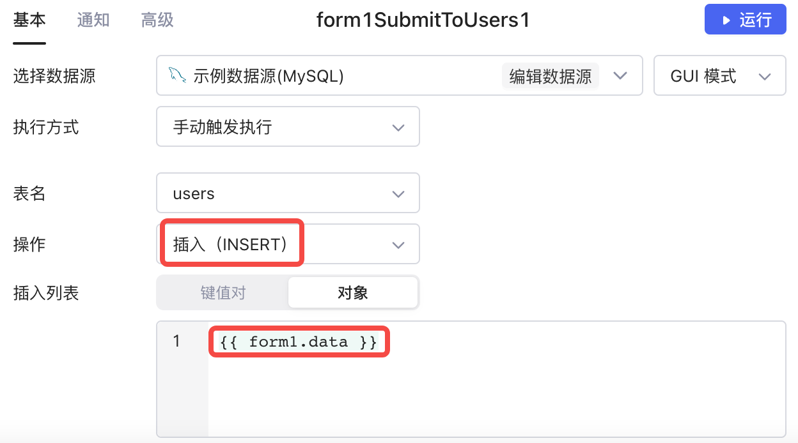​

## 与 JSON 表单组件的比较

多数情况下，Lowcoder更建议您使用表单组件，两种组件的差异如下表所示：

|**组件**|**创建方式**|**布局和样式、属性**|**维护和更新**|**通过数据库自动生成**|
| ---| -------------------------------------| ------------------------------------------| --------------------| --------|
|**表单**|组件拖放嵌入/关联数据库的表自动生成|拖拽组件调整布局，单独定义组件样式和属性|手动更改组件属性|支持|
|**JSON** **表单**|JSON 定义|使用 JSON  控件属性|编辑 JSON 更新表单|不支持|

## 实践：设计表单的技巧

表单是信息添加、录入的通用形式，合理的表单设计能减轻用户负担，提升使用效率。关于在Lowcoder中设计表单的技巧，详情请参阅文档[表单设计技巧](../style/form-desgin.md)。