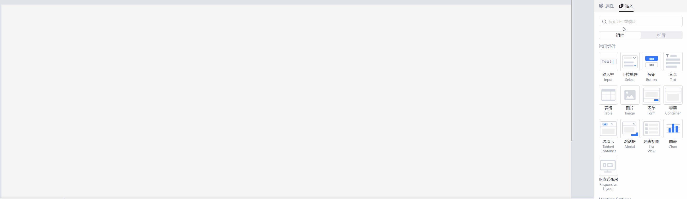
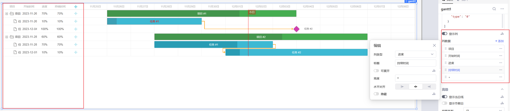
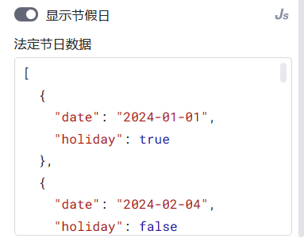
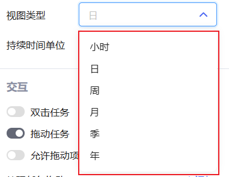
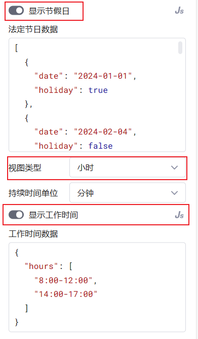
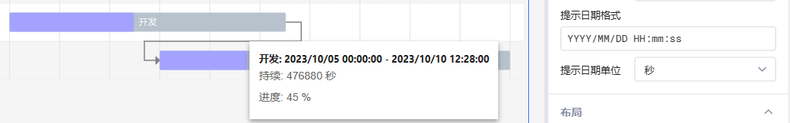
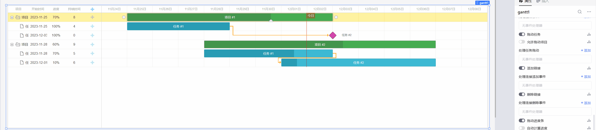
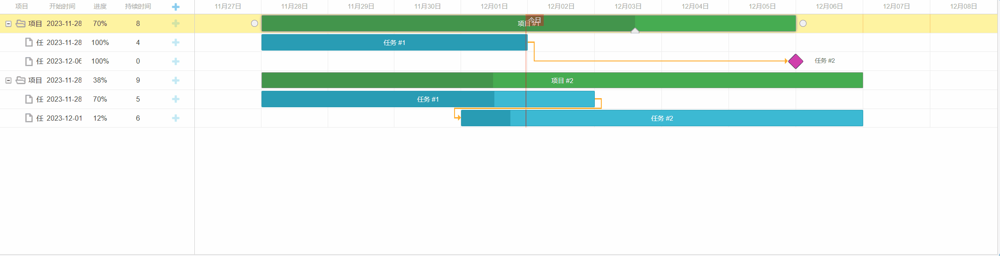
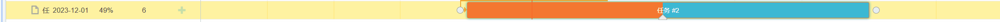
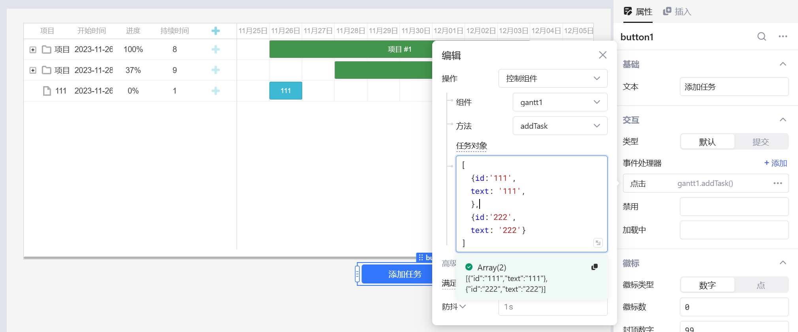

甘特图是一个复杂的高阶组件，组件通过列表和时间刻度表示出特定项目的顺序与持续时间，横轴表示时间，纵轴表示项目。

低代码平台Retool、Appsmith、Tooljet等都没有同类型组件，此次添加甘特图组件，作为拓展低代码使用边界的一次尝试。

甘特图选取了 [DHTMLX Gantt](https://docs.dhtmlx.com/gantt/) 作为组件,改组件渲染性能好、API丰富，但因为免费版限制，无法获取Gantt实例，因此一个页面只能渲染一个Gantt组件。

## 时间轴模式

* 自动模式：根据项目的时间自动计算甘特图横轴的起始时间。
* 手动模式：根据`开始时间`和`结束时间`设置甘特图横轴的起始时间。

## 任务数据

用于在图表上显示项目和任务，可参考 [任务属性](https://docs.dhtmlx.com/gantt/desktop__task_properties.html) (部分属性不支持)

* `id` (string or number): 任务的唯一标识符，可以是字符串或数字。
* `start_date` (Date): 任务的开始日期。
* `end_date` (Date): 任务的结束日期。
* `text` (string): 任务的显示文本。
* `progress` (number): 任务完成的百分比。
* `duration` (number): 任务的持续时间，以时间单位（例如天）表示。
* `parent` (string or number): 如果任务是子任务，则指定父任务的id。
* `type` (string): 任务的类型，例如`project`、`task`或`milestone`。
* `open` (boolean): 指示任务是否展开显示其子任务。
* `color` (string): 任务的颜色。
* `textColor` (string): 任务文本的颜色。
* `progressColor` (string): 任务进度条的颜色。
* `readonly` (boolean): 指示任务是否为只读。

## 连线数据

用于在图表上显示连线，可参考 [连线属性](https://docs.dhtmlx.com/gantt/desktop__link_properties.html) (部分属性不支持)

* `id` (string or number): 链接的唯一标识符。
* `source` (string or number): 链接的起始任务的id。
* `target` (string or number): 链接的目标任务的id。
* `color` (string): 链接的颜色。
* `type` (string): 链接的类型。
    - 0:终-起连线
    - 1:起-起连线
    - 2:终-终连线
    - 3:起-始连线
* `readonly` (boolean): 指示链接是否为只读。
  
## 显示列&列数据

打开显示列后，可在图表左边显示列表、折叠按钮、添加按钮等，点击列可以设置列类型、标题、宽度等属性

## 显示当日线

可在图表的时间轴的当日位置，显示红色的当日线

## 显示节假日

打开显示节假日后，自动设置星期六和星期天为休息日，同时增加`法定节日数据`选项，通过`date`和`holiday`可设置法定假假日和调休

## 视图类型

支持多种显示模式，已满足你的项目需求，从 **小时视图** 一直到 **年视图**，默认为 **日视图**

当打开 **显示节假日** 和 **视图类型** 为小时时，可以打开 **显示工作时间**来设置工作时间。

## 交互

可以设置 `双击任务` 、 `拖动任务` 、 `添加链接` 、 `删除任务`、`拖动进度条`等事件的处理

* 打开`拖动任务` 后将显示 `允许拖动项目` 选项，打开后允许拖动项目整体移动

* 打开`拖动进度条`后将显示 `自动计算进度` 选项，打开后可根据 `子任务进度` 自动计算 `项目进度`
  

## 进度分段颜色

打开`进度分段颜色` 选项后，可以让进度条根据进度显示颜色，共分为三段：`低进度`、`中进度`、`高进度` 和 `完成状态`

## 组件方法

其他组件或者通过代码可以通过组件方法，对组件进行操作。

### 添加任务（addTask）

`任务对象`：支持多种类型，传入对象将添加一个任务，传入集合可一次添加多个任务。具体对象属性可参考 [任务属性](./using-gantt.md#任务数据)

### 删除任务（removeTask）

`任务ID`: 文本数组，可删除一个或多个任务。

### 添加/删除链接（TODO：即将添加）

即将添加删除链接功能。

### 展开/折叠所有任务(expandingAll/collapsingAll)

展开或折叠所有任务

### 导出图表

* exportToPNG: 导出图表为PNG格式。
* exportToPDF: 导出图表为PDF格式。
* exportToExcel: 导出图表为Excel格式。