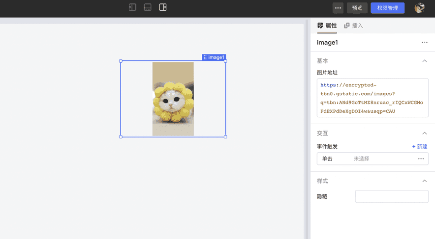
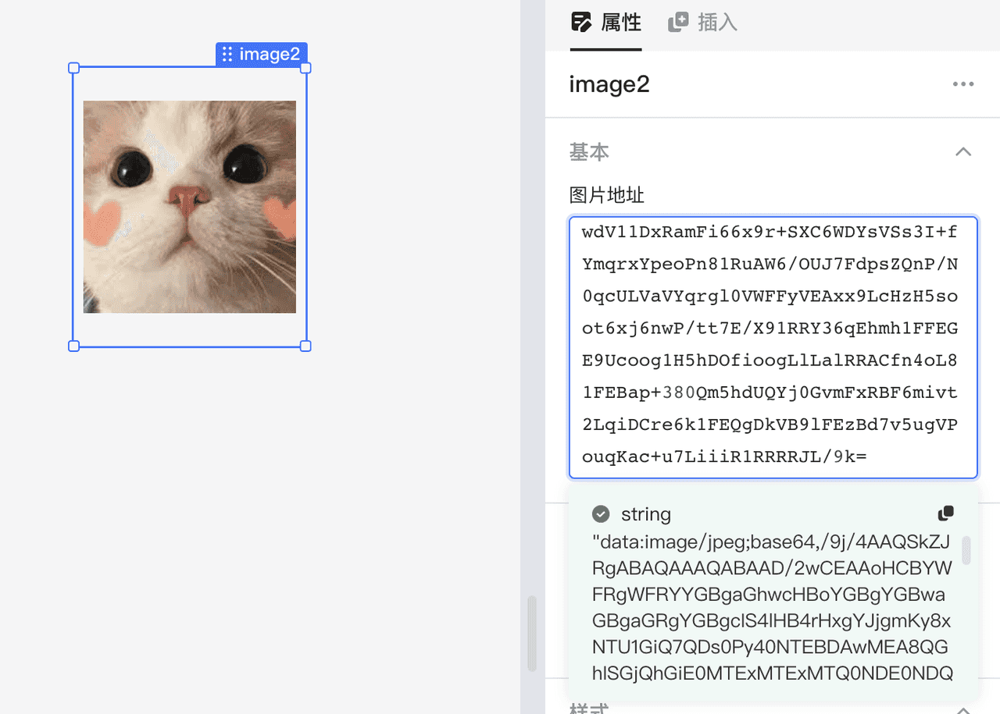
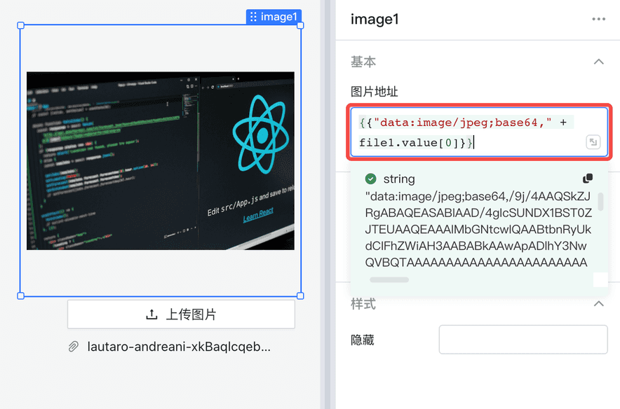
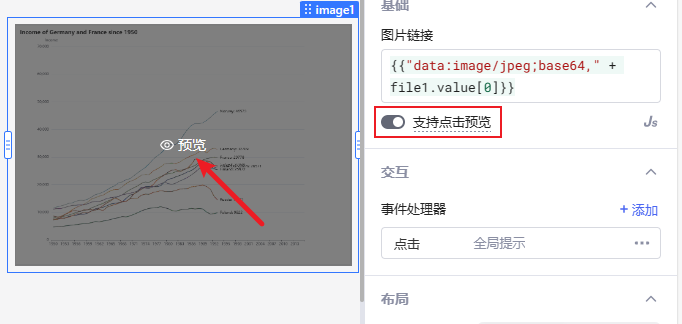

开发应用时经常会需要展示图片，在Lowcoder中可以通过 URL或者 Base64 字符串来引用图片，当然您也可以在 `{{ }}` 中编写 JS 表达式来引用图片地址。

## 通过 URL 引用图片

首先将一个**图片**组件拖放到画布上（或者拖放到一个容器内等），单击该组件，您会在属性编辑区看到**图片地址**输入框，输入图片的 URL 便可引用图片到组件中显示。



## 通过 Base64 字符串展示图片

在右侧图片地址输入框除了输入 URL 之外，您也可以填写一个图片内容转换的 Base64 字符串，字符串需要保留正确的描述符前缀，例如：data:image/jpeg;base64,（逗号不能省略）。

<mark style="background-color:yellow;">`data:image/PICTURE_FORMAT;base64`</mark><mark style="background-color:yellow;">**`,`**</mark><mark style="background-color:yellow;">`YOUR_BASE64_ENCODED_IMAGE_DATA`</mark>

<mark style="background-color:yellow;">`data:image;base64`</mark><mark style="background-color:yellow;">**`,`**</mark><mark style="background-color:yellow;">`YOUR_BASE64_ENCODED_IMAGE_DATA`</mark>



### Demo: 上传图片并显示

[文件上传组件](using-file.md#访问已上传文件) 上传文件后，可通过 `file1.value[0]` 来获取文件的**Base64**编码数据，因此，我们使用 JS拼接上他的描述符前缀即可显示。

```javascript
{{"data:image/jpeg;base64," + file1.value[0]}}
```



## 支持点击预览

打开`支持点击预览`后，当数据图片数据有效时，点击图片组件即可全屏预览图片。

