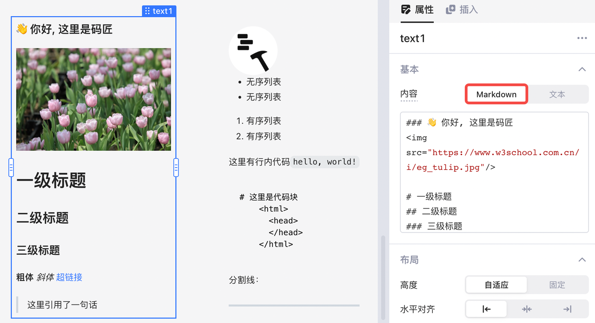

在Lowcoder中，您可以使用轻量级标记语言 **Markdown** 来格式化文本，例如改变字体的大小、颜色、类型等，使排版后的文本更美观和易读；Markdown 中也支持超文本标记语言 **HTML** 混编，实现更加定制化的样式。

您可以在以下组件中使用 Markdown：

* **文本组件** ：**内容**可选择为 Markdown



* **表格组件** ：**列类型**可设置为 Markdown


Lowcoder支持所有 Markdown 的基本语法：

* 标题语法：要创建标题，请在单词或短语前面添加井号 (`#`) 。
* 段落语法：要创建段落，请使用空白行将一行或多行文本进行分隔。
* 换行语法：在一行的末尾添加两个或多个空格，然后按回车键，即可创建一个换行。
* 强调语法：通过将文本设置为粗体 (`**`) 或斜体 (`*`) 来强调其重要性。
* 引用语法：要创建块引用，请在段落前添加一个 `>` 符号。
* 列表语法：要创建有序列表，请在每个列表项前添加数字并紧跟一个英文句点；要创建无序列表，请在每个列表项前面添加连字符 (`-`)、星号 (`*`) 或加号 (`+`) 。
* 代码语法：要将单词或短语表示为代码，请将其包裹在反引号 (```) 中。
* 分隔线语法：要创建分隔线，请在单独一行上使用三个或多个星号 (`***`)、连字符 (`---`) 或下划线 (`___`) ，并且不能包含其他内容。
* 链接语法：链接文本放在中括号内，链接地址放在后面的括号中。例如：`[Lowcoder](``https://lowcoder.mousheng.top``)`。
* 图片语法：要添加图像，请使用感叹号 (`!`)， 然后在方括号增加替代文本，图片链接放在圆括号里，括号里的链接后可以增加一个可选的图片标题文本。
* 转义字符语法：要显示原本用于格式化 Markdown 文档的字符，请在字符前面添加反斜杠字符 (`\`)。

详情可参阅 Markdown 官方教程：[Markdown 基本语法](https://markdown.com.cn/basic-syntax/)

## GFM 扩展

此外，Lowcoder也支持  **GFM ( GitHub Flavored Markdown ) 扩展** ，主要增加了以下几个特性：

* 脚注：要创建脚注参考，请在方括号（`[^1]`）内添加插入符号和标识符。可参阅 [Footnotes](https://docs.github.com/cn/get-started/writing-on-github/getting-started-with-writing-and-formatting-on-github/basic-writing-and-formatting-syntax#footnotes) 文档。
* 删除线：要添加删除线，请在词语前后使用两个波浪号 (`~~`)。可参阅 [Styling text](https://docs.github.com/cn/get-started/writing-on-github/getting-started-with-writing-and-formatting-on-github/basic-writing-and-formatting-syntax#styling-text) 文档。
* 表格：要添加表格，请使用三个或多个连字符（`---`）创建每列的标题，并使用竖线（`|`）分隔每列。可参阅 [Tables (extension)](https://github.github.com/gfm/#tables-extension-) 文档。
* 任务列表：要创建任务列表，请在列表项前加连字符 (`-`) 和空格，后接 (`[ ]`)；要将任务标记为完成，请使用 (`[x]`)。可参阅 [Task lists](https://docs.github.com/cn/get-started/writing-on-github/getting-started-with-writing-and-formatting-on-github/basic-writing-and-formatting-syntax#task-lists) 文档。

## HTML 支持

Lowcoder支持大部分 HTML 标签和属性，可参阅 [Markdown 内嵌 HTML 标签](https://markdown.com.cn/basic-syntax/htmls.html)文档。

> #### 🚫 注意
>
> Lowcoder考虑到安全原因，禁用 **iframe、script** 等标签。
>

### 附：Lowcoder支持的 HTML 标签

```html
<h1>
<h2>
<h3>
<h4>
<h5>
<h6>
<br>
<b>
<i>
<strong>
<em>
<a>
<pre>
<code>

<tt>
<div>
<ins>
<del>
<sup>
<sub>
<p>
<ol>
<ul>
<table>
<thead>
<tbody>
<tfoot>
<blockquote>
<dl>
<dt>
<dd>
<kbd>
<q>
<samp>
<var>
<hr>
<ruby>
<rt>
<rp>
<li>
<tr>
<td>
<th>
<s>
<strike>
<summary>
<details>
<caption>
<figure>
<figcaption>
<abbr>
<bdo>
<cite>
<dfn>
<mark>
<small>
<span>
<time>
<wbr>
<input>
```