本文档介绍如何使用表格组件展示数据和与表格数据交互。

## 表格数据

拖拽一个表格组件到画布上，表格的**数据**属性将自动填充一些示例数据，如下图：

​

表格组件支持的**数据格式**为 JavaScript 对象数组，即 `[ { k1:v1, k2:v2, ... }, ...]`​。您可以直接填写静态数据，也可以连接[数据源](../datasource.md)、创建[查询](../how-to-write-query.md)，并绑定动态的查询结果。

例如，将表格组件的数据属性与查询 `getUsers`​ 的结果数据 `{{getUsers.data}}`​ 进行绑定，如下图：

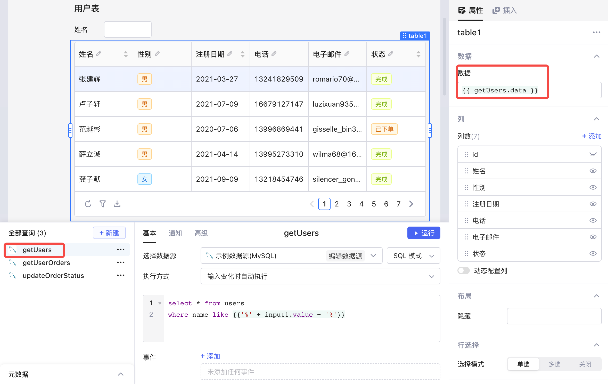​

### 子表格

前面提到，表格支持的数据格式为​**对象数组**​。如果数据中包含一种特殊字段——key 为 `"children"`​、value 为对象数组，即 `{ "children" : [{ k3:v3, k4:v4, ... }, ...] }`​，表格就会将 **children** 数组解析并展示为​**子表格**​，如下图：

​

## 批量调整列

在属性编辑区中，**列设置**区域展示了当前表格所有的列，长按列名左侧 `⋮⋮`​ 按钮可以拖拽调整列的顺序。

在列设置最上方，可以批量调整列设置：

* 点击左侧 `∨`​ 按钮，在下拉菜单中可以选择展示​**所有列**​/仅展示​**可见列**​；
* 点击右侧 `∨`​ 按钮，在下拉菜单中可以切换列设置，包括​**隐藏**​（可见性）、​****​、​**自动列宽**​、​**支持排序**​、​**对齐方式**​；
* 点击最右侧复选框，可以​**批量应用**​/**取消**列设置。

下图演示了如何批量调整列设置。关于列设置的详细说明，请参阅下文[调整当前列](../component-guides/using-table.md#%E8%B0%83%E6%95%B4%E5%BD%93%E5%89%8D%E5%88%97)。

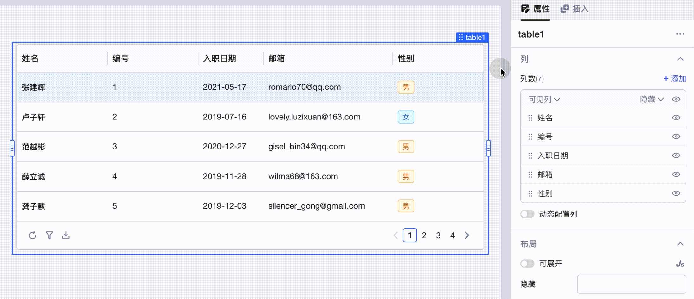​

## 调整当前列

单击列名，可以在弹窗中修改当前列标题、[列类型](../component-guides/using-table.md#%E5%88%97%E7%B1%BB%E5%9E%8B)和[单元格值](../component-guides/using-table.md#%E5%8D%95%E5%85%83%E6%A0%BC%E5%80%BC)；也可以设置当前列是否[可编辑](../component-guides/using-table.md#%E5%8F%AF%E7%BC%96%E8%BE%91)、是否支持排序及是否隐藏；还可以调整当前列的对齐方式、[固定位置](../component-guides/using-table.md#%E5%9B%BA%E5%AE%9A%E5%88%97)和列宽。

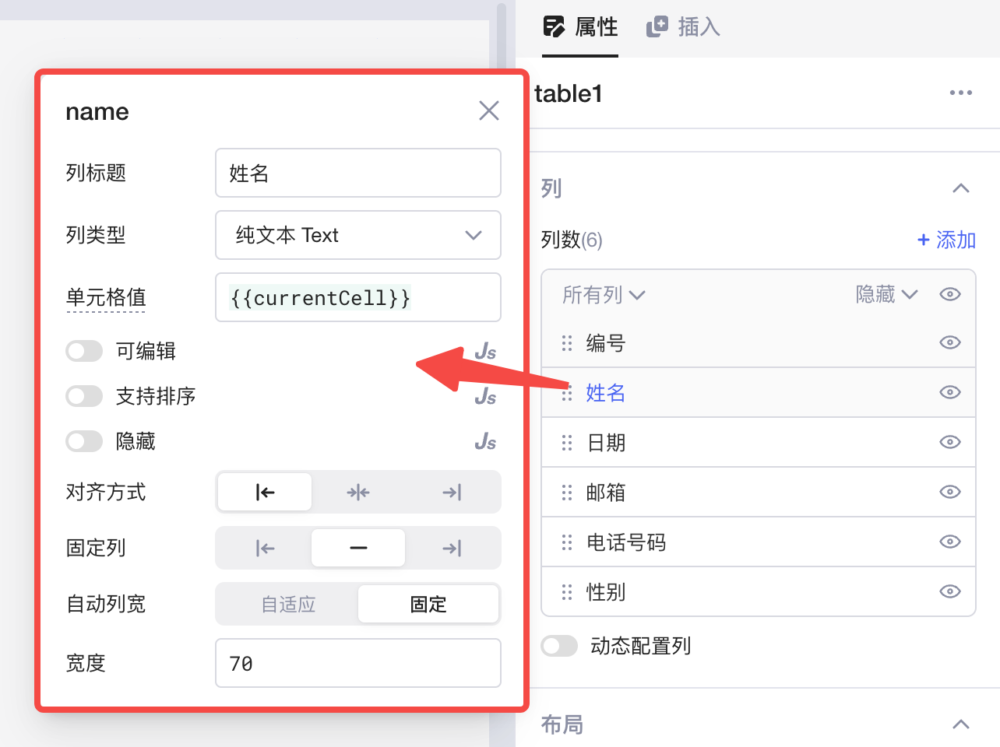​

### 访问当前行

表格组件会将输入的**对象数组**迭代解析为多个对象，分别对应表格每一行的数据。

在配置表格列时，您可以在**表格内部**通过以下**局部变量**访问当前迭代的行数据：

* ​`{{currentCell}}`​：当前单元格数据。例如：`{{currentCell * 5}}`​ 展示原单元格数据值的 5 倍。
* ​`{{currentRow}}`​：当前行数据。可通过 `.`​ 进一步访问某一字段，例如：`{{currentRow.id}}`​ 展示当前行的 id 字段。
* ​`{{currentIndex}}`​：当前行下标（从 0 开始）。

### 列类型

列类型是指该列**单元格值**的类型，默认为**纯文本**类型。

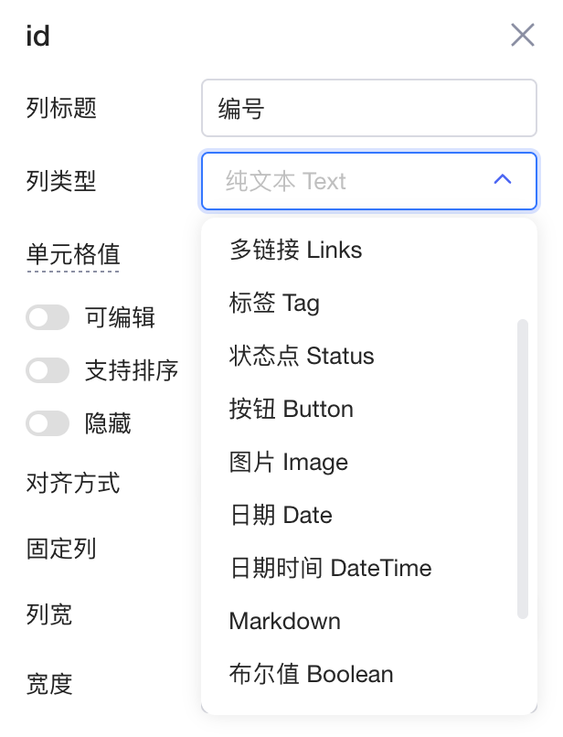​

为了更好地呈现表格数据、方便用户与表格数据交互，Lowcoder提供了多种**列类型**供您选择：

|列类型|用法|
| -------------------| ---------------------------------------------------------------------------------------------------------------------------------------------------------------------------------------------|
|链接 Link|单元格文本变为超链接形式。可以设置点击该链接后触发的事件​**动作**​，详情参考[事件动作设置](../event-handler.md#%E4%BA%8B%E4%BB%B6%E5%8A%A8%E4%BD%9C%E8%AE%BE%E7%BD%AE)。链接类型一般结合[新增自定义表格列](../component-guides/using-table.md#%E6%96%B0%E5%A2%9E%E8%87%AA%E5%AE%9A%E4%B9%89%E5%88%97)使用，常用于触发针对表格行的操作，例如​**下载**​：​|
|多链接 Links|在单元格内设置多个超链接。该类型一般结合[新增自定义列](../component-guides/using-table.md#%E6%96%B0%E5%A2%9E%E8%87%AA%E5%AE%9A%E4%B9%89%E5%88%97)使用，常用于为当前数据行提供多个操作选项，点击链接时触发的动作可参考[事件动作设置](../event-handler.md#%E4%BA%8B%E4%BB%B6%E5%8A%A8%E4%BD%9C%E8%AE%BE%E7%BD%AE)。​|
|标签 Tag|单元格值将自动分配颜色，变为带样式的标签形式。如果表格值为数组 (Array) 格式，将自动拆分成多个标签：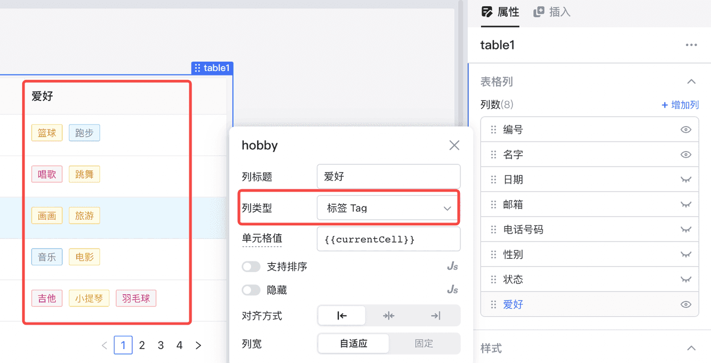​|
|状态点 Status|通过将该列状态值映射到**特定枚举**(success/error/warning/processing/default) 在文案前增加颜色圆点，使数据更加好看易懂。下图展示了基于`currentCell`​展示不同颜色的状态点：​|
|按钮 Button|单元格文本变为**按钮**形式，可以设置单击该按钮后触发的事件​**动作**​，详情参考[事件动作设置](../event-handler.md#%E4%BA%8B%E4%BB%B6%E5%8A%A8%E4%BD%9C%E8%AE%BE%E7%BD%AE)。​|
|图片 Image|在`{{ }}`​中直接填写图片地址，或者用`currentCell`​引用单元格内填写的图片地址后，该表格列以图片形式展示数据。关于图片地址的填写可参阅[使用图片组件](../component-guides/using-image.md)。​|
|日期 Date|双击[可编辑](../component-guides/using-table.md#%E5%8F%AF%E7%BC%96%E8%BE%91)的**日期**类型表格列，将弹出日期选择框，可以方便、快速填写日期值。​|
|日期时间 DataTime|双击[可编辑](../component-guides/using-table.md#%E5%8F%AF%E7%BC%96%E8%BE%91)的**日期时间**类型表格列，将弹出日期 + 时间选择框，如下图。​|
|Markdown|单元格内的文本将以 Markdown 语法解析，展示为格式化文本。关于 Markdown 的使用可参阅[使用 Markdown](../component-guides/using-markdown.md)。​|
|布尔值 Boolean|值为`true`​时，单元格展示为`✔️`​；值为`false`​时，可选择不同的​**false 文本**​。<br />双击[可编辑](../component-guides/using-table.md#%E5%8F%AF%E7%BC%96%E8%BE%91)的**布尔值**类型表格列，可单击（取消）勾选复选框。​|
|评分 Rating|单元格值以评分组件形式展示。双击[可编辑](../component-guides/using-table.md#%E5%8F%AF%E7%BC%96%E8%BE%91)的**评分**类型表格列，可修改评分值。​|
|进度条 Progress|单元格值以进度条形式展示。双击[可编辑](../component-guides/using-table.md#%E5%8F%AF%E7%BC%96%E8%BE%91)的**进度条**类型表格列，可修改进度值。​|

### 单元格值

确定好列类型后，可根据相应说明修改​**单元格值**​，默认值为 `{{currentCell}}`​。

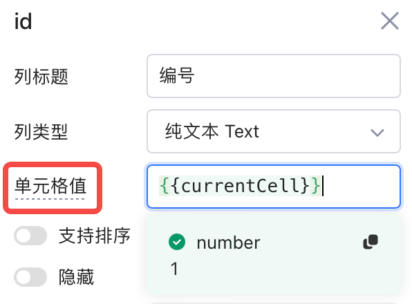​

关于在**表格内**访问当前数据的说明，见[访问当前行](../component-guides/using-table.md#%E8%AE%BF%E9%97%AE%E5%BD%93%E5%89%8D%E8%A1%8C)。

### 可编辑

打开**可编辑**开关后，双击当前列某一单元格即可直接编辑，如下图。

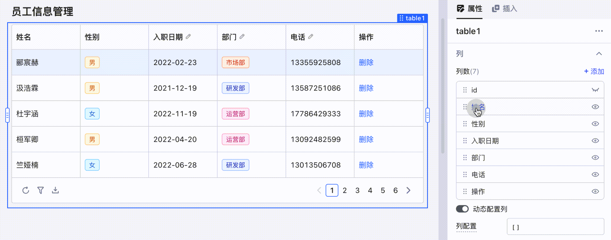​

编辑完成后，可以使用表格的 `toUpdateRows`​ 字段，快速向 MySQL、PostgreSQL 等数据源​**批量提交更新**​，如下图。为了点击**保存修改**按钮时能将所有修改值保存，需要手动添加一项**保存修改**事件，并绑定执行成功后的回调事件 `getUsers`​。

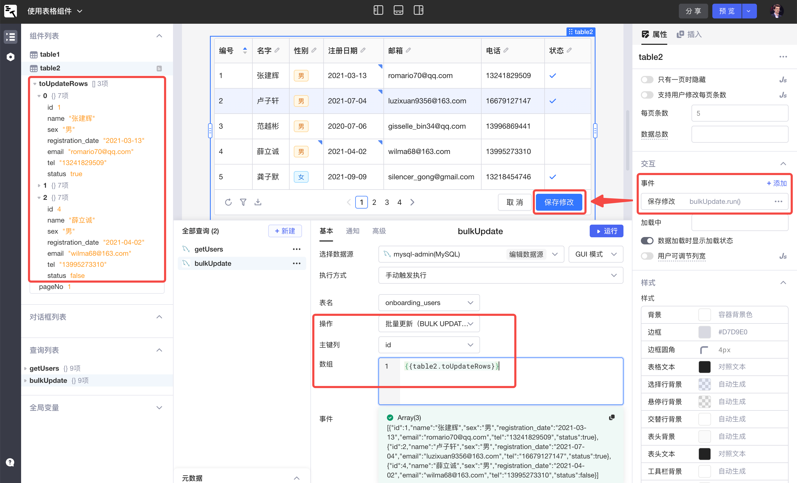​

此外，当前表格所有**待保存的修改值**可通过表格的 `changeSet`​ 字段访问。`changeSet`​ 是一个 JS 对象，key 为行索引，value 为当前行所有修改值。与 `toUpdateRows`​ 的区别在于，`changeSet`​ 只包括发生改变了的字段，而不是全部字段。

​`changeSet`​ 同样可以用于批量​**保存修改**​，如下图。

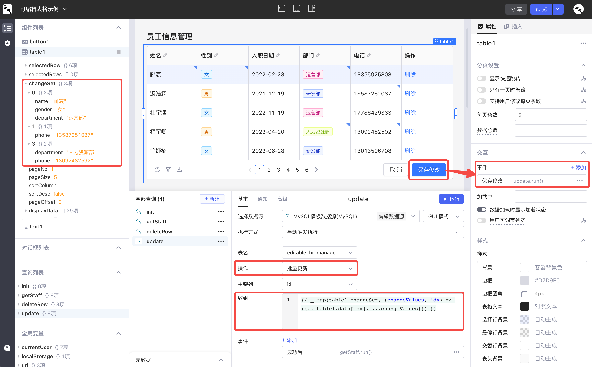​

上图中，`table1`​ 的**保存修改**事件绑定了查询 `update`​，用于**批量更新**数据到 MySQL 数据源，具体代码如下。该查询也绑定了执行成功后的回调事件 `getStaff`​，用于实时更新表格中信息。

```javascript
{{Object.keys(table1.changeSet).map((i) => ({
  id: table1.data[i].id,   // 按实际情况修改主键名
  ...table1.changeSet[i],
}))
}}
```

> #### 💡说明
>
> * 关于 _.map() 的使用方法，可参考 [https://www.lodashjs.com/docs/lodash.map](https://www.lodashjs.com/docs/lodash.map)
> * 关于 ...（即 JS 展开语法）的使用方法，可参考 [https://developer.mozilla.org/zh-CN/docs/Web/JavaScript/Reference/Operators/Spread_syntax](https://developer.mozilla.org/zh-CN/docs/Web/JavaScript/Reference/Operators/Spread_syntax)

### 固定列

设置当前列固定在表格的位置，可选择最左或最右。一般用于在表格列的数量较多时固定展示重要信息。

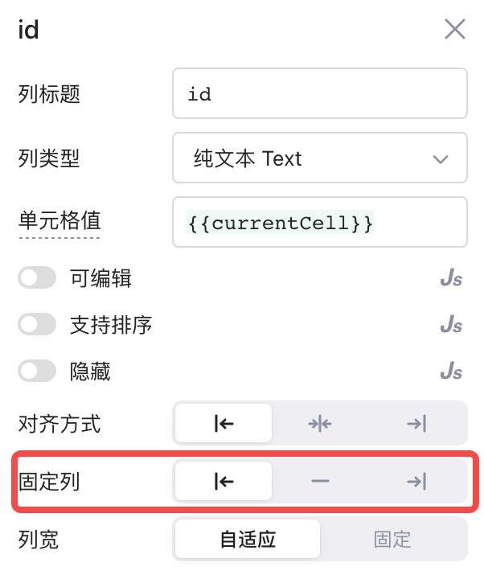​

当横向滚动表格时，固定列的展示效果如下。

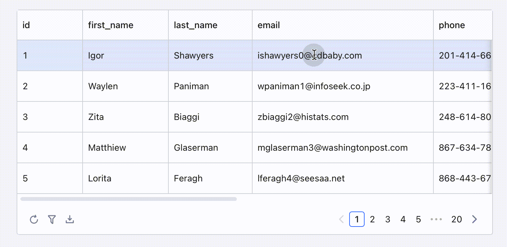​

## 新增自定义列

点击**增加列**将新增一个自定义表格列，可以用来展示由其他列的数据计算得到的结果，也可以放置若干个能够触发[事件](../event-handler.md)的[链接](../component-guides/using-table.md#%E9%93%BE%E6%8E%A5)或[按钮](../component-guides/using-table.md#%E6%8C%89%E9%92%AE)。

例如：下图表格中有一个月收入 `monthlyIncome`​ 列，可以新增一个年收入 `yearlyIncome`​ 列，再将**单元格值**设为 `{{currentRow.monthlyIncome*12}}`​ ，从而计算得到年收入数据：

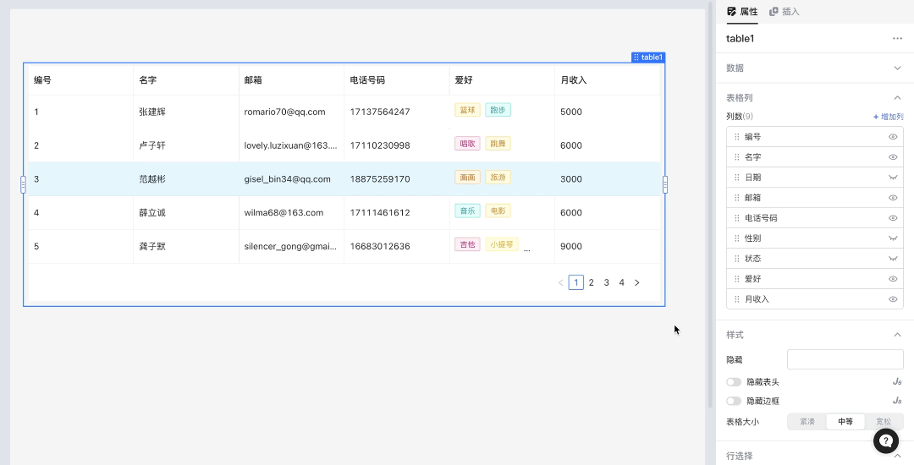​

## 动态配置列

以上所述的所有表格的列配置都是静态的。除此之外，表格的列配置也可以是动态的，可通过**动态配置列**开关控制。

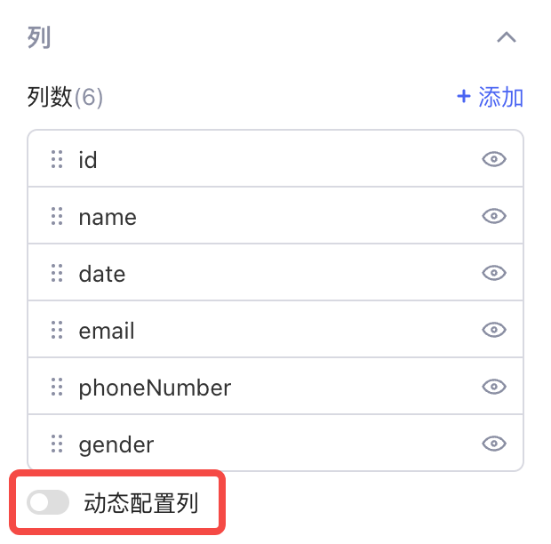​

关闭**动态配置列**开关时，表格的列配置是静态的。当表格的数据发生变化时，表格展示的列并不会变化，如下图。

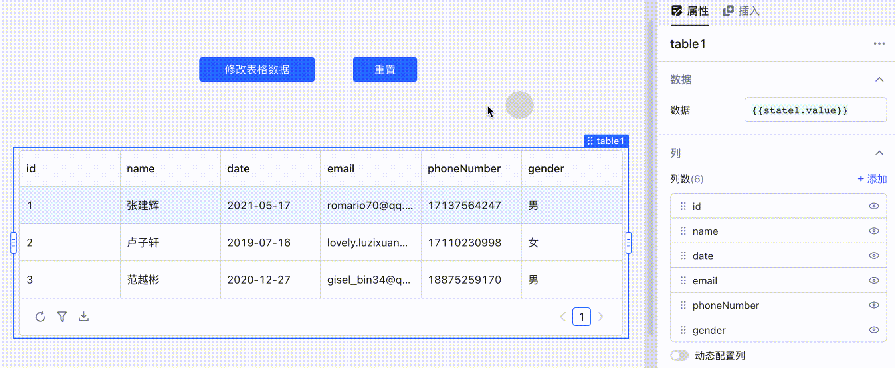​

打开**动态配置列**开关时，表格展示的列会根据**列配置**实时发生变化。

* **列配置**为空时，默认展示所有数据列，此时当表格的数据发生变化时，数据为空的列将不再展示，如下图。

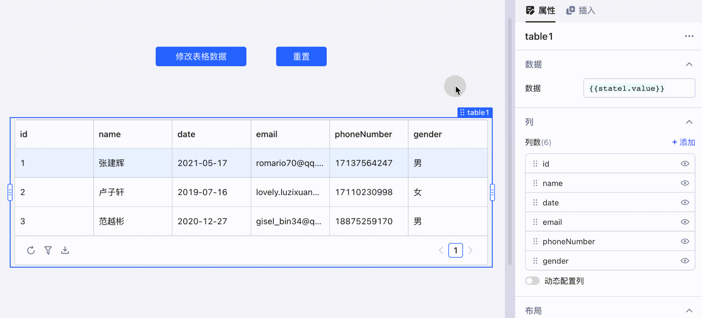​

* **列配置**可填入一个数组，用于动态配置展示的列及属性，如下图。

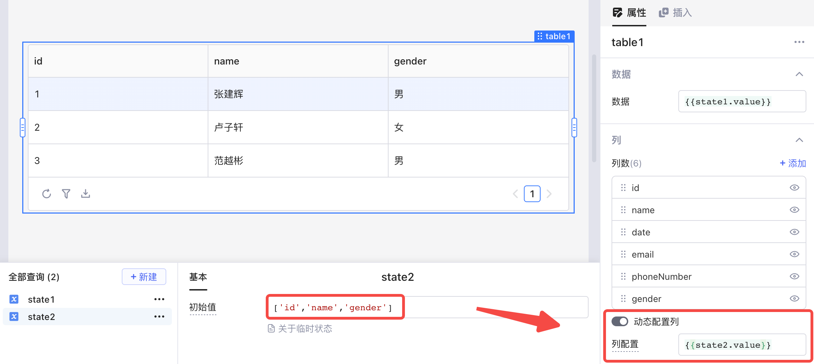​

## 布局

### 可展开 & 扩展视图

Lowcoder支持为表格行配置​**扩展视图**​，点击最左侧的按钮可以展开/关闭当前行的扩展信息，如下图：

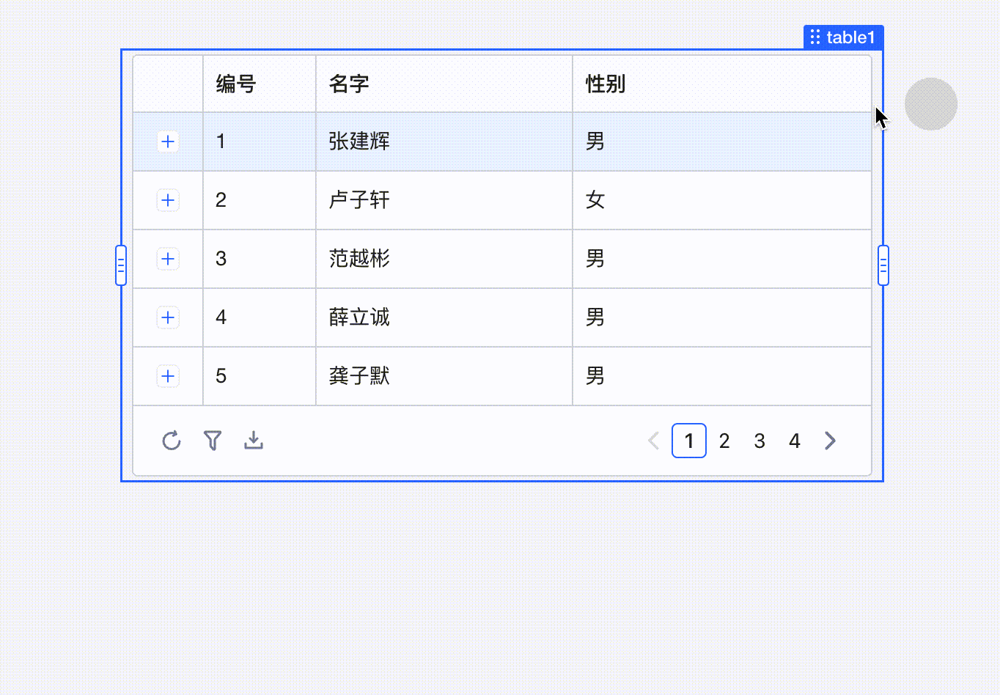​

首先，在表格**属性** -> **布局**打开**可展开**开关；

然后，点击**配置扩展视图**按钮，将弹出与表格等宽的[对话框](../component-guides/using-modal.md)；

拖拽组件到对话框中，自由配置**当前选中行**的扩展视图，其他行也将相应地自动配置，无需额外操作。

​

表格行扩展视图的展示逻辑与列表 (List View) 类似，详情可参阅[使用列表组件 (List View)](../component-guides/using-listView.md)。

## 表格内置属性

在 `{{ }}`​ 中输入表格组件名加 `.`​ 符号，Lowcoder会自动提示该表格组件的所有内置属性及内置方法，如下图：

​

您可以在所有能写 [JavaScript](javascript-in-lowcoder/README.md) 的地方通过表格组件的名称来访问以下内置属性：

|属性名|类型|描述|
| --------| ---------| ----------------------------------------------------------------------------------------------|
|​`selectedRow`​|Object|提供[当前选中行](../component-guides/using-table.md#%E8%AE%BF%E9%97%AE%E5%BD%93%E5%89%8D%E9%80%89%E4%B8%AD%E8%A1%8C)的数据，如果用户点击某行按钮/链接，则表示触发点击事件这一行|
|​`selectedRows`​|Array|多选模式下有用，同`selectedRow`​|
|​`selectedIndex`​|Number|提供当前选择行的下标|
|​`selectedIndexes`​|Array|多选模式下有用，同`selectedIndex`​|
|​`changeSet`​|Object|表示表格中被修改单元格的对象，仅包含被修改的单元格。第 1 个`key`​是行，第 2 个是列。详情可参阅[可编辑](../component-guides/using-table.md#%E5%8F%AF%E7%BC%96%E8%BE%91)。|
|​`toUpdateRows`​|Array|表示表格中被修改行的所有数据。详情可参阅[可编辑](../component-guides/using-table.md#%E5%8F%AF%E7%BC%96%E8%BE%91)。|
|​`pageNo`​|Number|当前展示第几页，从1开始|
|​`pageSize`​|Number|每页展示多少行|
|​`sortColumn`​|String|当前选中的排序列列名|
|​`sortDesc`​|Boolean|当前排序列是否是降序|
|​`pageOffset`​|Number|当前分页起始位置, 用于分页获取数据。例:`select * from users limit {{table1.pageSize}} offset {{ table1.pageOffset}}`​|
|​`displayData`​|Array|当前表格展示的数据|
|​`filter`​|Object|表格过滤参数|
|​`data`​|Array|当前表格所使用的原始数据|

### 访问当前选中行

可以通过**行选择**属性修改行选择模式，默认为​**单选**​。

​

不同选择模式，表格暴露的内置属性不同：

|**模式**|**暴露属性**|**作用**|
| ----------| ------| ----------------------|
|单选模式|​`selectedRow`​|当前选中行数据|
|单选模式|​`selectedIndex`​|当前选中行下标|
|多选模式|​`selectedRows`​|当前选中的行数据数组|
|多选模式|​`selectedIndexes`​|当前选中的行下标数组|

如下图，通过 `{{table1.selectedRow.name}}`​ 获取表格选中行的姓名列：

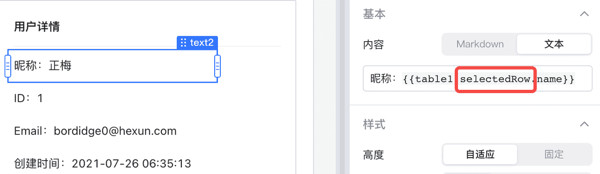​

> ### 💡 说明
>
> 通常在表格组件的**外部**调用表格暴露的内置属性。如果要在表格​**内部**​（例如，配置表格列的单元格值时）访问当前行的数据，请使用 `{{currentRow}}`​，详见[访问当前行](../component-guides/using-table.md#%E8%AE%BF%E9%97%AE%E5%BD%93%E5%89%8D%E8%A1%8C)。

## 工具条

工具条位于表格左下方，从左到右依次为刷新、过滤、下载和列设置，您可以在表格属性中分别设置这四个按钮是否显示。

​

### 过滤

点击过滤按钮，通过添加若干项**筛选规则**来筛选表格数据：

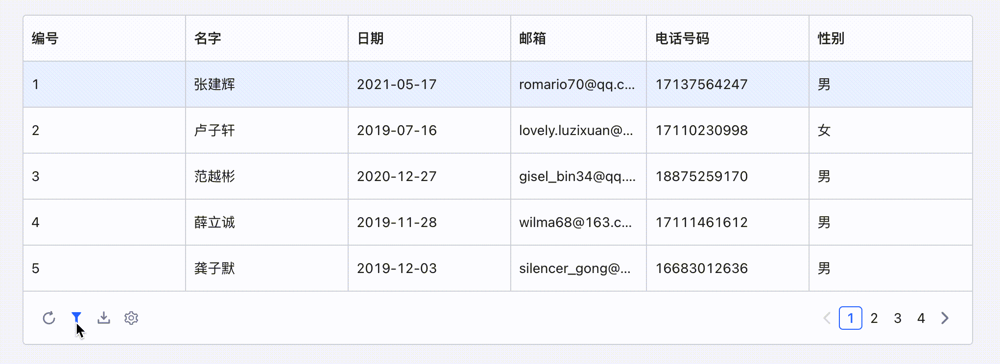​

### 列设置

点击列设置按钮，控制列的展示状态：

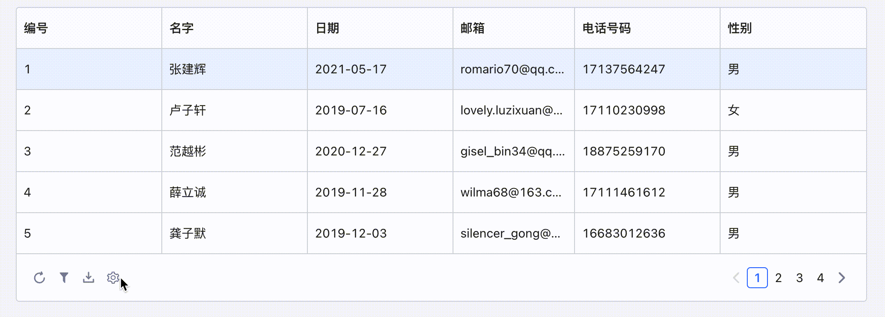​

### 刷新

点击刷新按钮可以刷新表格数据。

### 下载

点击下载按钮可以下载整个表格，默认为 csv 格式。

## 分页设置

您可以修改**分页设置**来设置表格：

* 是否显示快速跳转
* 是否在只有一页时隐藏页码
* 是否支持用户修改每页展示数据的条数
* 要展示的数据总条数

若数据总条数为空，默认获取表格数据长度；您也可以在 `{{ }}`​ 中填写 JS 表达式获取服务端数据总长。

​

### 服务端分页

**表格**组件暴露的 `pageOffset`​、`pageSize`​ 属性可以帮助您实现服务端分页。

```plain
pageSize：表格当前每页条数；
pageOffset：(表格当前页码 - 1) * pageSize。
```

以 MySQL 表 `users`​ 为例，下方展示服务端分页的配置步骤：

1. 创建一个查询 `totalUserCount`​ 用于查询数据源表中的数据总条数，将查询结果 `{{totalUserCount.data[0].count}}`​ 绑定至表格**数据总数**属性。

```sql
select count(1) as count from users
```

> #### 💡 说明
>
> 当数据源表中数据条数很多时，`select count(1)`​ 操作性能较低（例如：MySQL InnoDB 引擎会全表扫描）。此时可以不创建该查询，而是在表格**数据总数**属性中填写一个很大的数，从而实现无限翻页的效果。

2. 创建一个查询 `queryWithPagination`​ 控制表格分页展示，使用**表格**组件的 `pageOffset`​、`pageSize`​ 属性。

```sql
select * from users limit {{table1.pageOffset}}, {{table1.pageSize}}
```

最终设置如下图所示，总页数为 19，切换页码将自动触发查询并刷新数据：

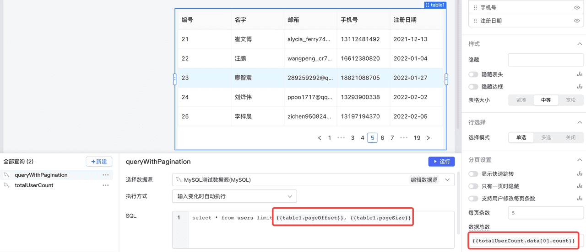​

## 事件

在属性 > 交互 > 事件中，可以为表格组件添加[事件](../event-handler.md)和设置加载效果等。表格组件有以下事件：

|事件名|描述|
| ------------| ----------------------------|
|保存修改|用户保存对表格数据的修改。|
|取消修改|用户取消对表格数据的修改。|
|选择行改变|用户改变当前选中的行。|
|点击行|用户点击了某一表格行。|
|筛选改变|用户改变了筛选规则。|
|排序改变|用户改变了列排序。|
|翻页|用户改变了当前表格页码。|
|刷新|用户点击了表格刷新按钮。|

此外，您也可以创建[数据变化响应器](../javascript-in-lowcoder/data-responder.md)，监听及响应任何**数据**的变化。