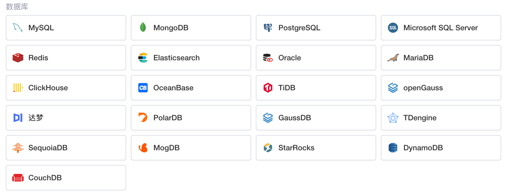

​

Lowcoder支持连接多种类型的数据库，可通过以下文档了解如何连接各种数据库：

|[连接 MySQL](../database/mysql.md)|[连接 MongoDB](../database/mongodb.md)|[连接 PostgreSQL](../database/postgresql.md)|[连接 Microsoft SQL server](../database/ms-SQL-server.md)|
| --| --| --| --|
|[连接 Redis](../database/redis.md)|[连接 Elasticsearch](../database/elasticsearch.md)|[连接 Oracle](../database/oracle.md)|[连接 MariaDB](../database/mariadb.md)|
|[连接 ClickHouse](../database/clickhouse.md)|[连接 OceanBase](../database/oceanbase.md)|[连接 TiDB](../database/TiDB.md)|[连接 openGauss](../database/openGauss.md)|
|[连接达梦 DM](../database/dameng.md)|[连接 PolarDB](../database/polardb.md)|[连接 GaussDB](../database/gaussdb.md)|[连接 TDengine](../database/tdengine.md)|
|[连接 SequoiaDB](../database/sequoiadb.md)|[连接 MogDB](../database/mogdb.md)|[连接 StarRocks](../database/starrocks.md)|[连接 DynamoDB](../database/dynamodb.md)|
|[连接 CouchDB](../database/couchdb.md)||||