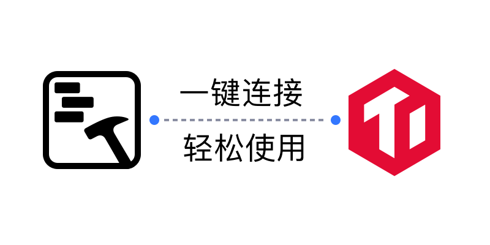
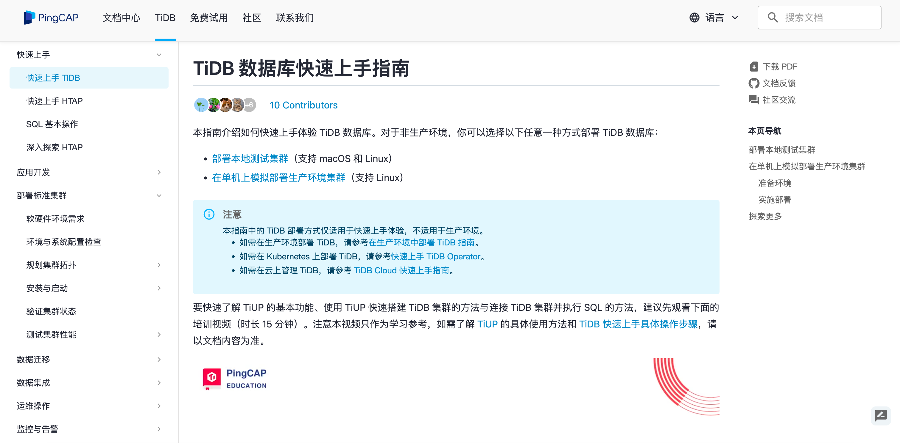
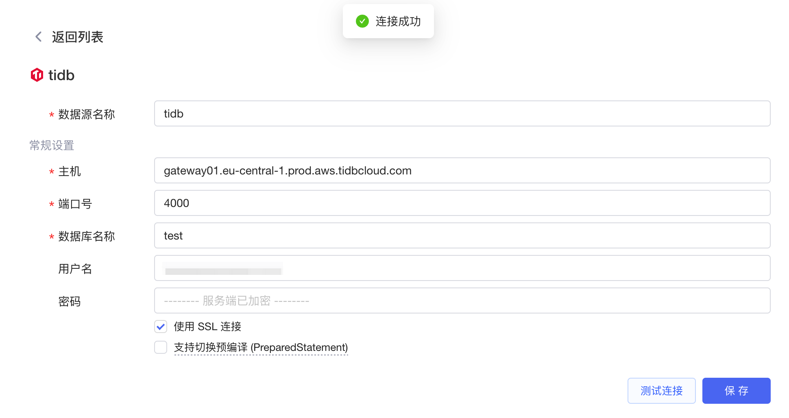
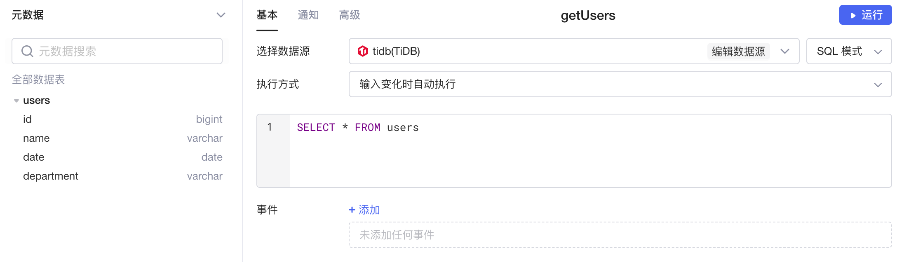
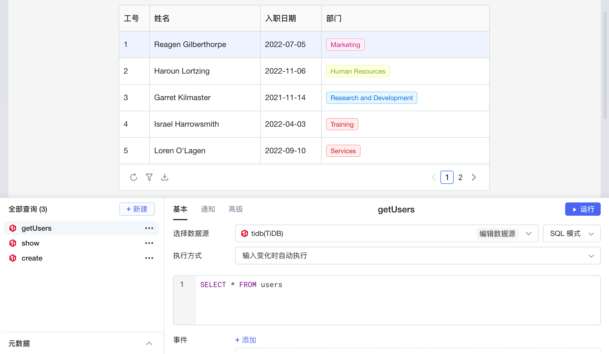

​

[TiDB](https://cn.pingcap.com/product/) 是 PingCAP 公司自主设计、研发的开源分布式关系型数据库，它支持 SQL 语言，提供了类似于 MySQL 的接口，但具有更高的可扩展性和高可用性。TiDB 支持横向扩展，能够通过增加节点来扩展性能和存储容量。同时，它还提供了强一致性保证，保证了数据的一致性和可靠性，适合高可用、数据规模较大等各种应用场景。

目前Lowcoder已经实现了与 TiDB 数据库的连接，支持对 TiDB 数据进行增、删、改、查， 同时还支持将数据绑定至各种组件，并通过简单的代码实现数据的可视化和计算等操作，能让您快速、高效地搭建应用和内部系统。

## 准备

正式开始前，您需要获取 TiDB 数据库的连接配置，并参考[IP 白名单](../ip-allowlist.md)文档将Lowcoder的 IP 地址添加到数据库网络的**白名单**中（按需配置）。

* 如果您从未使用过 TiDB，可参阅 TiDB 数据库的[快速上手指南](https://docs.pingcap.com/zh/tidb/stable/quick-start-with-tidb)部署数据库来上手体验；
* 如需在生产环境部署 TiDB，可参阅[在生产环境中部署 TiDB 指南](https://docs.pingcap.com/zh/tidb/stable/production-deployment-using-tiup)；
* 如需在云上管理 TiDB，请参考 [TiDB Cloud 快速上手指南](https://docs.pingcap.com/tidbcloud/tidb-cloud-quickstart)。

​

## 新建数据源

在[Lowcoder主页](https://lowcoder.mousheng.top/apps)左下角，点击**数据源**进入当前企业的数据源管理界面，然后点击右上角 + **新建数据源** > ​**TiDB**​，填写您的 TiDB 数据库的配置信息。点击​**测试连接**​，提示**连接成功**后再点击**保存**按钮，该 TiDB 数据源即新建完成，并且保存至企业的数据源列表中。

​

## 创建查询

在应用编辑页面，点击**新建**创建查询，选择您的 TiDB 数据源，然后编写 SQL 查询语句。Lowcoder中支持 **SQL 模式**和 **GUI模式**​，让您能够更加灵活便捷地操作数据。在查询编辑器的左下角，还支持展开查看数据库的​**元数据**​，包括各个数据表的字段信息等。关于使用 SQL 的详细教程，可参阅文档 [SQL 基本操作](https://docs.pingcap.com/zh/tidb/stable/basic-sql-operations)和 [TiDB SQL 语法详解](https://pingcap.github.io/sqlgram/)。

​

编写完成后，点击**运行**可查看查询的执行结果。如果将运行结果与Lowcoder中[组件](../component-guides/README.md)的数据字段绑定，就能使数据可视化。

​
