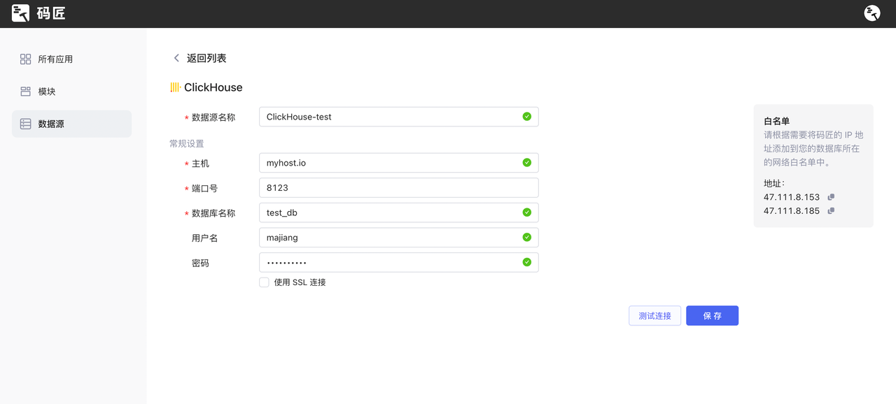

## 准备

首先您要获取到 ClickHouse 数据库的连接配置，然后参考[IP 白名单](../ip-allowlist.md)文档将Lowcoder的 IP 地址添加到数据库网络的白名单中（按需配置）。

## 新建数据源

**新建数据源** -> ​**ClickHouse**​，填写数据源配置信息 -> ​**测试连接**​，连接成功后，选择​**保存**​，该 ClickHouse 数据源即新建完成，并且保存到了您的数据源列表中。

​

## 创建查询

点击**新建**创建查询，选择您的 ClickHouse 数据源，然后编写查询，完成后即可点击​**运行**​。

​

^
^
