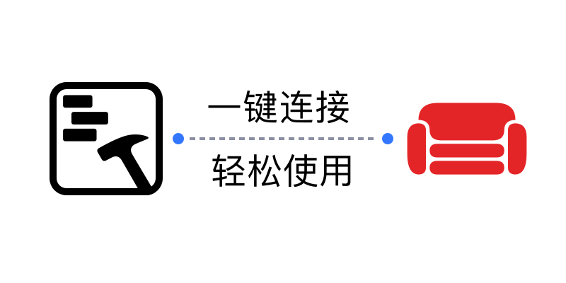
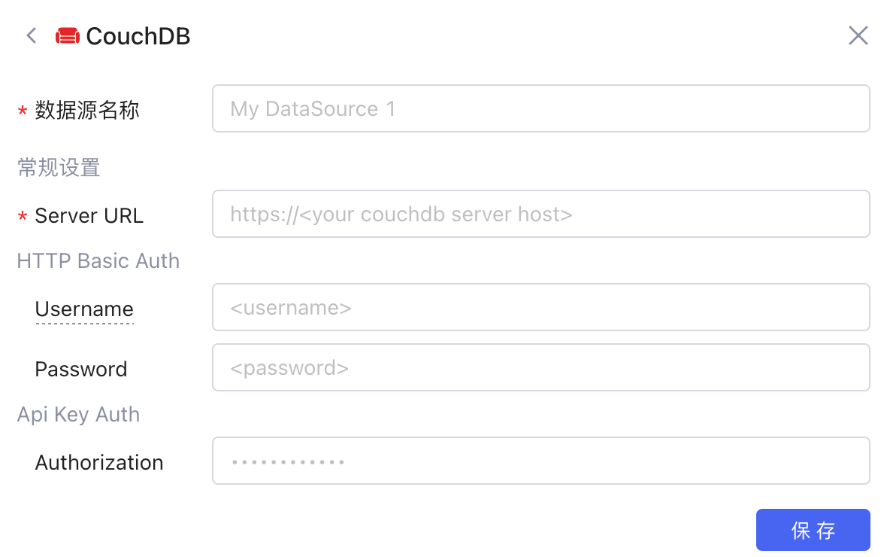
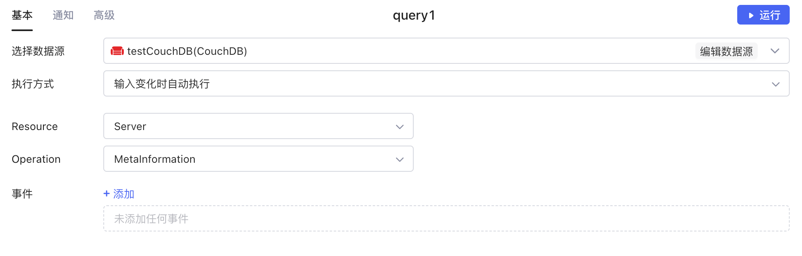
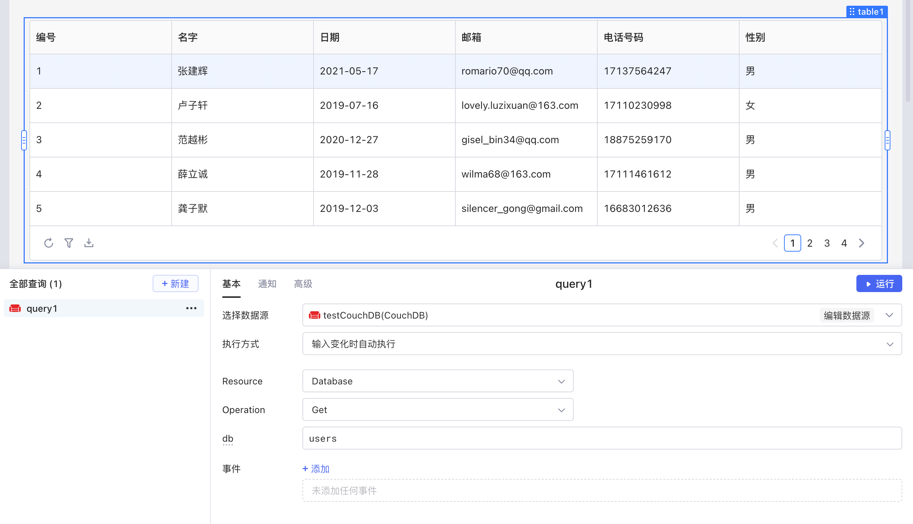

​

[CouchDB](https://couchdb.apache.org/) 是一种开源的 NoSQL 数据库服务，它使用基于文档的数据模型来存储数据。CouchDB 的数据源提供了高度可扩展性、高可用性和分布式性质。它支持跨多个节点的数据同步和复制，可以在多个节点之间共享数据。CouchDB 的数据模型支持复杂的文档结构，可以存储和查询包含多个层次结构、嵌套对象和数组的 JSON 数据。CouchDB 的查询功能非常强大，支持多种类型的查询，包括 MapReduce 查询、全文搜索和地理空间查询。

目前Lowcoder已经实现了与 CouchDB 数据源的连接，支持对 CouchDB 数据进行增、删、改、查， 同时还支持将数据绑定至各种组件，并通过简单的代码实现数据的可视化和计算等操作，能让您快速、高效地搭建应用和内部系统。

## 准备

正式开始前，您需要获取 CouchDB 数据库的连接配置，并参考[IP 白名单](../ip-allowlist.md)文档将Lowcoder的 IP 地址添加到数据库网络的**白名单**中（按需配置）。

## 新建数据源

在[Lowcoder主页](https://lowcoder.mousheng.top/apps)左下角，点击**数据源**进入当前企业的数据源管理界面，然后点击右上角 **+ 新建数据源** > ​**CouchDB**​，并根据提示填写相应配置。

​

## 创建查询

在应用编辑页面，点击**新建**创建查询，选择您的 CouchDB 数据源，然后填写查询内容。Lowcoder支持对 CouchDB 中各种资源执行多种 Operation，让您能够更加灵活便捷地操作数据。关于在Lowcoder中编辑 CouchDB 查询的详细教程，可参阅文档 [Apache CouchDB Documentation](https://docs.couchdb.org/en/stable/)。

​

编写完成后，点击**运行**可查看查询的执行结果。如果将运行结果与Lowcoder中[组件](../component-guides/README.md)的数据字段绑定，就能使数据可视化。

​