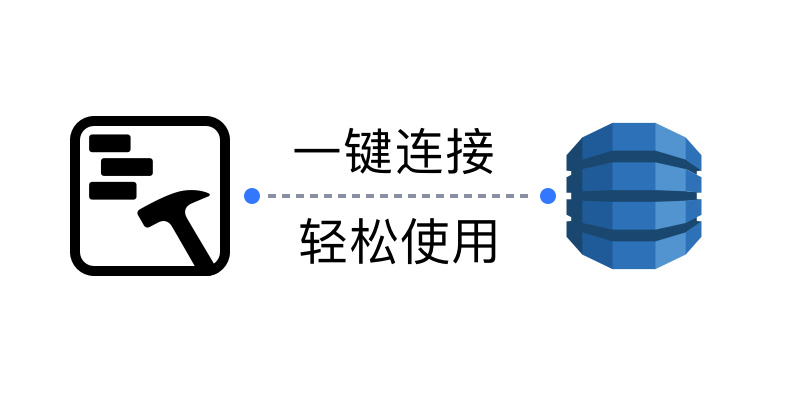
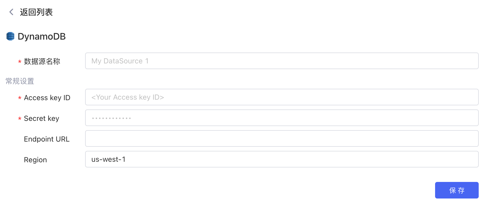
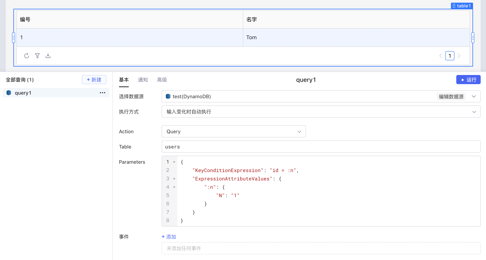

​

[DynamoDB](https://aws.amazon.com/cn/dynamodb/) 是亚马逊 AWS 的一种高性能、全托管的 NoSQL 数据库服务。Amazon DynamoDB 能够提供高度可扩展性、低延迟和可靠性，它支持多种数据类型和数据模型，包括键-值、文档和图形数据。DynamoDB 的数据模型非常灵活，可以根据需要对数据进行读取和写入。DynamoDB 可以轻松地与其他 AWS 服务集成，例如 Lambda、API Gateway、Elasticsearch 等，可以构建高效、高可用的应用程序和服务。

目前Lowcoder已经实现了与 DynamoDB 数据源的连接，支持对 DynamoDB 数据进行增、删、改、查， 同时还支持将数据绑定至各种组件，并通过简单的代码实现数据的可视化和计算等操作，能让您快速、高效地搭建应用和内部系统。

## 准备

正式开始前，您需要获取 DynamoDB 数据库的连接配置，并参考[IP 白名单](../ip-allowlist.md)文档将Lowcoder的 IP 地址添加到数据库网络的**白名单**中（按需配置）。

## 新建数据源

在[Lowcoder主页](https://lowcoder.mousheng.top/apps)左下角，点击**数据源**进入当前企业的数据源管理界面，然后点击右上角 **+ 新建数据源** > ​**DynamoDB**​，并根据提示填写相应配置。

​

## 创建查询

在应用编辑页面，点击**新建**创建查询，选择您的 DynamoDB 数据源，然后填写查询内容。Lowcoder中支持 DynamoDB 多种 Action，让您能够更加灵活便捷地操作数据。关于在Lowcoder中编辑 DynamoDB 查询的详细教程，可参阅文档 [Amazon DynamoDB Developer Guide](https://docs.aws.amazon.com/amazondynamodb/latest/developerguide/Introduction.html)。

​

编写完成后，点击**运行**可查看查询的执行结果。如果将运行结果与Lowcoder中[组件](../component-guides/README.md)的数据字段绑定，就能使数据可视化。

​