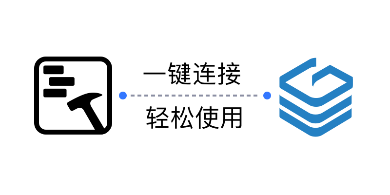
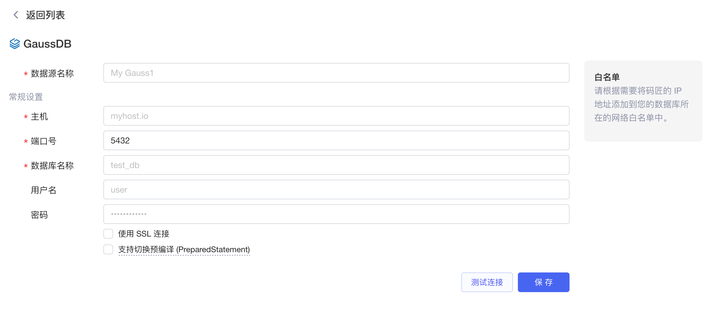
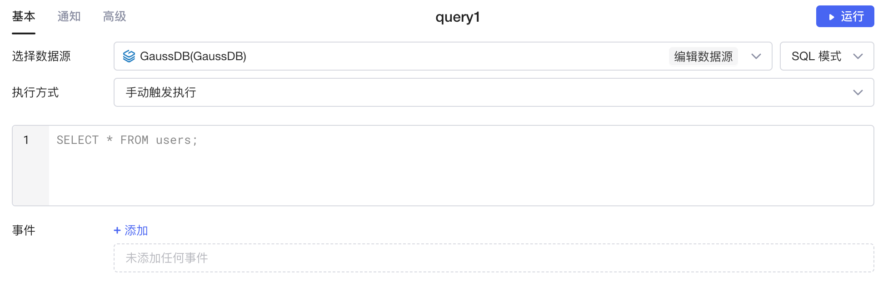
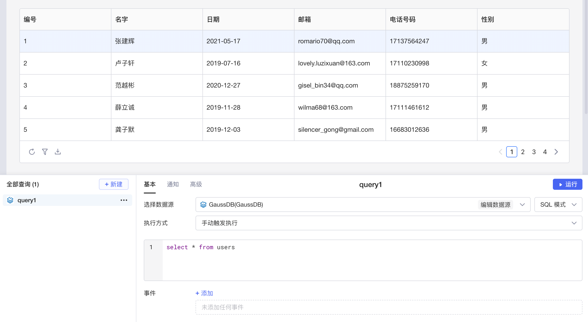

​

GaussDB 是华为推出的一个高性能、高可靠、高安全的分布式数据库管理系统。它采用多活架构，支持全球数据同步，可实现数据的实时同步和容灾备份，可满足不同业务场景下的数据管理需求。GaussDB 在分布式存储、事务处理、安全加密、性能优化等方面具有强大的能力，能够支持海量数据的高效管理和处理。同时，它提供了开放的 API 和丰富的生态工具链，使得应用开发和运维变得更加简便。

目前Lowcoder已经实现了与 GaussDB 数据源的连接，支持对 GaussDB 数据进行增、删、改、查， 同时还支持将数据绑定至各种组件，并通过简单的代码实现数据的可视化和计算等操作，能让您快速、高效地搭建应用和内部系统。

## 准备

正式开始前，您需要获取 GaussDB 数据库的连接配置，并参考[IP 白名单](../ip-allowlist.md)文档将Lowcoder的 IP 地址添加到数据库网络的**白名单**中（按需配置）。

## 新建数据源

在[Lowcoder主页](https://lowcoder.mousheng.top/apps)左下角，点击**数据源**进入当前企业的数据源管理界面，然后点击右上角 **+ 新建数据源** > ​**GaussDB**​，填写您的 GaussDB 数据库的配置信息。点击​**测试连接**​，提示**连接成功**后再点击**保存**按钮，该 GaussDB 数据源即新建完成，并且保存至企业的数据源列表中。

​

## 创建查询

在应用编辑页面，点击**新建**创建查询，选择您的 GaussDB 数据源，然后编写 SQL 查询语句。Lowcoder中支持 **SQL 模式**和 **GUI模式**​，让您能够更加灵活便捷地操作数据。关于在Lowcoder中使用 SQL 的详细教程，可参阅文档[使用 SQL](../using-sql.md)。

​

编写完成后，点击**运行**可查看查询的执行结果。如果将运行结果与Lowcoder中[组件](../component-guides/README.md)的数据字段绑定，就能使数据可视化。

​