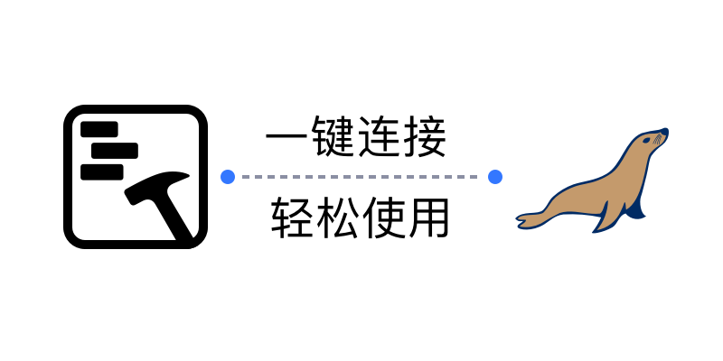
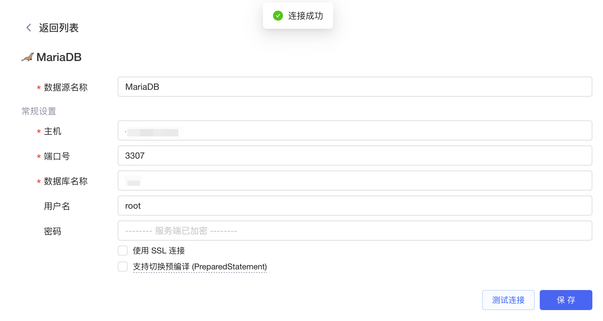
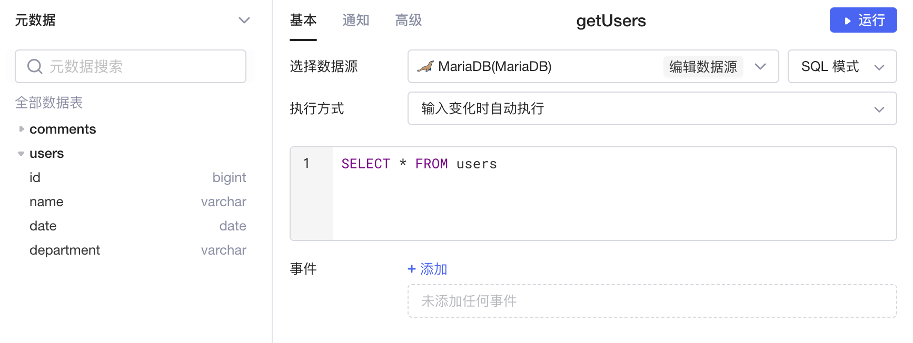
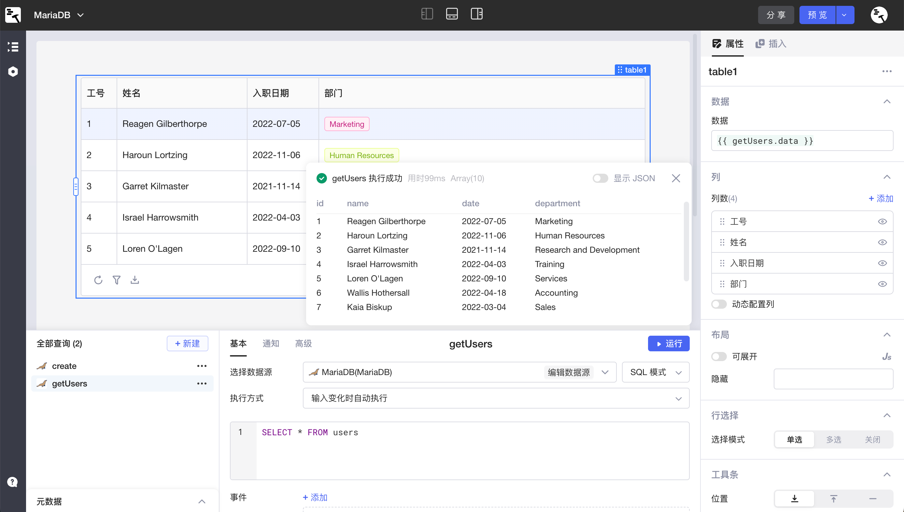

​

[MariaDB](https://mariadb.org/) 是一个免费的、开源的关系型数据库管理系统，相对于 MySQL 而言，具有更好的性能和更好的兼容性，同时也支持更多的存储引擎。MariaDB 也支持事务处理、副本和分布式处理等高级功能。MariaDB 中的数据存储方式与 MySQL 完全兼容，无需更改现有的代码即可进行迁移。目前 MariaDB 广泛应用于 Web 应用程序、企业级解决方案、云计算平台、分布式系统等领域中。

Lowcoder已经实现了与 MariaDB 数据源的连接，支持对 MariaDB 数据进行增、删、改、查， 同时还支持将数据绑定至各种组件，并通过简单的代码实现数据的可视化和计算等操作，能让您快速、高效地搭建应用和内部系统。

## 准备

正式开始前，您需要获取 MariaDB 的连接配置，并参考[IP 白名单](../ip-allowlist.md)文档将Lowcoder的 IP 地址添加到数据库网络的**白名单**中（按需配置）。

## 新建数据源

在[Lowcoder主页](https://lowcoder.mousheng.top/apps)左下角，点击**数据源**进入当前企业的数据源管理界面，然后点击右上角 + **新建数据源** > ​**MariaDB**​，填写您的数据库配置信息。点击​**测试连接**​，提示**连接成功**后再点击**保存**按钮，该 MariaDB 数据源即新建完成，并且保存至企业的数据源列表中。

​

## 创建查询

在应用编辑页面，点击**新建**创建查询，选择您的 MariaDB 数据源，然后编写 SQL 查询语句。Lowcoder中支持 **SQL 模式**和 **GUI模式**​，让您能够更加灵活便捷地操作数据。在查询编辑器的左下角，还支持展开查看数据库的​**元数据**​，包括各个数据表的字段信息等。关于在Lowcoder中使用 SQL 的详细教程，可参阅文档[使用 SQL](../using-sql.md)。

​

编写完成后，点击**运行**可查看查询的执行结果。如果将运行结果与Lowcoder中[组件](../component-guides/README.md)的数据字段绑定，就能使数据可视化。

​
