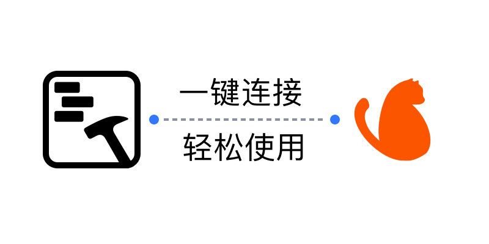
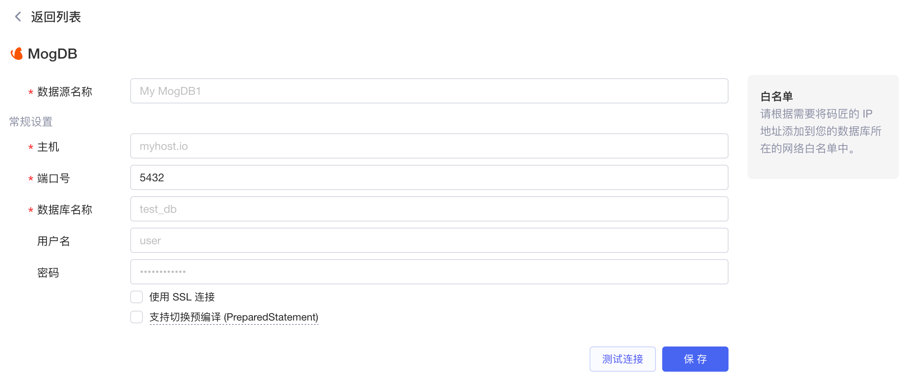
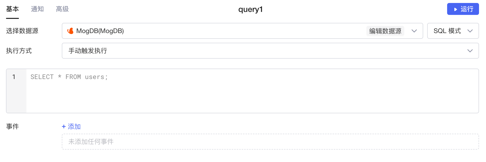
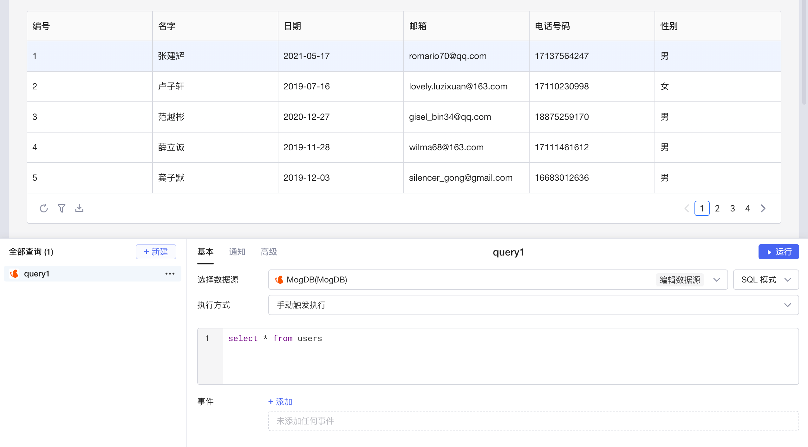

​

[MogDB](https://enmotech.com/products/MogDB) 是云和恩墨基于 openGauss 内核进行增强提升，推出的一款安稳易用的企业级关系型数据库，是一种分布式、高可用的大规模数据存储和处理解决方案，支持多种数据格式和访问方式，适用于云计算、大数据和物联网等场景，具有高性能、高可靠和易于管理的特点。

目前Lowcoder已经实现了与 MogDB 数据源的连接，支持对 MogDB 数据进行增、删、改、查， 同时还支持将数据绑定至各种组件，并通过简单的代码实现数据的可视化和计算等操作，能让您快速、高效地搭建应用和内部系统。

## 准备

正式开始前，您需要获取 MogDB 数据库的连接配置，并参考[IP 白名单](../ip-allowlist.md)文档将Lowcoder的 IP 地址添加到数据库网络的**白名单**中（按需配置）。

## 新建数据源

在[Lowcoder主页](https://lowcoder.mousheng.top/apps)左下角，点击**数据源**进入当前企业的数据源管理界面，然后点击右上角 **+ 新建数据源** > ​**MogDB**​，填写您的 MogDB 数据库的配置信息。点击​**测试连接**​，提示**连接成功**后再点击**保存**按钮，该 MogDB 数据源即新建完成，并且保存至企业的数据源列表中。

​

## 创建查询

在应用编辑页面，点击**新建**创建查询，选择您的 MogDB 数据源，然后编写 SQL 查询语句。Lowcoder中支持 **SQL 模式**和 **GUI模式**​，让您能够更加灵活便捷地操作数据。关于在Lowcoder中使用 SQL 的详细教程，可参阅文档[使用 SQL](../using-sql.md)。

​

编写完成后，点击**运行**可查看查询的执行结果。如果将运行结果与Lowcoder中[组件](../component-guides/README.md)的数据字段绑定，就能使数据可视化。

​