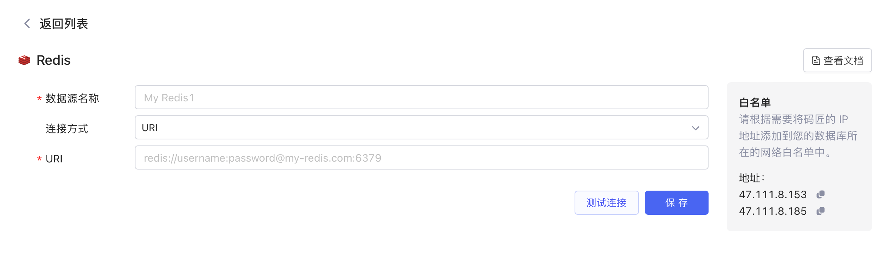
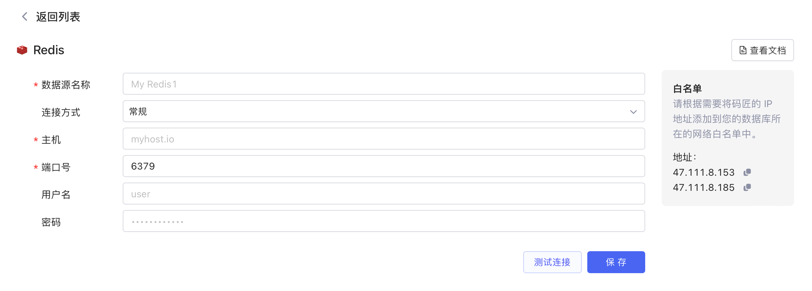
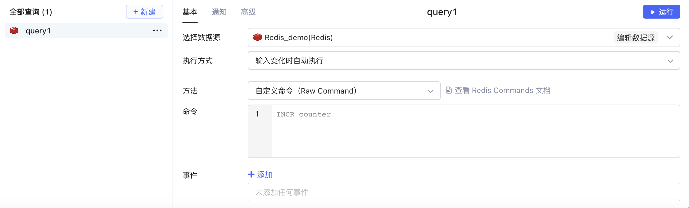

## 准备

首先您要获取到 Redis 数据库的连接配置，然后参考[IP 白名单](../ip-allowlist.md)文档将Lowcoder的 IP 地址添加到数据库网络的白名单中（按需配置）。

## 新建数据源

**新建数据源** -> ​**Redis**​，连接方式有两种：

* URI 连接

​

* 常规连接

​

填写完成数据源配置信息​\*\*->测试连接**​，连接成功后，选择​**保存\*\*​，该 Redis 数据源即新建完成，并且保存到了您的数据源列表中。

## 创建查询

创建查询 `query1`​，选择您的 Redis 数据源，然后设置其方法、命令等，即可点击​**运行**​。

​

^
