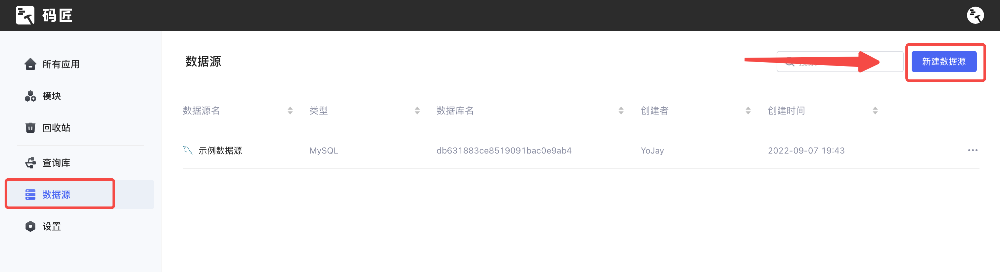
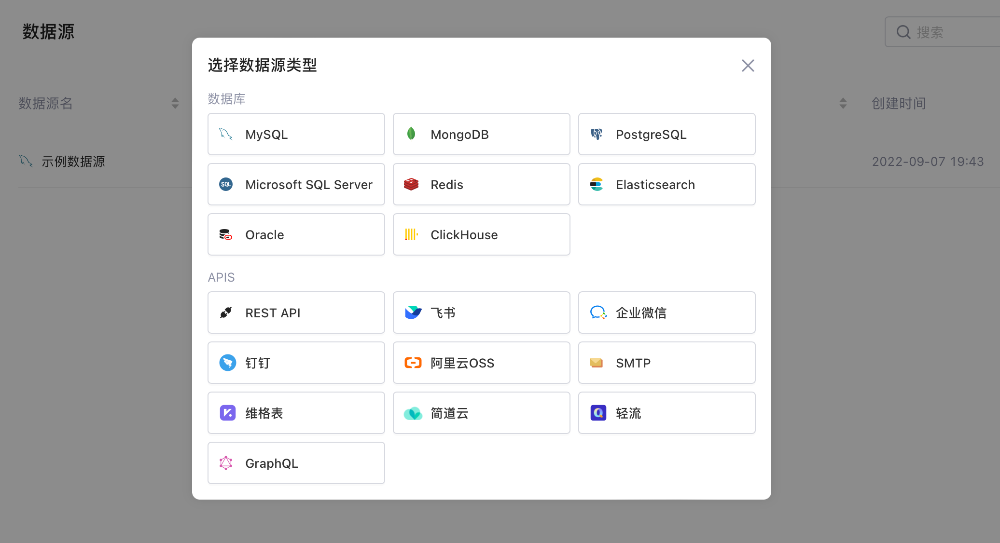
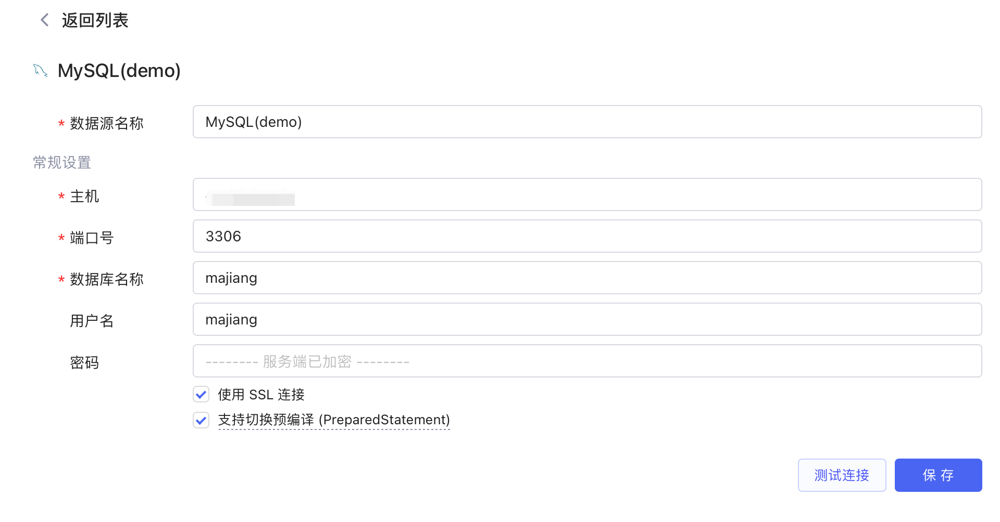
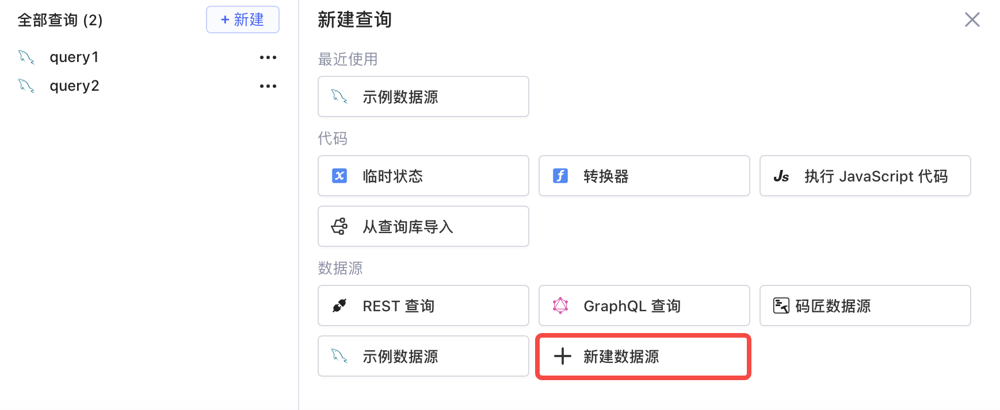
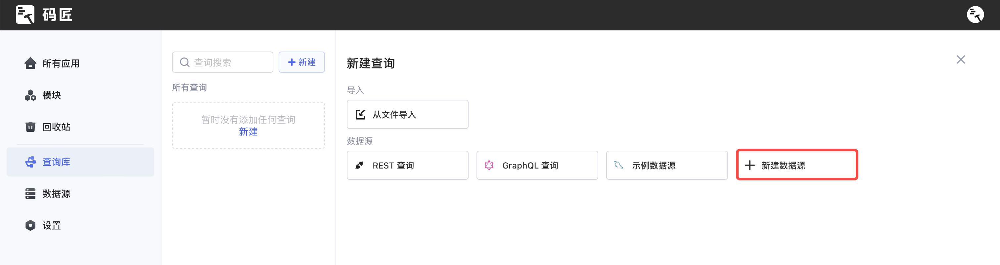
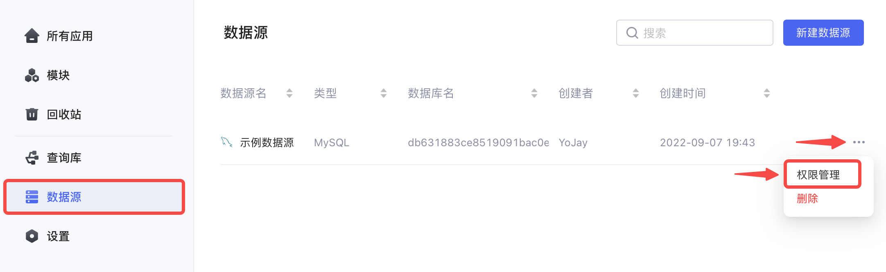

Lowcoder支持和整合了多种[数据库](database/README.md)和第三方 [API](api/README.md)，帮助您方便高效地管理数据源。本文档介绍如何在Lowcoder中新建数据源和分配数据源权限。

## 新建数据源

开始之前，请参考[IP 白名单](ip-allowlist.md)文档将Lowcoder的 IP 地址添加到您的数据源所在的网络白名单中（按需配置）。

新建数据源的一般步骤如下：

1. 进入Lowcoder主页面，点击左侧边栏的​**数据源**​（只对企业管理员和开发者群组的成员展示）。
2. 点击右上角的**新建数据源**按钮。

​

3. 选择您的数据源类型。

​

4. 填写数据源的配置信息，详细教程请参阅[连接数据库](database/README.md)和[连接 API](api/README.md) 部分的文档。
5. 点击测试连接，检查当前配置信息是否满足要求。
6. 点击保存。

​

您也可以在创建或编辑查询时新建数据源。

* 查询编辑器：

​

* 查询库：

​

## 权限管理

只有企业管理员和开发者群组的成员可以查看**数据源**页面和**新建**数据源。

已创建的每个数据源，只有企业管理员和数据源创建者可以进行权限管理。进入Lowcoder主页面，点击左侧边栏​**数据源**​，然后点击 `···`​ -> ​**权限管理**​。

​

点击 ​**+ 添加成员**​，可以添加当前企业的成员或群组，然后为其分配**可使用**或**可管理**的身份。

​

这两种身份及其对应权限如下表：

|**身份**|**权限**|
| --------| ---------------------------------------------------------------------------------------------|
|可使用|在编辑应用/模块/聚合页/查询库中的查询时使用数据源|
|可管理|* 在编辑应用/模块/聚合页/查询库中的查询时使用数据源* 编辑数据源* 删除数据源* 管理数据源权限|