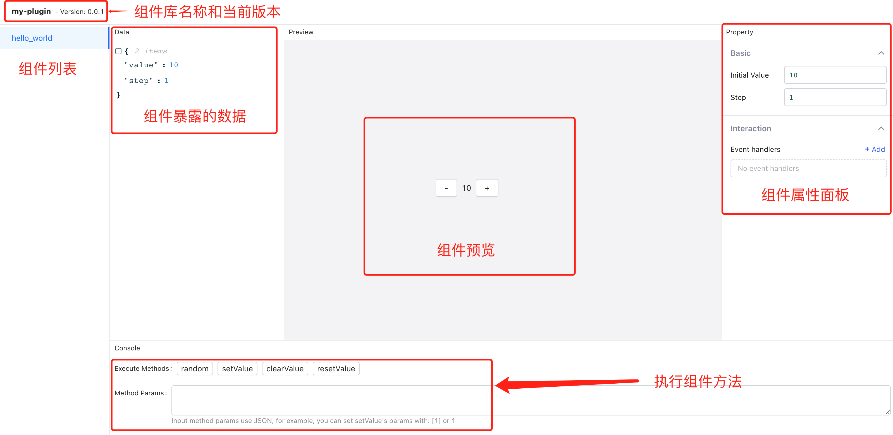
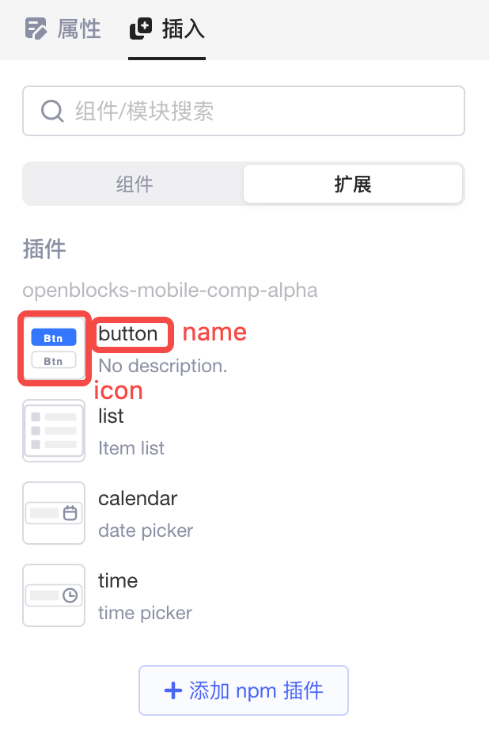
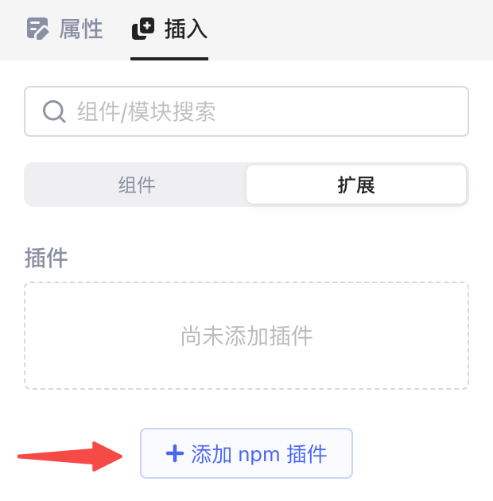

通过Lowcoder插件，您可以开发与Lowcoder原生组件体验一致的自定义组件库。

## 初始化开发环境

在终端中逐步执行以下命令：

```bash
# 初始化工程
yarn create openblocks-plugin my-plugin

# 切换到工程主目录
cd my-plugin

# 启动开发环境
yarn start
```

## 组件开发环境

​`yarn start`​ 执行成功后，会自动打开浏览器，进入组件开发环境。

​

## 插件配置

当前插件的配置需要在 `package.json`​ 中的 `openblocks`​ 字段中进行修改。

其中 `comps`​ 字段定义了当前插件包含的 UI 组件。其中每个 Object 的 key 是组件的唯一标识，value 包含了组件所有的元信息：

* ​`comps[someCompKey].name`​：组件展示在界面上的名称。
* ​`comps[someCompKey].icon`​：组件展示在界面上的图标，此处需要填写一个相对于 `package.json`​ 文件的相对路径。

​

* ​`comps[someCompKey].layoutInfo`​：组件的布局信息。

  * ​`w`​：组件宽度所占用的网格数（取值范围：1 - 24）
  * ​`h`​：组件高度所占用的网格数（取值范围：>= 1）

```json
"openblocks": {
  "description": "",
  "comps": {
    "hello_world": {
      "name": "Hello World",
      "icon": "./icons/hello_world.png",
      "layoutInfo": {
        "w": 12,
        "h": 5
      }
    },
    "counter": {
      "name": "Counter",
      "icon": "./icons/hello_world.png"
    }
  }
}
```

## 导出组件列表

组件列表需要通过 `src/index.ts`​ 导出，例如：

```bash
import HelloWorldComp from "./HelloWorldComp";

export default {
  hello_world: HelloWorldComp,
};
```

其中默认导出的对象的 key 需要与 `package.json`​ 中 `comps`​ 字段配置的 key 保持一致。

## 发布插件

插件开发并测试完毕后，可以发布到 npm 仓库。需要先​**在本机登录 npm 仓库**​，然后执行以下命令：

```bash
yarn build --publish
```

如果不指定 `--publish`​ 参数，会在根目录中打包成 `tar`​ 文件。

## 导入和使用插件

打开一个Lowcoder应用，在右侧面板 > **插入** > **扩展**中点击​**添加 npm 插件**​。

​

输入已发布的 npm 包 URL 或者名称，然后就可以像原生组件一样使用自定义组件了。

```bash
my-plugin

# or

https://www.npmjs.com/package/my-plugin
```