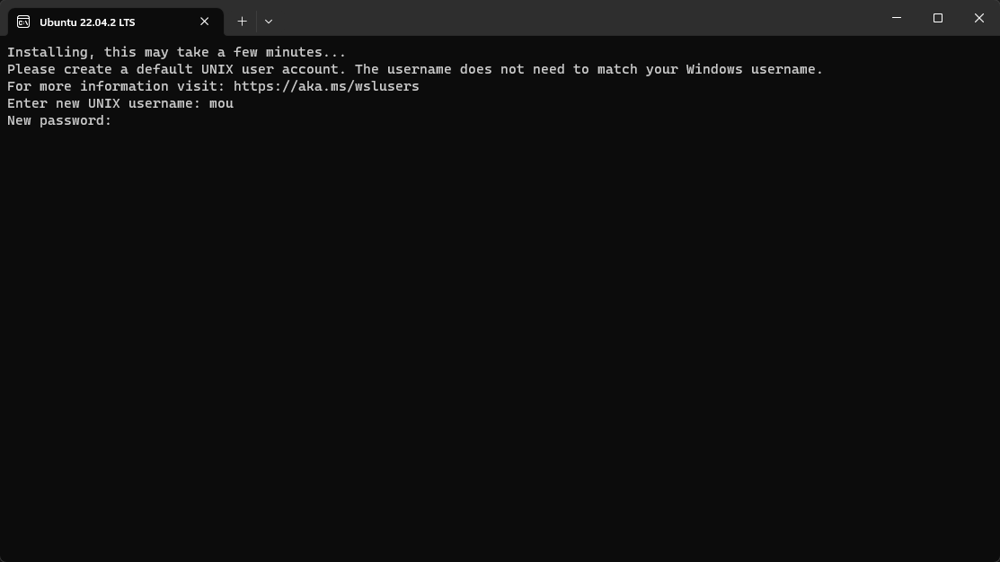
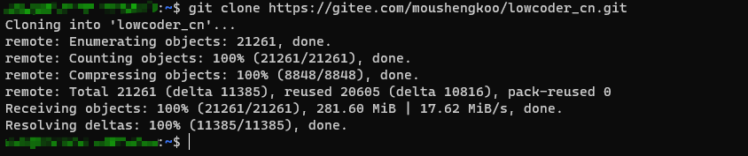
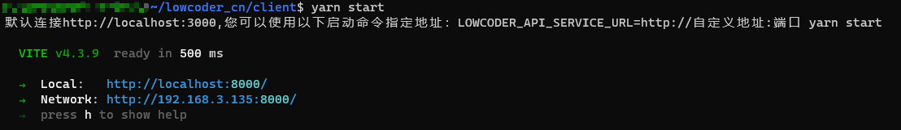
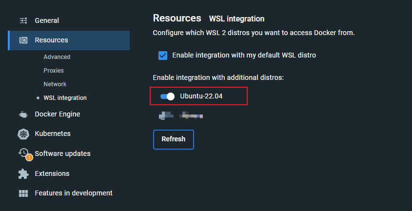
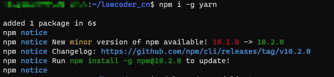

我将尽我所能将我了解掌握的分享给大家

* [源码下载](#源码下载)
* [快速调试前端](#快速调试前端)
* [调试后端](developer/debugBackendCode.md)
* [添加原生组件](developer/addComponent.md)
* [组件文件简单介绍](developer/component-file.md)
* [打包Docker镜像](developer/build-image.md)

以下以windows WSL2新安装的ubuntu22为例

### 源码下载

```bash
# WSL下注意切换到任意的linux目录，否则IO性能会很差
cd ~
git clone https://github.com/mousheng/lowcoder_CN.git
# 国内网络
git clone https://gitee.com/moushengkoo/lowcoder_cn.git

```


### 快速调试前端

如果您暂时只想修改前端内容，那么很简单只需要简单两步
#### 步骤一：运行容器

```bash
# 如果您本机已经运行了Lowcoder容器，那么可以直接跳过该步骤
sudo docker run -d --name lowcoder-dev -p 3000:3000 moushengkoo/lowcoder_cn:latest
# 以上命令运行的容器如果删除，数据将都消失，您也可以加载卷来做数据持久化
sudo docker run -d --name lowcoder-dev -p 3000:3000 -v "$PWD/stacks:/lowcoder-stacks" moushengkoo/lowcoder_cn:latest
```
> 如果提示sudo: docker: command not found，[解决](#打开wsl-docker)

#### 步骤二： 运行代码

```bash
# 切换到client目录
cd lowcoder_cn/client
# 安装依赖
yarn install
# 运行前端
yarn start
```
运行后，将自动打开浏览器，你也可以根据提示的网址手动打开。
当您修改项目代码后，浏览器将自动加载最新的代码，方便你调试。


> 如果你输入yarn提示Command 'yarn' not found，说明你没安装yarn包管理器，你可以输入 `npm i yarn -g` ，如果还是报错，那么跟我一起安装[node](#node安装)吧

#### 打开WSL-Docker
勾选**docker Desktop**> **Setting** > **Resources** > **WSL integration**，再点击右下角 **Apply & restart**
 
#### node安装

```bash
# 安装nvm，node版本管理器
bash -c "$(curl -fsSL https://gitee.com/RubyMetric/nvm-cn/raw/main/install.sh)"
# 安装后重新打开终端窗口
nvm install node
# 检查node是否安装成功
node -v
# 安装yarn
npm i -g yarn
```


