要添加原生组件，您只要完成 [快速调试前端](developer/README.md#快速调试前端) ，和一定的编程基础即可（我也是现学的Typescript和React）。

以下以添加**甘特图组件**为例主要分以下几个步骤：

### 正常调试前端：

请参考[快速调试前端](developer/README.md#快速调试前端)，即时调试和发现问题。

### 步骤一：搜索图标

到 [阿里巴巴矢量图标库](https://www.iconfont.cn/) 搜索你准备添加组件的图标,按需调整图标颜色后，点击**复制SVG代码**

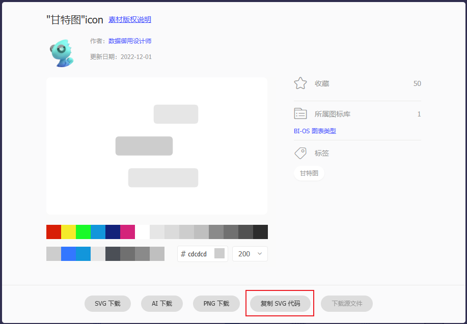

### 步骤二：新建图标文件并引入

#### 快速跳转图标文件夹

在VS Code中，按 **Ctrl+P** 粘贴 `client/packages/lowcoder-design/src/icons/index.ts` 可以快速定位到图标文件夹

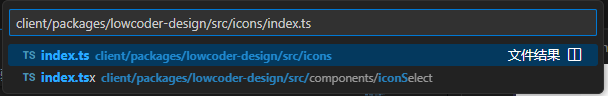

#### 新建图标文件

在该文件夹内新建 `icon-comp-gante.svg` ，并粘贴刚刚复制的svg代码

#### 引入SVG文件

在 `index.ts` 文件中末尾添加引入。

```javascript
export { ReactComponent as GanteeIcon } from "icons/icon-comp-gantee.svg";
```

保存所有文件，没有浏览器没有报错的话继续下一步骤。

### 步骤三：添加组件文件

这里我们使用 `qrCodeComp.tsx` 这个二维码生成组件的源文件作为模板，主要因为这个组件比较简单

#### 复制模板

定位到 `qrCodeComp.tsx` 文件后，复制一份，并改名为 `ganteeComp.tsx`

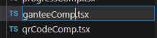

#### 修改导出名

修改导出名为 `GanteeComp` ，保存文件。这时浏览器不会报错，因为还没有任何文件引用我们的组件。

!> 注意导出的组件名首字母必须为大写

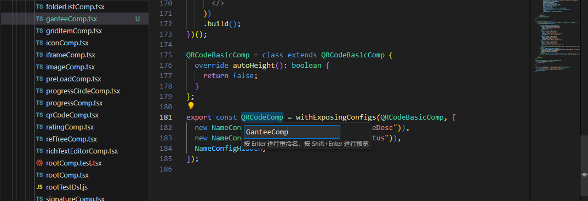

### 步骤四：引入组件

#### 注册组件类型
定位到 `client/packages/lowcoder/src/comps/uiCompRegistry.ts` 下拉到底部，添加 `| gantee` ，这时保存浏览器会提示未发现 `gantee` 类型图标的错误，不用管，请接下去注册左侧边栏图标。

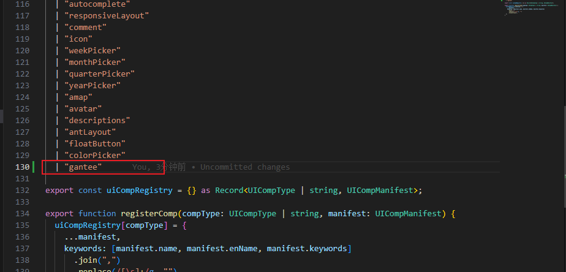

#### 注册左侧边栏图标

定位到 `client/packages/lowcoder/src/pages/editor/editorConstants.tsx` ,引入 [图标名](#引入svg文件) 中引入的图标名
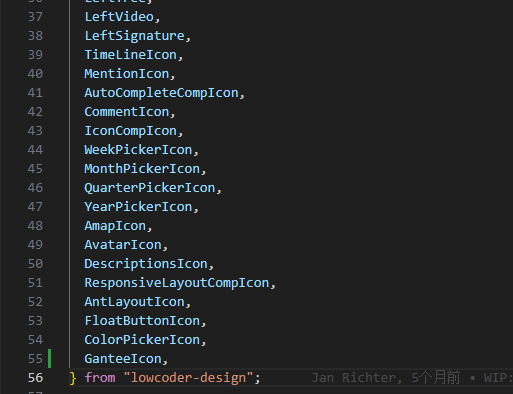

注册侧边栏图标。保存，错误消除。

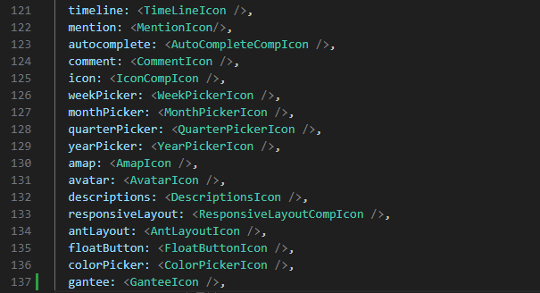

#### 注册组件到左侧组件列表

到目前为止，我们还不能再Lowcoder中看到我们新添加的组件，因为我们还没有注册到组件列表，那么接下来打开

 `client/packages/lowcoder/src/comps/index.tsx`


##### 引入组件图标

从**lowcoder-design**引入图标

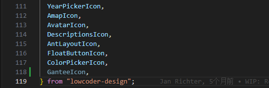

##### 引入组件源文件

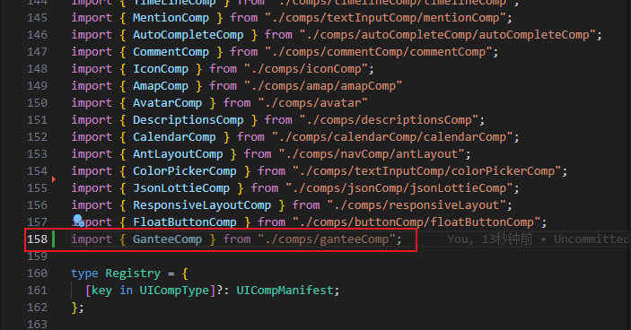

##### 添加国际化文本

Lowcoder使用i18n将组件的文本、属性、描述等对所有文本进行包裹，方便切换不同语言，语言包位置位于

```
client/packages/lowcoder/src/i18n/locales/en.ts
client/packages/lowcoder/src/i18n/locales/zh.ts
```
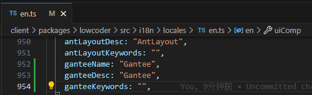


!> en.ts为默认语言包，在中文环境中使用 `trans("uiComp.ganteeName")` 调用时，如果en.ts中找不到对应的字符串就会报错，如果在zh.ts中找不到对应的字符串，则返回en.ts中的字符串。所以，如果碰到字符串不显示中文且没有报错，请检查是否路径或者大小写输入错误。

##### 注册到组件列表

最后，在 `uiCompMap` 变量最后添加组件属性即可完成注册，即可在Lowcoder中找到我们添加的组件。

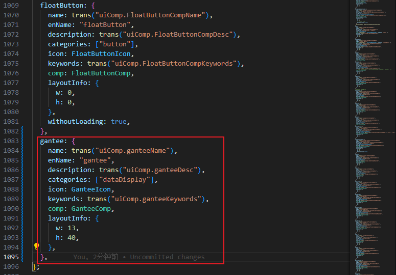

以下是组件属性对应在系统中的显示

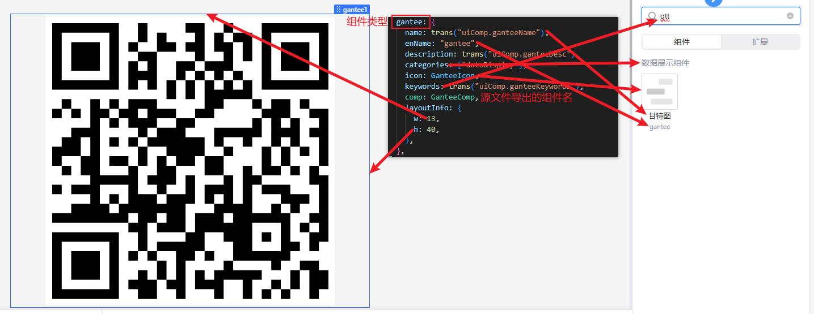

### 引入新的JS库

甘特图组件需要使用 `gantt-task-react` 库，所以编码前要添加该库

命令行窗口输入
```bash
cd client/packages/lowcoder
yarn add gantt-task-react
```

### 组件相关文件夹位置

```bash
# 图标文件夹
client/packages/lowcoder-design/src/icons/
# 图标文件引入
client/packages/lowcoder-design/src/icons/index.ts
# 左侧边栏图标注册
client/packages/lowcoder/src/pages/editor/editorConstants.tsx
# 组件类型注册
client/packages/lowcoder/src/comps/uiCompRegistry.ts
# 右侧组件面板注册
client/packages/lowcoder/src/comps/index.tsx
# 组件样式注册
client/packages/lowcoder/src/comps/controls/styleControlConstants.tsx
# 组件源码文件夹
client/packages/lowcoder/src/comps/comps/
# 文本库
client/packages/lowcoder/src/i18n/locales/en.ts
client/packages/lowcoder/src/i18n/locales/zh.ts
```