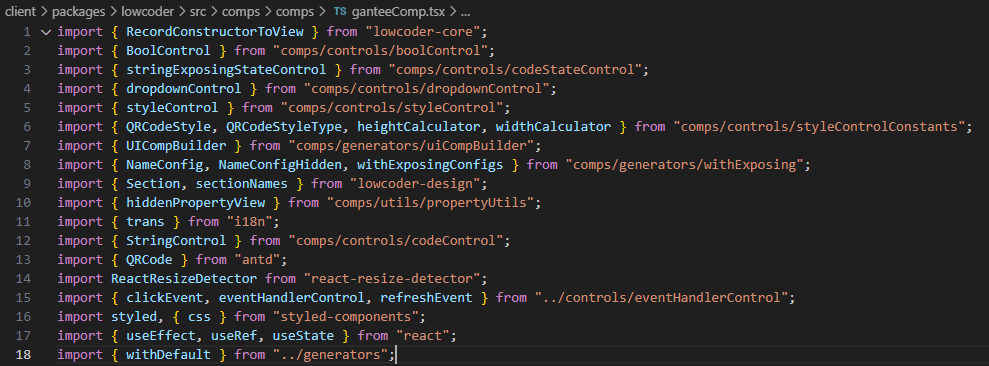
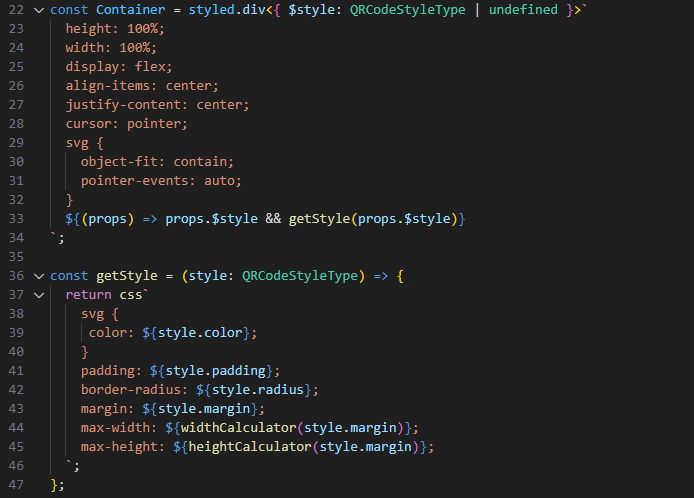
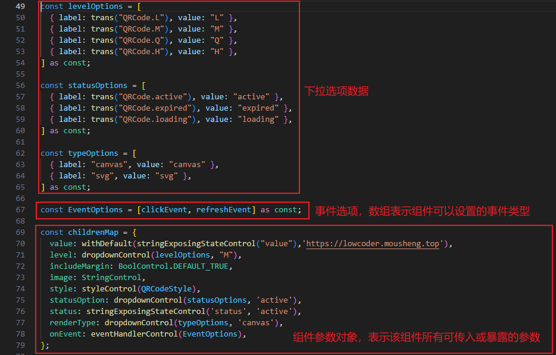
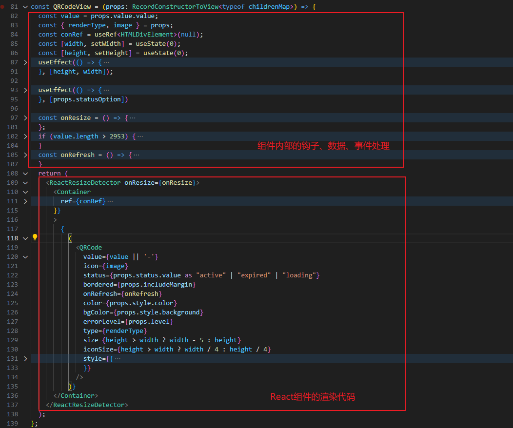
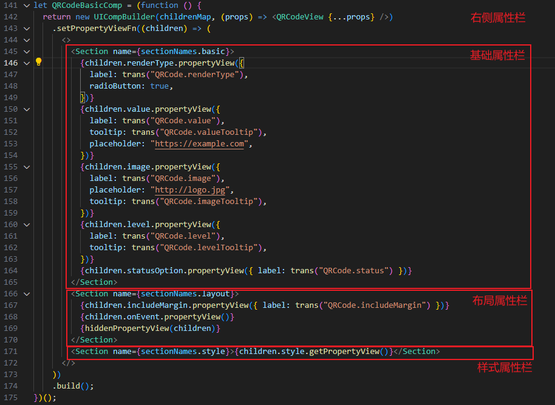
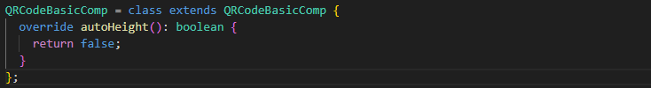
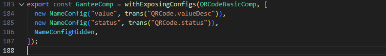

### 组件源文件的简单介绍

Lowcoder内置了很多有用的工具、函数、SDK和API，我也只是了解基础的部分，**后面有空再详写**

#### 文件引用

#### 样式组件

通过 **styled-components** 设置样式简洁、直观、方便

[styled-components 中文文档](https://github.com/hengg/styled-components-docs-zh)

[styled-components 官方文档](https://styled-components.com/docs)

#### 组件参数

#### 组件代码

#### 右侧属性栏

#### 组件是否自动高度

#### 组件暴露的参数设置

设置组件暴露值和暴露值的描述

