本教程用于在本地运行Lowcoder后端代码

## 本教程系统环境

本教程使用的Ubuntu 22.04.3 LTS系统

## 安装OpenJDK 17

Ubuntu下可直接使用apt来安装安装

```shell
sudo apt update
sudo apt install openjdk-17-jdk -y
java -version
```

显示如下代表安装成功

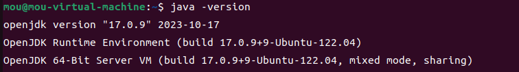

## 安装maven

```shell
sudo apt install maven -y
mvn -v
```

显示如下代表安装成功

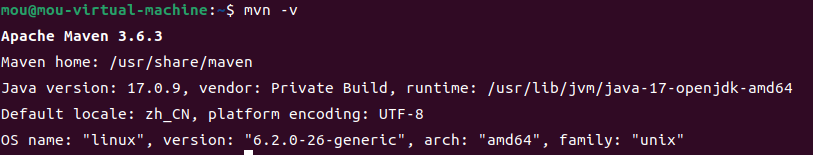

## 下载源码到本地

```shell
cd ~ && git clone https://github.com/mousheng/lowcoder_CN.git --depth=1
```

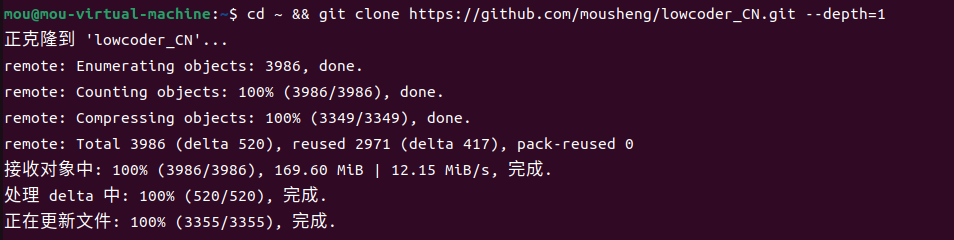

## 构建JAR

```shell
cd ~/lowcoder_CN/server/api-service && mvn clean package -DskipTests
```
根据网络状态和电脑性能，大概十分钟左右构建完成。

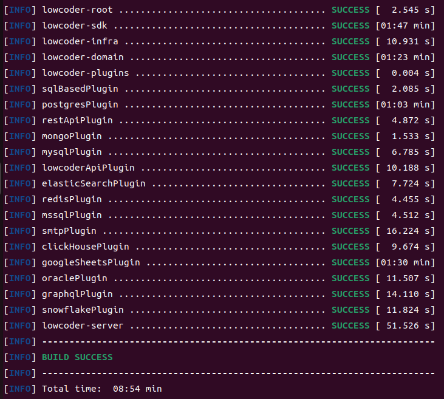

## 下载idea
```
cd ~ && wget https://download.jetbrains.com/idea/ideaIC-2021.3.2.tar.gz
tar -zxvf ideaIC-2021.3.2.tar.gz && mv idea-IC-213.6777.52 idea && rm -rf ideaIC-2021.3.2.tar.gz
```


## 运行Idea

打开Idea后，选择源码的 `api-service` 文件夹

```shell
cd ~ && ./idea/bin/idea.sh
```


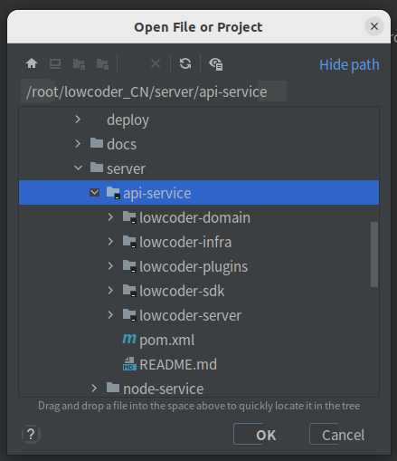

## 设置SDK版本

打开项目后，请先正确设置项目的SDK版本

打开菜单 `File` -> `Project Structure` ，`SDK` 选择 ` 17` 后点击 `OK`

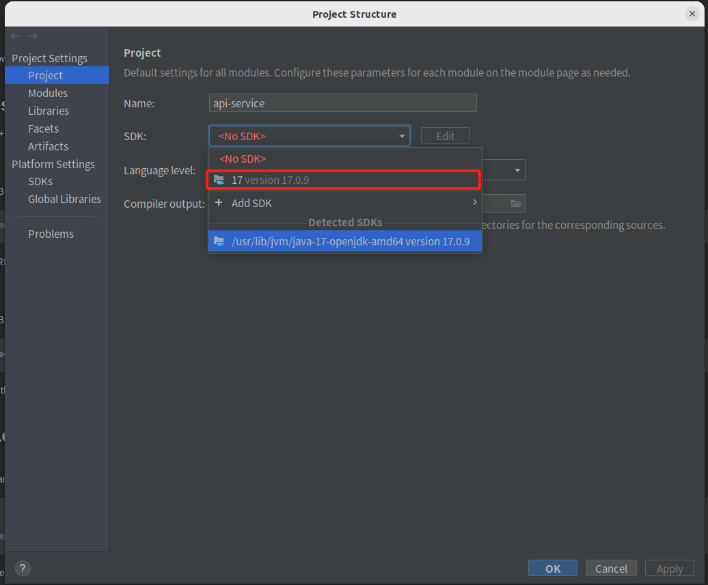


## 设置调试参数

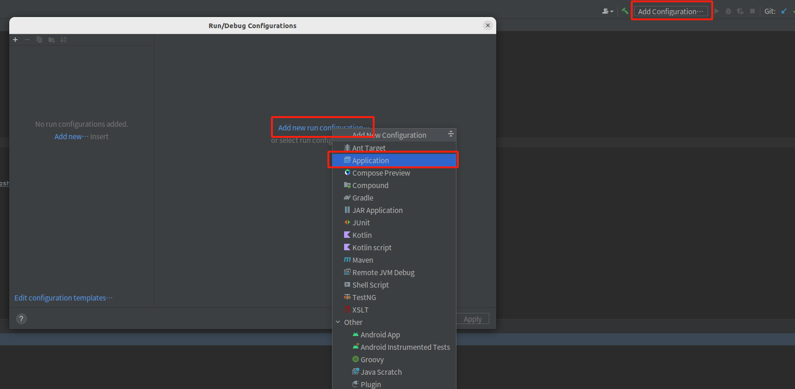

<table>
    <tr>
        <td style="width: 250px">名称</td>
        <td>值  </td>
    </tr>
    <tr>
        <td style="width: 250px">JDK version</td>
        <td>Java 17  </td>
    </tr>
    <tr>
        <td>-cp </td>
        <td>lowcoder-server </td>
    </tr>
    <tr>
        <td>Main class </td>
        <td>org.lowcoder.api.ServerApplication </td>
    </tr>
    <tr>
        <td>VM options(手动添加)</td>
        <td>-Dpf4j.mode=development -Dpf4j.pluginsDir=lowcoder-plugins -Dspring.profiles.active=lowcoder -XX:+AllowRedefinitionToAddDeleteMethods --add-opens java.base/java.nio=ALL-UNNAMED</td>
    </tr>
    <tr>
        <td>Specify classes and packages
        (手动添加)</td>
        <td>org.lowcoder.api.* </td>
    </tr>
</table>

!> 如果设置 `Main class` 一直无法刷新出值，可先不设置该，保存设置后重新点击编辑，再次打开设置一般即可刷出 `org.lowcoder.api.ServerApplication`

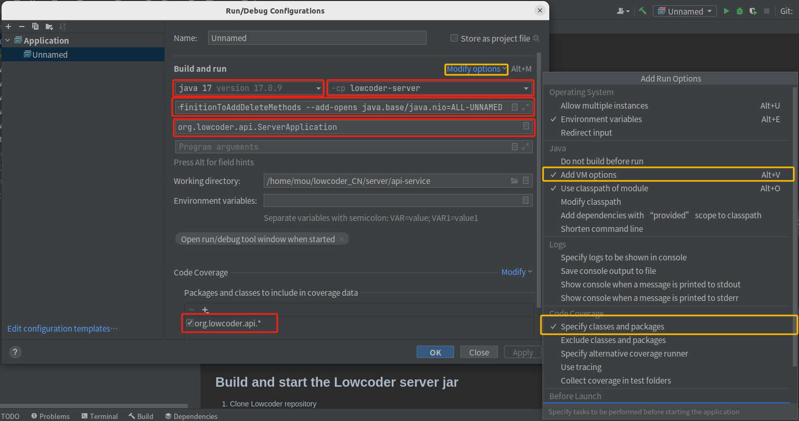

## 数据库环境

### 运行本地Mongo数据库

```shell
sudo docker run -d  --name lowcoder-mongodb -p 27017:27017 -e MONGO_INITDB_DATABASE=lowcoder -e MONGO_INITDB_ROOT_USERNAME=lowcoder -e MONGO_INITDB_ROOT_PASSWORD=secret123 mongo
```

### 运行本地Redis

```shell
sudo docker run -d --name lowcoder-redis -p 6379:6379 redis
sudo docker ps -a
```

容器状态为 `up` 则表示容器运行正常

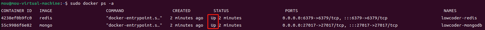

### 使用已有的数据库

如果您本地已有Mongo或Redis数据库，你可以修改 `~/lowcoder_CN/server/api-service/lowcoder-server/src/main/resources/application-lowcoder.yml` 来指定数据库

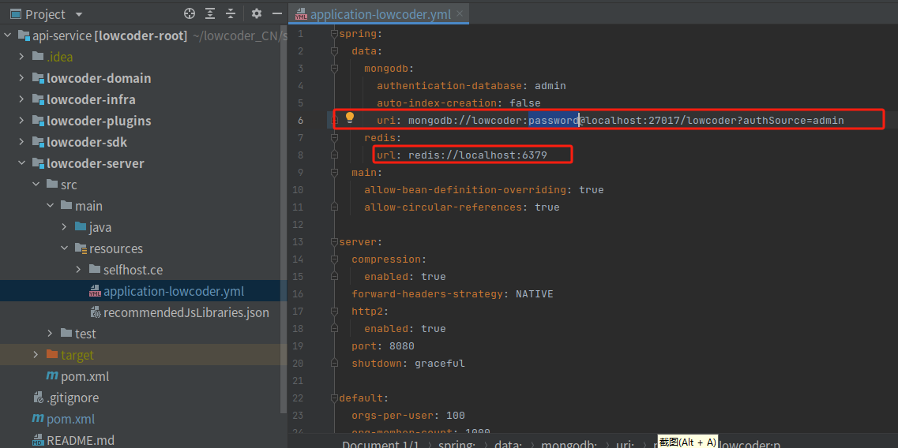

## 开始调试后端

点击调试按钮，当打印出 `SERVER STARTED`代表后端已启动,后端默认端口为 `8080`

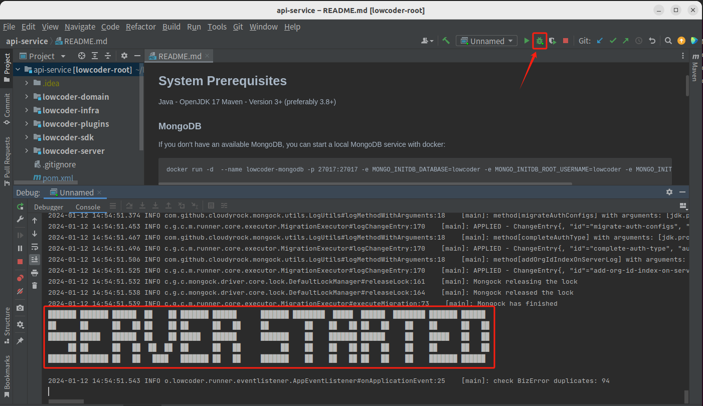

## 前端指定后端地址

新建一个终端或打开VScode来运行前端，具体配置要求可参考 [快速调试前端](developer/README.md#快速调试前端)

```
cd ~/lowcoder_CN/client && yarn

LOWCODER_API_SERVICE_URL=http://localhost:8080 yarn start
```

!> 必须指定LOWCODER_API_SERVICE_URL的值，因为LOWCODER_API_SERVICE_URL默认指向localhost:3000

显示如下图后即自动打开浏览器


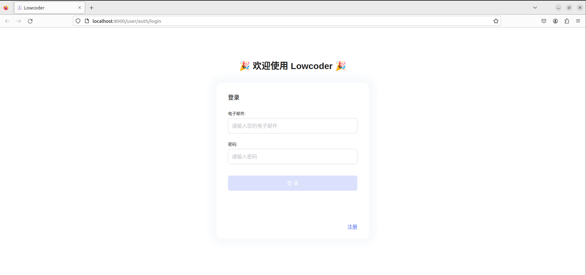