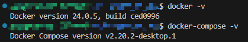
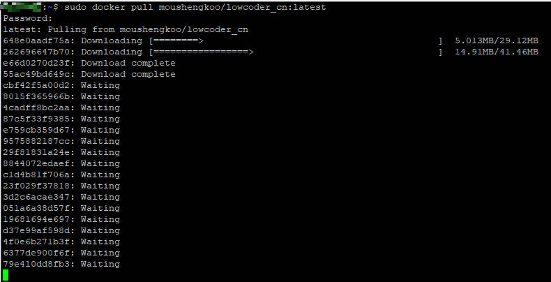
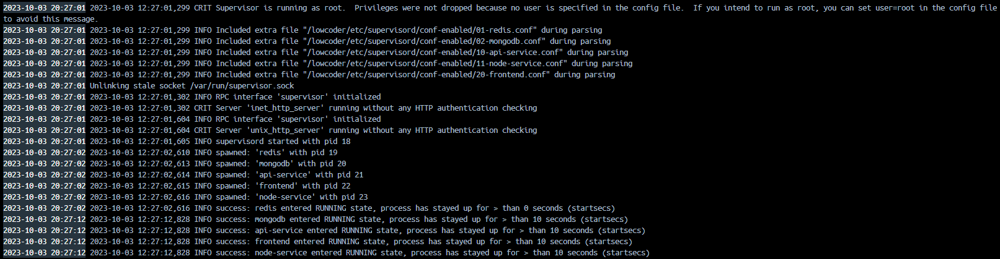
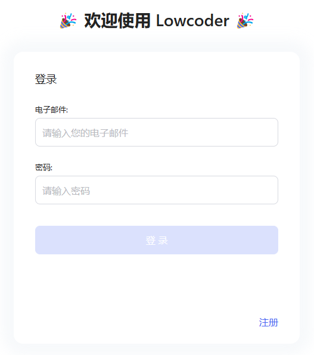
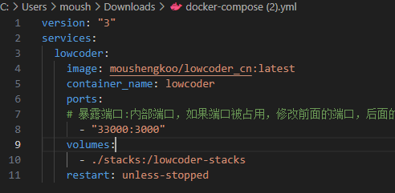

您可以选择使用 Docker-Compose  (推荐）或者 Docker 私有化部署Lowcoder。


### 软件环境

windows下使用Docker必须先安装[Docker Desktop](https://www.runoob.com/docker/windows-docker-install.html)，Linux可直接安装Docker和Docker-Compose

在命令行里查看docker和docker-compose的版本
```bash
docker -v
docker-compose -v
```


如果版本低于以下最低版本，请自行百度搜索更新方法

* [Docker](https://docs.docker.com/get-docker/)（最低版本：20.10.7）
* [Docker-Compose](https://docs.docker.com/compose/install/)（最低版本：1.29.2）


> 💡 说明
>
> * 服务器最低要求：2 核 CPU 和 4 GB RAM
> * Windows 推荐使用 PowerShell 来执行以下命令

### 拉取镜像
输入以下命令拉取最新镜像，镜像约 500 MB。

> 💡 权限
> * linux下命令前面加上 `sudo`+ 空格，防止权限不足

```
docker pull moushengkoo/lowcoder_cn:latest
```

​

!> 如使用latest标签但拉取的镜像却不是最新的，可到 [DockerHub](https://hub.docker.com/r/moushengkoo/lowcoder_cn/tags) 复制最新的tag再拉取，并修改docker-compose.yml文件或命令行中的latest为复制的tag

### 创建目录

创建实例数据存放目录，并切换到该目录中

```text
mkdir lowcoder
cd lowcoder
```
### 部署
<!-- tabs:start -->
<!-- tab:Docker-Compose部署方式 -->
#### 使用 Docker-Compose 部署（推荐）

##### 步骤 1：下载配置文件

可以使用 curl 命令进行下载：

```text
curl https://yun.mousheng.top/lowcoder/docker-compose.yml -o $PWD/docker-compose.yml
```

或者通过点击 [docker-compose.yml](https://yun.mousheng.top/lowcoder/docker-compose.yml) 进行下载。

##### 步骤 2：启动 docker 容器

运行命令启动 docker 容器：

```text
docker-compose up -d
```

镜像下载完毕后，服务会在 30 秒内完成启动，请耐心等待。

>💡 说明
>
> 如果遇到镜像下载速度慢或下载失败的问题，请参阅 Docker [镜像加速器](https://yeasy.gitbook.io/docker_practice/install/mirror)文档配置国内的镜像加速源。

##### 更新镜像

当dockerhub推送新镜像后，执行以下命令来更新Lowcoder服务：

```text
docker-compose pull
docker-compose rm -fsv lowcoder
docker-compose up -d
```
<!-- tab:Docker命令部署 -->
#### 使用Docker命令部署


执行以下命令来私有化部署Lowcoder服务：

```text
docker run -d --name lowcoder -p 3000:3000 -v "$PWD/stacks:/lowcoder-stacks" moushengkoo/lowcoder_cn:latest
```

##### 更新镜像

当dockerhub推送新镜像后，执行以下命令来更新Lowcoder服务：

```bash
docker pull moushengkoo/lowcoder_cn:latest
docker rm -fv lowcoder
docker run -d --name lowcoder -p 3000:3000 -v "$PWD/stacks:/lowcoder-stacks" moushengkoo/lowcoder_cn:latest
```

<!-- tabs:end -->

### 检查 docker 状态

通过以下命令来查看日志：

```text
docker logs -f lowcoder
```

当看到`frontend、backend、redis、mongo entered RUNNING state`​时，Lowcoder服务已经正式启动，如下图：

​

### 访问服务

访问 http://localhost:3000 ，选择​**立即注册**​，注册后将自动创建企业，之后您可以邀请成员进入该企业。

​


### 常见问题

#### linux下权限不足错误

如linux下有如下提示

!> Got permission denied while trying to connect to the Docker daemon socket at unix:///var/run/docker.sock: Get "http://%2Fvar%2Frun%2Fdocker.sock/v1.24/containers/json?all=1": dial unix /var/run/docker.sock: connect: permission denied

时，说明您的权限不足，请运行docker前面加上sudo 并输入密码即可


#### 端口被占用无法启动镜像

如容器启动失败，有如下提示

!> docker: Error response from daemon: driver failed programming external connectivity on endpoint lowcoder (fe50128558260f332522a3028fce797c3743db44b0e9fc6161c17e55e5d7ed6f): Bind for 0.0.0.0:3000 failed: port is already allocated.
时，说明3000端口被占用，可以修改容器的暴露端口为其他端口，具体根据您的部署方式。
<!-- tabs: start -->
<!-- tab: docker-compose -->
##### docker-compose配置

###### 修改配置文件

###### 重新运行镜像
```
docker-compose down 
docker-compose up -d
```
<!-- tab: docker命令行方式 -->
##### docker命令行方式
``` bash
docker rm -f lowcoder
# 先切换回实例数据存放目录，再运行以下命令
docker run -d --name lowcoder -p 33000:3000 -v "$PWD/stacks:/lowcoder-stacks" moushengkoo/lowcoder_cn:latest
```

<!-- tabs:end -->


* [在docker镜像中，如何如何访问宿主机 API/DB？](visit-host-api-or-db.md)