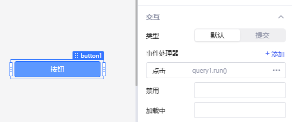

组件和查询都有自己的事件 (Event)，事件可以有条件地触发某一或某些动作。可以设置执行查询、控制组件、全局提示等动作以响应事件。 一个用户交互友好的、符合逻辑的可用应用，离不开合理的事件设置，它将所有组件和查询串联起来，形成一个联通有机的整体。本文档将介绍组件和查询的事件设置。
例如，对于**按钮**组件，您可以添加一个事件处理程序来触发**运行查询**操作***以响应按钮**单击**事件。

%20(1).png)

正确的添加事件处理，可以提供反应灵敏的用户体验。例如，在**插入新数据**事件后触发**获取数据**的查询，可实现表格自动刷新。

您可以为单个组件或查询添加任意数量的事件处理程序，这些事件处理程序可依次运行。

## 事件

### 组件事件

不同组件有不同的事件，如**按钮**组件只有**点击**事件。

**文本输入框**组件具有**更改**、**聚焦**、**失焦**和**提交**事件。

%20(1).png)

### 查询事件

运行查询可能成功或失败，因此查询有两个事件： **成功**或**失败**。您可以在查询编辑器中为查询添加事件处理程序。

.png)

## 事件动作

Lowcoder中有九种事件动作可用于处理不同的场景。在事件处理程序的**操作**下拉列表中设置它们。

%20(1).png)

如需了解[高级](event-handlers.md#高级)设置，请参阅本页的高级设置。

### 运行查询

在组件或者查询的事件部分选择新建，动作设为执行查询，最后可以在下拉框中，选择要执行的查询名称。

%20(1).png)

### 控制组件

在Lowcoder中，除了编写 JavaScript 控制组件之外，您还可以通过触发事件来控制组件。选择事件后，将动作选为控制组件，再选择相应的组件和对应的方法等。

.png)

### 设置临时状态

选择动作为设置临时状态，可以在事件触发后更新临时状态的值。支持 setValue 和 setIn 两种赋值方法，详情可参阅[临时状态](write-javascript/temporary-state.md).&#x20;文档。

### 打开应用页面

使用**打开应用页面**动作，您可以与其他应用进行连接、实现页面跳转，从而实现多页面交互。其中 URL Query 参数和 URL Hash 参数为可选项：

| 参数                      | 作用                                                                                                    |
| ------------------------- | ------------------------------------------------------------------------------------------------------- |
| 
URL Query 参数 
 | 
将以 <code>?key1=value1&#x26;key2=value2...</code> 形式追加到选择的所要打开应用的 url 后面。 
 |
| URL Hash 参数             | 将以 `#key1=value1&key2=value2...` 形式追加到选择的所要打开应用的 url 后面。                            |

#### **示例**

在「企业人员信息表」应用中，点击表格列「**部门**」的任一链接即可跳转到「**部门人员信息看板**」应用，并展示对应部门人员信息。
%20(1).png)

1.  **企业人员信息表**应用将当前行的部门信息 `{{currentRow.department}}` 作为 URL Query 参数传递给部门人员信息看板应用。

    
2. **部门人员信息看板**应用全局变量 url 字段将自动解析应用请求的 URL。示例中， url.query 值为 `{"department":"研发部"}`，然后可在查询中通过 `{{url.query.department}}` 获取到对应部门信息。

    .png)

### 跳转到指定应用

将**动作**选为 **跳转到指定应用** ，再填写要打开链接的 URL ，可选是否要在新标签页打开。

%20(1).png)

### 全局提示

添加一项事件后，选择**动作**为 **全局提示** ，再填写和设置相应的提示文案、信息级别（信息、成功、警告、错误）和持续时间即可。

.png)

### 复制到剪贴板

将**动作**选为 **复制到剪贴板** ，再填写要复制的文本。

%20(1).png)

### 下载

选择事件后，将**动作**选为 **下载** ，再填写下载的文件数据来源、文件名，选择文件类型。这样当事件触发后，就会有一个下载文件的动作执行，支持文件(TXT, JSON, CSV, and Excel)。

## 高级

### 执行条件

事件可以有条件地触发某一动作，在事件编辑框的执行条件中编写 JavaScript 表达式，这样**动作**仅当执行条件的计算结果为 true 时才运行，例如：`{{checkbox1.value}}`，`{{query1.data.length > 0}}`。

### 防抖/节流

防抖和节流属于查询编辑器的高级选项，它们的作用都是降低**动作**的运行频率。

**防抖**指的是 **延迟动作** ，即：动作不会在事件发生之后立刻执行，而是在设定的防抖时间过去之后才会执行，如果在这段时间内事件再次发生，则防抖时间重新计时。例如：当用户在搜索栏（一个**输入框**组件）中更改搜索文本时，会触发执行一个查询。如果该查询运行成本很大，您不希望在每输入一个字符时都触发它，就可以通过设定防抖时间来延迟查询的执行。这样就能实现：当用户停止输入后才会触发查询。这也是较优的提高性能和节省资源的方式。

**节流**指的是在指定的时间内只执行一次 **动作** 。例如：用一个按钮组件控制更新用户数据，按钮单击事件触发执行查询 `UpdateUserData`，该查询的运行成本较大，较好的方式是限制其在指定时间内只能运行一次，而非用户每点击一次按钮就运行一次（当发生用户频繁点击的情况）。遇到类似这种情况，您就可以设定其节流时间来节约运行成本。

您可以在输入框中直接填写数字来设定防抖或节流时间，单位均为毫秒。