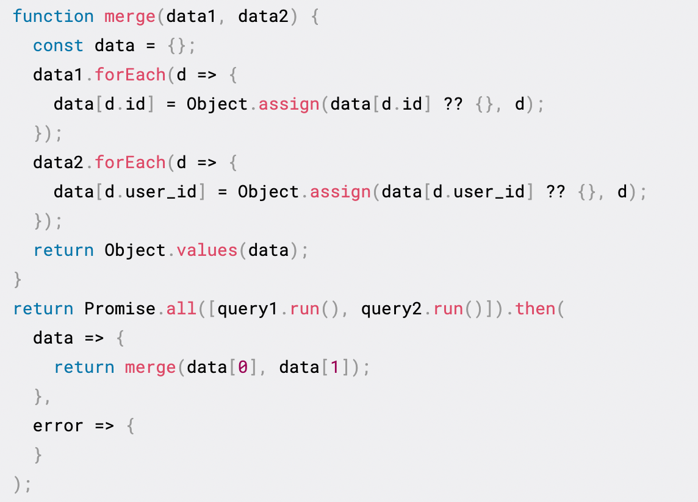

Lowcoder致力于提供极致的灵活度与扩展性，您几乎可以在任何地方编写 JavaScript 来串联与实现您的业务逻辑。

您可以根据使用场景，选择不同的 JavaScript 工具：

|**使用场景**|**文档介绍**|
| ----------------------------------------------------------------------------------------------------------------------------------------------------------------------------------------| --|
|使用 JavaScript 表达式访问数据、转换数据。例如：`{{input1.value + 9}}`​ `{{query1.data.map(row => row.id)}}`​   `{input1.value > input2.value ? input1.value : input1.value }}`​|[JavaScript 表达式](../javascript-in-lowcoder/writing-javascript.md)|
|使用转换器编写多行、复杂的数据转换逻辑。例如：​|[转换器](../javascript-in-lowcoder/using-transformer.md)|
|使用临时状态存储局部数据。例如：加法器的**当前计数**可以使用临时状态存储：​|[临时状态](../javascript-in-lowcoder/using-temp-state.md)|
|使用 JavaScript 串联查询、控制组件以及编排业务逻辑。例如：写 JS 查询来合并两个查询的结果数据，如下：​|[JavaScript 查询](../javascript-in-lowcoder/javascript-query.md)|
|使用数据变化响应器 (dataResponder) 监听及响应任何数据的变化。例如：同时监听表单中四个输入项，并在任意输入项发生变化时，触发相同的全局提示。​|[数据变化响应器](../javascript-in-lowcoder/data-responder.md)|