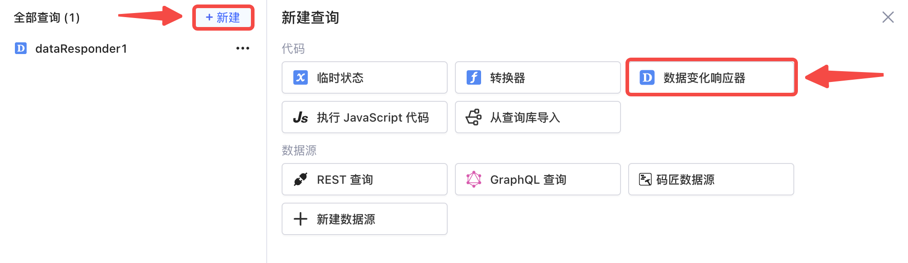
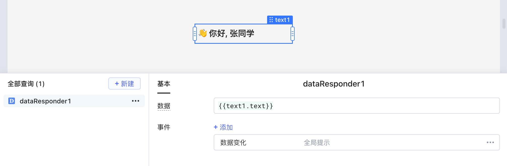
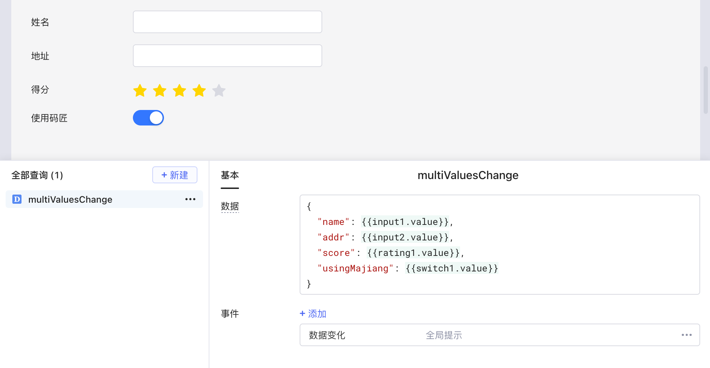

使用数据变化响应器 (Data Responder)，监听及响应任何数据的变化

搭建应用时，为了监听某些数据的变化，我们可以为组件设置事件，例如：表格中 `selectedRow` 属性的变化对应「选择行改变」事件、`filter` 的变化对应「筛选改变」事件、`sort` 的变化对应「排序改变」事件；输入框内容 `value` 的变化对应「内容改变」事件等等。

然而在更多情况下，一些**数据变化**却没有类似的内置事件来监听，例如临时状态、转换器、查询结果等值的变化。此时，就可以创建 **数据变化响应器** （下简称 **响应器** ），监听任意 **数据变化 (dataChange)** ，并为其设置[响应动作](../event-handler.md)。

> ### 💡 说明
>
> **数据变化**事件相比于内容改变、选择行改变等监听特定数据变化的事件，更具有普适性。
>

## 创建及使用

在应用编辑界面下方的查询编辑器中，点击 **+ 新建** -> **数据变化响应器**即可创建。

创建完成后，可以设置该响应器所依赖的数据，以及数据变化 (dataChange) 后的响应动作。

如下图，响应器 `dataResonder1` 监听文本组件 `text1` 中文本内容的变化，并在发生变化时触发全局提示。

## 响应多项数据的变化

响应器的数据支持设置为任意数据类型，包括数值 (Number)、字符串 (String)、数组 (Array) 和 JS 对象 (Object) 等等，只需要**通过** **`{{}}`** **声明对其他数据的依赖**即可。如果其中包含多项数据，则可以同时监听所有数据，并在任意数据发生变化时，触发同一个响应动作。

如下图，响应器 `multiValuesChange` 所依赖的数据为一个 JS 对象 (Object)，同时监听表单中四个输入项，并在任意输入项发生变化时，触发相同的全局提示。

## 事件动作

详情可参阅文档：事件 -> [事件动作设置](../event-handler.md)。