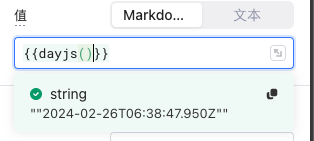
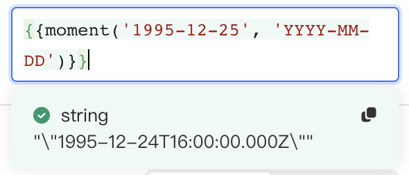
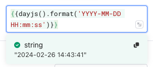
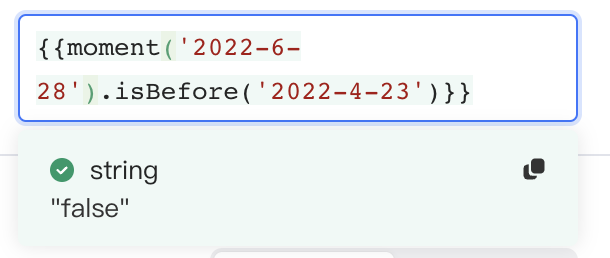
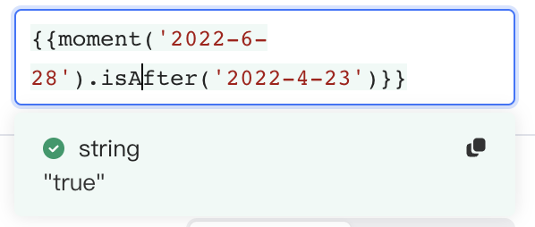

在搭建应用时，您可能需要对日期和时间进行操作——如：获取时间戳、转换时间格式、对日期做加减操作等，对此，Lowcoder默认装载了 [Day.js](https://day.js.org/docs/zh-CN/installation/installation)。Day.js 是一个JavaScript 类库，用于显示日期和时间、格式转换等操作。

## 在Lowcoder中使用 Day.js 库

下表给出一些常用的 Day 方法以及在Lowcoder中的应用示例，若您想了解更多操作，请参阅 [Day.js 文档](https://day.js.org/docs/zh-CN/installation/installation)。

| **方法**                                 |**描述**| **举例**                                                                                                                 |
|----------------------------------------| ----------------------------------------------------------------------|------------------------------------------------------------------------------------------------------------------------|
| `dayjs()`                              |获取当前日期对象，默认展示格林尼治时间|                                                                             |
| `dayjs(timestamp)`                     |传入一个整形数值，该值表示自 1970 年 1 月 1 日 12AM UTC 以来的毫秒数|                                                                           |
| `dayjs('date string').format()`        |将给定格式的日期字符串转换为日期对象|                                                                             |
| `.format('new format')`                |格式化当前日期，完整的日期格式请参阅[Day.js 文档](https://day.js.org/docs/zh-CN/durations/format)| `{{dayjs().format("YYYY-MM-DD HH:mm:ss")}} // "2022-07-05 17:01:26"`    |
| `.subtract(duration, 'duration type')` |减去给定的一段时间，需要定义时间长短和类型| `{{dayjs().subtract(2, 'months')}} // 当前时间减 2 个月`                              |
| `.add(duration, 'duration type')`      |加上给定的一段时间，需要定义时间长短和类型| `{{dayjs().add(2, 'days')}} // 当前时间加 2 天`                                      |
| `.isBefore('second date')`             |如果第一个给定日期在第二个给定日期之前，返回一个布尔值|                                                                             |
| `.isAfter('second date')`              |如果第一个给定日期在第二个给定日期之后，返回一个布尔值|                                                                             |
