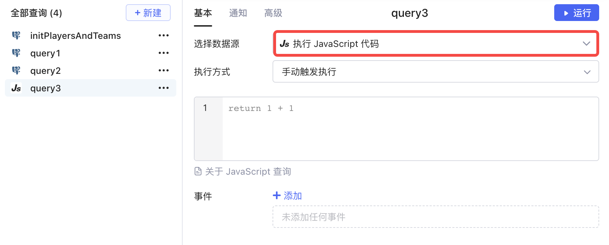
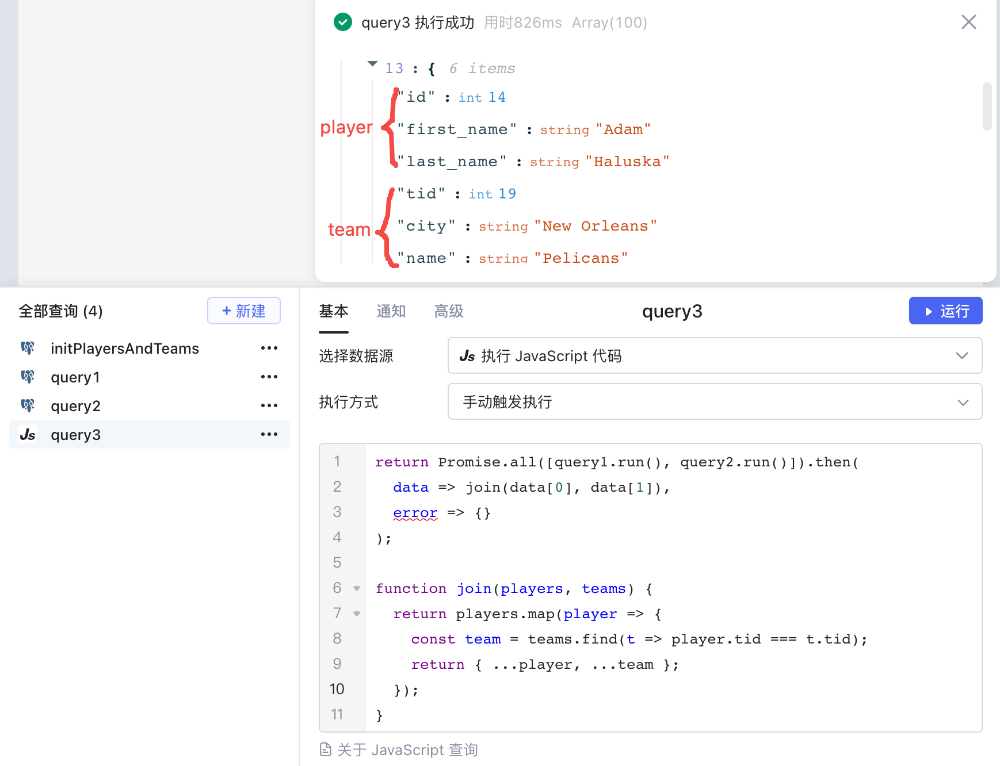
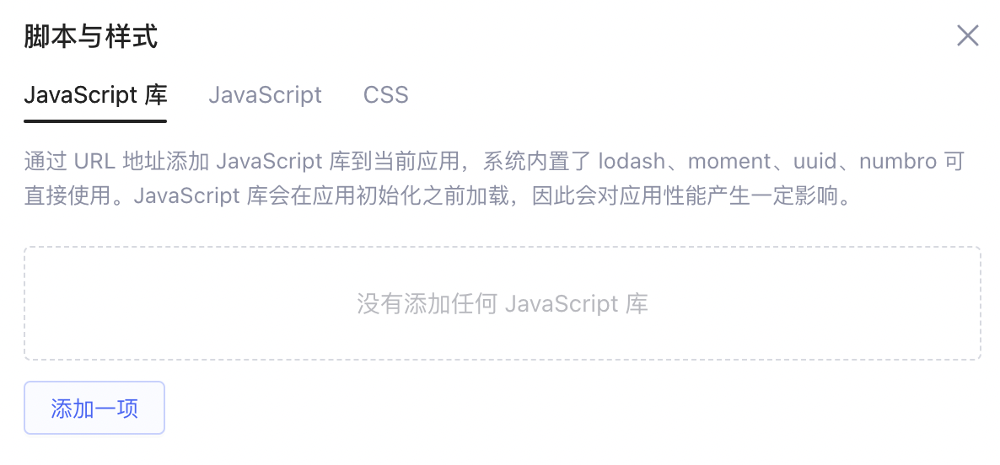
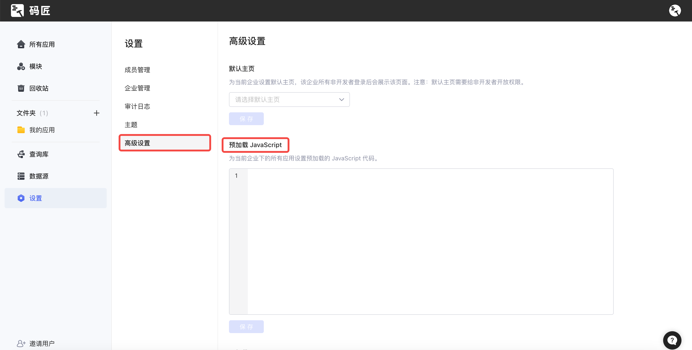
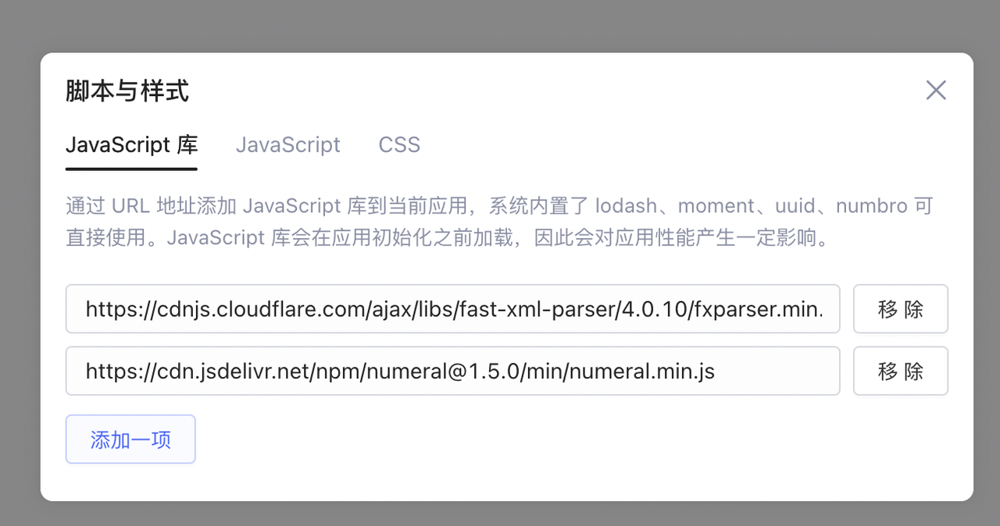
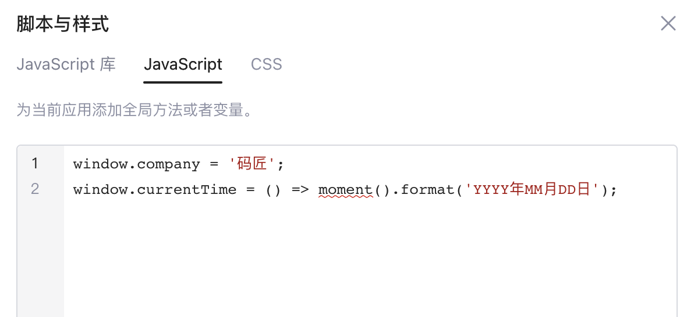
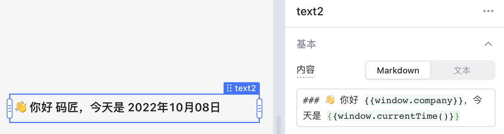

在Lowcoder中构建应用时，相较于在 `{{ }}`​ 内编写 [JavaScript 表达式](../javascript-in-lowcoder/writing-javascript.md)，通过 JavaScript 查询功能可以编写和运行更加复杂的 JavaScript 代码。这里的 JavaScript 代码支持的功能包括：

* 调用库函数
* 编写自定义函数并引用其返回值
* 引用组件的数据、调用组件暴露的方法来控制组件
* 引用查询返回值、执行查询

先看一个使用 JavaScript 查询的具体案例：

## 案例：合并两个查询数据结果

假设已经有两个不同的查询：

* SQL 查询 `query1`​ 从表 `players`​ 中读取 `id`​、`first_name`​、`last_name`​ 和 `tid`​ 四个字段的信息。

```sql
select id, first_name, last_name, tid from players
```

* SQL 查询 `query2`​ 从表 `teams`​ 中读取 `tid`​、`city`​ 和 `name`​ 三个字段的信息。

```sql
select tid, city, name from teams
```

接下来使用 JavaScript 查询根据 `tid`​ 字段合并两份数据：

1. 新建查询 `query3`​，数据源选择**执行 JavaScript代码**​。

​

2. 在输入框填写以下 JS 代码：

```javascript
return Promise.all([query1.run(), query2.run()]).then(
  data => join(data[0], data[1]),
  error => {}
);

function join(players, teams) {
  return players.map(player => {
    const team = teams.find(t => player.tid === t.tid);
    return { ...player, ...team };
  });
}
```

在这段代码中，`Promise.all()`​ 方法接收了 `query1`​ 与 `query2`​ 的运行结果（类型为 Promise），成功运行后，用自定义函数 `join()`​ 基于 `tid`​ 字段合并了查询结果。`query3`​ 的查询结果如下所示：

​

### 声明函数

JavaScript 查询内可以引用 JavaScript [全局变量和函数](https://developer.mozilla.org/zh-CN/docs/Web/JavaScript/Reference/Global_Objects)，也可以自定义函数，方便重复使用。例如：

```javascript
// 第一个数是否第二个数的倍数
function isMultiple(num1, num2) {
  return num1 % num2 === 0;
}

// 调用moment库返回当前日期
function getCurrentDate() {
  return moment().format('YYYY-MM-DD');
}
```

注意：由于安全原因，禁止使用 window 里部分全局变量和函数。

### 返回数据

* 可以使用 `return`​ 语句返回数据，例如 ：

```javascript
return Math.floor(3.4)
```

运行后将返回 `3`​。

* 返回结果也可以是一个 [Promise](https://developer.mozilla.org/zh-CN/docs/Web/JavaScript/Reference/Global_Objects/Promise) 对象，`query2.run()`​ 结果返回一个 Promise：

```javascript
return query2.run()
```

运行后返回的是 Promise 异步运行后的结果数据。

> #### 💡 说明
>
> ​`return`​ 语句不是必需的，如：在只运行特定逻辑、操作 UI 组件、运行其它查询等情况下。

### 访问数据

JavaScript 查询中可以访问页面任意组件和查询的数据，例如：

```javascript
var data = [input1.value, query1.data, fileUpload.files[0].name];
```

具体参考 [JavaScript 表达式](../javascript-in-lowcoder/writing-javascript.md)文档。

### 调用组件方法

JavaScript 查询中可以使用组件暴露的方法来操作它们（这些方法在 JavaScript 表达式 `{{ }}`​ 语法里不支持）。例如：

```javascript
input1.setValue("你好！"); // 更改 input1 输入框内的文字
```

> #### 💡 说明
>
> ​`input1.setValue()`​ （或其它组件方法）方法是异步的，返回值是一个 [Promise](https://developer.mozilla.org/zh-CN/docs/Web/JavaScript/Reference/Global_Objects/Promise) 对象，在它后面立刻访问 `input1.value`​ 并不能取得新更改的值。

### 运行其它查询

JavaScript 查询中可以运行其它查询，例如：

```javascript
query1.run(); // query1 是另一个查询
```

​`run()`​ 方法可以传递在被调用的查询中未知变量的名称和值，如：

```javascript
query1.run({
  name: "张三",
  status: 0 
});
```

例如： `query1`​ 是 SQL 语句：

```javascript
select * from users where user_name = {{ name }} and user_status = {{ status }}
```

那么，name 和 status 就是未知变量。

> #### 💡 说明
>
> 传递的参数名不能是已有组件名或查询名如：`input1`​、`query1`​。

​`run()`​ 方法的返回值是一个 [Promise](https://developer.mozilla.org/zh-CN/docs/Web/JavaScript/Reference/Global_Objects/Promise) 对象，您可以在它的 `then()`​ 方法里加上查询成功或失败后调用的函数，例如：

```javascript
query1.run({
  name: "张三",
  status: 0 
}).then(
  data => { // 处理成功后结果
    console.log("结果是：" + JSON.stringify(data)); 
  },
  error => { // 处理失败结果
    console.log("出错了！错误消息是：" + error.message);
  }
);
```

#### 示例 1：运行另一个 JavaScript 查询

JavaScript 查询 `query1`​ 声明如下：

```javascript
input1.setValue(text);
return num;
```

JavaScript 查询 `query2`​ 调用 `query1`​，并传入 `query1`​ 所需参数：

```javascript
return query1.run({
  text: "你好",
  num: 7
});
```

#### 示例 2：运行另一个 SQL 查询

MySQL 查询 `query1`​ 声明如下：

```sql
select * from users where gender={{gender}}
```

JavaScript 查询 `query2`​ 调用 `query1`​，并传入 `query1`​ 所需参数：

```javascript
return query1.run({
  gender: 0
});
```

## 自定义脚本

在应用编辑界面点击右上角 ​**•••**​，选择​**脚本与样式**​，您可以为当前应用引入额外的 JavaScript 库，定义预加载的 JavaScript 脚本。

​

​

此外，如果想为企业下所有应用设置预加载的 JavaScript 库与脚本，可以进入Lowcoder主页 -> 设置 -> **高级设置**中进行配置：

​

### 添加 JavaScript 库

例如，下面添加了 fxparser 库和 numeral 两个库：

​

### 定义 JavaScript 脚本

JavaScript 脚本中，可以定义上下文无关的全局变量与方法，例如：

​

之后您便可以在应用中引用定义的变量与方法：

​

## 附录：JavaScript 语法

如果您不熟悉 JavaScript 语言，可以参考 [JavaScript 教程](https://developer.mozilla.org/zh-CN/docs/Web/JavaScript)。