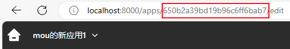
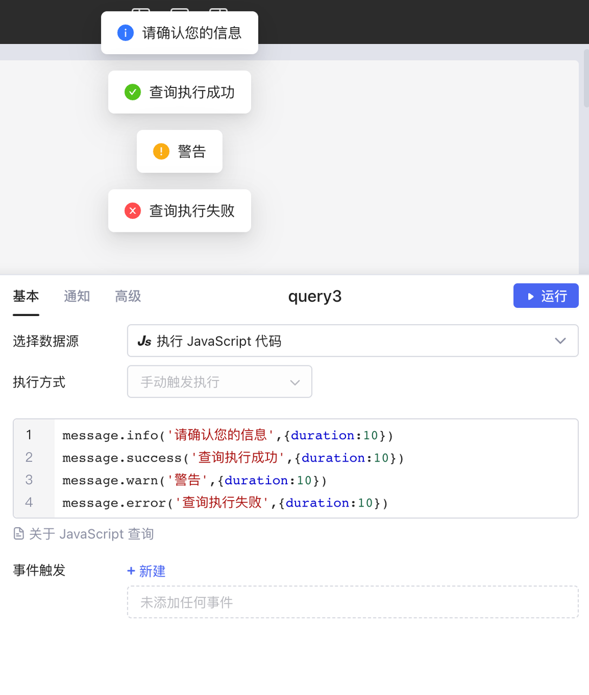
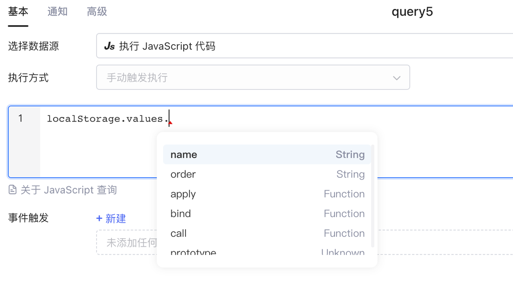
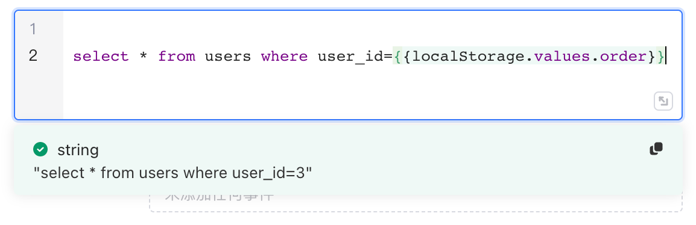

本文介绍Lowcoder内置的 JavaScript 系统函数及用法，可直接在 [JavaScript 查询](javascript-query.md)中调用。

## utils（工具函数）

### utils.openUrl（打开 URL）

```
utils.openUrl( url: string, options?: { newTab:  boolean = true } )
```

| **参数** | **说明** | **是否必填** |
| --- | --- | --- |
| `url` | 要打开的 HTTP 链接，必须以 `http://`或者 `https://` 开头 | 是 |
| `newTab` | 是否在新窗口打开链接，默认为 `true` | 否 |

```
//例：在新选项卡打开百度页面
utils.openUrl("https://www.baidu.com", { newTab: true })
```

### utils.openApp（打开Lowcoder应用）

```
utils.openApp( applicationId: string, options?: { queryParams?: {'key':'value'}, hashParams?: {'key':'value'}, newTab:  boolean = true } )
```

| **参数** | **说明** | **是否必填** |
| --- | --- | --- |
| `applicationId` | 字符串类型，Lowcoder应用 id（如图）


 | 是 |
| `queryParams: {'key1': 'value1', key2: 'value2', ...}` | 查询参数，以 `?key1=value1&key2=value2&...` 追加到应用 URL 后 | 否 |
| `hashParams：{'key1': 'value1', key2: 'value2', ...}` | hash 参数，以 `#key1=value1&key2=value2&...` 追加到应用 URL 后 | 否 |
| `newTab` | 是否在新窗口打开应用，默认为 `true` | 否 |

```
//例：在新选项卡打开Lowcoder应用
utils.openApp("632bddc33bb9722fb888f6c0", { newTab: (boolean = true) })

//例：在新选项卡打开Lowcoder应用，并传递 id 参数
utils.openApp("632bddc33bb9722fb888f6c0", {
  queryParams: { 'id': table1.selectedRow.id },
} )
```

### utils.downloadFile（下载文件）

```
utils.downloadFile(data: any, fileName: string, options?: {
  fileType?: string, 
  dataType?: 'url' | 'base64'
} )
```

| **参数** | **说明** | **是否必填** |
| --- | --- | --- |
| `data` | 要下载的数据，可以来自查询、组件、转换器等等 | 是 |
| `fileName` | 文件命名，字符串类型 | 是 |
| `fileType` | 文件类型，字符串类型，支持所有 [MIME 类型](https://developer.mozilla.org/zh-CN/docs/Web/HTTP/Basics_of_HTTP/MIME_types/Common_types) | 否 |
| `dataType` | 数据类型，字符串类型，可选的有 `'url'/'base64'` | 否 |

```
//例:以 png 格式下载文件上传组件的一个值内容：
utils.downloadFile(file1.value[0], "用户数据", {
  fileType: "png",
  dataType: "base64",
})

//例:以 xlxs 格式下载查询数据：
utils.downloadFile(query1.data, "用户数据", { fileType: "xlsx" })
//或者
utils.downloadFile(query1.data, "用户数据.xlsx")

//例:以 pdf 格式下载 REST 查询数据：
utils.downloadFile(restApiQuery.data, "用户数据", {
  fileType: "pdf",
  dataType: "base64"
})
```

### utils.copyToClipboard（复制字符串到剪贴板）

```
utils.copyToClipboard( text: string )
```

| **参数** | **说明** | **是否必填** |
| --- | --- | --- |
| `text` | 要复制的文本 | 是 |

```
// 将 text1.value 复制到剪贴板：
utils.copyToClipboard( input1.value )
```

## message（全局提示）

使用 message 可以发送全局提示消息，在屏幕中上方显示，默认持续时间为 3 秒。message 支持多种展示样式，可以选择对应的通知方法：

```
//message.info( text: string,  options?: {duration: number = 3 } )
message.info("请确认您的信息", { duration: 10 })

//message.success( text: string,  options?: {duration: number = 3 } )
message.success("查询执行成功", { duration: 10 })

//message.warn( text: string,  options?: {duration: number = 3 } )
message.warn("警告", { duration: 10 })

//message.error( text: string,  options?: {duration: number = 3 } )
message.error("查询执行失败", { duration: 10 })
```



## localStorage（本地存储）

localStorage 将键值对数据存储到本地，不随着应用的刷新重置，可以在企业下的任何应用中使用 localstorage 中的数据。

| **方法** | **说明** |
| --- | --- |
| `localStorage.values` | 暴露存储数据 |
| `localStorage.setItem(key: string, value: any)` | 存储键值对 |
| `localStorage.removeItem(key: string)` | 删除某一键值对 |
| `localStorage.clear()` | 清空 localStorage 内容 |

### localStorage.values

暴露存储数据。在 Javascript 查询中输入 `localStorage.values.`，会暴露其所有的数据：



### 访问 localStorage 中的数据

在左侧数据浏览器下方的全局变量中可以查看 localStorage 中的数据：


### localStorage.setItem(key: string, value: any)

存储键值对。

```
localStorage.setItem("order", select1.value)
```



### localStorage.removeItem(key: string)

删除某一键值对。

```
localStorage.removeItem("order")
```

### localStorage.clear()

清空 localStorage 内容。