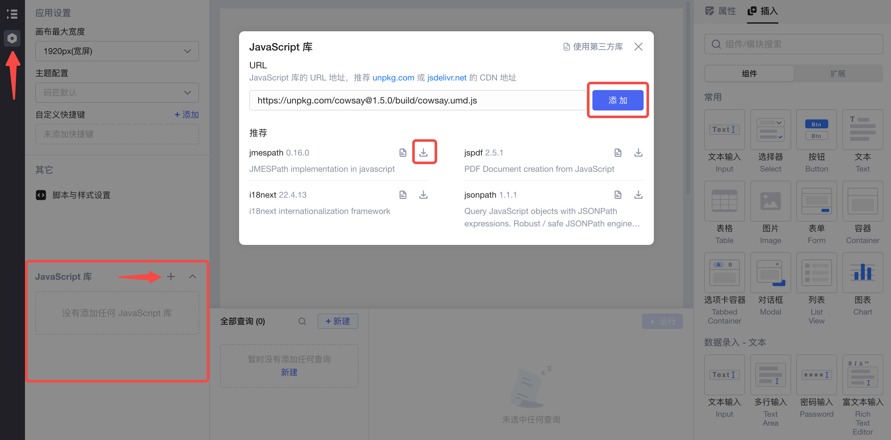
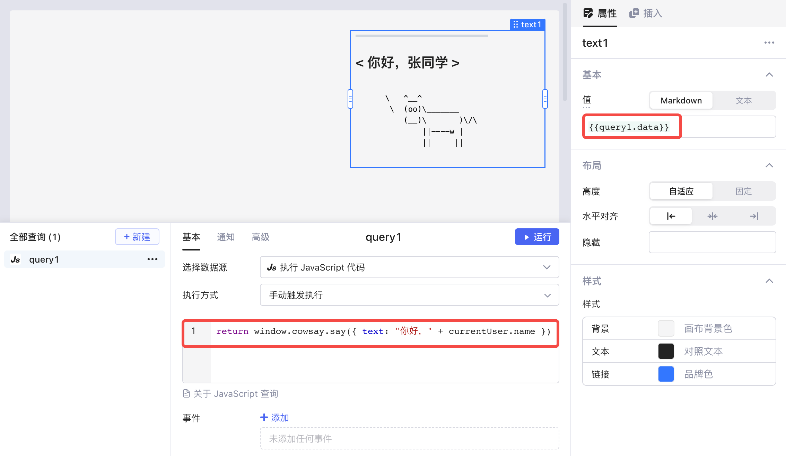
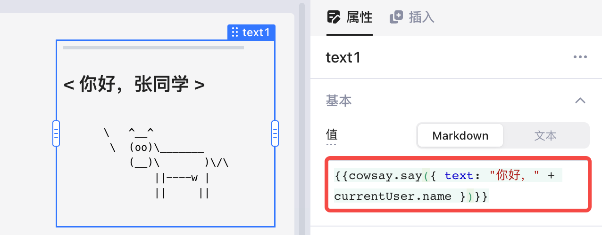
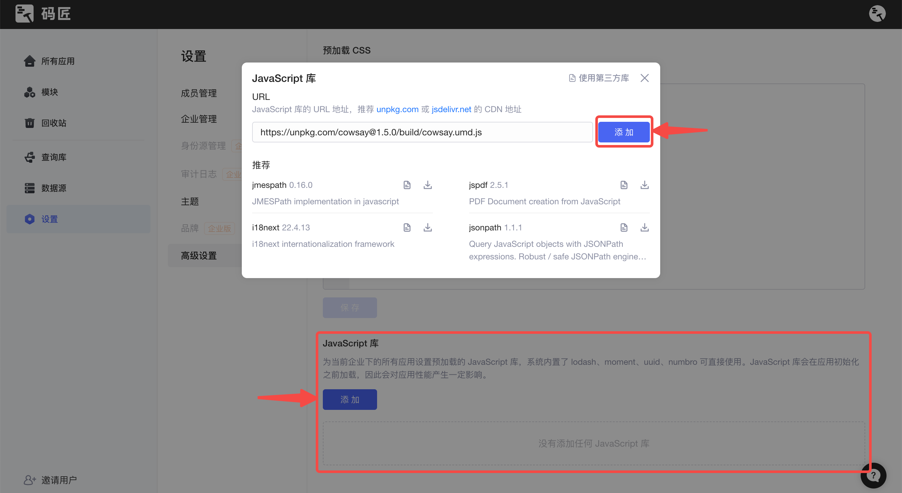

开发Lowcoder应用时，您可以直接使用Lowcoder内置的 JavaScript 库，从而提升开发效率；也可以通过 URL 地址添加 JS 库至单个应用或企业下所有应用，以满足不同的开发需求。

## Lowcoder内置 JS 库

Lowcoder内置的 JS 库如下表所示：

|**库名称**|**文档地址**|**版本号**|
| -----------| --| ---------------------------|
|lodash|[https://lodash.com/docs/](https://lodash.com/docs/)|4.17.21|
|moment|[https://momentjs.com/docs/](https://momentjs.com/docs/)|2.29.3|
|uuid|[https://github.com/uuidjs/uuid](https://github.com/uuidjs/uuid)|8.3.2（支持 v1/v3/v4/v5）|
|numbro|[https://numbrojs.com/format.html](https://numbrojs.com/format.html)|2.3.6|
|papaparse|[https://www.papaparse.com/docs](https://www.papaparse.com/docs)|5.3.2|

## 添加第三方 JS 库

Lowcoder支持您手动添加第三方 JS 库，以满足不同的开发需求。

* 您可以为**单个应用**添加 JS 库，这些库在其他应用中不能被调用。
* 您也可以为**当前企业下的所有应用**添加 JS 库。这些库会在所有应用初始化之前加载，会对应用性能产生一定影响。因此，当一些复杂的 JS 库不是所有应用都必需时，建议只为需要的应用单独添加。

> #### 💡 说明
>
> * 第三方库在浏览器环境中加载和运行；暂不支持仅运行于 Node.js 环境的库。
> * 第三方库的 URL 需要支持跨域。
> * 第三方库的导出必须直接设置在 window 对象上，类似 `var xxx = xxx`​ 的全局变量不生效。
> * 第三方库会在一个受限的沙箱中运行，以下全局变量无法使用：
>
>   * ​`parent`​
>   * ​`document`​
>   * ​`location`​
>   * ​`chrome`​
>   * ​`setTimeout`​
>   * ​`fetch`​
>   * ​`setInterval`​
>   * ​`clearInterval`​
>   * ​`setImmediate`​
>   * ​`XMLHttpRequest`​
>   * ​`importScripts`​
>   * ​`Navigator`​
>   * ​`MutationObserver`​

下面将以 [cowsay](https://github.com/piuccio/cowsay) 库为例，分别介绍两种情况下如何添加第三方 JS 库。库地址如下：

```plain
https://unpkg.com/cowsay@1.5.0/build/cowsay.umd.js
```

### 添加至单个应用

在应用编辑界面，点击左侧工具条的 `⚙️`​ 按钮进入应用设置；然后点击 **JavaScript 库**部分右上角的加号 `➕`​，在弹出窗口输入 cowsay 库的 URL 再点击**添加**按钮即可。您也可以点击下载图标，直接从推荐列表选择和安装第三方库。

​

新建一个 **JS查询**​，用 `cowsay.say()`​ 测试该库是否添加成功：

​

或者直接在文本组件的**属性**中调用：

​

### 添加至企业下所有应用

在Lowcoder主页面，点击**设置** > ​**高级设置**​；点击 **JavaScript 库**部分的**添加**按钮，然后在弹出窗口输入 cowsay 库的 URL 并点击**添加**即可。之后您可以在当前企业下的所有应用里调用 cowsay 库。

​