本文档介绍在Lowcoder中常用的数组方法。

## 常用操作

在Lowcoder中可以编写 JS 表达式操作数组，下面介绍常用的数组方法：

|**方法**|**描述**|**示例（使用文本组件，结果均转成 string）**|
| ------| ----------------------------------------------------------------| --------------------------------------------------------------------------------------|
|​`.length`​|返回数组的长度|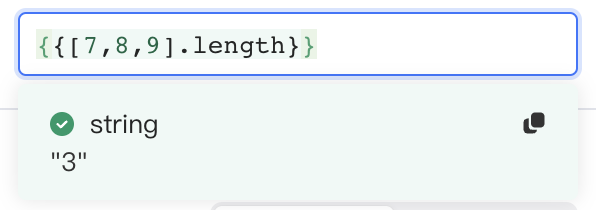​|
|​`.join`​|将数组中的元素组合成字符串，分隔符可以自定义(通常为空格)|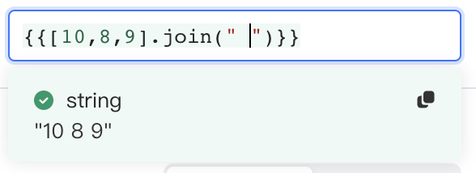​|
|​`.indexOf`​|返回数组中指定值第一次出现的索引|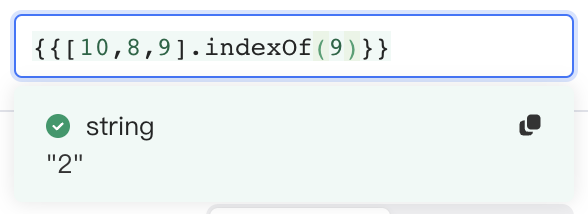​|
|​`.map`​|返回一个新数组，其中包含对原始数组的每个元素运行指定函数的结果|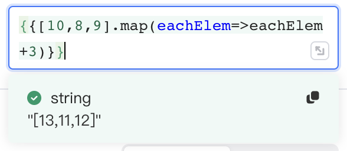​|
|​`.filter`​|返回一个新数组，其中包含原始数组中匹配指定条件的元素|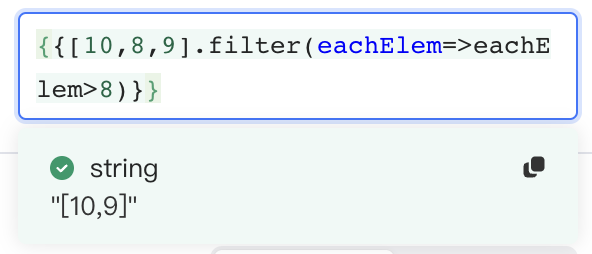​|
|​`.includes`​|如果数组包含传递给方法的值，则返回true或false|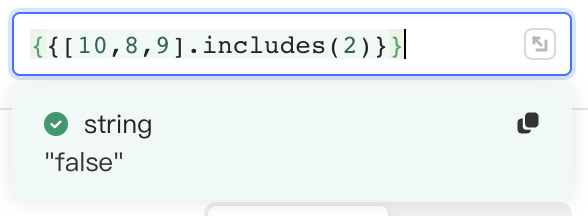​|
|​`.reduce`​|通过为数组的每个值（从左到右）运行函数，将数组缩减为单个数值|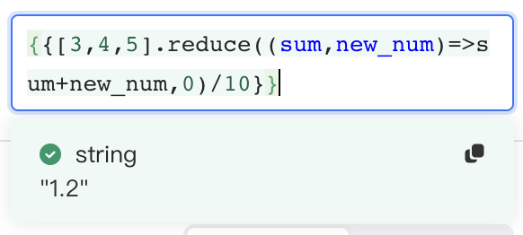​|
|​`.concat`​|合并 2 个或多个数组|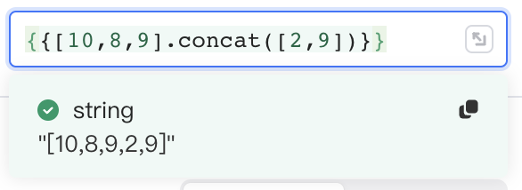​|

更多可参阅[ MDN 文档](https://developer.mozilla.org/zh-CN/docs/Web/JavaScript/Reference/Global_Objects/Array#%E5%B8%B8%E8%A7%81%E6%93%8D%E4%BD%9C)。

## 使用 Lodash 操作数组

Lowcoder默认装载了 Lodash。Lodash 是一个一致性、模块化、高性能的 JavaScript 实用工具库。下面给出一些使用 Lodash 库的方法操作数组的示例，若您想要了解更多操作，请参阅 [Lodash 文档](https://www.lodashjs.com/)。

|**方法**|**描述**|**示例（使用文本组件，结果均转成 string）**|
| ------| ----------------------------------------------------| ----------------------------------------------|
|​`_.head(array)`​|返回数组的第一个元素|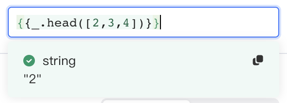​|
|​`_.last(array)`​|返回数组最后一个元素|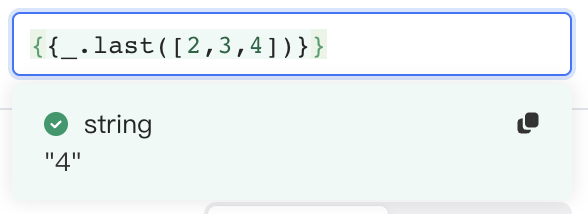​|
|​`_.nth(array, n)`​|获取第 n 个元素，n 可以为负数|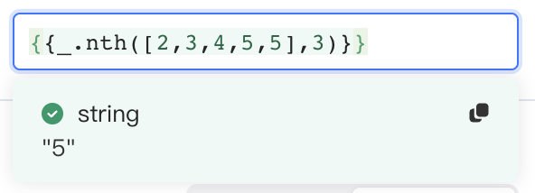​|
|​`_.chunk(array, size)`​|将数组拆分成多个长度为`size`​的小数组，小数组构成新数组|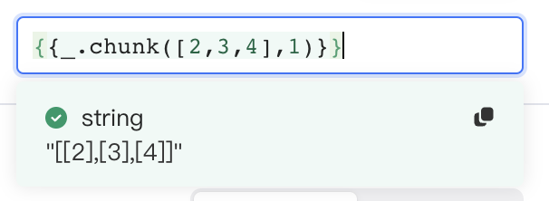​|
|​`_.uniq(array)`​|去重数组|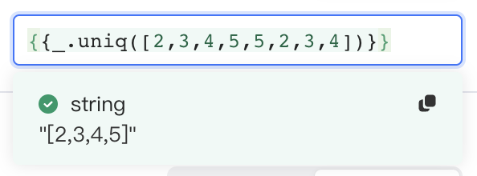​|
|​`_.initial(array)`​|删除数组最后一个元素|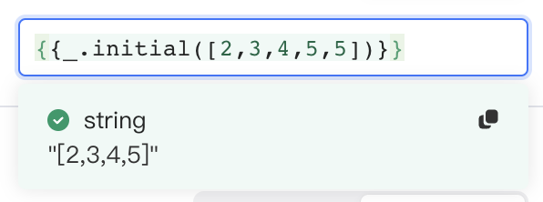​|
|​`_.pull(array, [values])`​|移除数组`array`​中所有和`[values]`​相等的元素|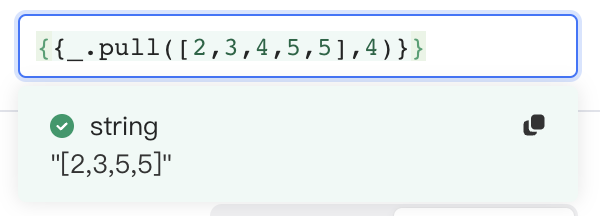​|
|​`_.tail(array)`​|删除数组第一个元素|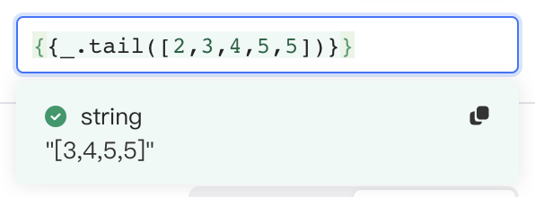​|