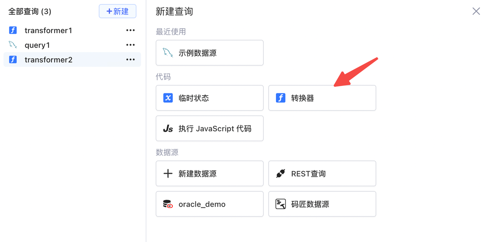
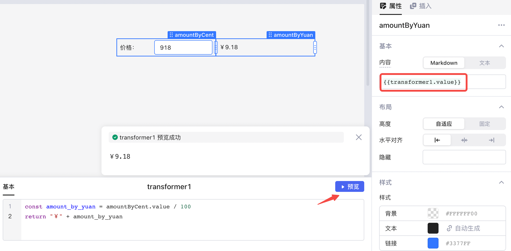
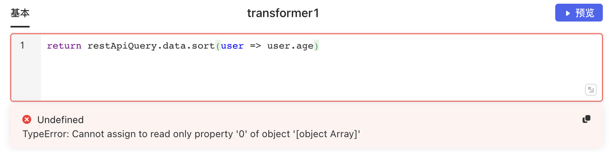
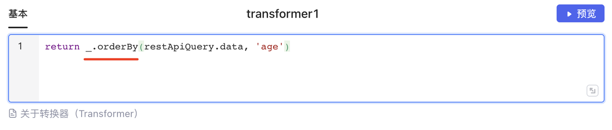

转换器 (Transformer)

转换器 (Transformer) 支持编写多行 JavaScript 代码，帮助我们实现查询/组件/临时状态等数据的转换以及方法的复用。与 [JavaScript 表达式](../javascript-in-lowcoder/writing-javascript.md)​`{{ }}`​ 不同，转换器支持多行 JS 代码。与 [JavaScript 查询](../javascript-in-lowcoder/javascript-query.md)不同，转换器中只支持只读操作，不能修改引用数据的值或者触发查询等。此外，转换器依赖的数据变化时，它的值将​**自动更新**​。

## 快速上手

点击查询编辑器面板的​**新建-&gt;转换器**​：

​

新建之后可以编写 JS 语句，点击**预览**可以预览代码运算的结果，最后的返回值将成为转换器的值 (`transformer1.value`​)，可以在应用内被引用：

​

> #### 💡 说明
>
> 查询/组件或者全局状态中的数据，如：`input1.valuequery1.datastate1.value`​ 等，在转换器中时可以直接引用，**无需加**​`{{ }}`​。

## 数据只读

转换器中不能修改查询/组件/临时状态的值，也不能触发查询等，如需上述功能可以编写 [JS 查询](javascript-query.md)。

如下所示，transformer1 希望将 restApiQuery 的数据按照 age 字段排序并返回，因为 sort 方法会修改原始数据 `restApiQuery.data`​，所以报错。

​

此处可以使用 [lodash](../javascript-in-lowcoder/using-array.md#%E4%BD%BF%E7%94%A8lodash%E6%93%8D%E4%BD%9C%E6%95%B0%E7%BB%84) 的 `_.orderBy()`​ 方法：

​

## 使用举例

### 编写注释

​`//`​ 后编写注释：

```javascript
//返回用户姓名
return currentUser.name
```

### 返回数据

要从转换器返回数据，请使用`return`​ 语句：

```javascript
const val = input1.value
return val * 5
```

### 转化时间戳格式

将查询返回的数据 `query1.data`​ 时间列 `start_time`​ 的时间戳，利用 `moment().format()`​ 函数转换为 `YYYY-MM-DD`​ 格式：

```javascript
return query1.data.map(it => {
    return {
        ...it,
        start_time: moment(it.start_time).format('YYYY-MM-DD')
    };
})
```

### 使用查询数据

#### 对查询数据做运算

要对查询得到的对象数组中的部分数据做运算，可以使用 `map()`​ 函数。如下，对查询返回的对象数组的 `price`​ 列所有数据做 +5 运算：

```javascript
const data = query1.data
return data.map(x => x.price + 5)
```

#### 对 API 查询结果排序

使用 `._orderBy()`​ 函数可以对数据进行排序，下面代码可以将 `query4`​ 的数据按照 `amount`​ 列的升序返回：

```javascript
return _.orderBy(query4.data, 'amount', 'asc')
```

#### 合并查询数据

使用转换器可以将多个查询的结果合并到一个表格中，可以使用 `_.zipWith()`​ 函数：

```javascript
var sqlData = query1.data;
var apiData = query2.data;

return _.zipWith(
    sqlData,
    apiData,
    (sql, api) => Object.assign({}, api, sql)
)
```