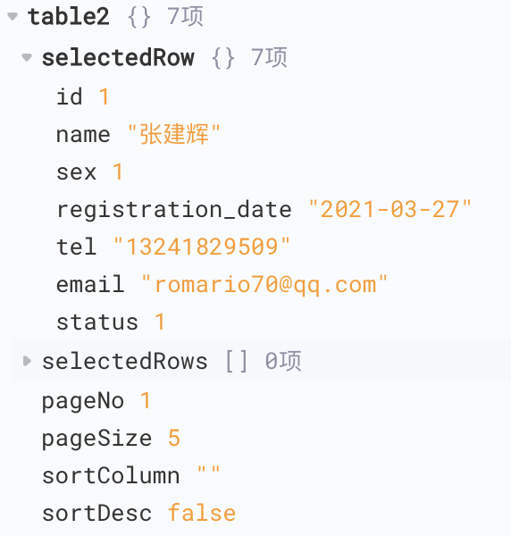
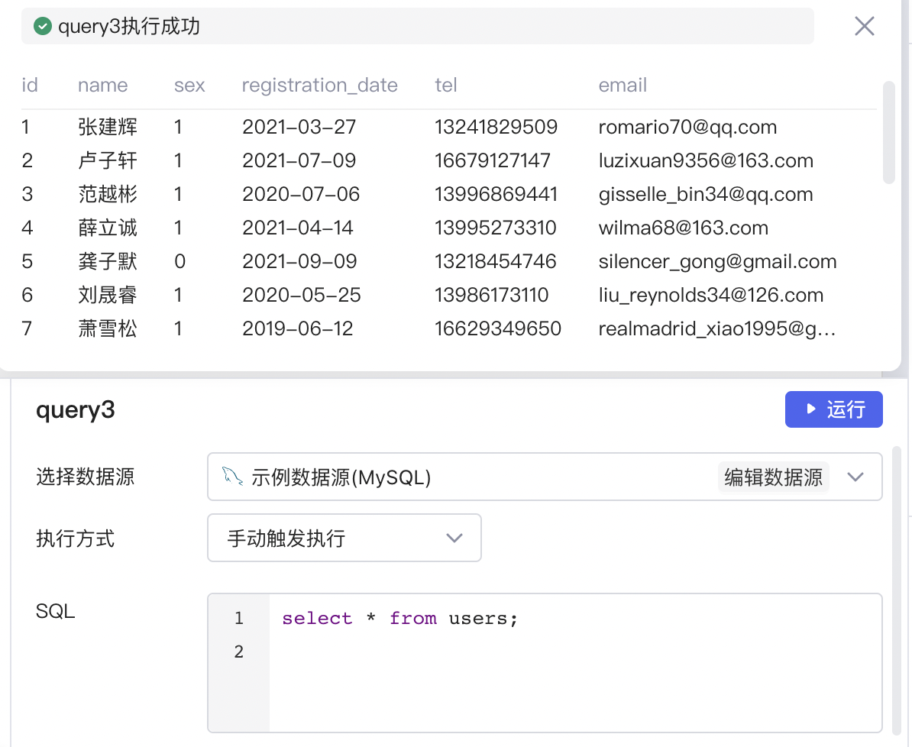
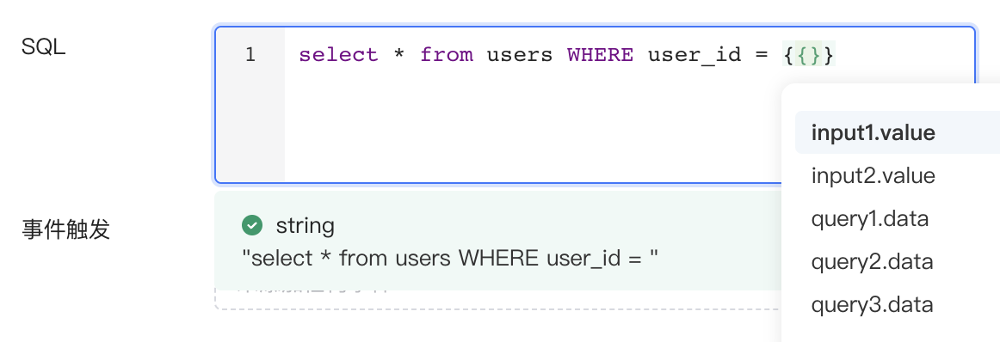
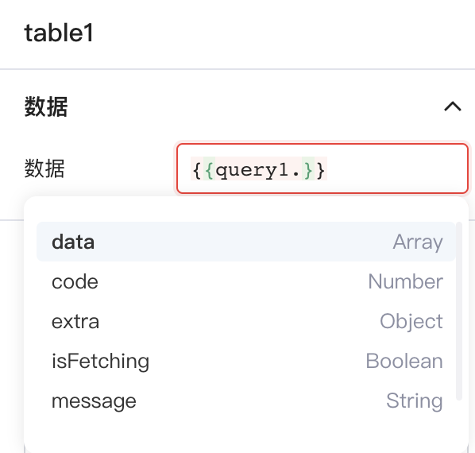
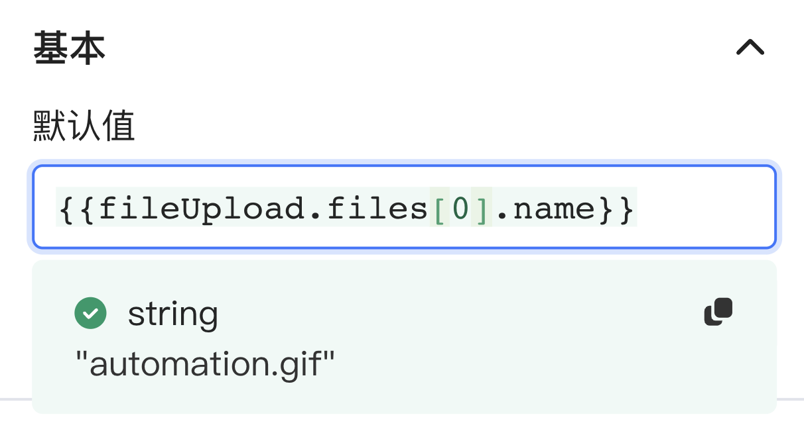
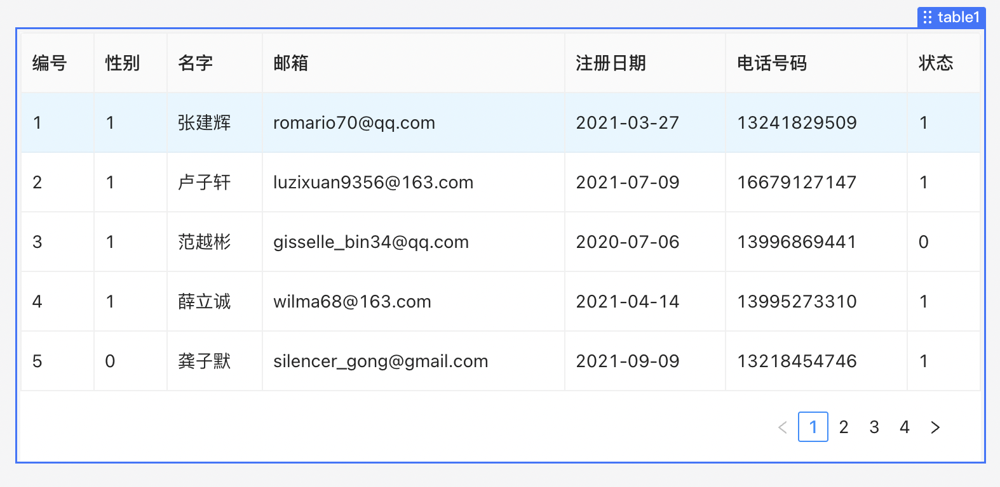
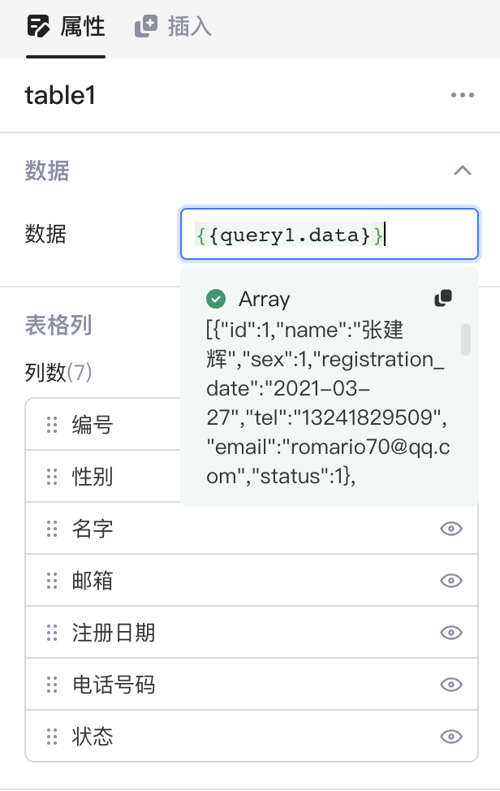
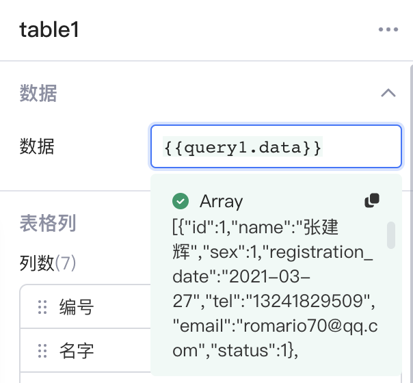

当在Lowcoder中构建应用程序时，您可以通过在 `{{ }}`​ 中编写自定义的 JavaScript 表达式来访问、操作页面上所有可用的数据，以及全局变量。

## 访问数据

在Lowcoder中，任何在 `{{ }}`​ 中的内容都会被解析成 JavaScript 表达式，您可以使用其获取 UI 组件暴露的字段、获取查询的状态与结果、访问全局变量，等等。在一个应用内，组件、查询、全局变量等都有全局唯一名称，如 `input1`​、`query1`​ 和 `table1`​（您也可以自定义其名称）。您可以通过它们的名字，在应用内任何地方访问它们所暴露的数据，如 `{{input1.value}}{{query1.data}}`​，您还可以通过表达式 `{{table1.selectedRow.userName}}`​ 访问表格 `table1`​ 当前选中行的 `userName`​ 信息，当 `table1`​ 选中行发生变化时，表达式所对应的值也就相应发生变化。

​

您可以获取和使用任何所创建查询相关联的数据。如下图，在查询编辑器区创建了一个查询 `query3`​，然后点击**运行**按钮，运行成功后，查询返回的结果数据会在查询编辑器区上方进行预览，也可以在左侧面板的查询列表中看到同样的结果。

​

### 访问对象中的数据

在Lowcoder中，组件、查询和全局变量等都是对象，针对这些对象它们都有内置方法或者属性，当编写 Javascript 表达式时，如果您在对象名后添加一个 `.`​，会触发弹出一个自动推荐填充 (autosuggest) 菜单或称为自动补全 (autocomplete) 菜单，提示该对象的方法或者属性，可以通过上下键进行选择。

​

​

### 访问数组中的数据

数组中的值用目标的索引来访问。索引总是从 0 开始，因此可以使用 `array[0]`​ 访问数组的第一个元素。例如：

​

## 操作数据

您可以在 `{{ }}`​ 中，使用 JavaScript 语法以及第三方库，对组件、查询对外暴露的数据进行各种抽取和转换操作。 假设想让字符串小写，表达式可写作：`{{input1.value.toLowerCase()}}`​；对一个值加 10，表达式可写作： `{{input1.value + 10 }}`​；让日期按照您想要的格式呈现，表达式可写作:`{{moment(table1.selectedRow.date_column).format('YYYY-MM-DD')}}`​；您甚至可以实现更复杂的操作，比如，对数组对象建立一个映射，并返回其中的一个键值，表达式则可写作：`{{query1.data.map(i => i.name)}}`​。 组件可以绑定数据并随着数据计算结果变化同步更新。例如，拖拽一个 `table1`​ 组件到画布上，选中组件，在右边的属性面板中绑定组件的数据为 `query1.data`​，则 `table1`​ 组件中会自动填充 JavaScript 表达式获取的数据。

​

​

### `{{ }}`​ 中编写 JavaScript 的限制

在Lowcoder中使用 `{{ }}`​ 书写 JavaScript 需要满足一定的语法规范，其支持的代码具体如下：

单行的代码/函数，例如：map/reduce 结合箭头函数、三目运算符，等等。

```javascript
{{query1.data.id.length}} // ✅ 单行值引用

{{query1.data.map(row => row.id)}} // ✅ map+箭头函数

{{ num1 > num2 ? num1 : num2 }} // ✅ 三目运算符
```

下面这些写法是不合法的 `{{ }}`​ 表达式写法，您可以创建[转换器](../javascript-in-lowcoder/using-transformer.md)来编写如下的多行代码：

```javascript
{{ 
    const array = query1.data;
    const filterArray = array.filter(it => it.value > 10);
    return filterArray; // ❌
}}
```

```javascript
{{ 
    if (select.value === "1") {  
        return "Option 1";
    }
    if (select.value === "2") {
        return "Option 2";
    }
    return "Option 3"; // ❌
}}
```

## 查看数据

对于 JavaScript 表达式，您会关注它的输入与输出值以及它们的展示，在Lowcoder中您可以轻松地查看这些数据。可以根据需求以 3 种主要的方式在Lowcoder中查看数据：查询结果预览（下方面板）、数据浏览器面板（左侧面板）查看和实时值预览（输入框下方面板）。

||**查询结果预览**|**数据浏览器查看**|**实时值预览**|
| --| ---------------------------------------------| ---------------------------------------------| ------------------------------------------------|
|**形式**|表格|结构化 JSON 展示|JSON String|
|**是否展示数据类型**|否|是|是|
|**位置**|查询运行成功后，展示在查询编辑器区上方|数据浏览器（左侧面板）|输入 JavaScript 表达式后，实时展示在输入框下方|
|**示例**|​|​|​|