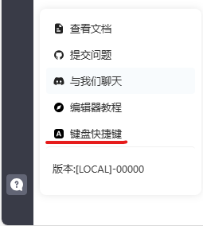
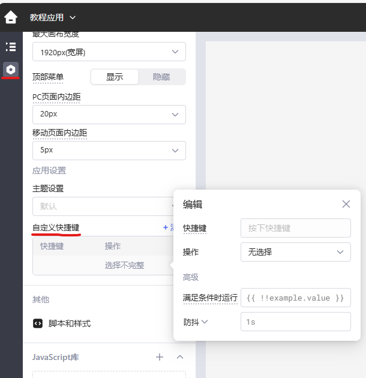

## 内置快捷键

Lowcoder 提供内置键盘快捷键，帮助您更快、更高效地在界面上工作，并提高控制精度。点击左下角**帮助 > 键盘快捷键** 可查看。

### 全局

Lowcoder界面上的全局键盘快捷键。

| 快捷键 | 描述                    |
| ------ | ----------------------- |
| `?`    | 显示/隐藏快捷键提示窗口 |

### 应用编辑器

在**应用编辑器**中的快捷键（windows下⌘代表Ctrl）.

| 快捷键        | 描述         |
| ------------- | ------------ |
| `⌘` + `B`     | 切换左侧面板 |
| `⌘` + `J`     | 切换底部面板 |
| `⌘` + `U`     | 切换右侧面板 |
| `⌘` + `.`     | 切换全部面板 |
| `⌘` + ⇧ + `P` | 预览         |
| `⌘` + `Z`     | 撤销         |
| `⌘` + ⇧ + `Z` | 重做         |
| `⌘`           | 显示网格     |

### 组件

组件的快捷键.

| Shortcut              | Description |
| --------------------- | ----------- |
| `⌘` + Click           | 多选        |
| `⌘` + `A`             | 全选        |
| `⌘` + `C`             | 复制        |
| `⌘` + `X`             | 剪切        |
| `⌘` + `V`             | 粘贴        |
| `←` `↑` `→` `↓`       | 移动        |
| `⌘` + `←` `↑` `→` `↓` | 调整大小    |
| `DEL`/`Backspace`     | 删除        |
| `ESC`                 | 取消选择    |

### 查询

查询编辑器的快捷键.

| 快捷键    | 描述         |
| --------- | ------------ |
| `⌘` + `↵` | 运行当前查询 |

### 文本

文本编辑时快捷键.

| 快捷键      | 描述           |
| ----------- | -------------- |
| `⌘` + `L`   | 格式化文本     |
| `⌘` + Click | 在左侧面板选中 |

## 自定义快捷键

您可以在应用程序级别定义自定义键盘快捷键。 点击左侧栏 ⚙️>**自定义快捷键**。单击 **+添加** 为特定操作添加新的快捷方式，也可以单击三个点 `...` 将其删除。

Lowcoder键盘快捷键的设置最好避免与浏览器的键盘快捷键发生冲突，以防无法成功触发。