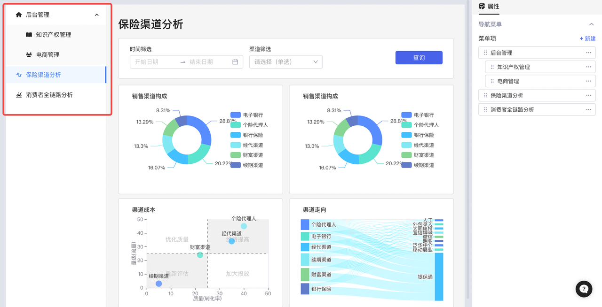
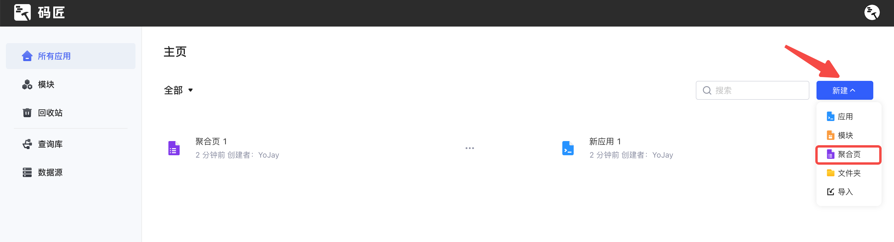
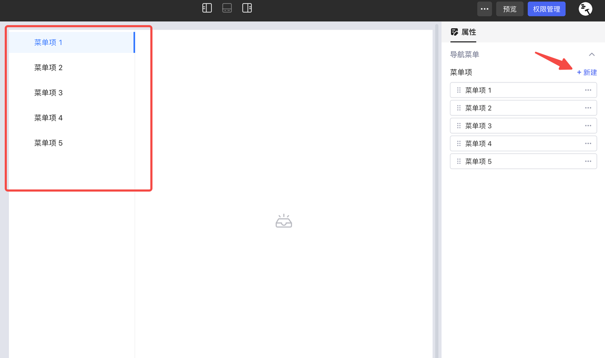
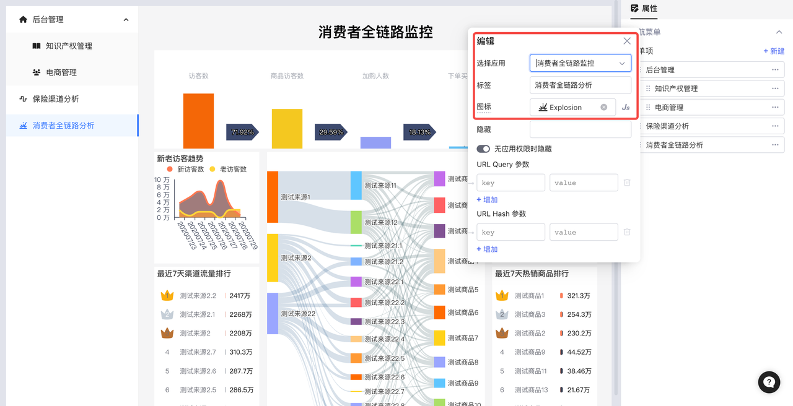
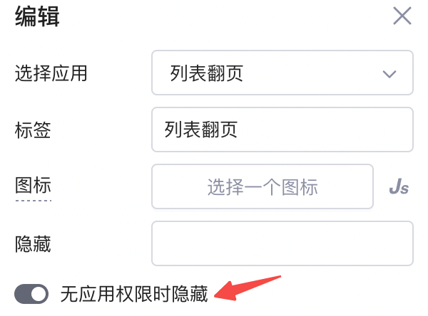
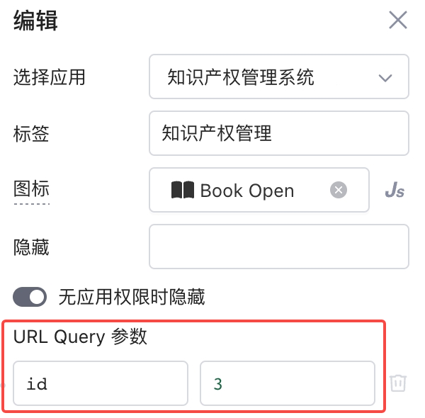
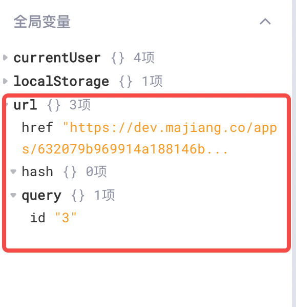
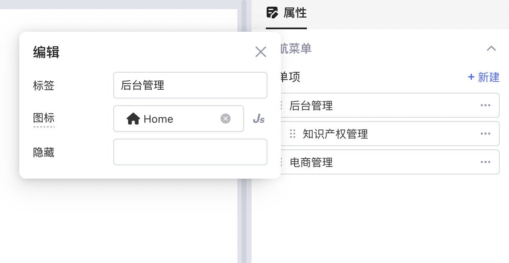
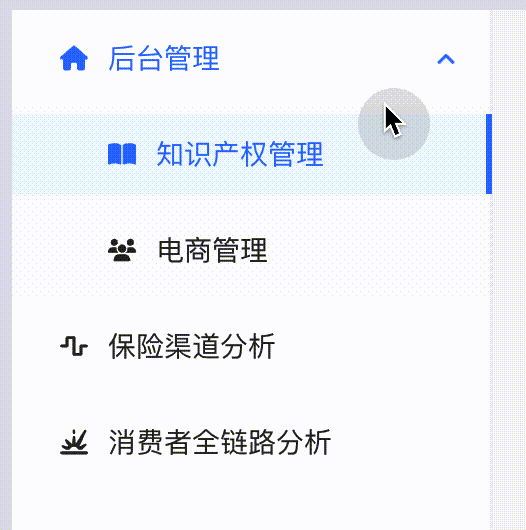

聚合页功能通过左侧导航栏的形式链接多个单页面应用，从而实现多页面的有机整合。

## 创建聚合页

管理员和开发者可以在Lowcoder主页的右上角点击**新建** -> **聚合页**创建聚合页：

## 配置菜单项

**点击创建**后，进入聚合页应用编辑界面，在这里，您可以**新建**菜单项：

单击菜单项，可以为其配置访问的应用页面、标签文案、图标等，画布区域会实时展示当前选择的应用页面：

### 权限

**无应用权限时隐藏**开关默认是打开状态：即用户进入聚合页应用时，对于该用户没有查看权限的应用，其菜单项会自动隐藏。若关闭开关，用户能看到相应菜单项，但无法查看应用。

### URL 参数

您可以在配置应用页面的时候，为其添加 URL 参数（URL 参数详情请参阅[事件-打开应用页面](event-handlers.md#打开应用页面)文档）：

完成后，再次点击该菜单项，参数会追加到该页面 URL 后面，并且可以在**全局变量**中查看该聚合页 URL 的数据：

该参数可以在页面内以 `{{url.query.key1}}` 或者 `{{url.hash.key1}}`的形式被引用，但需回到该页面应用内进行引用。

## 二级目录

您还可以点击 `⋮⋮` 向斜上方拖动菜单项使其成为二级目录，折叠到一级菜单项下面：

需要注意的是， **当菜单项成为父目录后，其不能再配置应用页面** ，例如这里的**后台管理**页面，只能配置其子目录的应用页面，父目录则负责展开或者折叠二级目录。

