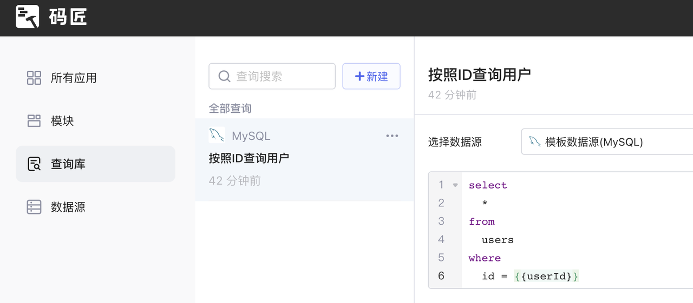
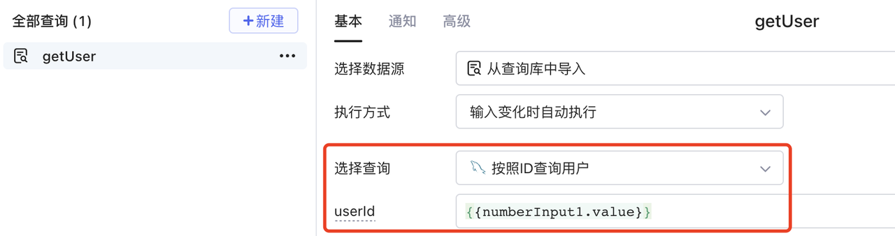
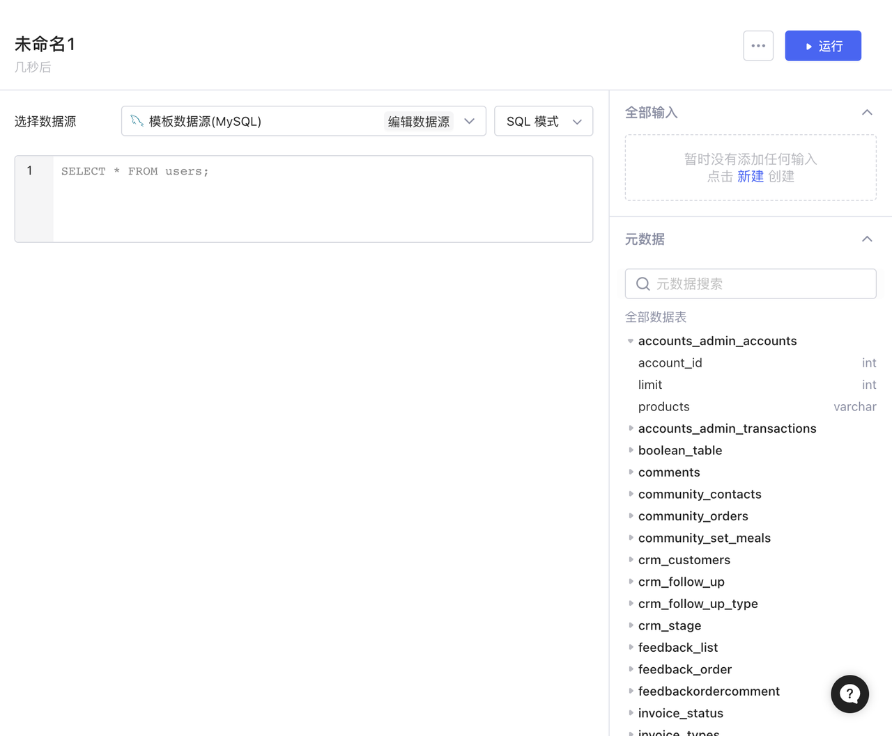
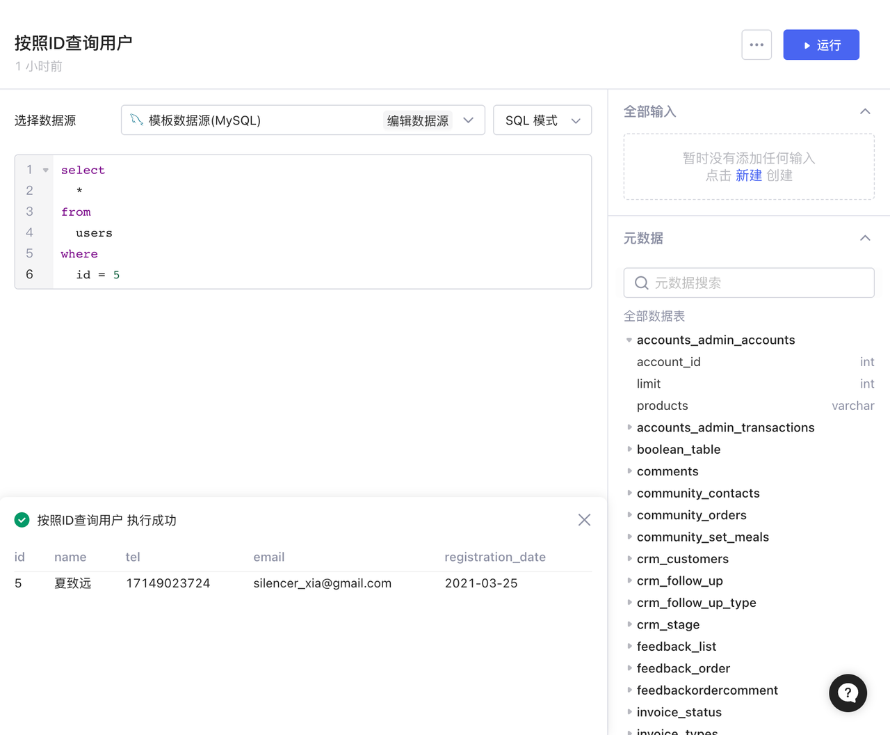
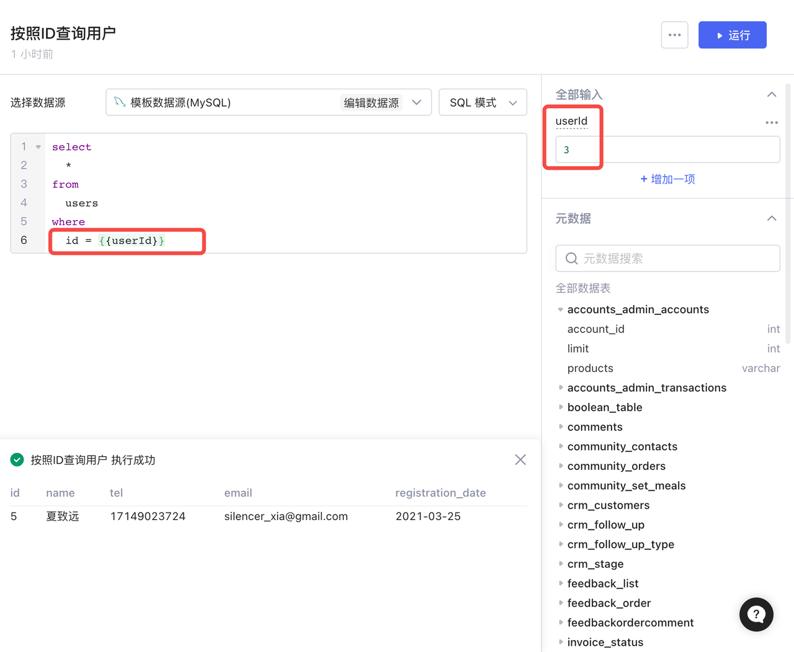
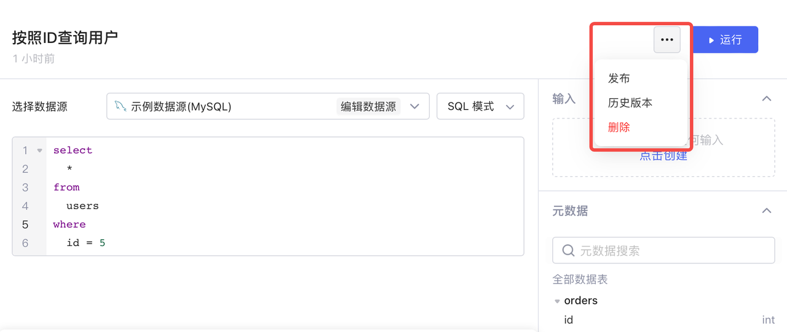
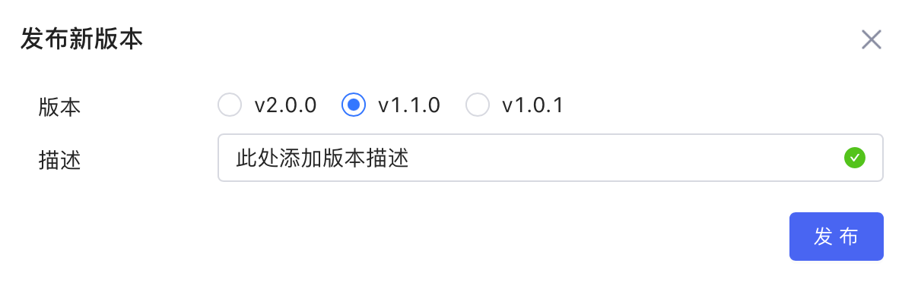
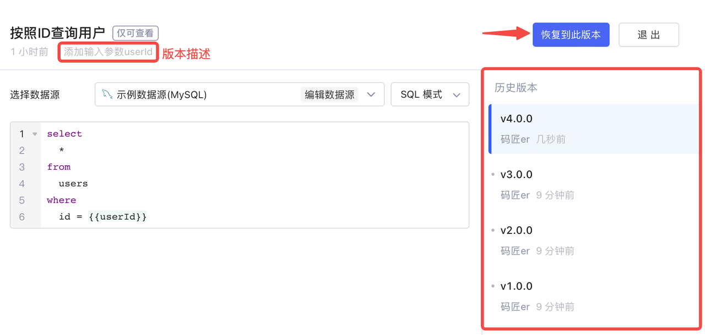
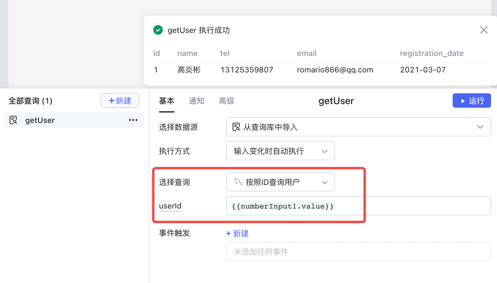
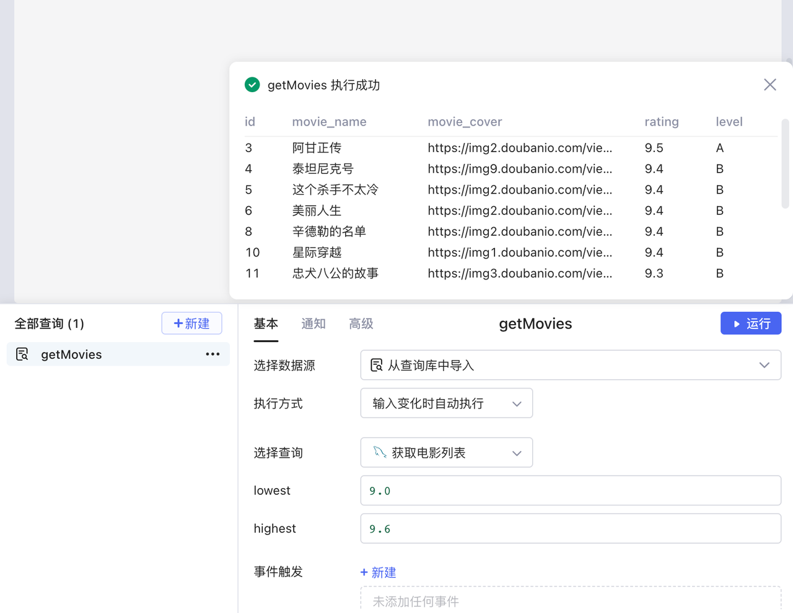

查询库为您提供了复用查询的能力。查询库内的查询可以在企业内共享，您可以在查询库中创建、运行查询，然后在编辑任何Lowcoder应用时引用。

## 功能

查询库支持：

* 基于数据源编写查询

​

* 查询创建后，可以在开发应用时被引用，引用的为该查询的最新编辑态
* 为查询定义输入参数，当查询被引用时需传入

​

## 创建查询

1. 点击​**新建**​，然后选择数据源：

​

2. 可以为查询重命名，编写查询后，点击**运行**可以获取查询结果，查询结果展示在下方：

​

3. 为了让上层应用可以传递参数到查询中，可以通过右上角为该查询​**新建输入**​。在查询中利用 `{{}}`​ 引用输入，之后可以在输入设置框中填写数据用于测试：

​

> #### 💡 说明
>
> {{ }} 中暂时只能用于引用输入，暂不支持 JavaScript 表达式。

## 版本管理

您或许需要在查询库中更新某一查询，例如为该查询添加输入参数、修改查询语句等，但同时也希望保留原有版本，以备复用，这可以通过查询库的版本管理实现。点击右上角的`···`​，通过**发布**和**历史记录**功能，您可以将查询发布为多种版本，以及浏览和恢复到历史版本。

​

### 发布

查询编辑完成后，可选择发布为新版本。在查询库界面，点击右上角 `···`​ -> ​**发布**​。Lowcoder采用[语义化版本控制规范](https://semver.org/lang/zh-CN/)，您可选择合适的版本号命名，并添加版本描述。

​

### 历史版本

在查询库中，还可以浏览查询的历史版本记录，并恢复到某一版本。

点击右上角的`···`​，选择​**历史版本**​，进入历史版本界面。选择历史版本列表中的某个版本，可查看该版本详情，包括查询内容和版本描述；接着点击上方的**恢复到此版本**按钮，即可将当前草稿恢复至所选版本。点击**退出**回到查询库编辑界面。

​

## 导入查询

1. 应用开发界面中，选择 **新建-&gt;从查询库中导入：**

​

2. 选择所需要的查询：

​

### 输入参数

下面的查询，创建了两个输入：`lowest`​ 和 `highest`​，调用该查询时，可以为输入传入数据后运行。

```sql
select * from movie_list where rating > {{lowest}} and rating < {{highest}}
```

​

## 权限

企业管理员/开发者群组成员可以访问查询库，拥有对库内所有查询的读/写权限。