快速上手搭建第一个应用

本文档适用于初次使用Lowcoder的新手。通过搭建一个简单的用户订单系统（如下图所示），快速了解Lowcoder的主要组件及功能，熟悉Lowcoder应用搭建流程。

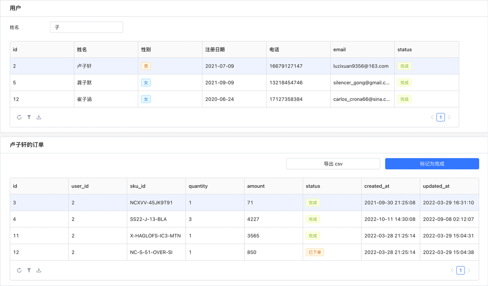​

## 准备开始

注册与登录后，您将进入Lowcoder的主页面，在这里创建和管理企业的应用。Lowcoder会为您预先创建一个示例应用，方便您快速体验Lowcoder各项基础功能。

这里选择​**新建一个应用**​：

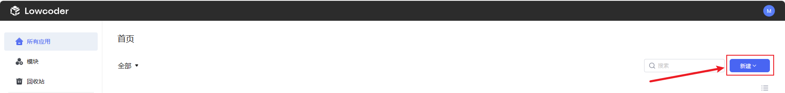​

## 使用组件

进入[编辑页面](editor-interface.md)后，使用组件以搭建应用。

1. 在页面右侧，Lowcoder为您提供了一系列功能丰富的组件。这里选择常用组件中的**文本**组件，并拖拽到页面中央的画布上。
2. 点击位于画布上的组件，右侧将自动展示该组件的属性，用于输入​**内容**​、调整**样式**等。
3. 使用 Markdown 语法输入一个标题 `### 用户表`​；当内容被修改时，画布会自动、即时地更新。

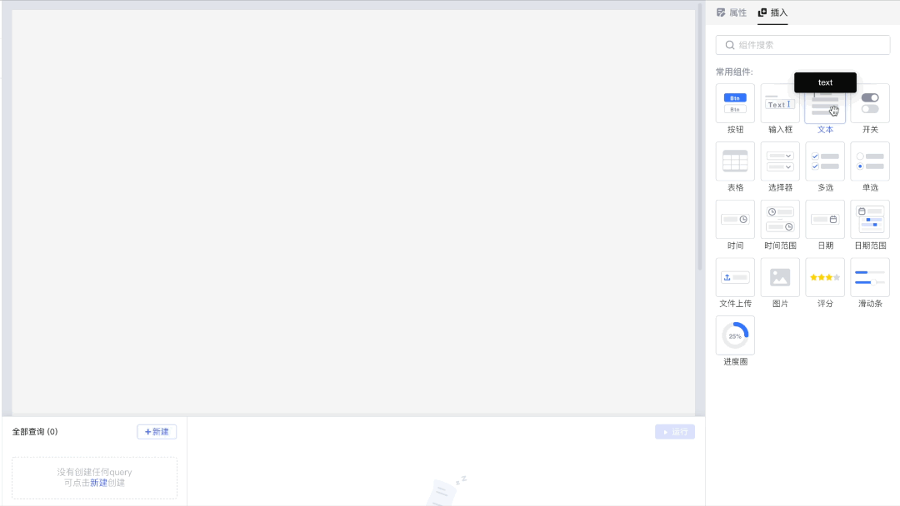​

## 构建查询

连接 SQL 类数据源，编写 SQL 查询语句以[构建查询](how-to-write-query.md)。

1. 在页面下方的查询编辑器中，可以编写 MySQL、PostgreSQL、MongoDB、REST API 等多种数据源的查询语句。Lowcoder为您预先创建了​**示例数据源**​，并填充了一些演示数据；此外，您可以[新建数据源](datasource.md)并基于其创建查询，也可以在编辑器中的**选择数据源**下拉菜单中切换数据源。
2. 使用 MySQL 示例数据源**新建**一个查询，并改名 `getUsers`​：

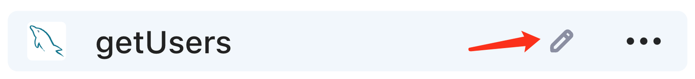​

3. 在 SQL 编辑框中输入查询语句：`select * from users`​，点击​**运行**​，编辑器右上方将显示执行结果。

​

## 展示查询结果

将[表格组件](component-guides/using-table.md)的数据属性与查询结果绑定，展示返回的内容。

1. 插入一个**表格**组件 `table1`​ 并置于文本组件**用户表**下方，表格默认包含了一些预填充的数据。
2. 为了展示上述查询结果，需要将表格的**数据**属性与 `{{getUsers.data}}`​ 进行绑定。这里表格自动绑定了刚刚执行的 `getUsers`​ 的结果，后续 `{{getUsers.data}}`​ 发生变化时，表格中展示的内容也会同步更新。

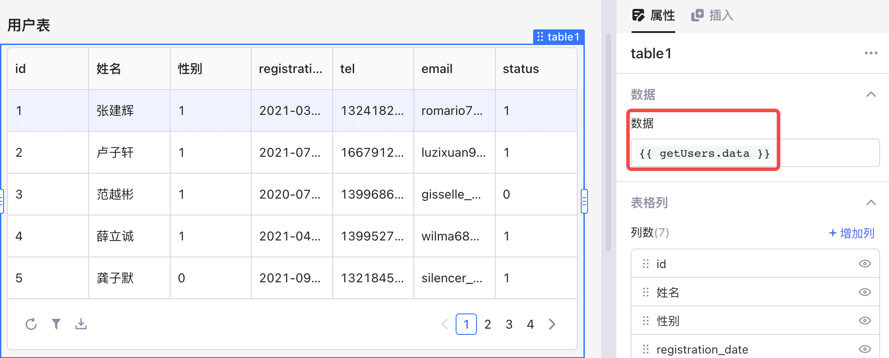​

```sql
-- Lowcoder使用 {{ }} 语法标记 JavaScript 表达式并自动计算对应的值，比如对于下方的 SQL：
select * from products 
where price_in_fen > {{ input1.value * 100 }} and price_in_fen < {{ input2.value * 100 }}
-- 当 input1.value 为 10，input2.value 为 50 时，Lowcoder编辑器会分别解析出两个变量 {{ input1.value * 100 }} 与 {{ input2.value * 100 }} ，并求出对应的值：1000 与 5000。
```

3. 在**表格列**属性中，可以修改列的标题、类型、可见性、顺序等；可以通过拖拽的方式调整列的顺序。为了使表格更加友好可读，这里可以将所有列标题修改为中文。对于​**性别**​、**状态**两列，可以通过 JavaScript 中的条件运算符「? :」将数值映射为字符串，并将列类型修改为​**标签**​。

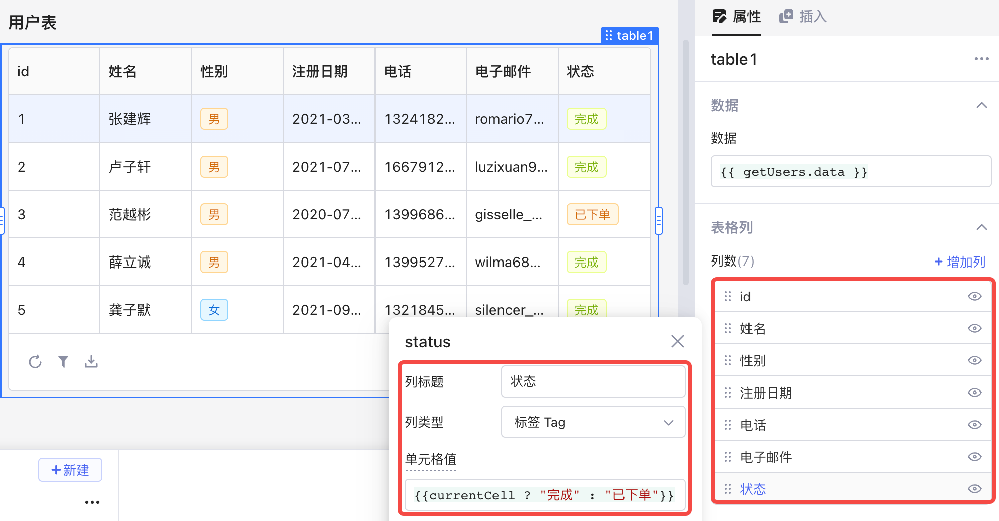​

## 搜索用户数据

结合输入框组件的值调整 SQL 语句，实现搜索功能。

1. 表格数据较多时，搜索功能可以更快定位数据。这里插入一个**输入框**组件 `input1`​，拖拽到表格上方，并修改**标签文本**为「姓名」。

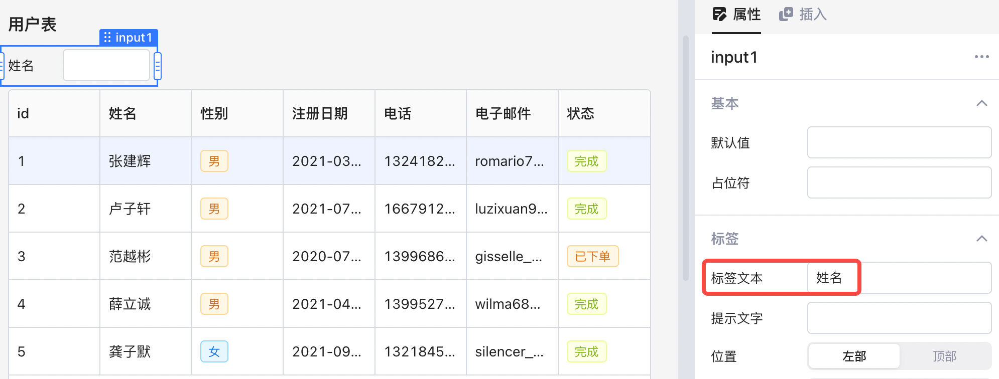​

2. 将已构建查询 `getUsers`​ 的 SQL 语句进行改写：

```sql
select * from users
where name like {{'%' + input1.value + '%'}}

-- Lowcoder默认针对 {{ }} 中的值开启预编译语句 (PreparedStatement)，因此写成 {{'%' + input1.value + '%'}}
-- 预编译语句模式下不能写成 '%{{ input1.value}}%'
```

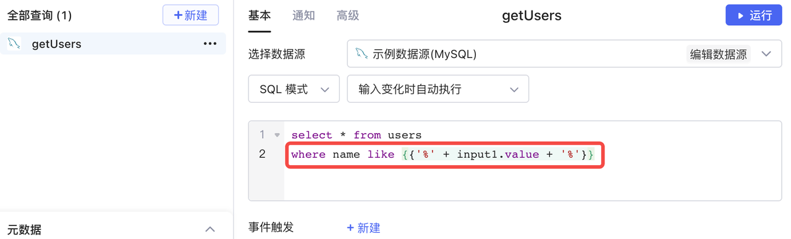​

3. 改写后的 SQL 语句引用了 `input1.value`​，即 `input1`​ 的值 ，并结合 MySQL 通配符实现了按照输入的关键字进行模糊搜索的功能。这里试着搜索「子」，可以看到对应的查询结果。

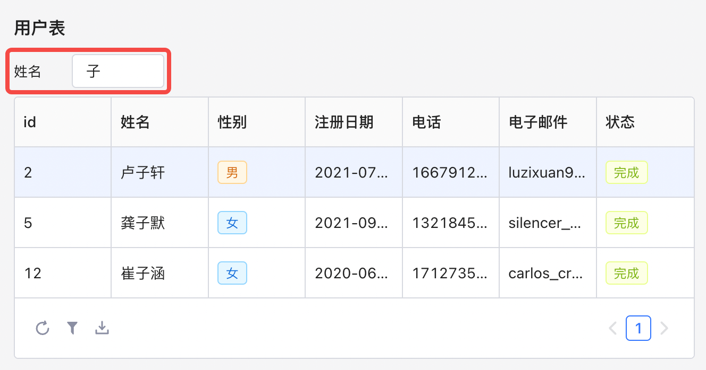​

## 获取用户订单

用表格组件的属性构建新的查询，获取选中用户的所有订单。

1. 新建一个 MySQL 查询 `getUserOrders`​，并输入 SQL 查询语句：

```sql
select * from orders
where user_id = {{table1.selectedRow.id}}
```

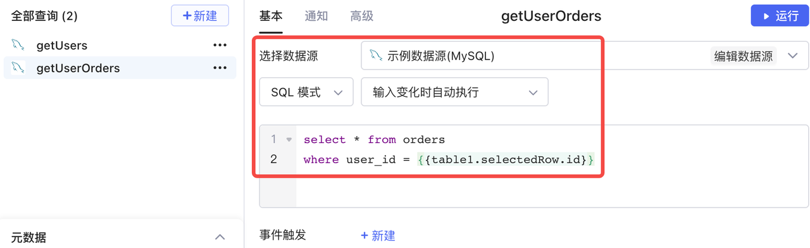​

> #### 💡 说明
>
> 对于多行 SQL 语句，可以使用 **CMD + L** (macOS)、**CTRL + L** (Windows/Linux) 进行格式化。更多快捷键，可点击屏幕右下角问号查看。

2. 表格组件的 **selectedRow** 属性表示当前选中的行。`getUserOrders`​ 能从表 orders 中获取 `table1`​ 当前选中行所对应的用户的所有订单。这里插入一个表格组件 `table2`​，并将数据字段与 `{{getUserOrders.data}}`​ 绑定。此时，选中 `table1`​ 中的任意一行，`table2`​ 将随之更新，展示所选用户的所有订单。

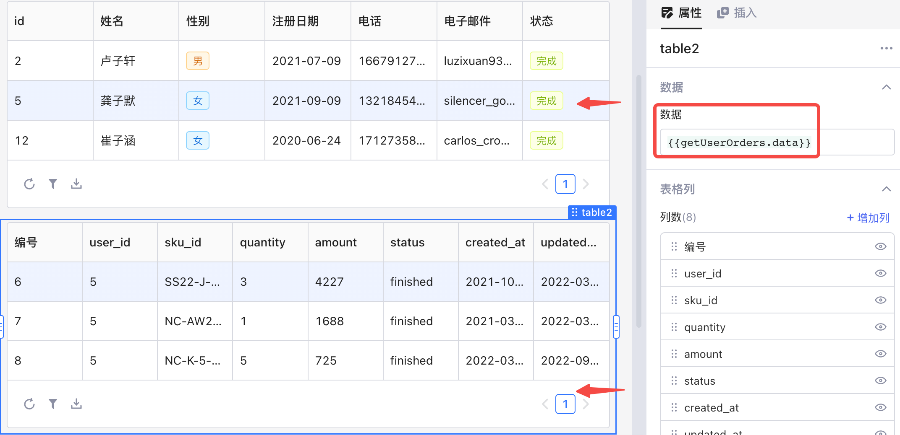​

3. 为了明确展示是谁的订单，这里可以插入一个​**容器**​，将 `table2`​ 拖入容器内，并将容器标题的内容修改为 `### {{table1.selectedRow.name}}的订单`​。此时，若选中 `table1`​ 中「龚子默」这一行，容器的标题就会随之更新为「龚子默的订单」。

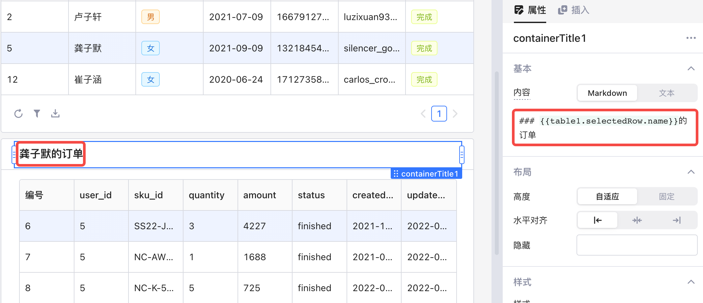​

## 更新订单状态

构建新的查询修改表格内容，更新订单状态。

1. 同样为了提高可读性，修改 **status** 列的单元格值为 `{{currentCell == 'finished' ? '完成' : '已下单'}}`​，将数据映射为文本，再把列类型设为标签。可以看到，表格中某些订单的状态是​**已下单**​，需要增加更新订单状态为**完成**的功能。这里插入一个**按钮**组件 `button1`​，拖拽到表格组件 `table2`​ 上方，并修改**文本**为「标记为完成」。

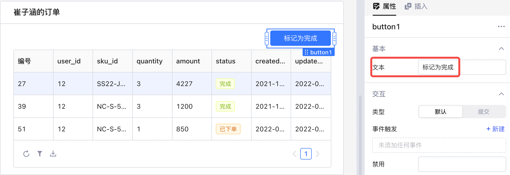​

2. 新建一个查询 `updateOrderStatus`​，输入以下 SQL 更新语句，此时系统会自动将该查询的触发方式调整为​**手动触发执行**​（该 SQL 语句为写请求，对于写请求，触发方式默认为手动触发执行，可以参阅[使用 SQL](using-sql.md) 文档）：

```sql
update orders
set status = 'finished'
where id = {{table2.selectedRow.id}}
```

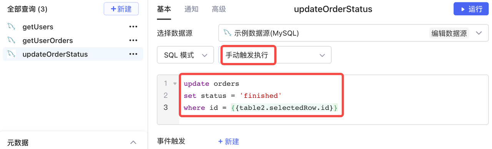​

3. 更新语句 `updateOrderStatus`​ 执行成功后，当前用户的订单表也要随之更新，所以还需要绑定成功后的回调事件。这里为 `updateOrderStatus`​ 新建一个[事件触发](event-handler.md)，选择成功后执行查询 `getUserOrders`​。

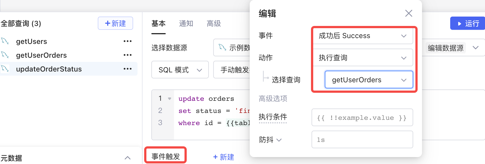​

4. 最后，为按钮组件 `button1`​ 新建一个​**事件触发**​，选择**执行查询**​`updateOrderStatus`​。此时，若选中表格中的一行订单，单击**标记为完成**按钮，订单的状态就会更新为「完成」。

​

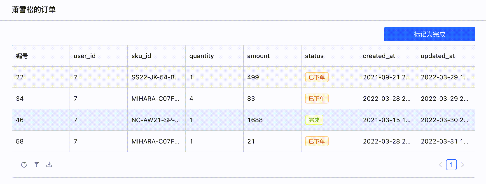​

## 预览与发布

至此，一个用户订单系统已经搭建完成，点击右上角​**预览**​，您可以看到用户实际使用时的效果，用户可以查询、搜索与更新，进而完成业务诉求。点击**发布**确定当前修改，向用户推送应用的最新版本。

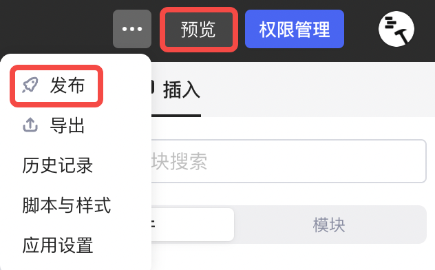​

好了，新手旅程告一段落。Lowcoder还为您提供了一系列开箱即用的组件并支持多种数据源连接，欢迎您进一步探索与体验！
