样式、主题与友好交互

良好的用户界面对于提升用户体验至关重要。在Lowcoder中，您可以自定义每个组件的样式，并使用主题功能统一多个应用的界面及使用体验。此外，还可以通过配置组件的图标、默认值、提示信息和隐藏、禁用等属性提升易用性，使用户交互更友好。

## 组件样式

Lowcoder中所有组件的属性面板都有样式一栏，通过修改默认的样式配置，可以获得您自定义的样式。

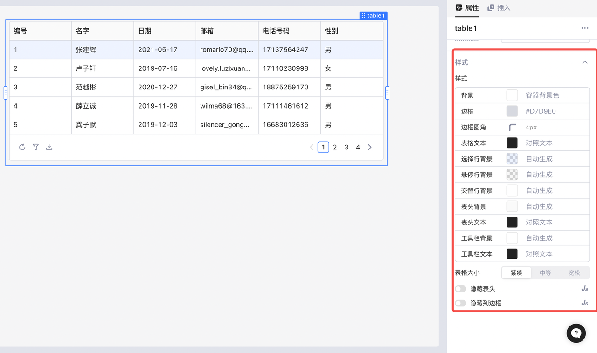​

点击色板可以直接选取颜色；点击右侧文字，则可以写 CSS 颜色代码设置颜色。

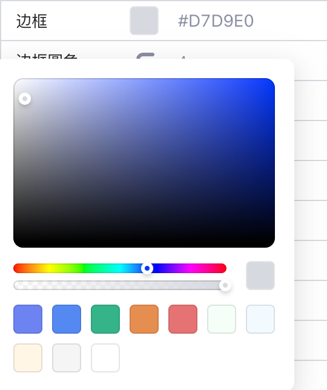​

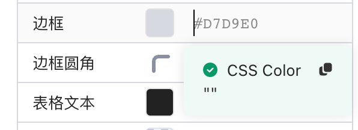​

也可以在输入框中使用 `{{}}`​ 写 [JavaScript 表达式](../javascript-in-lowcoder/writing-javascript.md)，使组件样式根据不同条件动态变化。

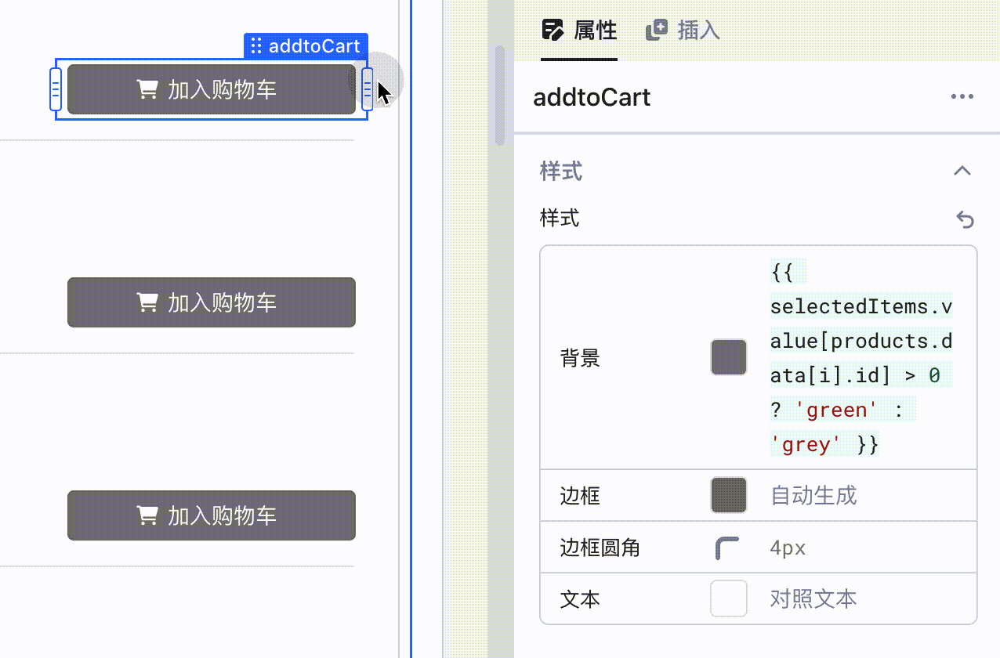​

经过设计后的样式会更加好看、好用。如下图，调整了表格的边框颜色、表头背景颜色、表头文本颜色，还将**列类型**调整为了**标签**样式、隐藏了列边框，表格数据展示更加清晰、友好。

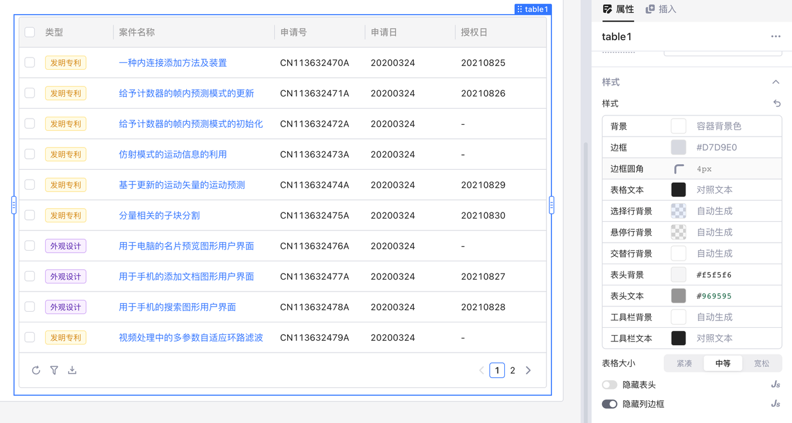​

## 应用主题

使用主题功能，可以统一企业下多个应用之间的界面体验，快速设置整个应用的样式，打造统一的个性化外观。

切换主题效果呈现：

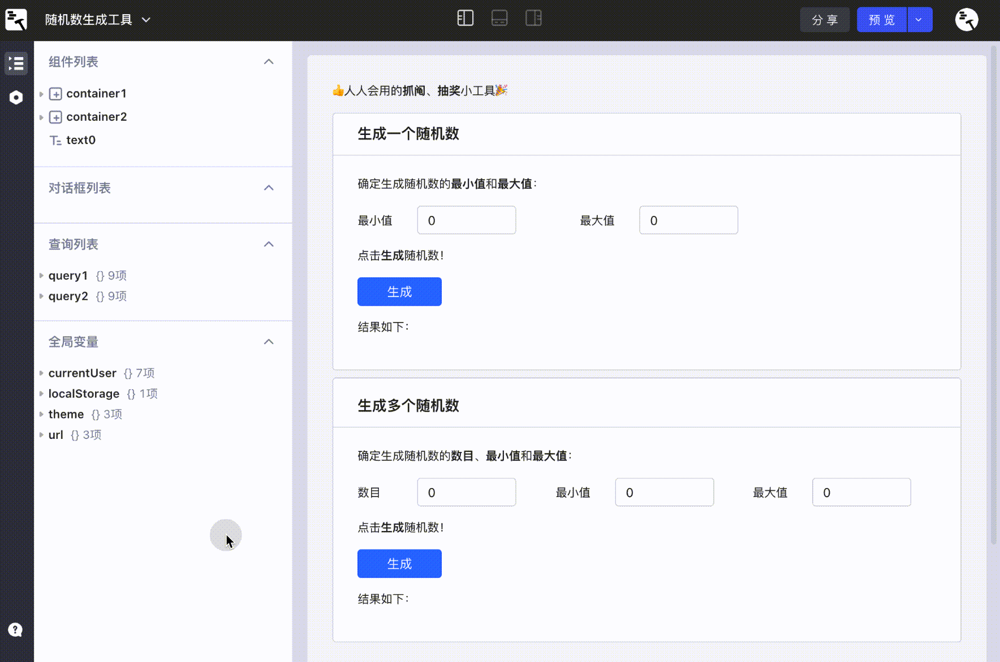​

### 创建主题

**企业管理员**可以在[Lowcoder主页](https://lowcoder.mousheng.top/)的企业设置界面创建主题。依次点击左侧边栏的**设置** -> **主题** -> **创建主题**并输入名称。您可以先选择一个Lowcoder中的现有主题，基于其进行自定义。

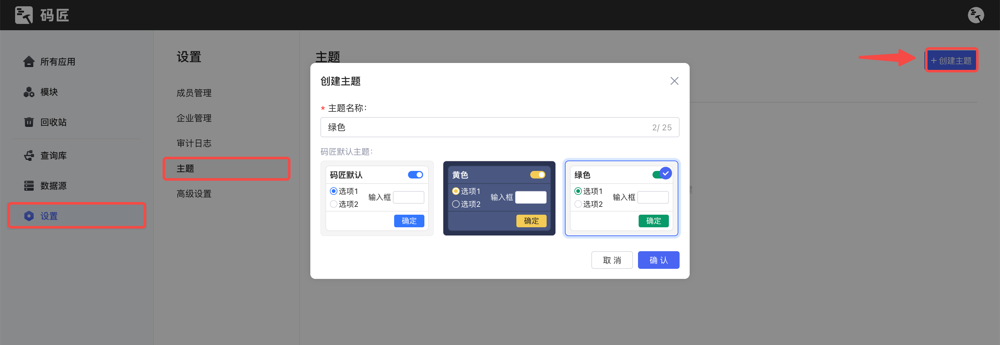​

在主题编辑界面，可以配置​**主色调**​、​**文字颜色**​、​**边框圆角**​、**Echarts 图表样式**等，支持实时预览主题效果和图表样式。

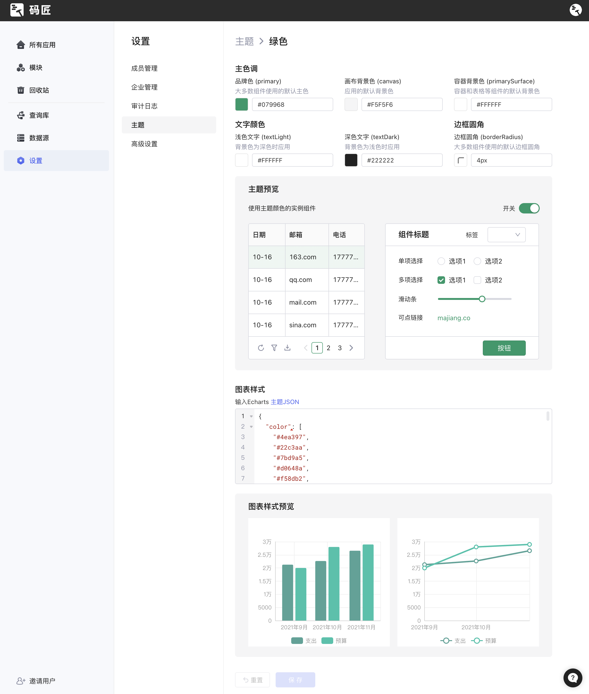​

### 预设主题

**开发者**进入应用编辑界面，点击左侧工具条的设置按钮 ⚙️，然后在**应用设置** -> **主题配置**中可以预设当前应用的主题。

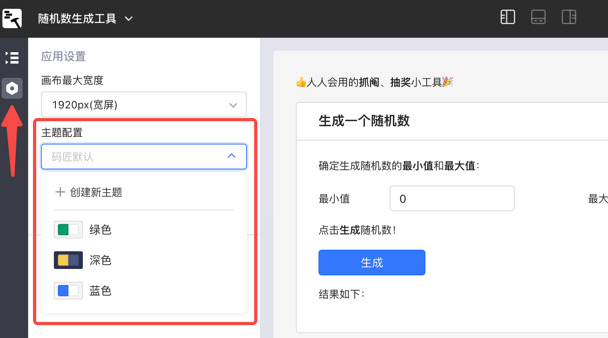​

**企业管理员**也可以在Lowcoder主页的**企业设置** -> **主题**中为当前企业的所有应用​**设置默认主题**​。

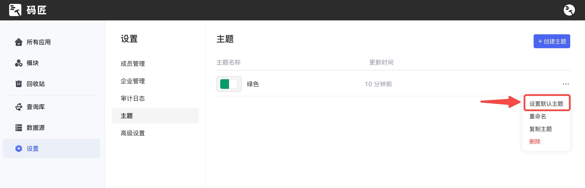​

### 动态切换主题

**开发者**在编辑应用时，可以[使用 JavaScript](../javascript-in-lowcoder/README.md) 引用全局变量 `theme`​ 和调用其内置方法 `theme.switchTo()`​，使**终端用户**在使用该应用时可以主动切换用户本地的主题。

全局变量 `theme`​ 包含三个字段，可在左侧数据浏览器下方查看：

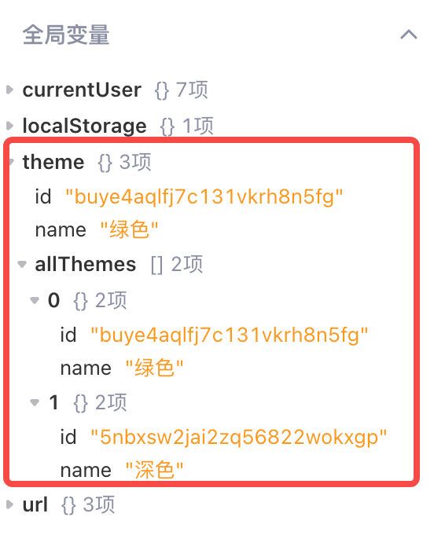​

* ​`id`​ 和 `name`​ 均为字符串，分别表示当前主题的 **ID** 和​**名称**​。值为空时，表示使用Lowcoder默认主题。
* ​`allThemes`​ 为一个数组，包含当前企业**所有已创建主题**的 ID 和名称信息。

​`theme.switchTo()`​ 方法用于动态切换用户本地的主题，所需参数为主题的 ​**ID**​。当传入参数为**空字符串**​`""`​ 时，则重置为当前应用[预设主题](../style.md#%E9%A2%84%E8%AE%BE%E4%B8%BB%E9%A2%98)。

> ### 💡 说明
>
> 终端用户在应用中切换主题后，`theme_id`​ 将保存在浏览器的本地存储 (Local Storage) 中。新主题将覆盖开发者为应用静态配置的[预设主题](../style.md#%E9%A2%84%E8%AE%BE%E4%B8%BB%E9%A2%98)，且对当前浏览器环境下的所有应用生效。

配合[选项列表配置](../component-guides/option-list.md)和[事件动作设置](../event-handler.md#%E4%BA%8B%E4%BB%B6%E5%8A%A8%E4%BD%9C%E8%AE%BE%E7%BD%AE)，可使终端用户在使用过程中主动切换应用主题，效果如下图所示，也可直接点击 [demo](https://lowcoder.mousheng.top/apps/63f8579439329f691001c991/view) 链接查看和试用。

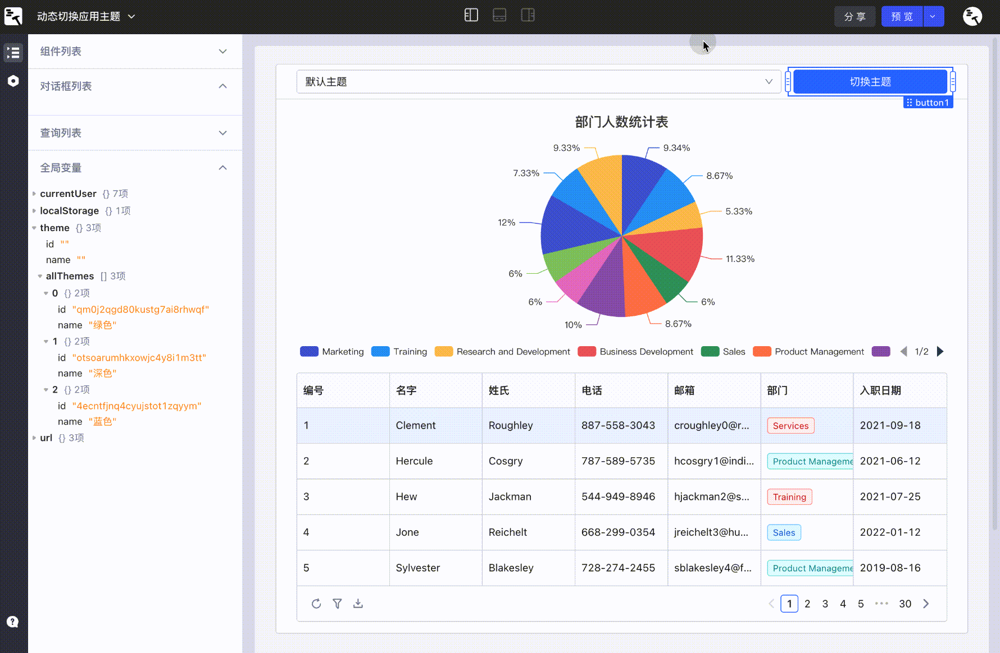​

具体步骤如下：

1. 拖入一个选择器组件，切换至**自动**模式，输入以下数据来自动配置选项列表。

```text
{{[{ id: "", name: "默认主题" }, ...theme.allThemes]}}
```

2. 分别设置选项的**标签**和**值**为 `{{item.name}}`​、`{{item.id}}`​。配置好后，选项列表将包括一个**默认主题**和当前企业的​**所有主题**​。  
    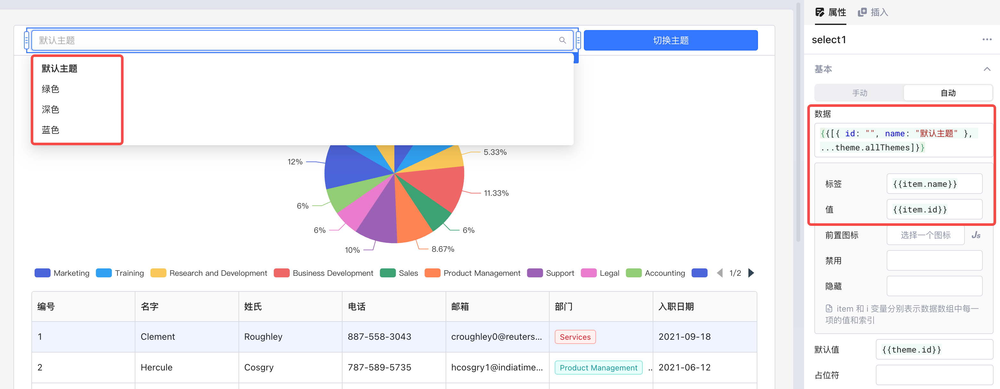​
3. 拖入一个按钮组件，用于执行切换主题的操作。添加一项单击事件，动作选择运行 JavaScript，执行 `theme.switchTo()`​ 方法，参数为选择器的值。  
    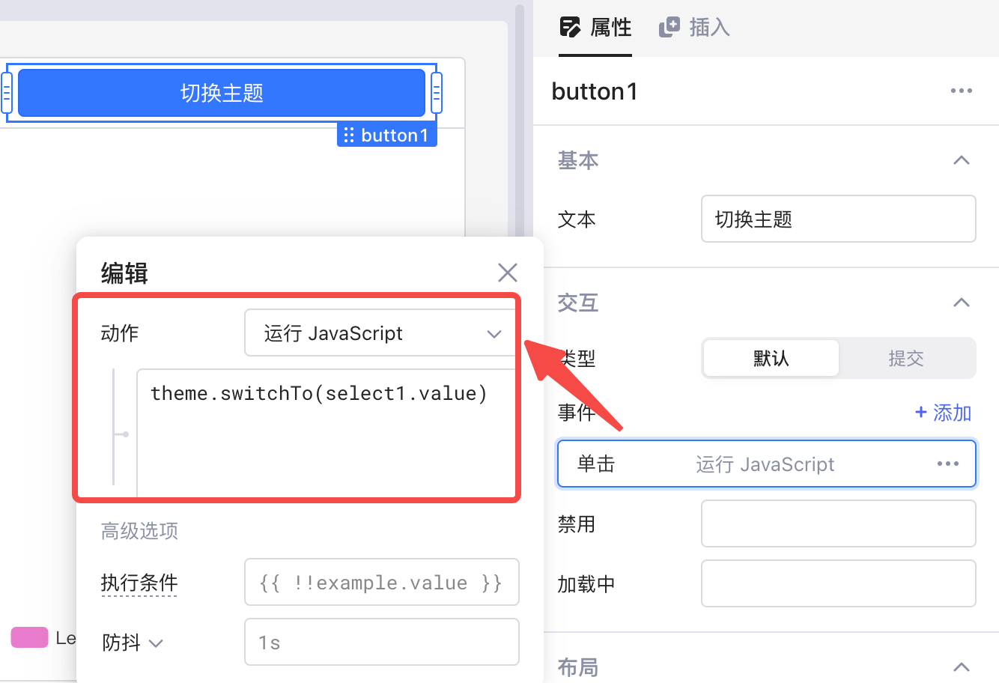​

## 自定义 CSS

当[应用主题](../style.md#%E5%BA%94%E7%94%A8%E4%B8%BB%E9%A2%98)和[组件样式](../style.md#%E7%BB%84%E4%BB%B6%E6%A0%B7%E5%BC%8F)属性配置都无法满足样式定制的需求时，可以使用自定义 CSS 的功能。

* 关于使用自定义 CSS 的 demo 展示，请参阅文档[自定义 CSS 使用样例](../style/css-demo.md)。
* 关于编写 CSS 代码的注意事项，请参阅文档[自定义 CSS 注意事项](../style/css-manual.md)。

### 应用级 CSS

从应用编辑界面的左侧工具条开始，点击 ⚙️ > **其它** > **脚本与样式设置** > ​**CSS**​，可以为**当前应用**编写自定义 CSS，实现更灵活的样式设计。

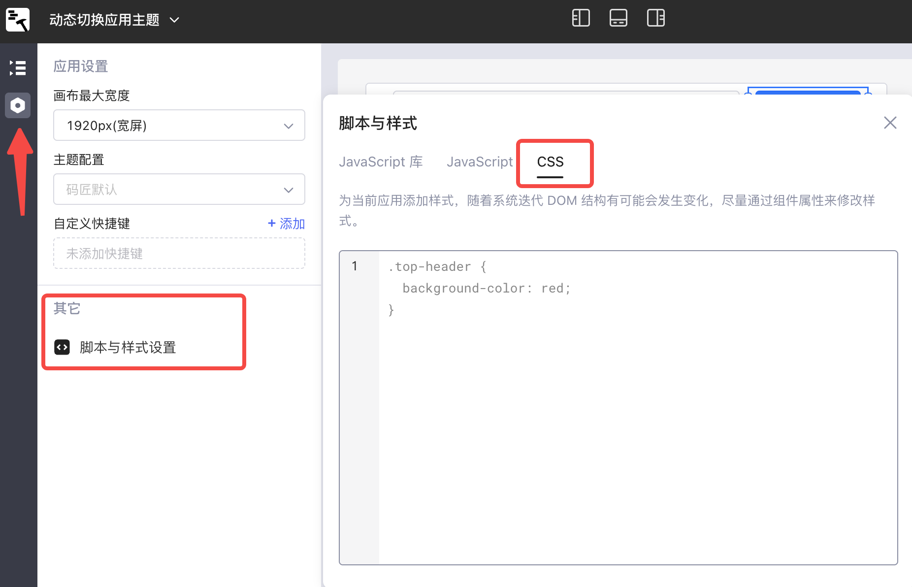​

例如，拖入一个文本组件 `text1`​，利用`.text1`​ 定位该组件，然后修改其样式：

​

> ### 💡 说明
>
> 可以使用自定义 CSS 功能为当前应用添加样式。但随着系统迭代，DOM 结构可能会发生变化，因此更推荐在右侧属性面板中修改​**组件样式**​。

### 预加载 CSS

企业管理员进入[Lowcoder主页](https://lowcoder.mousheng.top/)，依次点击左侧边栏的**设置** -> ​**高级设置**​，可以为当前企业下的**所有应用**设置预加载的 CSS 代码。

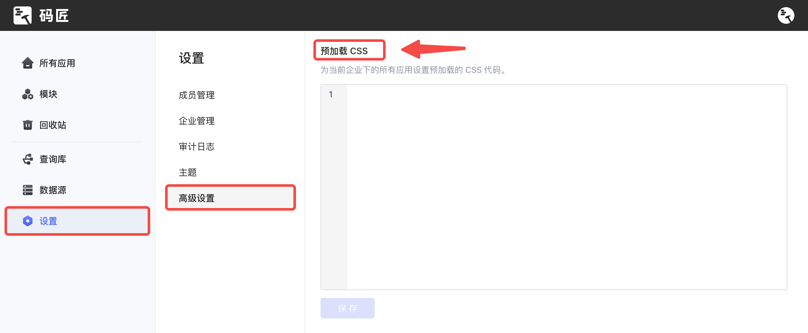​

## 友好交互

易用、高效与安全在企业级系统交互设计中至关重要，Lowcoder致力于实践这一价值观，也​**欢迎您提供反馈和建议**​。

### 恰当隐藏 UI

合理设置组件的**隐藏**属性，能避免信息过载，从而提升用户使用效率。

例如，创建一个餐食建议收集表单，其中**建议输入框**根据用户的选择而展示或隐藏：

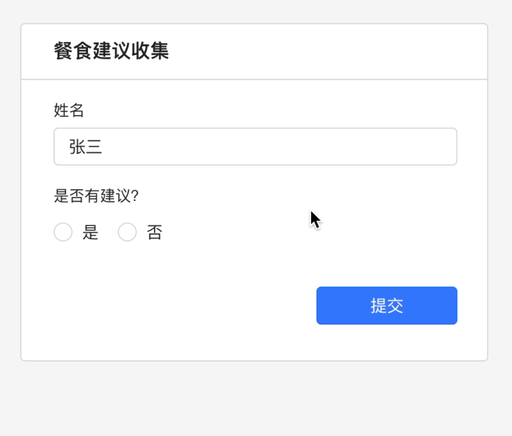​

设置组件 `textArea1`​ 的隐藏属性：当组件 `radio1`​ 的值为 1 时，隐藏属性值为 false，否则，值为 true。组件隐藏后下方相邻的组件会自动补位。

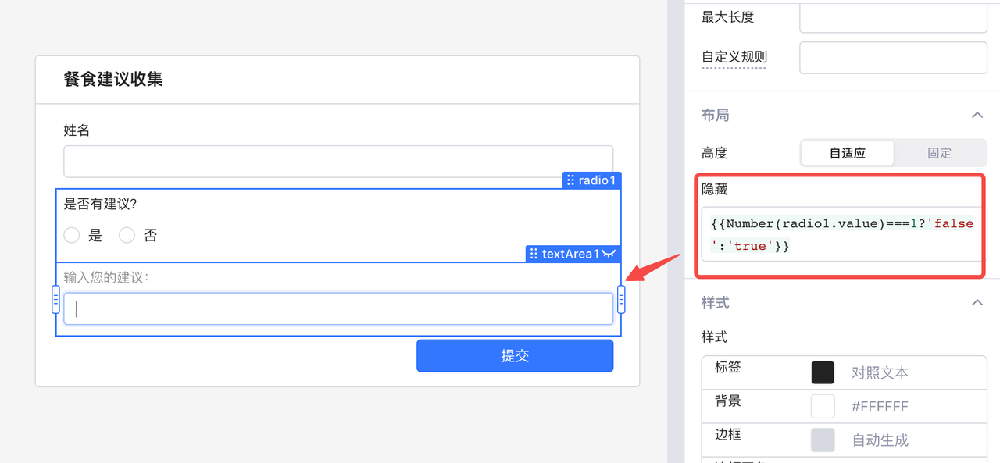​

### 图标配置

生活中图标随处可见，有些情况下甚至可以代替文字，其虽简明但能传递很大的信息量，且具有隐喻性和信息性。合理使用图标不但能给用户更好的视觉体验，还更有助于用户理解。

对于Lowcoder中的部分组件，其属性区有前置/后置图标配置选项，您可以为其添加合适的图标，使得内容好看易懂。

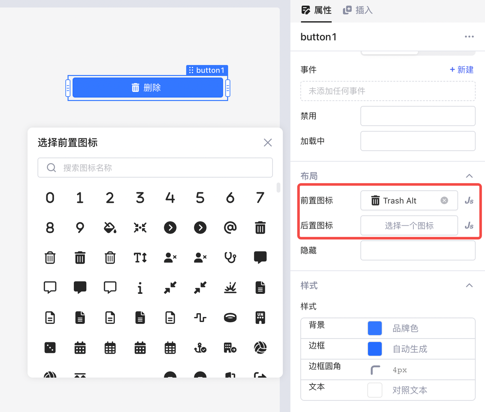​

### 信息提示

在用户输入前，给予用户合适的前置提示信息，能提升应用易用性与使用效率。

* 占位符：没有值时展示在输入框中，用以提示用户输入的内容。
* 提示文字：标签下面会被添加一道下划虚线，光标悬浮会出现提示文字，提示用户输入的内容。

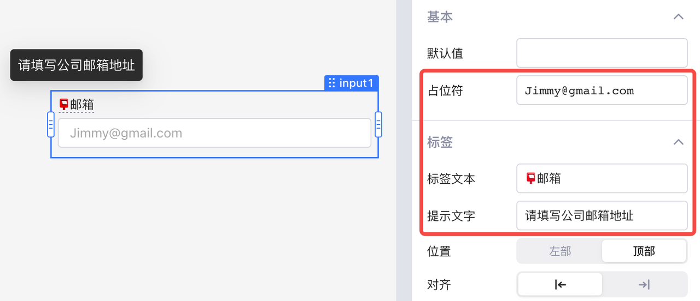​

### 有效反馈

用户与界面交互后，及时给予用户适当的反馈信息能让用户感知当前操作状态。及时的反馈有助于驱动用户继续做出有效操作，帮助用户养成正确的操作习惯，或纠正用户的不当操作。

#### 全局提示

您可以为一些用户交互行为设置全局提示，给予用户动作执行后的反馈**。**Lowcoder中的全局提示消息类型包括四种：**通知、成功、警告和错误。**

设置全局提示有三种方法：

1. 设置事件的响应动作——全局提示。详情请参阅[事件](../event-handler.md#%E5%85%A8%E5%B1%80%E6%8F%90%E7%A4%BA)文档。
2. Javascript 查询中，使用内置函数设置全局提示。详情请参阅[message（全局提示）](../javascript-in-lowcoder/use-built-in-js-functions.md#message%EF%BC%88%E5%85%A8%E5%B1%80%E6%8F%90%E7%A4%BA%EF%BC%89)。
3. 使用查询的通知面板。详情请参阅[查询](../how-to-write-query.md#%E9%80%9A%E7%9F%A5%E9%9D%A2%E6%9D%BF)。

例如：在查询的**通知面板**中，可以勾选​**执行查询失败后通知**​，您可以设置失败的判定条件和提示文案：

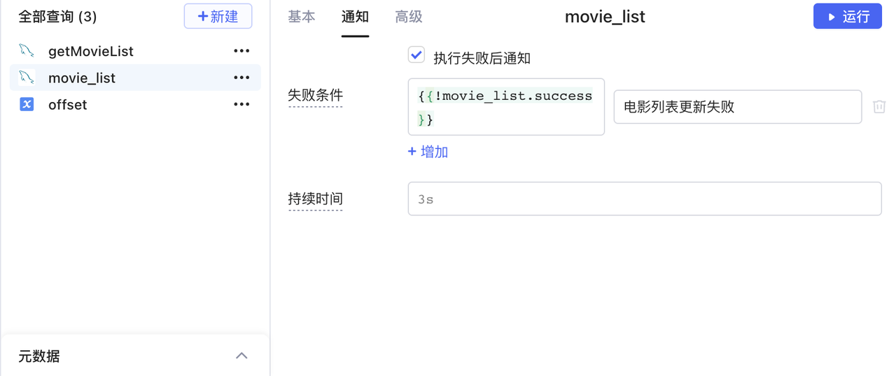​

​

#### 查询加载反馈

当查询操作相对耗时，为了给用户提示操作正在进行并避免用户在短时间内反复操作，可以设置一个加载反馈。

例如下图中的**上一页**按钮，其**加载中**属性为 `{{movie_list.isFetching}}`​，`isFetching`​ 是Lowcoder中查询的一个属性，表示当前查询正在加载中。点击按钮，会自动触发运行查询 `movie_list`​ ，此时按钮会呈现一个动态的加载效果。

​

#### 二次确认

当用户进行数据新增、修改、删除等敏感操作时，为避免用户误操作，可以在执行之前设置二次确认来提醒用户，Lowcoder中您可以使用查询的**高级面板**实现此功能，勾选​**执行前弹出确认对话框**​，并设置二次确认文案：

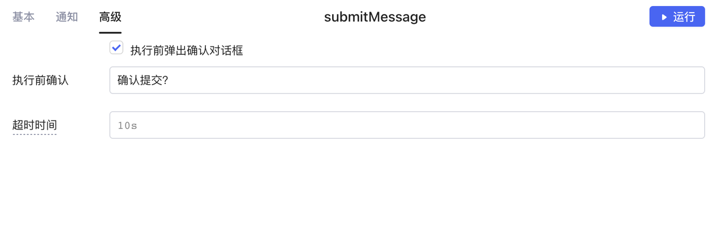​

### 表单设计技巧

表单是信息添加、录入的通用形式，合理的表单设计能减轻用户负担，提升使用效率。关于在Lowcoder中设计表单的技巧，详情请参阅文档[表单设计技巧](../style/form-desgin.md)。