[表单](../component-guides/using-form.md)是信息添加、录入的通用形式，合理的表单设计能减轻用户负担。这里Lowcoder提供了一些表单设计的简单技巧。

### 技巧 1：选择合适的输入框标签对齐

Lowcoder中标签根据标签与输入框的位置关系，可以设置位置和对齐方式：

​

每种标签对齐都有自身的优点与局限性，根据不同的场景选择合适的标签对齐，能提高用户填写速度，同时还能降低信息填写时的错误率。

根据 Matteo Penzo 研究发布的[关于标签对齐的文章](https://www.uxmatters.com/mt/archives/2006/07/label-placement-in-forms.php)：采用顶部左对齐的标签样式，浏览表单所需的时间最短，而左侧左对齐则用时最长。以下为该研究中捕捉到的用户在填写三种对齐方式的表单时的眼动轨迹（圆圈越大，注视时间越长）：

​

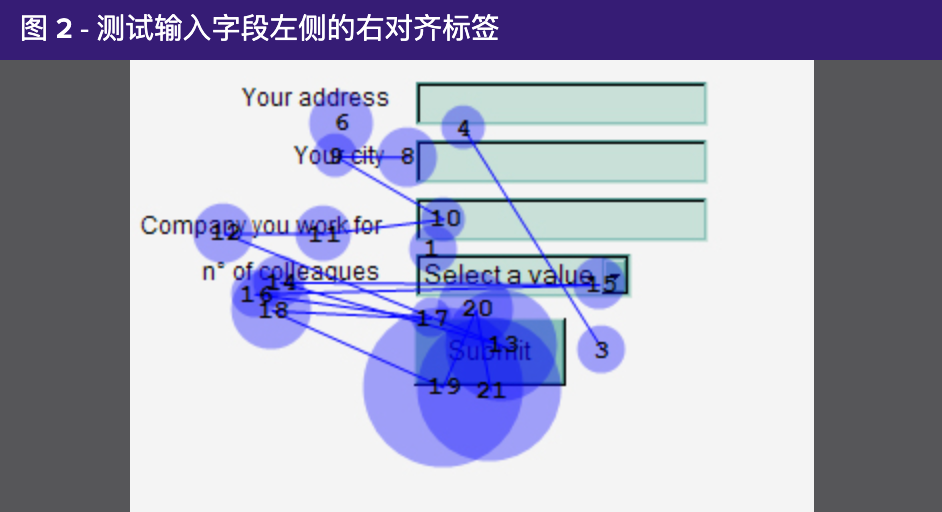​

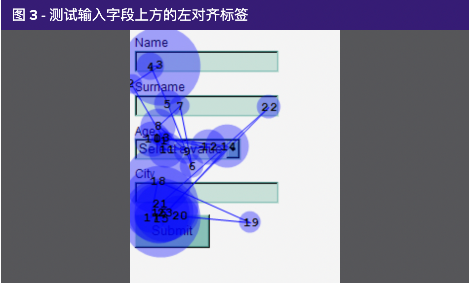​

可以看到，在顶部左对齐的设计中，用户能够在单次视线移动中​**同时获取标签和输入字段**​，可以更快理解表单。而左侧左对齐会迫使用户通过注视更大范围的屏幕空间获取信息，从而拖慢用户的反应速度。

如果希望用户能快速扫描填写表单，那么标签顶部对齐是最佳选择。注意对齐的一致性，所有标签在整个表单中都应该遵循相同的对齐方式。

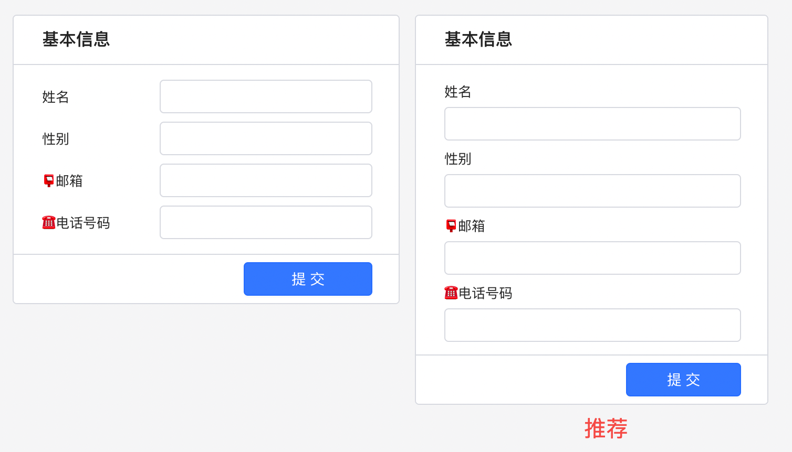​

因为左侧左对齐使得浏览表单所需时间最长，如果表单要求敏感数据如银行卡号等，也可以使用左侧左对齐来故意减缓用户的填写速度，来确保填写的准确性。

### 技巧 2：保持标签文本简洁，并选择合适的输入组件

标签越长，用户则需要花更多时间阅读和理解，因此标签文本不宜过长，越简洁越好。但如果您确实需要展示更多信息，可以使用Lowcoder的**占位符**和**提示文字**来设置提示信息。

如下图，在搜索栏中使用占位符来说明输入的内容：

​

虽然占位符文本可以很好地扩展标签信息，但不应该用它来取代标签本身，因为较浅的文本颜色很难引起用户的注意，而且一旦用户开始输入，占位符就会消失。

人们理解图像和符号的速度比文本快得多，因此在输入框的前缀或后缀中添加表情符号可以大大提高用户体验，比如可以通过 🔍 表示搜索、☎️ 表示电话等。如果需要更详细的解释，**提示文字**也非常有用，此功能将为输入的标签添加下划线，用户可以在光标悬停时看到更多信息。

​

当光标悬停在带下划线的文本上时会出现提示文本

Lowcoder提供了四种数据录入类型的组件（文本、数字、选择和日期），在构建表单时应选择合适的组件。

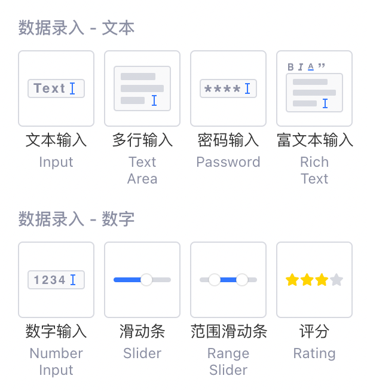​

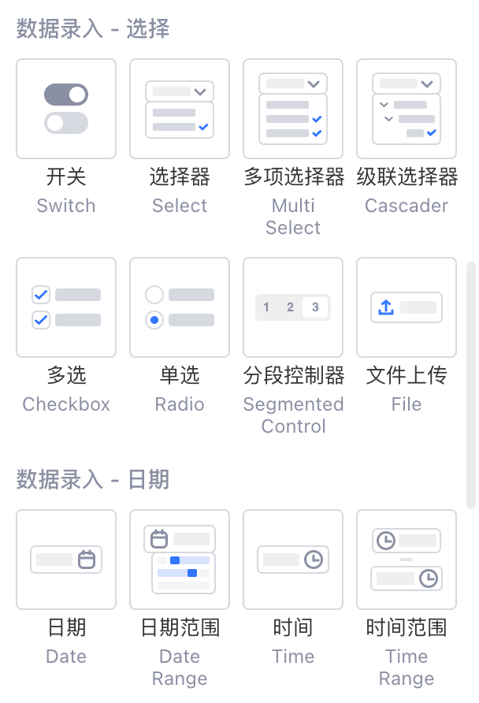​

在数据输入目标已知的情况下采用选择器组件，会节省用户时间：

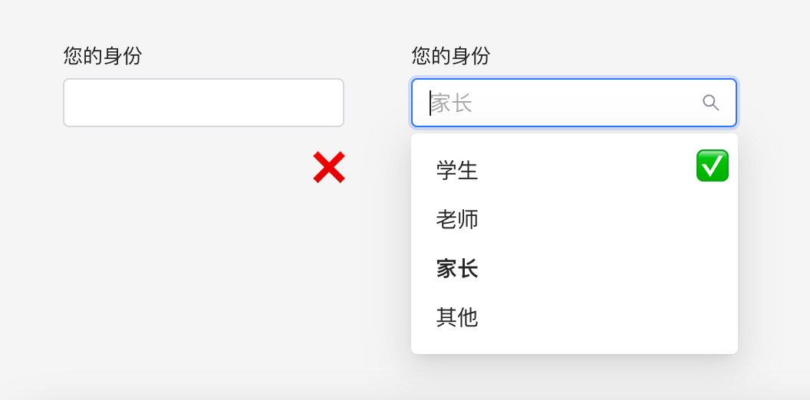​

文本输入组件 VS 选择器组件

在选择的项数较少的时候，采用单选组件最佳（用户只需点击一次，而选择器组件需操作两次）：

​

文本输入组件 VS 选择器组件 VS 单选组件

### 技巧 3：保持输入框长度合理、一致

保持输入框长度的合理和一致，可以使表单美观、易读。如果文本输入框需要很长（例如：身份证、手机号和邮箱等），可以考虑将这些输入框纵向排布；如果所有输入都很长，只有一些是较短的输入（例如：居住的省、市和邮编），则可以将这些较短的输入压缩到同一行，再与其他输入框保持长度一致。

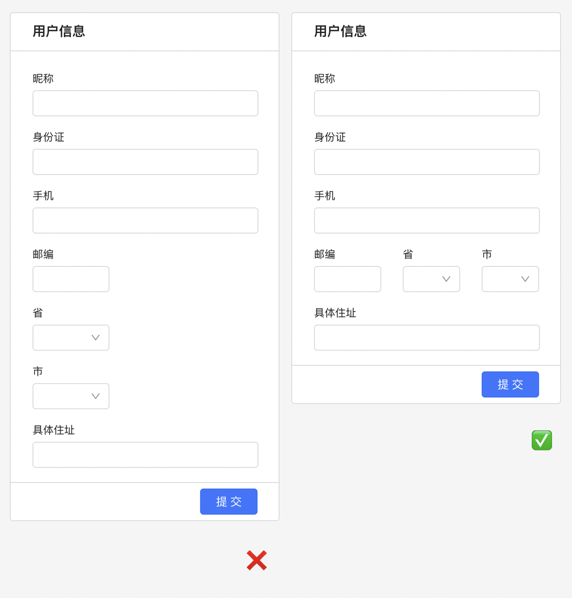​

Lowcoder还支持多行输入框，如果你觉得目标输入可能需要多行空间（如：评论输入），那么您可以选用多行输入框。

### 技巧 4：表单输入框放在一列

Lowcoder建议您尽量​**将所有表单、输入框放在一个列中**​，使填写路径更加清晰。保持有秩序的单列表单形式更利于用户浏览，而多列的表单形式则会破坏用户填写规律，进而影响完成表单的速度。

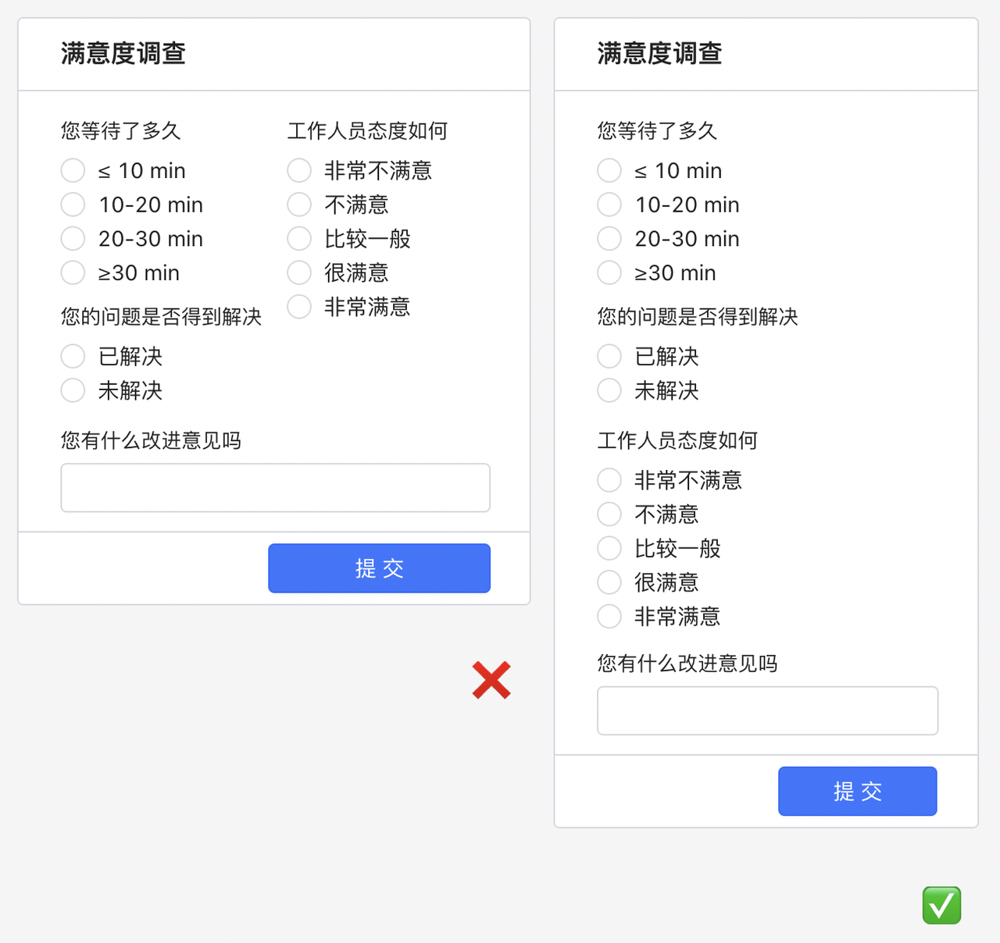​

### 技巧 5：对相关信息分组，并折叠不常用表单项

对有关联的信息进行分组是提高文案可读性的常用策略。Lowcoder建议您通过运用字号、间距或者分割线等视觉手段将相关的信息进行分组，提升用户处理信息的效率，从而提高表单易用性。

这里使用Lowcoder的**分割线**组件，将表单内容进行了信息分组：

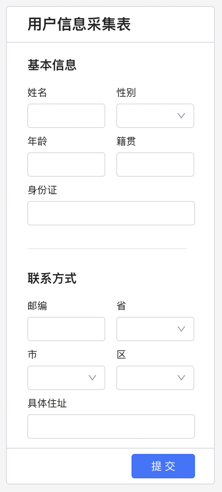​

此外，如果某些表单项很少使用，可以在表单中**动态折叠/展开**该部分，以优先展示常用表单项，使界面整洁有效。可以通过添加一个用于切换的​**链接**​，并根据折叠/展开的状态动态改变链接文本：

​

1. 首先在表单中添加一个链接组件：

​

2. 创建一个[临时状态](../javascript-in-lowcoder/using-temp-state.md)​`showHide`​，设置默认值为 `false`​。然后为链接组件添加一个**单击**事件，动作选择​**设置临时状态**​，再选择创建好的临时状态 `showHide`​，再参照下图输入值：

​

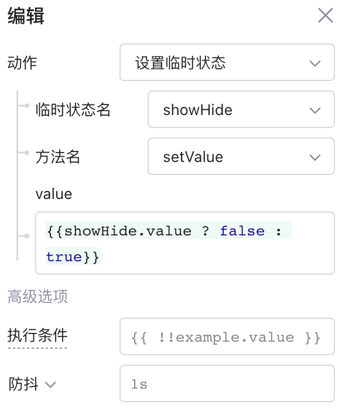​

3. 接着为想要动态折叠/展开的每个组件设置**布局-&gt;隐藏**属性，如下图：

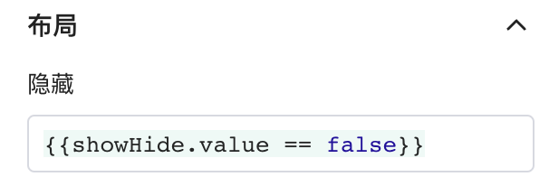​

4. 最后，修改链接文本，使其也能动态变化：

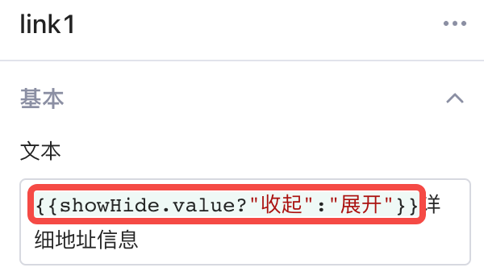​

### 技巧 6：表单默认值

设置默认值能帮助您的用户更高效地使用表单，主要包括两方面：通过设置表单输入的​**默认值**​，预测用户可能输入的内容；或者将**选择组件的默认值**​[手动配置](../component-guides/option-list.md#%E6%89%8B%E5%8A%A8%E9%85%8D%E7%BD%AE%E9%80%89%E9%A1%B9)为用户最常使用的选项。

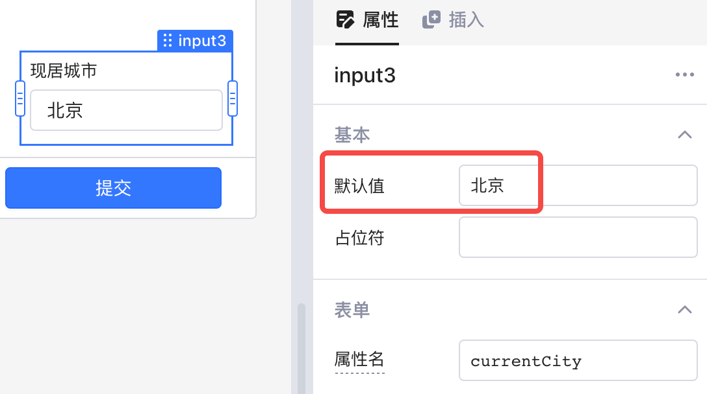​

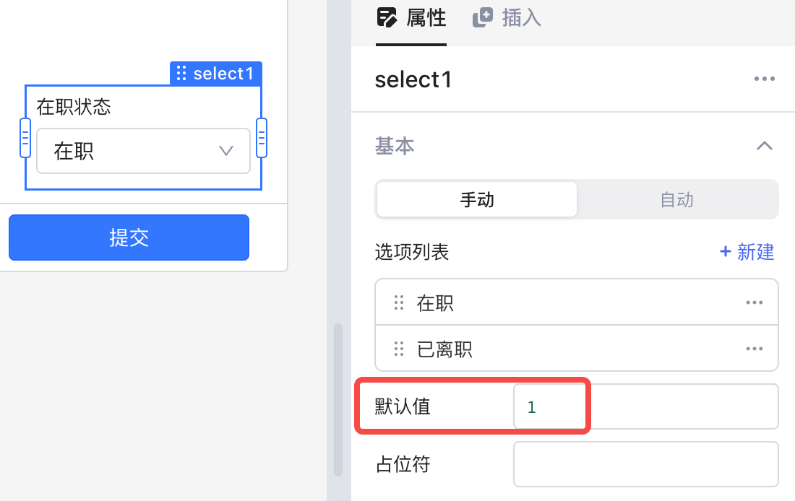​

对于​**数据输入**​，另一个实用技巧是使用**选择器组件**来为用户提供备选项，并根据后端数据动态更新选项（使用文本输入组件则可能会产生一些不必要的人为错误），具体可参阅[选项列表配置 -&gt; 自动配置选项](../component-guides/option-list.md#%E8%87%AA%E5%8A%A8%E9%85%8D%E7%BD%AE%E9%80%89%E9%A1%B9)。

许多情况下，表单组件可以利用表格选中行设置默认值。例如下图，引用表格组件的 `table.selectedRow.data`​ 属性，将表格当前行的数据作为默认值来自动填充表单，并允许用户修改和提交表单：

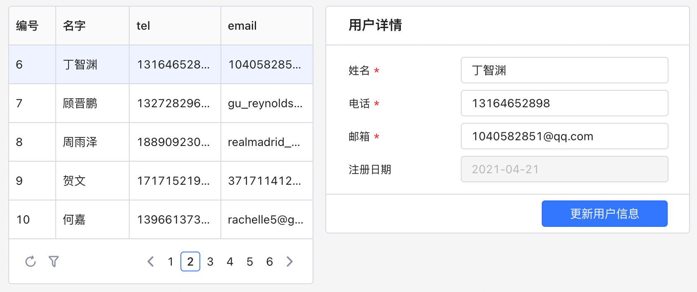​

### 技巧 7：输入校验和反馈

在提交表单到数据库之前进行数据校验，能避免将用户错误或无效的输入送到后端。而给用户及时、正确的反馈也同样重要，能帮助用户快速了解为什么输入的数据是错误的。

在Lowcoder中，几乎每个数据录入组件都有**校验**属性，帮助您基于设置的规则在用户提交数据之前进行检查：

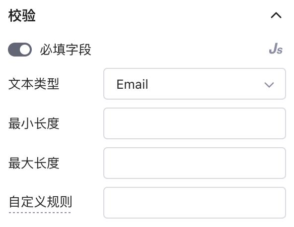​

通过配置组件或查询的事件属性，触发表单提交成功或失败的通知，从而根据用户输入的具体情况给出不同反馈，指出当前输入存在的问题。如下图，当电子邮件输入为空时，触发全局提示：

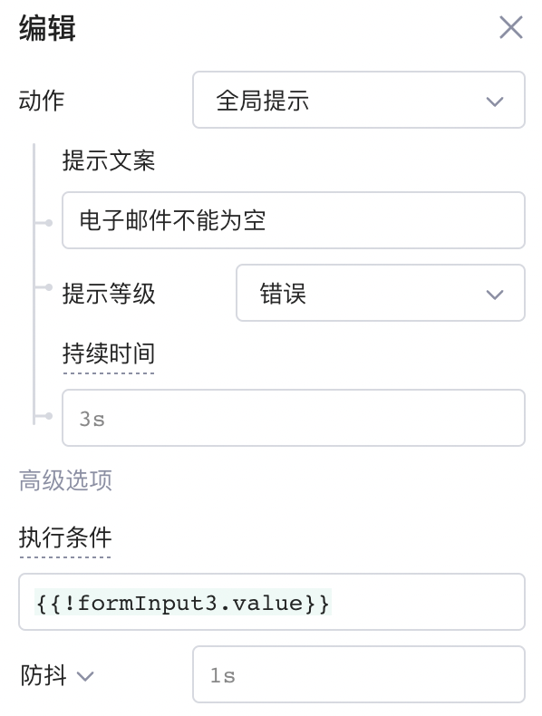​

​

### 技巧 8：成功提交后重置到默认值

一般情况下，在提交表单后自动清除输入是很重要的。在Lowcoder中，可以在表单组件的属性栏选择是否在​**成功提交后重置到默认值**​。

​

但在一些特殊情况下，一些表单项的输入值需频繁复用，此时可以在表单中添加一个**清除**按钮，并配置好​**单击事件的动作**​，让用户自己决定是否清除和重置输入。

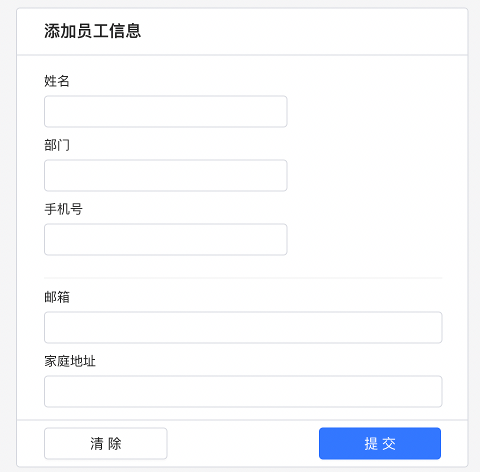​

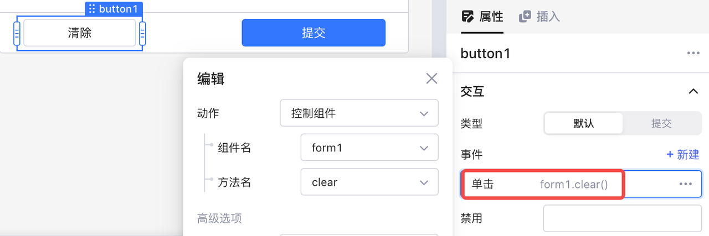​

> #### 🚫 注意
>
> 不要将「清除」按钮放在「提交」按钮附近的位置，否则用户可能将原本打算提交的内容不小心清除了。

### 技巧 9：布局

最后一个技巧是设计用户友好的组件布局，这并没有千篇一律的公式，但Lowcoder为您总结了以下几点建议：

#### 使用对话框

前面提到，许多情况下需要搭配使用**表格**组件和**表单**组件。当涉及到更新表格中的一条记录时，最佳做法是将**表单**放入**对话框**中，当用户点击链接或按钮时，再自动弹出填充了默认值的表单，而不是将表单一直静态展示在表格旁边，防止用户在浏览表单时不小心编辑数据。具体可参阅[使用对话框 (Modal)](../component-guides/using-modal.md#%E8%A7%A6%E5%8F%91%E6%89%93%E5%BC%80%E5%AF%B9%E8%AF%9D%E6%A1%86)。

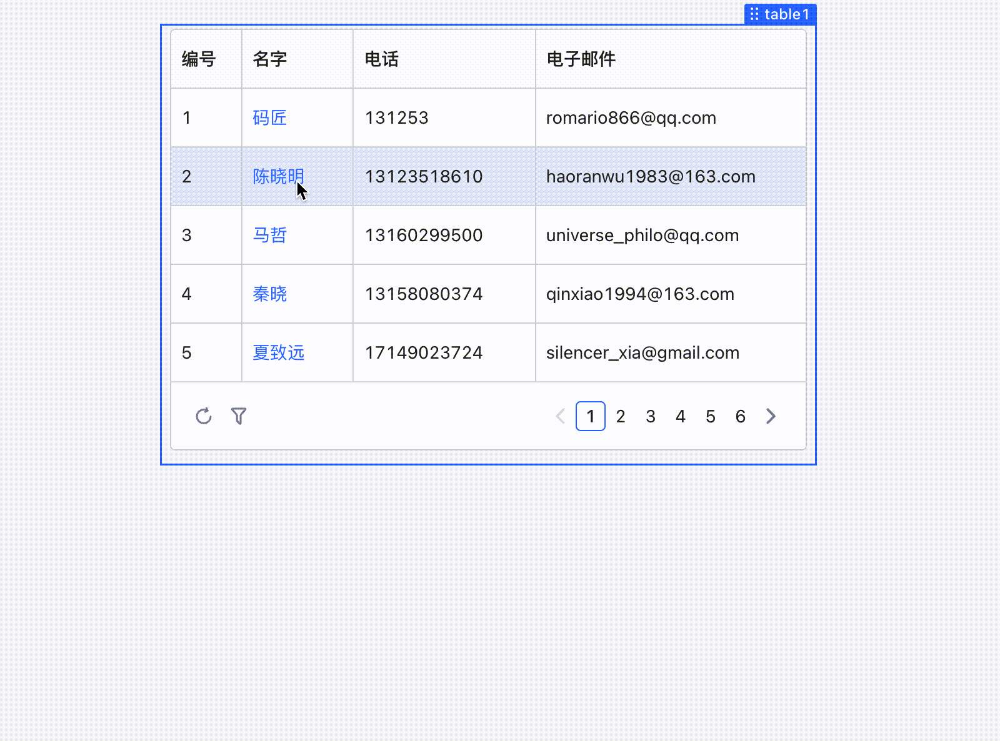​

#### 保持创建和更新的表单结构相同

创建和更新的表单应保持同样的输入逻辑，如果您重新排列输入的顺序，用户可能会因为之前的习惯导致出错。

#### 正确分离增删查改操作

对于用户来说，针对数据库的增删查改操作应该是明确区分的。如果读取和更新操作没有正确分离，那么用户的一次误点击就可能意外改变数据。同样，删除操作也应该始终独立，最好为重要的数据设置警告/验证信息。