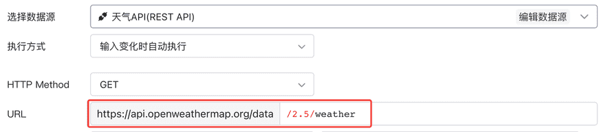
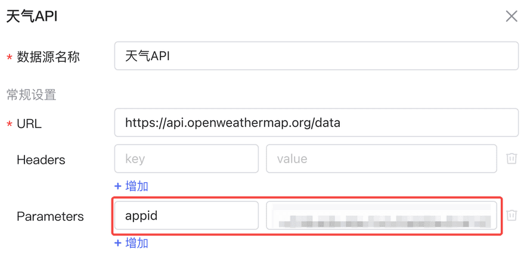
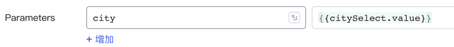
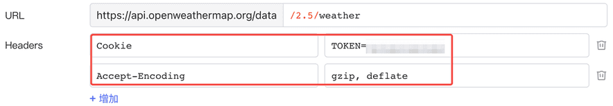
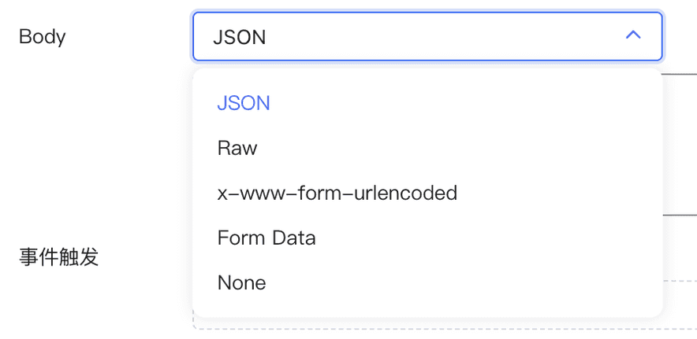
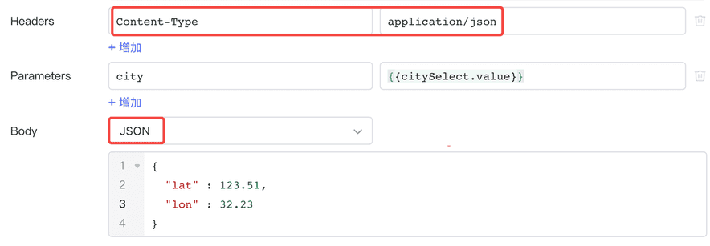

在Lowcoder中，您如果连接的是 REST API 数据源，那么您可以在查询中向 API 发送各种 HTTP 请求。本文档将介绍如何向 REST API 发送 HTTP 请求。

Lowcoder中创建一个 REST API 查询有两种方式：

1. 新建一个 REST API 数据源，数据源中可配置查询所公用的参数：如 URL 前缀、Headers 和 Parameters，还可设置数据源的[认证方式](api/rest-api.md#%E8%AE%A4%E8%AF%81%E6%96%B9%E5%BC%8F) (None/Basic/Digest)，之后基于该数据源创建查询。

​

2. 基于内置 **REST查询** 数据源创建查询，**REST查询** 数据源 URL、Header 等参数均为空。

## URL & Parameters

新建 REST API 查询后，最终请求的 **URL** 由数据源定义的前缀与查询定义的后缀共同构成，如果数据源中前缀为空，则需要在查询中定义完整 URL。下图展示了数据源与查询共同定义 URL 的例子：

数据源和查询中均可定义 **Parameters** 键值对，它们将自动追加到 URL 的末尾组成完整的 URL，例如：`?id=1&status=live`​。如果出现同名 Parameter，那么查询中定义的 Parameter 参数值将覆盖数据源中定义的值。此外，Parameters 键值对默认会进行 URL 编码，因此无需额外编码。下图展示了数据源和分别定义参数 appid（用于鉴权） 与 city 的例子：

HTTP Header 允许客户端和服务器通过 request 和 response 传递上下文信息。一个 Header 由名称（不区分大小写）后跟一个冒号，冒号后跟具体的值（不带换行符）组成。

在Lowcoder中，您可以填写 Header 的 key 和 value，分别代表其名称和值。如下图指定了 `Cookie`​ 和 `Accept-Encoding`​：

## Body

对于 POST、PUT 和 PATCH 请求，可以在 Body 部分填写请求正文，Body 将作为请求的一部分一起发送给 API。Body 格式类型可选的如下：

当您选择 Body 类型后，Lowcoder会自动为您填写相应 Content-Type，例如：当 Body 选择 JSON 格式，Content-Type 将自动填写 `application-json`​：

