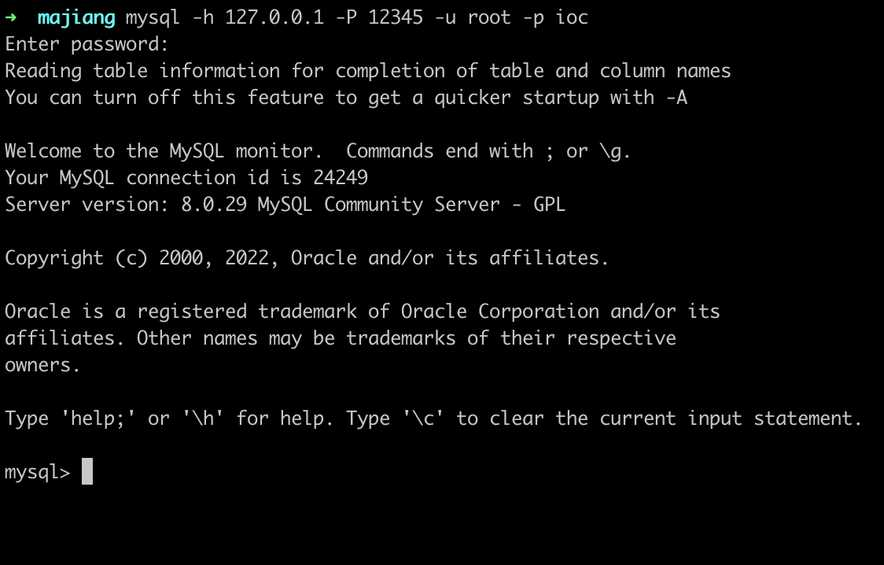
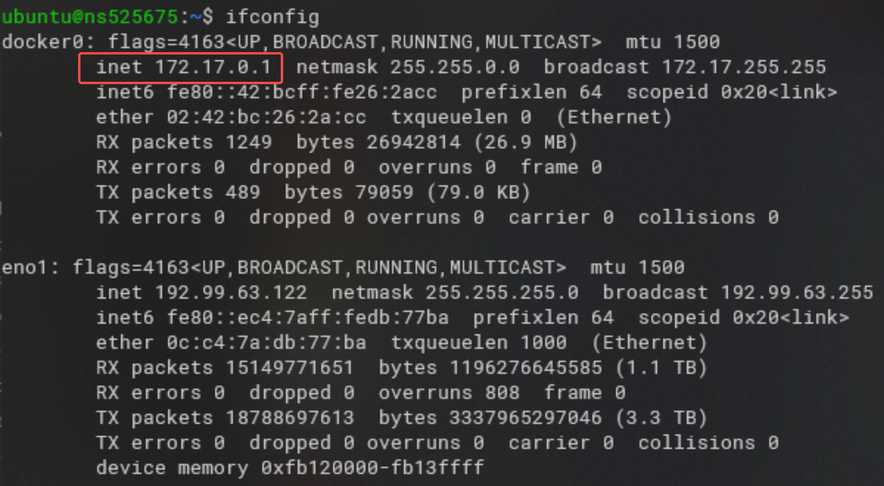
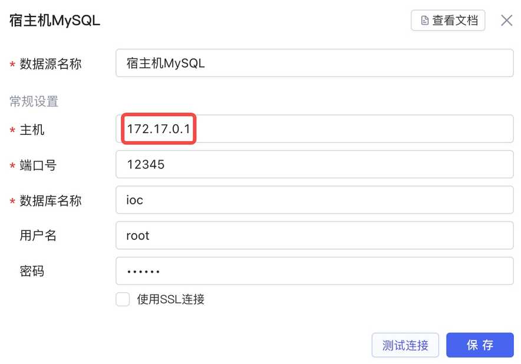
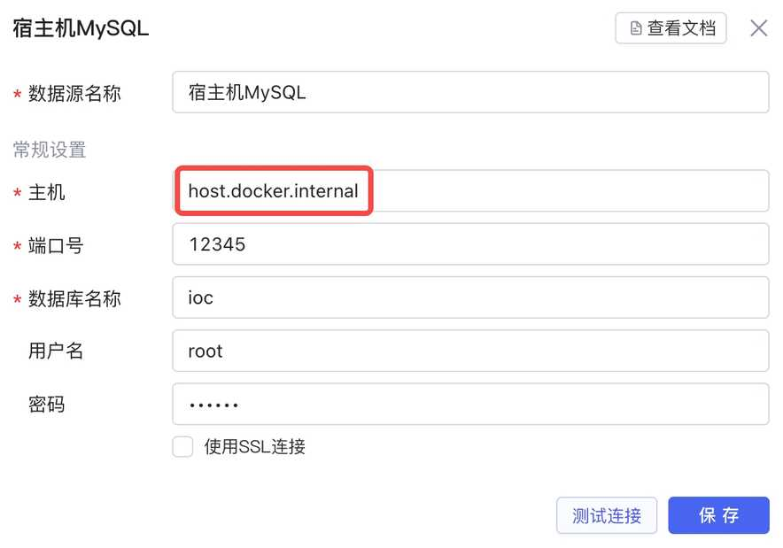

如何访问宿主机 API/DB

使用 Docker 镜像在本地服务器部署Lowcoder后，您可能需要Lowcoder访问部署在同一台服务器（宿主机）的 API/DB 数据源。Lowcoder镜像默认使用 [桥接 (Bridge) 模式](https://docs.docker.com/network/bridge/)，因此无法通过 `127.0.0.1`​/`localhost`​ 访问宿主机相关服务（只能请求到镜像内部网络）。本文以 MySQL 为例，介绍在不同系统环境下如何访问宿主机上的 API/DB。

## 准备

假设宿主机上已有 MySQL 服务，端口为 12345，确认本地访问 MySQL 服务无误：



## Linux

1. 在宿主机终端中输入 `ifconfig docker0`​，确认 Docker 虚拟网桥 IP 配置：



Docker 服务启动时，系统会自动创建一个 docker0 的设备（默认 IP 地址为 `172.17.0.1`​），docker 服务可以通过该 IP 与宿主机进行通信。

1. 使用上图红框中的 IP 地址（当前例子为 `172.17.0.1`​，具体根据您终端显示值而定），在Lowcoder中配置 MySQL 数据源，如下所示：



> #### ⚠️ 注意
>
> 部分系统（如 Ubuntu）可能因为防火墙原因访问失败，此时需要：
>
> 1. 配置防火墙允许 docker0 访问，终端中输入：
>
> ```bash
> iptables -A INPUT -p tcp -i docker0 --dport 3306 -j ACCEPT
> ```
>
> 2. 保存防火墙配置，终端中输入：
>
> ```bash
> iptables-save > /etc/iptables.up.rules
> ```

## Windows/Mac

Docker 在 Windows 和 macOS 平台下并没有 docker0 虚拟网桥，此时可以使用这个特殊的 DNS 名称来解析宿主机 IP：

```text
host.docker.internal
```

Lowcoder中配置 MySQL 数据源如下所示：

